# 500 个 Omarchy 主题

[English](README.en.md)

[](https://bjarneo.github.io/100-themes)

本仓库为 [Omarchy](https://omarchy.org) 准备了 100 组霓虹配色，每组配色有 5 个变体，合起来就是 500 个 Omarchy 主题。每个变体都有一套 16 色的 ANSI 调色板、一张带 Omarchy 字标的背景，以及一张按这组颜色绘制的背景。

- 画廊：[bjarneo.github.io/100-themes](https://bjarneo.github.io/100-themes)
- 宣传视频：[`assets/promo.mp4`](assets/promo.mp4)，每个主题各出现一次，5 个变体各 20 个
- 背景图：1000 张 6K，6144×3456

## 变体

| 变体 | 主题名 | 说明 | 最低 ANSI 对比度 | 最低正文对比度 |
| --- | --- | --- | --- | --- |
| 深色 | `synthwave` | 设计配色本体。深色背景配霓虹色。 | 3.6:1 | 14.4:1 |
| 日间 | `synthwave-day` | 同样的色相，换成浅色背景。适合明亮的房间和白天。 | 2.7:1 | 13.5:1 |
| 高对比度 | `synthwave-high-contrast` | 接近纯黑的背景。每个 ANSI 色都达到 7:1，即 WCAG AAA 级。 | 7.0:1 | 19.0:1 |
| 日间高对比度 | `synthwave-day-high-contrast` | 接近纯白的背景。每个 ANSI 色都达到 7:1，即 WCAG AAA 级。 | 7.0:1 | 19.5:1 |
| OLED | `synthwave-oled` | 纯黑底上放设计色。面板区域保持黑色，所以 OLED 屏上多数像素是灭的。 | 3.8:1 | 16.9:1 |

两列对比度取的是 100 个主题里相对各自背景的最低 WCAG 对比度。每个变体都是一个完整的 Omarchy 主题，各自有自己的目录，所以你可以任意混搭安装。

## 安装

`install.sh` 把主题复制到 `~/.config/omarchy/themes`。每个主题变体都会变成一个普通的 Omarchy 主题目录。除非你用 `--variant` 点名，脚本会安装一个主题的全部 5 个变体。

### 不克隆仓库，只装一个主题

脚本只下载你点名的主题：

```bash
curl -fsSL https://bjarneo.github.io/100-themes/install.sh | bash -s -- synthwave --set
```

只想装部分变体时，加上 `--variant`：

```bash
curl -fsSL https://bjarneo.github.io/100-themes/install.sh | bash -s -- synthwave hacker --variant oled,day
```

`--set` 会应用最后一个主题里第一个被安装的变体。

### 从克隆的仓库安装

```bash
git clone --depth 1 https://github.com/bjarneo/100-themes ~/.local/share/100-themes
cd ~/.local/share/100-themes
./install.sh --all --variant dark,oled
omarchy theme set synthwave-oled
```

整个仓库约 2190 MB，因为里面有 1000 张 6K 背景图。想少下载一些就用上面的 `curl` 命令，它只下载你点名的那些目录。

### 选项

| 命令 | 结果 |
| --- | --- |
| `install.sh synthwave hacker` | 为点名的主题安装全部 5 个变体 |
| `install.sh synthwave --variant day,oled` | 只安装列出的这些变体 |
| `install.sh --all` | 安装全部 500 个主题 |
| `install.sh --list` | 列出 100 个主题名 |
| `install.sh synthwave --set` | 安装主题，然后应用它的第一个变体 |
| `install.sh --update` | 重新安装脚本装过的每个主题变体 |
| `install.sh --remove synthwave` | 删除脚本为某个主题装过的变体 |
| `install.sh --link synthwave` | 链接到克隆目录而不是复制。在克隆目录里执行 `git pull` 即可更新。 |
| `install.sh --force synthwave` | 覆盖一个同名但不是本脚本装的主题 |

变体名是 `dark`、`day`、`high-contrast`、`day-high-contrast` 和 `oled`。脚本会在每个复制过去的主题里写一个 `.100-themes` 标记文件。`--update` 和 `--remove` 依据这个文件工作，所以绝不会改动你自己做的主题。

### 用 Aether 应用

[Aether](https://github.com/omacom/aether) 可以直接从[画廊](https://bjarneo.github.io/100-themes)应用主题。打开一个主题、选一个变体，然后在这 3 个按钮里选 1 个：

| 按钮 | 结果 |
| --- | --- |
| Apply with Aether | Aether 载入配色和背景，然后通过它自己的主题一次性应用。可以反复使用。 |
| Install as Omarchy theme | Aether 把这个变体加入 `~/.config/omarchy/themes` 并立刻启用。如果已存在同名主题，例如刚跑过 `install.sh`，它会停止。 |
| Open in editor | Aether 在编辑器里打开这份配色。在你点 Apply 之前不会有任何改动。 |

Apply 和 Install 都带 `silent=true`，和 omarchy-themes 站点上的链接一样。它们直接执行，不打开 Aether 窗口。

Aether 下载超过 60 秒就会中止。网络慢的时候 6K 背景可能不止 60 秒，所以这些链接下载的是 `assets/aether/` 里的 3840×2160 副本。GitHub 不渲染 `aether://` 链接，请用画廊，或者自己拼链接：

```text
aether://apply?colors=https://bjarneo.github.io/100-themes/synthwave/oled/colors.toml&wallpaper=https://bjarneo.github.io/100-themes/assets/aether/synthwave/oled/1-sunset-grid.jpg&silent=true
```

加上 `&as_omarchy_theme=synthwave-oled` 就能安装这个变体。想打开编辑器就用 `&edit=true` 代替 `&silent=true`。

### 主题重名

脚本不会替换它没有安装过的主题。如果 `~/.config/omarchy/themes/sakura` 已存在，脚本会跳过 `sakura` 并提示你。改掉你自己的主题名，或者用 `--force` 覆盖它。

`omarchy theme install <url>` 在这个仓库上不可用。那条命令要求仓库根目录只有一个主题。

## 切换主题和背景

```bash
omarchy theme set neon-tokyo-oled   # 应用一个主题
omarchy theme bg next               # 显示当前主题的下一张背景
omarchy theme current               # 显示当前主题的名字
```

Omarchy 用的是字母序最靠前的那张背景，也就是 `0-omarchy-wordmark.jpg`。执行 `omarchy theme bg next` 就能看到这张主题自己的背景。

## 仓库结构

```text
synthwave/
├── dark/                          # 安装为 synthwave
│   ├── colors.toml                # Omarchy 读取的配色
│   ├── icons.theme                # 强调色对应的 Yaru 图标主题
│   ├── preview.png                # 应用该变体后工作区 7 的截图
│   └── backgrounds/
│       ├── 0-omarchy-wordmark.jpg # 用该变体颜色做的 Omarchy 字标，6K
│       ├── 1-sunset-grid.jpg      # 为该变体颜色绘制的背景，6K
│       └── 2-neon-sign.mp4        # 会闪烁的字标霓虹灯牌，4K
├── day/                           # 安装为 synthwave-day
├── high-contrast/                 # 安装为 synthwave-high-contrast
├── day-high-contrast/             # 安装为 synthwave-day-high-contrast
└── oled/                          # 安装为 synthwave-oled
```

Omarchy 根据 `colors.toml` 生成 Hyprland、各终端、Neovim、btop、VS Code 等应用的配置。这些主题不附带应用配置。浅色变体会设 `mode = "light"`，所以 Omarchy 也会把 GTK 等应用切到浅色模式。

`assets/` 放的是画廊和 README 要用的文件：截图、背景预览、给 Aether 用的 3840×2160 副本、mosaic 和视频。

### `colors.toml`

每个变体都写全了 Omarchy 会读取的所有键，所以没有键会退回到推导值。

| 键 | 来源 |
| --- | --- |
| `background`、`foreground` | 该变体的背景色和前景色 |
| `red`、`green`、`yellow`、`blue`、`magenta`、`cyan` | ANSI 颜色 1 到 6 |
| `bright_red` 到 `bright_magenta` | ANSI 颜色 9 到 14 |
| `lighter_background` | ANSI 颜色 0，紧邻背景的那层表面 |
| `muted` | ANSI 颜色 8。终端把它当作 bright black。 |
| `light_foreground`、`bright_foreground` | ANSI 颜色 7 和 15 |
| `accent` | ANSI 颜色 5 |
| `selection` | 背景里混入 22% 到 38% 的强调色 |
| `dark_background`、`darker_background` | 与背景相隔 2 档。OLED 把两者都留作 `#000000`。 |
| `dark_foreground` | 变暗的文字，例如注释 |
| `orange`、`brown` | 橙色列在红与黄之间。棕色是暗的橙。 |
| `hyprland_active_border` | 从青到洋红的 45° 渐变 |
| `hyprland_inactive_border` | 67% 不透明度的 `muted` |

## 配色是怎么来的

这些配色来自 Neon ANSI Palette 设计。该设计在 OKLCH 色彩空间里由 5 组值搭出每份配色：背景的色相、明度和彩度，6 个 ANSI 色的色相，1 个彩度值，以及 4 组明度值中的 1 组。每个色相还会被一个种子决定的、最大 4° 的偏移挪动，所以两份色相相同的配色也不会完全一样。

5 个变体都保留这些色相和彩度，只改明度：

- **深色**用设计值。`tools/palettes.mjs` 里的表和设计的数学是同一套。
- **日间**为浅色背景使用固定的 OKLCH 明度值，范围 0.50 到 0.66。
- **高对比度**从设计明度起步，把每个颜色不断提亮，直到它对接近纯黑的背景达到 7:1。亮色要到 9:1。
- **日间高对比度**把每个颜色不断压暗，直到它对接近纯白的背景达到 7:1。亮色要到 9:1。
- **OLED**在 `#000000` 上使用深色的那些颜色。

超出 sRGB 的颜色会被削减彩度，直到能表示为止。

## 背景图

每个变体有 2 张 6K 背景，6144×3456。重要内容都靠近画面中心，所以这些图也能铺满 16:10 和 21:9 的屏幕。深色变体用夜景。浅色变体用同一母题的日景。

每个变体还有一张动态背景 `2-neon-sign.mp4`。它把 Omarchy 的字标做成砖墙上的霓虹灯牌，用的就是该变体的颜色。浅色变体用浅色的墙。灯牌闪烁点亮，亮约 7 秒，中间闪一下故障，然后再熄灭。每条视频是 3840×2160、20 秒循环，0.7 到 2.6 MB。要看它，应用主题后把 `omarchy theme bg next` 执行两次。

| 母题 | 主题 |
| --- | --- |
| 落日网格 | [Synthwave](#synthwave), [Neon Wave](#neon-wave), [Vaporwave](#vaporwave), [Outrun](#outrun), [Retrowave](#retrowave), [Dusk](#dusk), [Miami Night](#miami-night), [Racing](#racing) |
| 代码雨 | [Hacker](#hacker), [Stealth](#stealth), [Mainframe](#mainframe), [Terminal Green](#terminal-green), [Terminal Blue](#terminal-blue) |
| 星云 | [Ultraviolet](#ultraviolet), [Midnight](#midnight), [Nebula](#nebula), [Galaxy](#galaxy), [Supernova](#supernova), [Deep Space](#deep-space) |
| 极光 | [Glacier](#glacier), [Chillwave](#chillwave), [Shoegaze](#shoegaze), [Ambient](#ambient), [Dawn](#dawn), [Aurora](#aurora), [Tundra](#tundra) |
| 天际线 | [Cyberpunk](#cyberpunk), [Noir Rain](#noir-rain), [Grime](#grime), [Industrial](#industrial), [Neon Tokyo](#neon-tokyo), [Neon Vegas](#neon-vegas), [Hong Kong Rain](#hong-kong-rain) |
| 均衡器 | [Phonk](#phonk), [Drum & Bass](#drum--bass), [Dubstep](#dubstep), [Techno](#techno), [House](#house), [Acid House](#acid-house), [Trap](#trap), [Punk](#punk), [Metal](#metal) |
| 声波 | [Lofi](#lofi), [Darkwave](#darkwave), [Trance](#trance), [Goth](#goth), [Grunge](#grunge), [Jazz Club](#jazz-club), [Blues](#blues), [Funk](#funk), [Soul](#soul), [Reggae](#reggae) |
| 光斑 | [Sakura](#sakura), [Dreampop](#dreampop), [Candy](#candy), [Bubblegum](#bubblegum), [Lemonade](#lemonade), [Mint](#mint), [Grape](#grape), [Watermelon](#watermelon), [Espresso](#espresso), [Matcha](#matcha), [Cotton Candy](#cotton-candy), [Polaroid](#polaroid) |
| 深水 | [Abyss](#abyss), [Tropical](#tropical), [Bioluminescent](#bioluminescent), [Lagoon](#lagoon), [Coral Reef](#coral-reef), [Jellyfish](#jellyfish) |
| 余烬 | [Ember](#ember), [Solar Flare](#solar-flare), [Desert](#desert), [Volcano](#volcano), [Hazard](#hazard) |
| 像素画 | [Arcade](#arcade), [Chiptune](#chiptune), [8-Bit](#8-bit), [Arcade Carpet](#arcade-carpet), [Pinball](#pinball) |
| VHS | [Amber CRT](#amber-crt), [Glitchcore](#glitchcore), [VHS](#vhs), [Cathode](#cathode) |
| 等高线 | [Toxic](#toxic), [Jungle](#jungle), [Rainforest](#rainforest), [Swamp](#swamp), [Mushroom](#mushroom), [Firefly](#firefly), [Poison](#poison), [Radioactive](#radioactive) |
| 霓虹灯管 | [Hyperpop](#hyperpop), [Disco](#disco), [Plasma Arc](#plasma-arc), [Laser Tag](#laser-tag), [Berlin Club](#berlin-club) |
| 行星 | [Black Hole](#black-hole), [Mars](#mars), [Blood Moon](#blood-moon) |

## 重新生成主题

`tools/` 里有做出这个仓库的全部脚本。你需要 Node.js 22 或更高版本、`chromium`、`magick` 和 `ffmpeg`。

| 命令 | 结果 |
| --- | --- |
| `node tools/build.mjs` | 写出 `colors.toml`、`icons.theme` 和 `assets/themes.js` |
| `node tools/render.mjs [theme...]` | 用无头 Chromium 以 6144×3456 渲染背景。设 `VARIANTS=oled` 只渲染某些变体，或用 `SIZE=3840x2160` 换别的尺寸。 |
| `tools/capture.sh [--variant list] [theme...]` | 依次应用每个变体，给工作区 7 截图，写出 `preview.png` |
| `node tools/neon.mjs [theme...]` | 为每个变体渲染 `2-neon-sign.mp4`。设 `VARIANTS=day` 只做某些变体。它每条视频画 4 张静帧，再按帧时间轴合成视频。 |
| `node tools/assets.mjs` | 写出 Aether 副本、画廊缩略图与预览、变体条带和 mosaic |
| `node tools/promo.mjs <song.mp3>` | 渲染 `assets/promo.mp4`，每个主题各一次，5 个变体各 20 个，一拍一个 |
| `node tools/readme.mjs` | 写出 README.md（中文）和 README.en.md（英文） |

`tools/capture.sh` 运行期间会改动你的桌面。它切到工作区 7 并依次应用每个变体。结束时它会重新应用你原来的主题，并删掉它加上的链接。如果另一个工作区变成了活动工作区，脚本会在截图之前停下。

`.github/workflows/pages.yml` 里的 GitHub Pages 工作流发布画廊。它不包含 6K 背景和 `preview.png`，因为 Pages 站点最大 1 GB。

## 全部主题

| | | | | |
| --- | --- | --- | --- | --- |
| 001 [Synthwave](#synthwave) | 002 [Neon Wave](#neon-wave) | 003 [Lofi](#lofi) | 004 [Hacker](#hacker) | 005 [Ember](#ember) |
| 006 [Vaporwave](#vaporwave) | 007 [Cyberpunk](#cyberpunk) | 008 [Outrun](#outrun) | 009 [Toxic](#toxic) | 010 [Abyss](#abyss) |
| 011 [Ultraviolet](#ultraviolet) | 012 [Arcade](#arcade) | 013 [Noir Rain](#noir-rain) | 014 [Glacier](#glacier) | 015 [Tropical](#tropical) |
| 016 [Sakura](#sakura) | 017 [Amber CRT](#amber-crt) | 018 [Dreampop](#dreampop) | 019 [Solar Flare](#solar-flare) | 020 [Bioluminescent](#bioluminescent) |
| 021 [Darkwave](#darkwave) | 022 [Chillwave](#chillwave) | 023 [Retrowave](#retrowave) | 024 [Phonk](#phonk) | 025 [Drum & Bass](#drum--bass) |
| 026 [Dubstep](#dubstep) | 027 [Techno](#techno) | 028 [House](#house) | 029 [Trance](#trance) | 030 [Acid House](#acid-house) |
| 031 [Jungle](#jungle) | 032 [Grime](#grime) | 033 [Trap](#trap) | 034 [Hyperpop](#hyperpop) | 035 [Glitchcore](#glitchcore) |
| 036 [Chiptune](#chiptune) | 037 [8-Bit](#8-bit) | 038 [Industrial](#industrial) | 039 [Punk](#punk) | 040 [Metal](#metal) |
| 041 [Goth](#goth) | 042 [Grunge](#grunge) | 043 [Shoegaze](#shoegaze) | 044 [Jazz Club](#jazz-club) | 045 [Blues](#blues) |
| 046 [Disco](#disco) | 047 [Funk](#funk) | 048 [Soul](#soul) | 049 [Reggae](#reggae) | 050 [Ambient](#ambient) |
| 051 [Midnight](#midnight) | 052 [Dawn](#dawn) | 053 [Dusk](#dusk) | 054 [Aurora](#aurora) | 055 [Nebula](#nebula) |
| 056 [Galaxy](#galaxy) | 057 [Supernova](#supernova) | 058 [Black Hole](#black-hole) | 059 [Mars](#mars) | 060 [Deep Space](#deep-space) |
| 061 [Lagoon](#lagoon) | 062 [Coral Reef](#coral-reef) | 063 [Rainforest](#rainforest) | 064 [Desert](#desert) | 065 [Volcano](#volcano) |
| 066 [Tundra](#tundra) | 067 [Swamp](#swamp) | 068 [Mushroom](#mushroom) | 069 [Firefly](#firefly) | 070 [Jellyfish](#jellyfish) |
| 071 [Candy](#candy) | 072 [Bubblegum](#bubblegum) | 073 [Lemonade](#lemonade) | 074 [Mint](#mint) | 075 [Grape](#grape) |
| 076 [Watermelon](#watermelon) | 077 [Espresso](#espresso) | 078 [Matcha](#matcha) | 079 [Cotton Candy](#cotton-candy) | 080 [Blood Moon](#blood-moon) |
| 081 [Poison](#poison) | 082 [Hazard](#hazard) | 083 [Radioactive](#radioactive) | 084 [Plasma Arc](#plasma-arc) | 085 [Laser Tag](#laser-tag) |
| 086 [Stealth](#stealth) | 087 [Mainframe](#mainframe) | 088 [Terminal Green](#terminal-green) | 089 [Terminal Blue](#terminal-blue) | 090 [Neon Tokyo](#neon-tokyo) |
| 091 [Neon Vegas](#neon-vegas) | 092 [Miami Night](#miami-night) | 093 [Hong Kong Rain](#hong-kong-rain) | 094 [Berlin Club](#berlin-club) | 095 [Arcade Carpet](#arcade-carpet) |
| 096 [Pinball](#pinball) | 097 [Racing](#racing) | 098 [VHS](#vhs) | 099 [Polaroid](#polaroid) | 100 [Cathode](#cathode) |

### Synthwave

[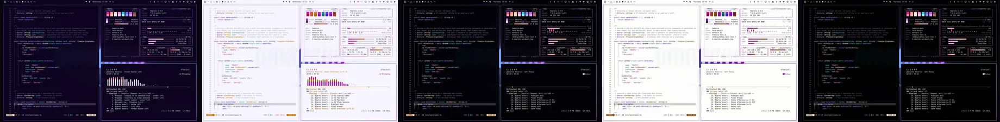](https://bjarneo.github.io/100-themes/#synthwave)

`001` · 目录：[`synthwave/`](synthwave/) · [在画廊中打开](https://bjarneo.github.io/100-themes/#synthwave)

Synthwave 的深色变体用深紫背景，强调色为紫。ANSI 色饱和而明亮。原生背景是透视网格上的一轮霓虹太阳。

| 变体 | 主题名 | `background` | `foreground` | `accent` | 图标主题 |
| --- | --- | --- | --- | --- | --- |
| 深色 | [`synthwave`](synthwave/dark/) | `#0c031f` | `#e8e6ef` | `#d563fe` | `Yaru-purple` |
| 日间 | [`synthwave-day`](synthwave/day/) | `#f7f5fe` | `#282238` | `#a720d0` | `Yaru-purple` |
| 高对比度 | [`synthwave-high-contrast`](synthwave/high-contrast/) | `#020107` | `#f5f4fa` | `#d667fe` | `Yaru-purple` |
| 日间高对比度 | [`synthwave-day-high-contrast`](synthwave/day-high-contrast/) | `#fdfefc` | `#0b0618` | `#9200b8` | `Yaru-purple` |
| OLED | [`synthwave-oled`](synthwave/oled/) | `#000000` | `#e8e6ef` | `#d563fe` | `Yaru-purple` |

<details>
<summary>每个变体的全部 16 个 ANSI 颜色</summary>

| 变体 | 常规，0 到 7 | 亮色，8 到 15 |
| --- | --- | --- |
| 深色 | `#190f2e` `#fe288f` `#fc9afe` `#fde3c9` `#766dff` `#d563fe` `#21e4f8` `#cbc9d4` | `#665a8c` `#fe83af` `#fed5fe` `#fdf7f2` `#9698fd` `#e39efe` `#c1f6fe` `#faf9fd` |
| 日间 | `#e4e0f5` `#cc096f` `#b915bf` `#c47809` `#5835ea` `#a720d0` `#058490` `#494459` | `#a5a1b6` `#aa055b` `#9c00a2` `#a96500` `#4900d5` `#8d05b2` `#066d78` `#151120` |
| 高对比度 | `#18102a` `#fe5c9d` `#fc9afe` `#fecd9c` `#8f8ffe` `#d667fe` `#21e4f8` `#dedde5` | `#8279a1` `#ffa6c3` `#fed5fe` `#fde3c9` `#babefe` `#e6a8ff` `#b5f5fe` `#ffffff` |
| 日间高对比度 | `#ece9f8` `#ac045d` `#9c04a1` `#7e4c07` `#552ee4` `#9200b8` `#08616a` `#2e2c37` | `#777386` `#90004c` `#810085` `#683e04` `#4900d5` `#7a009b` `#015058` `#020103` |
| OLED | `#0d061e` `#fe288f` `#fc9afe` `#fde3c9` `#766dff` `#d563fe` `#21e4f8` `#cbc9d4` | `#665a8c` `#fe83af` `#fed5fe` `#fdf7f2` `#9698fd` `#e39efe` `#c1f6fe` `#faf9fd` |

</details>

```bash
curl -fsSL https://bjarneo.github.io/100-themes/install.sh | bash -s -- synthwave --set
```

### Neon Wave

[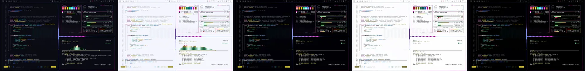](https://bjarneo.github.io/100-themes/#neon-wave)

`002` · 目录：[`neon-wave/`](neon-wave/) · [在画廊中打开](https://bjarneo.github.io/100-themes/#neon-wave)

Neon Wave 的深色变体用深靛蓝背景，强调色为洋红。ANSI 色使用极高的彩度，霓虹感强烈。原生背景是透视网格上的一轮霓虹太阳。

| 变体 | 主题名 | `background` | `foreground` | `accent` | 图标主题 |
| --- | --- | --- | --- | --- | --- |
| 深色 | [`neon-wave`](neon-wave/dark/) | `#0a0a12` | `#e6e6f0` | `#ff2bd6` | `Yaru-magenta` |
| 日间 | [`neon-wave-day`](neon-wave/day/) | `#f5f6fd` | `#222534` | `#c004a2` | `Yaru-magenta` |
| 高对比度 | [`neon-wave-high-contrast`](neon-wave/high-contrast/) | `#010106` | `#f3f5fb` | `#ff48da` | `Yaru-magenta` |
| 日间高对比度 | [`neon-wave-day-high-contrast`](neon-wave/day-high-contrast/) | `#fdfdfe` | `#060815` | `#a4018a` | `Yaru-magenta` |
| OLED | [`neon-wave-oled`](neon-wave/oled/) | `#000000` | `#e6e6f0` | `#ff2bd6` | `Yaru-magenta` |

<details>
<summary>每个变体的全部 16 个 ANSI 颜色</summary>

| 变体 | 常规，0 到 7 | 亮色，8 到 15 |
| --- | --- | --- |
| 深色 | `#12121c` `#ff2e63` `#2bff88` `#ffe600` `#3d7bff` `#ff2bd6` `#00f0ff` `#c8c8d8` | `#4f4f70` `#ff6b8f` `#7dffb0` `#fff27a` `#7aa8ff` `#ff7ae6` `#7af7ff` `#ffffff` |
| 日间 | `#dfe2ef` `#d40335` `#058c47` `#9c8e00` `#025fc4` `#c004a2` `#01858b` `#434755` | `#a0a4b5` `#b1002a` `#00743a` `#857903` `#004ca2` `#9f0486` `#006e74` `#10131f` |
| 高对比度 | `#111428` `#fe626a` `#1ae97d` `#efdb00` `#5b9ffd` `#ff48da` `#1be5f0` `#dbdee6` | `#777e9f` `#feaaa9` `#9cffb9` `#ffec3f` `#9fc7fe` `#fda0e4` `#a2f9ff` `#ffffff` |
| 日间高对比度 | `#e9ebf3` `#b0062b` `#036532` `#615801` `#0055b3` `#a4018a` `#066166` `#2b2d38` | `#717585` `#930021` `#055329` `#504900` `#004594` `#880072` `#095054` `#010203` |
| OLED | `#07091c` `#ff2e63` `#2bff88` `#ffe600` `#3d7bff` `#ff2bd6` `#00f0ff` `#c8c8d8` | `#4f4f70` `#ff6b8f` `#7dffb0` `#fff27a` `#7aa8ff` `#ff7ae6` `#7af7ff` `#ffffff` |

</details>

```bash
curl -fsSL https://bjarneo.github.io/100-themes/install.sh | bash -s -- neon-wave --set
```

### Lofi

[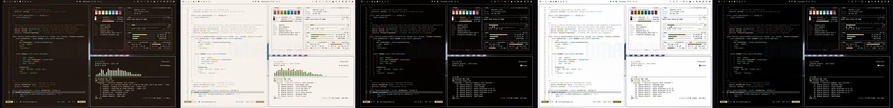](https://bjarneo.github.io/100-themes/#lofi)

`003` · 目录：[`lofi/`](lofi/) · [在画廊中打开](https://bjarneo.github.io/100-themes/#lofi)

Lofi 的深色变体用深棕背景，强调色为洋红。ANSI 色使用低彩度，柔和而不刺眼。原生背景是层层叠叠的声波带。

| 变体 | 主题名 | `background` | `foreground` | `accent` | 图标主题 |
| --- | --- | --- | --- | --- | --- |
| 深色 | [`lofi`](lofi/dark/) | `#1f160f` | `#eee6e0` | `#d496c9` | `Yaru-magenta` |
| 日间 | [`lofi-day`](lofi/day/) | `#f8f2ee` | `#2f241c` | `#975d8e` | `Yaru-magenta` |
| 高对比度 | [`lofi-high-contrast`](lofi/high-contrast/) | `#040100` | `#f9f4f0` | `#d496c9` | `Yaru-magenta` |
| 日间高对比度 | [`lofi-day-high-contrast`](lofi/day-high-contrast/) | `#fdfdfe` | `#100702` | `#7b4473` | `Yaru-magenta` |
| OLED | [`lofi-oled`](lofi/oled/) | `#000000` | `#eee6e0` | `#d496c9` | `Yaru-magenta` |

<details>
<summary>每个变体的全部 16 个 ANSI 颜色</summary>

| 变体 | 常规，0 到 7 | 亮色，8 到 15 |
| --- | --- | --- |
| 深色 | `#2e241d` `#dc8c82` `#9dce8f` `#f2cb83` `#72aae1` `#d496c9` `#65d2d4` `#d2c8c1` | `#755e4c` `#ecb4ad` `#c9e9bf` `#fef0d7` `#a3c8ee` `#e9bee1` `#aaeced` `#fdf9f7` |
| 日间 | `#e6ded8` `#a75c53` `#58854a` `#ab863e` `#396fa3` `#975d8e` `#0c888b` `#50453d` | `#aea298` `#93463e` `#437133` `#967020` `#205b90` `#83487a` `#007274` `#1b120b` |
| 高对比度 | `#201308` `#dc8c82` `#9dce8f` `#f2cb83` `#72aae1` `#d496c9` `#65d2d4` `#e4dcd6` | `#937b69` `#f4b1a8` `#c4ebb8` `#fee4b7` `#9cc9f6` `#eebbe5` `#9deff0` `#ffffff` |
| 日间高对比度 | `#efeae6` `#8a423a` `#376228` `#725200` `#235a8c` `#7b4473` `#066264` `#362c24` | `#7f736a` `#792f29` `#245113` `#5d4204` `#094a7d` `#6c3364` `#044f51` `#030101` |
| OLED | `#140801` `#dc8c82` `#9dce8f` `#f2cb83` `#72aae1` `#d496c9` `#65d2d4` `#d2c8c1` | `#755e4c` `#ecb4ad` `#c9e9bf` `#fef0d7` `#a3c8ee` `#e9bee1` `#aaeced` `#fdf9f7` |

</details>

```bash
curl -fsSL https://bjarneo.github.io/100-themes/install.sh | bash -s -- lofi --set
```

### Hacker

[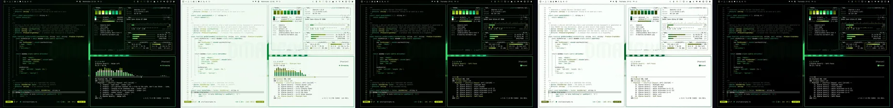](https://bjarneo.github.io/100-themes/#hacker)

`004` · 目录：[`hacker/`](hacker/) · [在画廊中打开](https://bjarneo.github.io/100-themes/#hacker)

Hacker 的深色变体用深绿背景，强调色为绿。6 个 ANSI 色相都靠近绿，整组读起来像一个颜色。原生背景是一列列坠落的代码字符。

| 变体 | 主题名 | `background` | `foreground` | `accent` | 图标主题 |
| --- | --- | --- | --- | --- | --- |
| 深色 | [`hacker`](hacker/dark/) | `#000802` | `#e3eae4` | `#12bb7c` | `Yaru-sage` |
| 日间 | [`hacker-day`](hacker/day/) | `#f1faf2` | `#1d2a1f` | `#008053` | `Yaru-sage` |
| 高对比度 | [`hacker-high-contrast`](hacker/high-contrast/) | `#000300` | `#f1f7f2` | `#12bb7c` | `Yaru-sage` |
| 日间高对比度 | [`hacker-day-high-contrast`](hacker/day-high-contrast/) | `#fbfffb` | `#020c04` | `#016440` | `Yaru-sage` |
| OLED | [`hacker-oled`](hacker/oled/) | `#000000` | `#e3eae4` | `#12bb7c` | `Yaru-sage` |

<details>
<summary>每个变体的全部 16 个 ANSI 颜色</summary>

| 变体 | 常规，0 到 7 | 亮色，8 到 15 |
| --- | --- | --- |
| 深色 | `#07150a` `#568104` `#11dc4b` `#dbf515` `#12a05c` `#12bb7c` `#51f75b` `#c4cdc5` | `#4f6c54` `#6da200` `#7af888` `#f5ffcf` `#03c470` `#11e095` `#d7ffd5` `#f8fbf8` |
| 日间 | `#dbe6dd` `#4b7107` `#09892c` `#839403` `#007742` `#008053` `#058d1c` `#3e4c41` | `#9aa99c` `#3c5b04` `#007221` `#6f7d08` `#006034` `#056944` `#047516` `#0b170e` |
| 高对比度 | `#071b0c` `#79b306` `#11dc4b` `#cfe717` `#15bc6d` `#12bb7c` `#51f75b` `#d9e0da` | `#6b8971` `#9cdb3f` `#77f886` `#dff848` `#30e78a` `#18e79b` `#b3feb1` `#ffffff` |
| 日间高对比度 | `#e6eee7` `#3f6100` `#02661e` `#535e00` `#056639` `#016440` `#006710` `#273129` | `#6b796d` `#334f02` `#035418` `#434c00` `#00542c` `#025334` `#00550b` `#010201` |
| OLED | `#001003` `#568104` `#11dc4b` `#dbf515` `#12a05c` `#12bb7c` `#51f75b` `#c4cdc5` | `#4f6c54` `#6da200` `#7af888` `#f5ffcf` `#03c470` `#11e095` `#d7ffd5` `#f8fbf8` |

</details>

```bash
curl -fsSL https://bjarneo.github.io/100-themes/install.sh | bash -s -- hacker --set
```

### Ember

[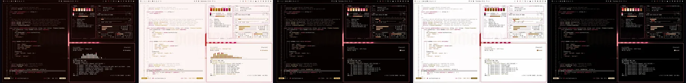](https://bjarneo.github.io/100-themes/#ember)

`005` · 目录：[`ember/`](ember/) · [在画廊中打开](https://bjarneo.github.io/100-themes/#ember)

Ember 的深色变体用深红背景，强调色为粉红。ANSI 色饱和而明亮。原生背景是沙丘上的余烬或尘土。

| 变体 | 主题名 | `background` | `foreground` | `accent` | 图标主题 |
| --- | --- | --- | --- | --- | --- |
| 深色 | [`ember`](ember/dark/) | `#110402` | `#f0e5e2` | `#fe5c8c` | `Yaru-red` |
| 日间 | [`ember-day`](ember/day/) | `#fcf5f3` | `#33221d` | `#cf025e` | `Yaru-red` |
| 高对比度 | [`ember-high-contrast`](ember/high-contrast/) | `#050100` | `#faf3f1` | `#fe5c8c` | `Yaru-red` |
| 日间高对比度 | [`ember-day-high-contrast`](ember/day-high-contrast/) | `#fefdfd` | `#130503` | `#af004e` | `Yaru-red` |
| OLED | [`ember-oled`](ember/oled/) | `#000000` | `#f0e5e2` | `#fe5c8c` | `Yaru-red` |

<details>
<summary>每个变体的全部 16 个 ANSI 颜色</summary>

| 变体 | 常规，0 到 7 | 亮色，8 到 15 |
| --- | --- | --- |
| 深色 | `#1f0f0a` `#fc4735` `#ffaf7c` `#fee5b7` `#ec3060` `#fe5c8c` `#fdb89a` `#d4c7c4` | `#7d5950` `#f59282` `#fddecb` `#fff8eb` `#e6838f` `#fe9db2` `#fce6dc` `#fdf9f8` |
| 日间 | `#eedfdb` `#d41102` `#b25806` `#b38308` `#b90042` `#cf025e` `#bd4d00` `#54433f` | `#b49f9a` `#b00e03` `#944907` `#996f05` `#960134` `#ac034d` `#9e3f00` `#1e100c` |
| 高对比度 | `#250f09` `#fe6652` `#ffaf7c` `#ffd077` `#ff5f7c` `#fe5c8c` `#fdb89a` `#e6dbd9` | `#9c766c` `#ffab9d` `#feddc9` `#fee4b6` `#fea9b2` `#fda9ba` `#fee1d4` `#ffffff` |
| 日间高对比度 | `#f3e9e6` `#b20500` `#8d4300` `#725200` `#ae043e` `#af004e` `#953b00` `#372a27` | `#84716c` `#940300` `#753600` `#5d4303` `#910333` `#8f043f` `#7b3001` `#030101` |
| OLED | `#190502` `#fc4735` `#ffaf7c` `#fee5b7` `#ec3060` `#fe5c8c` `#fdb89a` `#d4c7c4` | `#7d5950` `#f59282` `#fddecb` `#fff8eb` `#e6838f` `#fe9db2` `#fce6dc` `#fdf9f8` |

</details>

```bash
curl -fsSL https://bjarneo.github.io/100-themes/install.sh | bash -s -- ember --set
```

### Vaporwave

[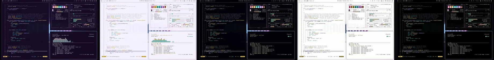](https://bjarneo.github.io/100-themes/#vaporwave)

`006` · 目录：[`vaporwave/`](vaporwave/) · [在画廊中打开](https://bjarneo.github.io/100-themes/#vaporwave)

Vaporwave 的深色变体用深紫背景，强调色为洋红。ANSI 色是浅淡的粉彩色。原生背景是透视网格上的一轮霓虹太阳。

| 变体 | 主题名 | `background` | `foreground` | `accent` | 图标主题 |
| --- | --- | --- | --- | --- | --- |
| 深色 | [`vaporwave`](vaporwave/dark/) | `#150b24` | `#e9e6ef` | `#ec9dee` | `Yaru-magenta` |
| 日间 | [`vaporwave-day`](vaporwave/day/) | `#f5f1fe` | `#292237` | `#a459a6` | `Yaru-magenta` |
| 高对比度 | [`vaporwave-high-contrast`](vaporwave/high-contrast/) | `#020107` | `#f6f4fa` | `#ec9dee` | `Yaru-magenta` |
| 日间高对比度 | [`vaporwave-day-high-contrast`](vaporwave/day-high-contrast/) | `#fdfefc` | `#0c0517` | `#833a85` | `Yaru-magenta` |
| OLED | [`vaporwave-oled`](vaporwave/oled/) | `#000000` | `#e9e6ef` | `#ec9dee` | `Yaru-magenta` |

<details>
<summary>每个变体的全部 16 个 ANSI 颜色</summary>

| 变体 | 常规，0 到 7 | 亮色，8 到 15 |
| --- | --- | --- |
| 深色 | `#231933` `#fb90bf` `#44e8c8` `#fedc67` `#aea3ff` `#ec9dee` `#2debf9` `#ccc8d3` | `#695a85` `#fec5dc` `#acffea` `#fef8e6` `#cecafd` `#fecafe` `#d3fafe` `#faf9fd` |
| 日间 | `#e2dcf0` `#b75282` `#09957f` `#af8f01` `#7061bd` `#a459a6` `#0e919a` `#4a4458` | `#a7a1b5` `#a23a6e` `#077e6a` `#957b0f` `#5d4aaa` `#8f4292` `#107a82` `#16111f` |
| 高对比度 | `#1a1029` `#fb90bf` `#44e8c8` `#f7d560` `#aea3ff` `#ec9dee` `#2debf9` `#dfdce5` | `#85789f` `#fec5dc` `#99ffe6` `#fee79c` `#cecafe` `#ffc9ff` `#a9f8ff` `#ffffff` |
| 日间高对比度 | `#ede8f7` `#943363` `#0c6354` `#6a5600` `#5a49a3` `#833a85` `#066168` `#2f2c37` | `#787285` `#841d54` `#015144` `#574600` `#4c3795` `#732777` `#004f55` `#020103` |
| OLED | `#0f051d` `#fb90bf` `#44e8c8` `#fedc67` `#aea3ff` `#ec9dee` `#2debf9` `#ccc8d3` | `#695a85` `#fec5dc` `#acffea` `#fef8e6` `#cecafd` `#fecafe` `#d3fafe` `#faf9fd` |

</details>

```bash
curl -fsSL https://bjarneo.github.io/100-themes/install.sh | bash -s -- vaporwave --set
```

### Cyberpunk

[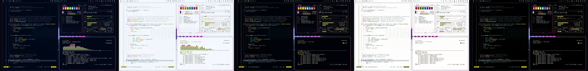](https://bjarneo.github.io/100-themes/#cyberpunk)

`007` · 目录：[`cyberpunk/`](cyberpunk/) · [在画廊中打开](https://bjarneo.github.io/100-themes/#cyberpunk)

Cyberpunk 的深色变体用深蓝背景，强调色为洋红。ANSI 色使用极高的彩度，霓虹感强烈。原生背景是一座城市的天际线。

| 变体 | 主题名 | `background` | `foreground` | `accent` | 图标主题 |
| --- | --- | --- | --- | --- | --- |
| 深色 | [`cyberpunk`](cyberpunk/dark/) | `#000717` | `#e3e8f0` | `#ff44ca` | `Yaru-magenta` |
| 日间 | [`cyberpunk-day`](cyberpunk/day/) | `#f3f7fc` | `#1b2737` | `#c30597` | `Yaru-magenta` |
| 高对比度 | [`cyberpunk-high-contrast`](cyberpunk/high-contrast/) | `#000208` | `#f2f5fb` | `#fe51cb` | `Yaru-magenta` |
| 日间高对比度 | [`cyberpunk-day-high-contrast`](cyberpunk/day-high-contrast/) | `#fefdfc` | `#020917` | `#a50080` | `Yaru-magenta` |
| OLED | [`cyberpunk-oled`](cyberpunk/oled/) | `#000000` | `#e3e8f0` | `#ff44ca` | `Yaru-magenta` |

<details>
<summary>每个变体的全部 16 个 ANSI 颜色</summary>

| 变体 | 常规，0 到 7 | 亮色，8 到 15 |
| --- | --- | --- |
| 深色 | `#071425` `#ff3965` `#b1d60f` `#feed0d` `#118ed5` `#ff44ca` `#1fe4f6` `#c4cbd4` | `#4c6585` `#fe8895` `#d4f56b` `#fffbca` `#2eaeff` `#fe95d9` `#bef7fe` `#f8fafd` |
| 日间 | `#d9e4f3` `#d20048` `#698000` `#9a8f01` `#0069a1` `#c30597` `#04848f` `#3d4958` | `#98a6b8` `#af043b` `#576a07` `#847a01` `#075582` `#a2047d` `#0f6d76` `#0a1421` |
| 高对比度 | `#05162c` `#fd6179` `#b1d60f` `#eddc07` `#11a7fb` `#fe51cb` `#1fe4f6` `#d9dfe6` | `#6882a4` `#fea9b0` `#cff90d` `#feed0d` `#8dccfd` `#fea2dc` `#b0f6ff` `#ffffff` |
| 日间高对比度 | `#e4ecf6` `#af043b` `#4c5e00` `#605903` `#005c8e` `#a50080` `#076169` `#272e38` | `#697686` `#910530` `#3d4c00` `#504900` `#004b75` `#8a006a` `#075057` `#010203` |
| OLED | `#000b1f` `#ff3965` `#b1d60f` `#feed0d` `#118ed5` `#ff44ca` `#1fe4f6` `#c4cbd4` | `#4c6585` `#fe8895` `#d4f56b` `#fffbca` `#2eaeff` `#fe95d9` `#bef7fe` `#f8fafd` |

</details>

```bash
curl -fsSL https://bjarneo.github.io/100-themes/install.sh | bash -s -- cyberpunk --set
```

### Outrun

[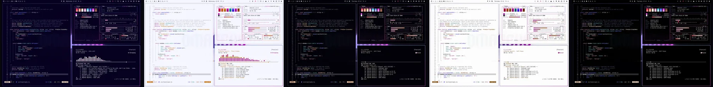](https://bjarneo.github.io/100-themes/#outrun)

`008` · 目录：[`outrun/`](outrun/) · [在画廊中打开](https://bjarneo.github.io/100-themes/#outrun)

Outrun 的深色变体用深靛蓝背景，强调色为洋红。ANSI 色使用极高的彩度，霓虹感强烈。原生背景是透视网格上的一轮霓虹太阳。

| 变体 | 主题名 | `background` | `foreground` | `accent` | 图标主题 |
| --- | --- | --- | --- | --- | --- |
| 深色 | [`outrun`](outrun/dark/) | `#06001f` | `#e7e7f0` | `#f146ef` | `Yaru-magenta` |
| 日间 | [`outrun-day`](outrun/day/) | `#f6f6ff` | `#242439` | `#b806b7` | `Yaru-magenta` |
| 高对比度 | [`outrun-high-contrast`](outrun/high-contrast/) | `#020108` | `#f4f4fa` | `#f54af3` | `Yaru-magenta` |
| 日间高对比度 | [`outrun-day-high-contrast`](outrun/day-high-contrast/) | `#fdfdfc` | `#080619` | `#9e009d` | `Yaru-magenta` |
| OLED | [`outrun-oled`](outrun/oled/) | `#000000` | `#e7e7f0` | `#f146ef` | `Yaru-magenta` |

<details>
<summary>每个变体的全部 16 个 ANSI 颜色</summary>

| 变体 | 常规，0 到 7 | 亮色，8 到 15 |
| --- | --- | --- |
| 深色 | `#100a2e` `#fd3e61` `#ffa0de` `#ffe2ca` `#5e75ff` `#f146ef` `#5eddfe` `#c9c9d4` | `#5e5b94` `#fd8992` `#fdd8ef` `#fef7f1` `#869dfc` `#f299ee` `#cef3fd` `#fafafd` |
| 日间 | `#e0e1f6` `#d30043` `#c7069d` `#ca740e` `#3d38f8` `#b806b7` `#02829b` `#45455a` | `#a2a2b7` `#b00036` `#a70083` `#ac620c` `#3100e4` `#990498` `#006c81` `#121221` |
| 高对比度 | `#14122b` `#fe6175` `#ffa0de` `#ffcca2` `#7d96fe` `#f54af3` `#5eddfe` `#dddde6` | `#7c7ca3` `#ffa9ae` `#fdd8ef` `#fde2cd` `#b0c1fd` `#fe9af9` `#c3f1ff` `#ffffff` |
| 日间高对比度 | `#e9eaf9` `#af0437` `#a50081` `#834906` `#3a31f3` `#9e009d` `#026072` `#2d2d38` | `#727286` `#93002c` `#89006b` `#6c3b01` `#3100e4` `#810281` `#064f5e` `#020203` |
| OLED | `#0a071f` `#fd3e61` `#ffa0de` `#ffe2ca` `#5e75ff` `#f146ef` `#5eddfe` `#c9c9d4` | `#5e5b94` `#fd8992` `#fdd8ef` `#fef7f1` `#869dfc` `#f299ee` `#cef3fd` `#fafafd` |

</details>

```bash
curl -fsSL https://bjarneo.github.io/100-themes/install.sh | bash -s -- outrun --set
```

### Toxic

[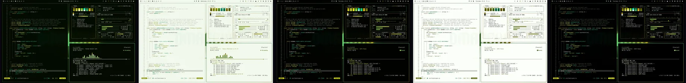](https://bjarneo.github.io/100-themes/#toxic)

`009` · 目录：[`toxic/`](toxic/) · [在画廊中打开](https://bjarneo.github.io/100-themes/#toxic)

Toxic 的深色变体用深橄榄绿背景，强调色为黄。ANSI 色饱和而明亮。原生背景是一张等高线地形图。

| 变体 | 主题名 | `background` | `foreground` | `accent` | 图标主题 |
| --- | --- | --- | --- | --- | --- |
| 深色 | [`toxic`](toxic/dark/) | `#030a00` | `#e5eae1` | `#b99d13` | `Yaru-yellow` |
| 日间 | [`toxic-day`](toxic/day/) | `#f3f9ed` | `#212a18` | `#7f6b0c` | `Yaru-yellow` |
| 高对比度 | [`toxic-high-contrast`](toxic/high-contrast/) | `#010200` | `#f3f6f1` | `#b99d13` | `Yaru-yellow` |
| 日间高对比度 | [`toxic-day-high-contrast`](toxic/day-high-contrast/) | `#fcfff9` | `#050c01` | `#685700` | `Yaru-yellow` |
| OLED | [`toxic-oled`](toxic/oled/) | `#000000` | `#e5eae1` | `#b99d13` | `Yaru-yellow` |

<details>
<summary>每个变体的全部 16 个 ANSI 颜色</summary>

| 变体 | 常规，0 到 7 | 亮色，8 到 15 |
| --- | --- | --- |
| 深色 | `#0e1704` `#7b7508` `#79d30b` `#e8f11c` `#02a054` `#b99d13` `#06f4b9` `#c7cdc3` | `#586a46` `#9a930b` `#adee7f` `#f9ffbf` `#44c073` `#ddbc24` `#ceffea` `#f9fbf7` |
| 日间 | `#dee6d6` `#6b6605` `#498304` `#8b9100` `#00773d` `#7f6b0c` `#128967` `#424b3a` | `#9ea995` `#575200` `#3b6d00` `#767b04` `#076031` `#685704` `#077255` `#0f1608` |
| 高对比度 | `#0e1a01` `#aba300` `#79d30b` `#dbe302` `#07bd65` `#b99d13` `#06f4b9` `#dbe0d7` | `#748862` `#d3ca0f` `#9df455` `#ecf419` `#1ae97f` `#e6c204` `#a1feda` `#ffffff` |
| 日间高对比度 | `#e8ede2` `#5e5905` `#356300` `#585c02` `#016533` `#685700` `#06654b` `#2a3025` | `#6f7866` `#4e4a04` `#2b5200` `#484b00` `#05532a` `#554700` `#04523c` `#010201` |
| OLED | `#050f00` `#7b7508` `#79d30b` `#e8f11c` `#02a054` `#b99d13` `#06f4b9` `#c7cdc3` | `#586a46` `#9a930b` `#adee7f` `#f9ffbf` `#44c073` `#ddbc24` `#ceffea` `#f9fbf7` |

</details>

```bash
curl -fsSL https://bjarneo.github.io/100-themes/install.sh | bash -s -- toxic --set
```

### Abyss

[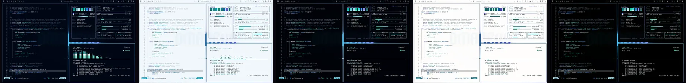](https://bjarneo.github.io/100-themes/#abyss)

`010` · 目录：[`abyss/`](abyss/) · [在画廊中打开](https://bjarneo.github.io/100-themes/#abyss)

Abyss 的深色变体用深蓝背景，强调色为靛蓝。ANSI 色使用中彩度，观感更平静。原生背景是水中的光线。

| 变体 | 主题名 | `background` | `foreground` | `accent` | 图标主题 |
| --- | --- | --- | --- | --- | --- |
| 深色 | [`abyss`](abyss/dark/) | `#000614` | `#e2e9f0` | `#8593fd` | `Yaru-blue` |
| 日间 | [`abyss-day`](abyss/day/) | `#f2f7fc` | `#182836` | `#545ccb` | `Yaru-blue` |
| 高对比度 | [`abyss-high-contrast`](abyss/high-contrast/) | `#000208` | `#f1f6fa` | `#8593fd` | `Yaru-blue` |
| 日间高对比度 | [`abyss-day-high-contrast`](abyss/day-high-contrast/) | `#fefdfc` | `#000a16` | `#454ab7` | `Yaru-blue` |
| OLED | [`abyss-oled`](abyss/oled/) | `#000000` | `#e2e9f0` | `#8593fd` | `Yaru-blue` |

<details>
<summary>每个变体的全部 16 个 ANSI 颜色</summary>

| 变体 | 常规，0 到 7 | 亮色，8 到 15 |
| --- | --- | --- |
| 深色 | `#021322` `#008380` `#05d6ad` `#b2f1fe` `#2288e8` `#8593fd` `#17eeec` `#c3ccd4` | `#456783` `#1aa3a0` `#5cf6ce` `#f0fbfd` `#5da8fa` `#acb9fc` `#c6fffd` `#f7fafd` |
| 日间 | `#d7e5f2` `#047270` `#05856b` `#009ab0` `#0064b5` `#545ccb` `#058684` `#3a4a57` | `#96a7b7` `#015c5a` `#0f6d58` `#138394` `#005093` `#4245b8` `#016f6e` `#081520` |
| 高对比度 | `#00182b` `#02b5b2` `#05d6ad` `#82e9fe` `#49a2fe` `#8593fd` `#17eeec` `#d8dfe6` | `#6284a2` `#1fe0db` `#5cf6ce` `#bcf3fe` `#98c8ff` `#b4c0fd` `#89fffc` `#ffffff` |
| 日间高对比度 | `#e3edf5` `#086260` `#066450` `#0c606d` `#0559a0` `#454ab7` `#076261` `#262f37` | `#667785` `#09504e` `#045141` `#004e5a` `#024885` `#3836a9` `#094f4f` `#010203` |
| OLED | `#000c1e` `#008380` `#05d6ad` `#b2f1fe` `#2288e8` `#8593fd` `#17eeec` `#c3ccd4` | `#456783` `#1aa3a0` `#5cf6ce` `#f0fbfd` `#5da8fa` `#acb9fc` `#c6fffd` `#f7fafd` |

</details>

```bash
curl -fsSL https://bjarneo.github.io/100-themes/install.sh | bash -s -- abyss --set
```

### Ultraviolet

[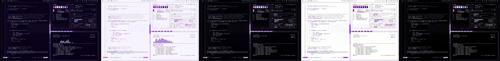](https://bjarneo.github.io/100-themes/#ultraviolet)

`011` · 目录：[`ultraviolet/`](ultraviolet/) · [在画廊中打开](https://bjarneo.github.io/100-themes/#ultraviolet)

Ultraviolet 的深色变体用深紫背景，强调色为紫。ANSI 色饱和而明亮。原生背景是星野里的一片星云。

| 变体 | 主题名 | `background` | `foreground` | `accent` | 图标主题 |
| --- | --- | --- | --- | --- | --- |
| 深色 | [`ultraviolet`](ultraviolet/dark/) | `#090119` | `#e9e6ef` | `#c274ff` | `Yaru-purple` |
| 日间 | [`ultraviolet-day`](ultraviolet/day/) | `#f8f5fe` | `#292237` | `#9421d7` | `Yaru-purple` |
| 高对比度 | [`ultraviolet-high-contrast`](ultraviolet/high-contrast/) | `#020107` | `#f6f4fa` | `#c274ff` | `Yaru-purple` |
| 日间高对比度 | [`ultraviolet-day-high-contrast`](ultraviolet/day-high-contrast/) | `#fdfefc` | `#0c0517` | `#8907cb` | `Yaru-purple` |
| OLED | [`ultraviolet-oled`](ultraviolet/oled/) | `#000000` | `#e9e6ef` | `#c274ff` | `Yaru-purple` |

<details>
<summary>每个变体的全部 16 个 ANSI 颜色</summary>

| 变体 | 常规，0 到 7 | 亮色，8 到 15 |
| --- | --- | --- |
| 深色 | `#160928` `#bd02aa` `#adaeff` `#f2daff` `#467cfd` `#c274ff` `#d2c9ff` `#ccc8d3` | `#6a588a` `#c26bb3` `#d1d3fe` `#fcf6ff` `#77a2fe` `#d4a7fd` `#f2f0fd` `#faf9fd` |
| 日间 | `#e5dff4` `#a70096` `#6847fa` `#bd45f0` `#124aee` `#9421d7` `#8040f6` `#4a4458` | `#a7a1b5` `#88007a` `#5821e8` `#a91ddc` `#0027dc` `#7c05b8` `#6f15e3` `#16111f` |
| 高对比度 | `#1a1029` `#f751e0` `#adaeff` `#ebc8fd` `#6d9afe` `#c274ff` `#d2c9ff` `#dfdce5` | `#85789f` `#fe9dec` `#d1d3ff` `#f3e0fe` `#a8c4fc` `#d9b0fe` `#e8e4fe` `#ffffff` |
| 日间高对比度 | `#ede8f7` `#a20092` `#5a2ee5` `#8e06bc` `#0d42e7` `#8907cb` `#6d21dd` `#2f2c37` | `#787285` `#850477` `#4e00d6` `#77019e` `#0025da` `#7104a8` `#5e00c6` `#020103` |
| OLED | `#0f051d` `#bd02aa` `#adaeff` `#f2daff` `#467cfd` `#c274ff` `#d2c9ff` `#ccc8d3` | `#6a588a` `#c26bb3` `#d1d3fe` `#fcf6ff` `#77a2fe` `#d4a7fd` `#f2f0fd` `#faf9fd` |

</details>

```bash
curl -fsSL https://bjarneo.github.io/100-themes/install.sh | bash -s -- ultraviolet --set
```

### Arcade

[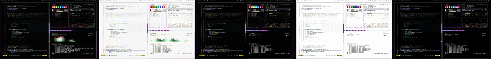](https://bjarneo.github.io/100-themes/#arcade)

`012` · 目录：[`arcade/`](arcade/) · [在画廊中打开](https://bjarneo.github.io/100-themes/#arcade)

Arcade 的深色变体用中性黑背景，强调色为洋红。ANSI 色使用极高的彩度，霓虹感强烈。原生背景是一处像素风景。

| 变体 | 主题名 | `background` | `foreground` | `accent` | 图标主题 |
| --- | --- | --- | --- | --- | --- |
| 深色 | [`arcade`](arcade/dark/) | `#030303` | `#efe5e7` | `#fe32e3` | `Yaru-magenta` |
| 日间 | [`arcade-day`](arcade/day/) | `#f7f7f7` | `#2b2426` | `#be00a9` | `Yaru-magenta` |
| 高对比度 | [`arcade-high-contrast`](arcade/high-contrast/) | `#020202` | `#faf3f5` | `#ff40e4` | `Yaru-magenta` |
| 日间高对比度 | [`arcade-day-high-contrast`](arcade/day-high-contrast/) | `#fdfdfd` | `#0d0809` | `#a0028e` | `Yaru-magenta` |
| OLED | [`arcade-oled`](arcade/oled/) | `#000000` | `#efe5e7` | `#fe32e3` | `Yaru-magenta` |

<details>
<summary>每个变体的全部 16 个 ANSI 颜色</summary>

| 变体 | 常规，0 到 7 | 亮色，8 到 15 |
| --- | --- | --- |
| 深色 | `#0d0d0d` `#fe423d` `#14eb4d` `#ffe97e` `#2581fe` `#fe32e3` `#1be5ee` `#d3c7ca` | `#6e5f63` `#fd8c80` `#a1ffa7` `#fff9dc` `#6aa5fd` `#fe91e9` `#b0fbff` `#fdf9fa` |
| 日间 | `#e3e3e3` `#d60015` `#0a8d2b` `#a18c0b` `#015dca` `#be00a9` `#01858a` `#4d4647` | `#aaa2a4` `#b20010` `#017521` `#8a7707` `#004aa5` `#9d058c` `#0a6e72` `#181214` |
| 高对比度 | `#1a1416` `#ff655a` `#14eb4d` `#f7d710` `#5e9efd` `#ff40e4` `#1be5ee` `#e5dbdd` | `#8b7b80` `#feaca1` `#a1ffa7` `#fee97f` `#a1c6fe` `#fe9eeb` `#a3f9fe` `#ffffff` |
| 日间高对比度 | `#ebebeb` `#b20211` `#05661d` `#655600` `#0053b8` `#a0028e` `#066166` `#372a2d` | `#7a7274` `#94000c` `#005313` `#524601` `#004498` `#860077` `#014f53` `#030102` |
| OLED | `#0f090b` `#fe423d` `#14eb4d` `#ffe97e` `#2581fe` `#fe32e3` `#1be5ee` `#d3c7ca` | `#6e5f63` `#fd8c80` `#a1ffa7` `#fff9dc` `#6aa5fd` `#fe91e9` `#b0fbff` `#fdf9fa` |

</details>

```bash
curl -fsSL https://bjarneo.github.io/100-themes/install.sh | bash -s -- arcade --set
```

### Noir Rain

[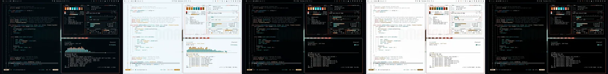](https://bjarneo.github.io/100-themes/#noir-rain)

`013` · 目录：[`noir-rain/`](noir-rain/) · [在画廊中打开](https://bjarneo.github.io/100-themes/#noir-rain)

Noir Rain 的深色变体用深蓝背景，强调色为红。ANSI 色饱和而明亮。原生背景是一座城市的天际线。

| 变体 | 主题名 | `background` | `foreground` | `accent` | 图标主题 |
| --- | --- | --- | --- | --- | --- |
| 深色 | [`noir-rain`](noir-rain/dark/) | `#02090e` | `#e0eaee` | `#fe664f` | `Yaru` |
| 日间 | [`noir-rain-day`](noir-rain/day/) | `#f1f8fc` | `#1b292f` | `#cc2a14` | `Yaru` |
| 高对比度 | [`noir-rain-high-contrast`](noir-rain/high-contrast/) | `#000204` | `#f0f6f9` | `#fe664f` | `Yaru` |
| 日间高对比度 | [`noir-rain-day-high-contrast`](noir-rain/day-high-contrast/) | `#fefdfd` | `#020b10` | `#ae1801` | `Yaru` |
| OLED | [`noir-rain-oled`](noir-rain/oled/) | `#000000` | `#e0eaee` | `#fe664f` | `Yaru` |

<details>
<summary>每个变体的全部 16 个 ANSI 颜色</summary>

| 变体 | 常规，0 到 7 | 亮色，8 到 15 |
| --- | --- | --- |
| 深色 | `#0a161b` `#e4690e` `#00e0e1` `#fee3c4` `#0f94ba` `#fe664f` `#1ce6ea` `#c1cdd3` | `#4c6876` `#fe9052` `#6efeff` `#fff7ef` `#15b5e3` `#fea290` `#a6fdfe` `#f7fbfd` |
| 日间 | `#dbe5e9` `#b44f00` `#038586` `#be7c0c` `#006e8c` `#cc2a14` `#028588` `#3d4a51` | `#99a7af` `#964100` `#0f6e6f` `#a36909` `#055871` `#ae1801` `#0e6e70` `#0a161b` |
| 高对比度 | `#061821` `#f87100` `#00e0e1` `#fdce96` `#13aedb` `#fe664f` `#1ce6ea` `#d6e0e4` | `#688594` `#ffae84` `#74fefe` `#fee3c4` `#60d4ff` `#feac9c` `#91fdff` `#ffffff` |
| 日间高对比度 | `#e6ecef` `#904005` `#066263` `#7c4e00` `#015e79` `#ae1801` `#066264` `#243036` | `#69777e` `#783302` `#045050` `#654004` `#004e65` `#920e00` `#044f51` `#010203` |
| OLED | `#000d15` `#e4690e` `#00e0e1` `#fee3c4` `#0f94ba` `#fe664f` `#1ce6ea` `#c1cdd3` | `#4c6876` `#fe9052` `#6efeff` `#fff7ef` `#15b5e3` `#fea290` `#a6fdfe` `#f7fbfd` |

</details>

```bash
curl -fsSL https://bjarneo.github.io/100-themes/install.sh | bash -s -- noir-rain --set
```

### Glacier

[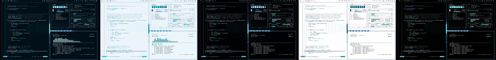](https://bjarneo.github.io/100-themes/#glacier)

`014` · 目录：[`glacier/`](glacier/) · [在画廊中打开](https://bjarneo.github.io/100-themes/#glacier)

Glacier 的深色变体用深蓝背景，强调色为蓝。ANSI 色是浅淡的粉彩色。原生背景是山湖上空的极光。

| 变体 | 主题名 | `background` | `foreground` | `accent` | 图标主题 |
| --- | --- | --- | --- | --- | --- |
| 深色 | [`glacier`](glacier/dark/) | `#010f18` | `#e0eaee` | `#98bffe` | `Yaru-blue` |
| 日间 | [`glacier-day`](glacier/day/) | `#ebf5fb` | `#182932` | `#4a79c6` | `Yaru-blue` |
| 高对比度 | [`glacier-high-contrast`](glacier/high-contrast/) | `#000205` | `#f0f6f9` | `#98bffe` | `Yaru-blue` |
| 日间高对比度 | [`glacier-day-high-contrast`](glacier/day-high-contrast/) | `#fdfdfe` | `#000b12` | `#28559f` | `Yaru-blue` |
| OLED | [`glacier-oled`](glacier/oled/) | `#000000` | `#e0eaee` | `#98bffe` | `Yaru-blue` |

<details>
<summary>每个变体的全部 16 个 ANSI 颜色</summary>

| 变体 | 常规，0 到 7 | 亮色，8 到 15 |
| --- | --- | --- |
| 深色 | `#0a1d26` `#1ecee2` `#41e5e3` `#9eedfd` `#57bcfa` `#98bffe` `#50ece0` `#c1cdd3` | `#45697a` `#9fe5f0` `#b2fbf9` `#f0fbfd` `#a6d8fc` `#ccdffe` `#c7fff8` `#f7fbfd` |
| 日间 | `#d5e2e9` `#008a99` `#109391` `#02a4bb` `#007ab2` `#4a79c6` `#00948b` `#3a4a53` | `#95a8b1` `#057480` `#137b7a` `#098da1` `#066493` `#3364b3` `#057c75` `#07161d` |
| 高对比度 | `#001925` `#1ecee2` `#41e5e3` `#83e9fe` `#57bcfa` `#98bffe` `#50ece0` `#d6e0e4` | `#618699` `#7cebfb` `#8dfefc` `#bff2fd` `#a4d8fd` `#cddffc` `#90fff4` `#ffffff` |
| 日间高对比度 | `#e3edf2` `#08616b` `#076261` `#0c606e` `#075d88` `#28559f` `#0c625c` `#243036` | `#667881` `#014f57` `#01504f` `#074f5b` `#064c6f` `#144591` `#04504b` `#010203` |
| OLED | `#000e19` `#1ecee2` `#41e5e3` `#9eedfd` `#57bcfa` `#98bffe` `#50ece0` `#c1cdd3` | `#45697a` `#9fe5f0` `#b2fbf9` `#f0fbfd` `#a6d8fc` `#ccdffe` `#c7fff8` `#f7fbfd` |

</details>

```bash
curl -fsSL https://bjarneo.github.io/100-themes/install.sh | bash -s -- glacier --set
```

### Tropical

[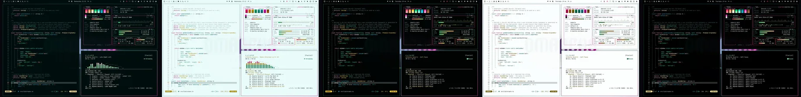](https://bjarneo.github.io/100-themes/#tropical)

`015` · 目录：[`tropical/`](tropical/) · [在画廊中打开](https://bjarneo.github.io/100-themes/#tropical)

Tropical 的深色变体用深青蓝背景，强调色为洋红。ANSI 色饱和而明亮。原生背景是水中的光线。

| 变体 | 主题名 | `background` | `foreground` | `accent` | 图标主题 |
| --- | --- | --- | --- | --- | --- |
| 深色 | [`tropical`](tropical/dark/) | `#000d0d` | `#dfeaea` | `#fe48c2` | `Yaru-magenta` |
| 日间 | [`tropical-day`](tropical/day/) | `#eafbfa` | `#0f2c2c` | `#c50092` | `Yaru-magenta` |
| 高对比度 | [`tropical-high-contrast`](tropical/high-contrast/) | `#000303` | `#eff7f7` | `#ff4ec3` | `Yaru-magenta` |
| 日间高对比度 | [`tropical-day-high-contrast`](tropical/day-high-contrast/) | `#fbfefe` | `#000d0d` | `#a6047a` | `Yaru-magenta` |
| OLED | [`tropical-oled`](tropical/oled/) | `#000000` | `#dfeaea` | `#fe48c2` | `Yaru-magenta` |

<details>
<summary>每个变体的全部 16 个 ANSI 颜色</summary>

| 变体 | 常规，0 到 7 | 亮色，8 到 15 |
| --- | --- | --- |
| 深色 | `#001b1b` `#fe3968` `#06e984` `#ffe79e` `#1596ac` `#fe48c2` `#1feacc` `#c0cecd` | `#356e6e` `#fe8896` `#99ffbc` `#fef8e7` `#15b8d3` `#fe96d4` `#adfeec` `#f6fbfb` |
| 日间 | `#d2e8e8` `#d2004a` `#028b4d` `#a98804` `#0b6f80` `#c50092` `#0d8775` `#344d4d` | `#90abaa` `#af003c` `#01743f` `#8f740f` `#095a68` `#a30478` `#097061` `#021818` |
| 高对比度 | `#001b1b` `#fd617b` `#06e984` `#ffd339` `#14b1cb` `#ff4ec3` `#1feacc` `#d5e1e0` | `#538c8b` `#fea9b1` `#9bfebd` `#ffe79e` `#1edbfa` `#fda3d8` `#99fee9` `#ffffff` |
| 日间高对比度 | `#e0efee` `#ae043d` `#046537` `#6b5500` `#0d606e` `#a6047a` `#086356` `#223131` | `#607a7a` `#920131` `#00522a` `#584600` `#054f5c` `#8b0066` `#005145` `#000202` |
| OLED | `#000f0f` `#fe3968` `#06e984` `#ffe79e` `#1596ac` `#fe48c2` `#1feacc` `#c0cecd` | `#356e6e` `#fe8896` `#99ffbc` `#fef8e7` `#15b8d3` `#fe96d4` `#adfeec` `#f6fbfb` |

</details>

```bash
curl -fsSL https://bjarneo.github.io/100-themes/install.sh | bash -s -- tropical --set
```

### Sakura

[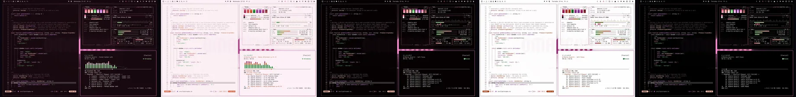](https://bjarneo.github.io/100-themes/#sakura)

`016` · 目录：[`sakura/`](sakura/) · [在画廊中打开](https://bjarneo.github.io/100-themes/#sakura)

Sakura 的深色变体用深梅红背景，强调色为粉红。ANSI 色使用中彩度，观感更平静。原生背景是带虚化的柔和光斑。

| 变体 | 主题名 | `background` | `foreground` | `accent` | 图标主题 |
| --- | --- | --- | --- | --- | --- |
| 深色 | [`sakura`](sakura/dark/) | `#17080f` | `#efe5e9` | `#fa7fb5` | `Yaru-magenta` |
| 日间 | [`sakura-day`](sakura/day/) | `#fbf0f5` | `#312128` | `#b8437b` | `Yaru-magenta` |
| 高对比度 | [`sakura-high-contrast`](sakura/high-contrast/) | `#050102` | `#faf3f6` | `#fa7fb5` | `Yaru-magenta` |
| 日间高对比度 | [`sakura-day-high-contrast`](sakura/day-high-contrast/) | `#fefdfd` | `#12050b` | `#9d2964` | `Yaru-magenta` |
| OLED | [`sakura-oled`](sakura/oled/) | `#000000` | `#efe5e9` | `#fa7fb5` | `Yaru-magenta` |

<details>
<summary>每个变体的全部 16 个 ANSI 颜色</summary>

| 变体 | 常规，0 到 7 | 亮色，8 到 15 |
| --- | --- | --- |
| 深色 | `#25151d` `#f57595` `#74d87b` `#fdc1ae` `#d081e2` `#fa7fb5` `#f995eb` `#d3c7cc` | `#7a5867` `#fda8ba` `#a7f5aa` `#fdeeea` `#e8a9f8` `#ffb5d2` `#feccf5` `#fdf9fa` |
| 日间 | `#e9dbe1` `#bd4266` `#238f34` `#db623e` `#9346a4` `#b8437b` `#ab4da0` `#53424a` | `#b29fa7` `#a82552` `#077822` `#c64920` `#7f2d91` `#a32867` `#97348c` `#1c0f15` |
| 高对比度 | `#230e19` `#f57595` `#74d87b` `#fdc1ae` `#d081e2` `#fa7fb5` `#f995eb` `#e5dbdf` | `#987484` `#fea8ba` `#a6f5a9` `#fde1d8` `#e9a9f8` `#ffb5d2` `#feccf5` `#ffffff` |
| 日间高对比度 | `#f2e8ec` `#a22750` `#006719` `#a03003` `#833794` `#9d2964` `#8e3184` `#362a2f` | `#827078` `#90013f` `#035314` `#862500` `#722084` `#8b0853` `#7d1874` `#030102` |
| OLED | `#17040d` `#f57595` `#74d87b` `#fdc1ae` `#d081e2` `#fa7fb5` `#f995eb` `#d3c7cc` | `#7a5867` `#fda8ba` `#a7f5aa` `#fdeeea` `#e8a9f8` `#ffb5d2` `#feccf5` `#fdf9fa` |

</details>

```bash
curl -fsSL https://bjarneo.github.io/100-themes/install.sh | bash -s -- sakura --set
```

### Amber CRT

[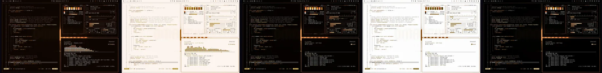](https://bjarneo.github.io/100-themes/#amber-crt)

`017` · 目录：[`amber-crt/`](amber-crt/) · [在画廊中打开](https://bjarneo.github.io/100-themes/#amber-crt)

Amber CRT 的深色变体用深棕背景，强调色为橙。6 个 ANSI 色相都靠近橙，整组读起来像一个颜色。原生背景是带跟踪噪点的 VHS 画面。

| 变体 | 主题名 | `background` | `foreground` | `accent` | 图标主题 |
| --- | --- | --- | --- | --- | --- |
| 深色 | [`amber-crt`](amber-crt/dark/) | `#0e0501` | `#eee6e0` | `#f17634` | `Yaru` |
| 日间 | [`amber-crt-day`](amber-crt/day/) | `#fdf5ef` | `#30241a` | `#ae4800` | `Yaru` |
| 高对比度 | [`amber-crt-high-contrast`](amber-crt/high-contrast/) | `#040100` | `#f9f4f0` | `#f17634` | `Yaru` |
| 日间高对比度 | [`amber-crt-day-high-contrast`](amber-crt/day-high-contrast/) | `#fdfdfd` | `#110702` | `#933d04` | `Yaru` |
| OLED | [`amber-crt-oled`](amber-crt/oled/) | `#000000` | `#eee6e0` | `#f17634` | `Yaru` |

<details>
<summary>每个变体的全部 16 个 ANSI 颜色</summary>

| 变体 | 常规，0 到 7 | 亮色，8 到 15 |
| --- | --- | --- |
| 深色 | `#1c1108` `#af5408` `#fe9f0c` `#ffe19f` `#c07006` `#f17634` `#fec672` `#d2c8c1` | `#775d49` `#be7e57` `#fecd9a` `#fff8e9` `#d09763` `#f2aa89` `#fef0db` `#fdf9f7` |
| 日间 | `#ebe1d9` `#9b4800` `#9f6104` `#aa8310` `#905200` `#ae4800` `#9a6a09` `#51453c` | `#b0a297` `#7f3900` `#845006` `#916f04` `#754100` `#8f3b02` `#815700` `#1b1109` |
| 高对比度 | `#221205` `#ee7922` `#fe9f0c` `#fed166` `#e28400` `#f17634` `#fec672` `#e4dcd6` | `#957a65` `#feaf81` `#fecd9a` `#fee5ae` `#feb169` `#feae89` `#fee4bf` `#ffffff` |
| 日间高对比度 | `#f0eae5` `#8c4102` `#7c4b03` `#6f5300` `#824a03` `#933d04` `#764f04` `#362c24` | `#807369` `#763500` `#683e01` `#5b4400` `#6c3c00` `#7a3103` `#614001` `#030101` |
| OLED | `#160700` `#af5408` `#fe9f0c` `#ffe19f` `#c07006` `#f17634` `#fec672` `#d2c8c1` | `#775d49` `#be7e57` `#fecd9a` `#fff8e9` `#d09763` `#f2aa89` `#fef0db` `#fdf9f7` |

</details>

```bash
curl -fsSL https://bjarneo.github.io/100-themes/install.sh | bash -s -- amber-crt --set
```

### Dreampop

[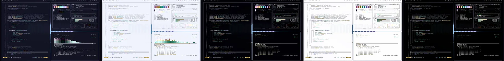](https://bjarneo.github.io/100-themes/#dreampop)

`018` · 目录：[`dreampop/`](dreampop/) · [在画廊中打开](https://bjarneo.github.io/100-themes/#dreampop)

Dreampop 的深色变体用深靛蓝背景，强调色为紫。ANSI 色是浅淡的粉彩色。原生背景是带虚化的柔和光斑。

| 变体 | 主题名 | `background` | `foreground` | `accent` | 图标主题 |
| --- | --- | --- | --- | --- | --- |
| 深色 | [`dreampop`](dreampop/dark/) | `#131423` | `#e6e7f0` | `#cdacf8` | `Yaru-purple` |
| 日间 | [`dreampop-day`](dreampop/day/) | `#f1f3fd` | `#242534` | `#8869af` | `Yaru-purple` |
| 高对比度 | [`dreampop-high-contrast`](dreampop/high-contrast/) | `#010106` | `#f4f5fb` | `#cdacf8` | `Yaru-purple` |
| 日间高对比度 | [`dreampop-day-high-contrast`](dreampop/day-high-contrast/) | `#fdfdfe` | `#070814` | `#68498d` | `Yaru-purple` |
| OLED | [`dreampop-oled`](dreampop/oled/) | `#000000` | `#e6e7f0` | `#cdacf8` | `Yaru-purple` |

<details>
<summary>每个变体的全部 16 个 ANSI 颜色</summary>

| 变体 | 常规，0 到 7 | 亮色，8 到 15 |
| --- | --- | --- |
| 深色 | `#212232` `#e59cd1` `#81e1b7` `#fcdb86` `#99acf7` `#cdacf8` `#6ce7ef` `#c8cad4` | `#5d6080` `#fdc3ec` `#b6fedc` `#fff8e6` `#c2cffc` `#e6d5ff` `#d0fbfe` `#f9fafd` |
| 日间 | `#dddfeb` `#a35f92` `#2f956e` `#ad8e38` `#5c6cb2` `#8869af` `#0d9299` `#454655` | `#a1a3b4` `#8f497e` `#0a7f5a` `#997912` `#48579e` `#74539c` `#007b82` `#11131f` |
| 高对比度 | `#131428` `#e59cd1` `#81e1b7` `#f5d480` `#99acf7` `#cdacf8` `#6ce7ef` `#dcdde6` | `#7a7d9e` `#fec2ed` `#b0fbd8` `#fee6a8` `#c2cfff` `#e6d5fe` `#a8f8fe` `#ffffff` |
| 日间高对比度 | `#e9eaf3` `#824172` `#006446` `#6d5400` `#455396` `#68498d` `#066167` `#2c2d38` | `#717383` `#712e62` `#065239` `#594502` `#354186` `#59387e` `#024f54` `#010203` |
| OLED | `#08081b` `#e59cd1` `#81e1b7` `#fcdb86` `#99acf7` `#cdacf8` `#6ce7ef` `#c8cad4` | `#5d6080` `#fdc3ec` `#b6fedc` `#fff8e6` `#c2cffc` `#e6d5ff` `#d0fbfe` `#f9fafd` |

</details>

```bash
curl -fsSL https://bjarneo.github.io/100-themes/install.sh | bash -s -- dreampop --set
```

### Solar Flare

[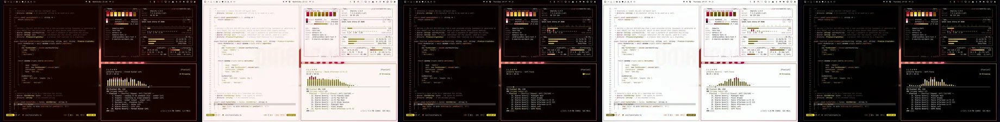](https://bjarneo.github.io/100-themes/#solar-flare)

`019` · 目录：[`solar-flare/`](solar-flare/) · [在画廊中打开](https://bjarneo.github.io/100-themes/#solar-flare)

Solar Flare 的深色变体用深红背景，强调色为粉红。ANSI 色饱和而明亮。原生背景是沙丘上的余烬或尘土。

| 变体 | 主题名 | `background` | `foreground` | `accent` | 图标主题 |
| --- | --- | --- | --- | --- | --- |
| 深色 | [`solar-flare`](solar-flare/dark/) | `#140200` | `#efe5e2` | `#fe5e86` | `Yaru-red` |
| 日间 | [`solar-flare-day`](solar-flare/day/) | `#fcf5f3` | `#35211a` | `#c60653` | `Yaru-red` |
| 高对比度 | [`solar-flare-high-contrast`](solar-flare/high-contrast/) | `#060000` | `#faf3f1` | `#fe5e86` | `Yaru-red` |
| 日间高对比度 | [`solar-flare-day-high-contrast`](solar-flare/day-high-contrast/) | `#fcfefe` | `#140502` | `#b00048` | `Yaru-red` |
| OLED | [`solar-flare-oled`](solar-flare/oled/) | `#000000` | `#efe5e2` | `#fe5e86` | `Yaru-red` |

<details>
<summary>每个变体的全部 16 个 ANSI 颜色</summary>

| 变体 | 常规，0 到 7 | 亮色，8 到 15 |
| --- | --- | --- |
| 深色 | `#220d06` `#d40924` `#dab300` `#ffe714` `#cb6605` `#fe5e86` `#fec678` `#d4c7c3` | `#815849` `#d76963` `#f7d561` `#fffad5` `#e78a49` `#fd9eaf` `#fef0dd` `#fdf9f8` |
| 日间 | `#f2ded7` `#bb071e` `#886f09` `#9a8b08` `#984b03` `#c60653` `#9c690c` `#56423c` | `#b69f97` `#980417` `#705c03` `#837601` `#7b3c03` `#a30443` `#825604` `#1f0f09` |
| 高对比度 | `#280d04` `#ff645f` `#dab300` `#f0da1b` `#ef7907` `#fe5e86` `#fec678` `#e6dcd8` | `#a07465` `#fdaca4` `#fed329` `#ffeb52` `#fdb07e` `#fea8b7` `#ffe3be` `#ffffff` |
| 日间高对比度 | `#f5e8e3` `#b3041c` `#6a5600` `#635903` `#8d4400` `#b00048` `#785008` `#372b26` | `#867069` `#950013` `#574600` `#514903` `#733802` `#90023a` `#644100` `#030101` |
| OLED | `#1b0300` `#d40924` `#dab300` `#ffe714` `#cb6605` `#fe5e86` `#fec678` `#d4c7c3` | `#815849` `#d76963` `#f7d561` `#fffad5` `#e78a49` `#fd9eaf` `#fef0dd` `#fdf9f8` |

</details>

```bash
curl -fsSL https://bjarneo.github.io/100-themes/install.sh | bash -s -- solar-flare --set
```

### Bioluminescent

[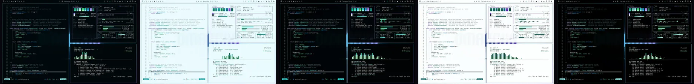](https://bjarneo.github.io/100-themes/#bioluminescent)

`020` · 目录：[`bioluminescent/`](bioluminescent/) · [在画廊中打开](https://bjarneo.github.io/100-themes/#bioluminescent)

Bioluminescent 的深色变体用深青蓝背景，强调色为紫。ANSI 色饱和而明亮。原生背景是水中的光线。

| 变体 | 主题名 | `background` | `foreground` | `accent` | 图标主题 |
| --- | --- | --- | --- | --- | --- |
| 深色 | [`bioluminescent`](bioluminescent/dark/) | `#00070a` | `#dfeaec` | `#a586fd` | `Yaru-purple` |
| 日间 | [`bioluminescent-day`](bioluminescent/day/) | `#eafafe` | `#102b30` | `#7b4fd8` | `Yaru-purple` |
| 高对比度 | [`bioluminescent-high-contrast`](bioluminescent/high-contrast/) | `#000305` | `#eff7f8` | `#a586fd` | `Yaru-purple` |
| 日间高对比度 | [`bioluminescent-day-high-contrast`](bioluminescent/day-high-contrast/) | `#fbfefe` | `#000c11` | `#6838c1` | `Yaru-purple` |
| OLED | [`bioluminescent-oled`](bioluminescent/oled/) | `#000000` | `#dfeaec` | `#a586fd` | `Yaru-purple` |

<details>
<summary>每个变体的全部 16 个 ANSI 颜色</summary>

| 变体 | 常规，0 到 7 | 亮色，8 到 15 |
| --- | --- | --- |
| 深色 | `#001318` `#12aa8a` `#32e881` `#8dfff9` `#0890cd` `#a586fd` `#12e8da` `#c0cdd0` | `#356d76` `#3dcca8` `#9efeba` `#e6fefd` `#44afec` `#c1b0ff` `#a6fef5` `#f6fbfc` |
| 日间 | `#d2e8ec` `#07856b` `#018c48` `#01a19c` `#016b9a` `#7b4fd8` `#0f867e` `#354c51` | `#90aaaf` `#0b6e58` `#06743b` `#118985` `#00567d` `#6933c5` `#027069` `#02171b` |
| 高对比度 | `#001a1f` `#04b995` `#32e881` `#13f6ef` `#16aaf0` `#a586fd` `#12e8da` `#d5e0e2` | `#538a94` `#1de4b9` `#9bffb9` `#8dfff9` `#83cefd` `#c7b9fc` `#8ffff4` `#ffffff` |
| 日间高对比度 | `#e0eef1` `#076450` `#016533` `#09625f` `#015d87` `#6838c1` `#0d625c` `#223133` | `#617a7e` `#015240` `#005228` `#08514f` `#044c6e` `#5a1db3` `#08504b` `#000202` |
| OLED | `#000e12` `#12aa8a` `#32e881` `#8dfff9` `#0890cd` `#a586fd` `#12e8da` `#c0cdd0` | `#356d76` `#3dcca8` `#9efeba` `#e6fefd` `#44afec` `#c1b0ff` `#a6fef5` `#f6fbfc` |

</details>

```bash
curl -fsSL https://bjarneo.github.io/100-themes/install.sh | bash -s -- bioluminescent --set
```

### Darkwave

[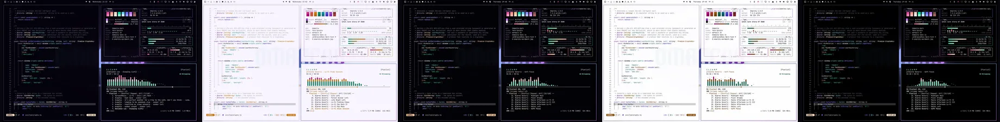](https://bjarneo.github.io/100-themes/#darkwave)

`021` · 目录：[`darkwave/`](darkwave/) · [在画廊中打开](https://bjarneo.github.io/100-themes/#darkwave)

Darkwave 的深色变体用深紫背景，强调色为紫。ANSI 色饱和而明亮。原生背景是层层叠叠的声波带。

| 变体 | 主题名 | `background` | `foreground` | `accent` | 图标主题 |
| --- | --- | --- | --- | --- | --- |
| 深色 | [`darkwave`](darkwave/dark/) | `#04020b` | `#e9e6ef` | `#c773f7` | `Yaru-purple` |
| 日间 | [`darkwave-day`](darkwave/day/) | `#f8f5ff` | `#282332` | `#9742c4` | `Yaru-purple` |
| 高对比度 | [`darkwave-high-contrast`](darkwave/high-contrast/) | `#020105` | `#f6f4fa` | `#c773f7` | `Yaru-purple` |
| 日间高对比度 | [`darkwave-day-high-contrast`](darkwave/day-high-contrast/) | `#fdfdfe` | `#0b0713` | `#832caf` | `Yaru-purple` |
| OLED | [`darkwave-oled`](darkwave/oled/) | `#000000` | `#e9e6ef` | `#c773f7` | `Yaru-purple` |

<details>
<summary>每个变体的全部 16 个 ANSI 颜色</summary>

| 变体 | 常规，0 到 7 | 亮色，8 到 15 |
| --- | --- | --- |
| 深色 | `#0f0a18` `#e651a2` `#12e5b5` `#ffe2ca` `#7071fa` `#c773f7` `#67dcfe` `#ccc8d3` | `#675d7c` `#f885be` `#8bffd9` `#fdf7f2` `#9199fd` `#dba3ff` `#d0f2fd` `#faf9fd` |
| 日间 | `#e4e1ed` `#bf2a81` `#03896b` `#c97409` `#514ad1` `#9742c4` `#08829c` `#4a4553` | `#a7a1b2` `#a7006c` `#067158` `#ac6303` `#402ebe` `#8324b1` `#0e6b81` `#15111d` |
| 高对比度 | `#191125` `#f55faf` `#12e5b5` `#fecca1` `#8a92fc` `#c773f7` `#67dcfe` `#dfdce5` | `#857a9a` `#ffa3ce` `#8affd9` `#ffe2ca` `#b7bffe` `#deadfd` `#c4f1ff` `#ffffff` |
| 日间高对比度 | `#ece9f2` `#a9046e` `#0c644e` `#824a04` `#4b42c8` `#832caf` `#055f73` `#2f2c37` | `#787383` `#8b005a` `#05523f` `#6c3b00` `#3e2bba` `#7409a0` `#044f60` `#020103` |
| OLED | `#0e0719` `#e651a2` `#12e5b5` `#ffe2ca` `#7071fa` `#c773f7` `#67dcfe` `#ccc8d3` | `#675d7c` `#f885be` `#8bffd9` `#fdf7f2` `#9199fd` `#dba3ff` `#d0f2fd` `#faf9fd` |

</details>

```bash
curl -fsSL https://bjarneo.github.io/100-themes/install.sh | bash -s -- darkwave --set
```

### Chillwave

[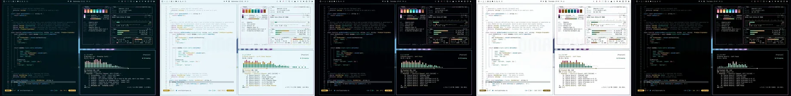](https://bjarneo.github.io/100-themes/#chillwave)

`022` · 目录：[`chillwave/`](chillwave/) · [在画廊中打开](https://bjarneo.github.io/100-themes/#chillwave)

Chillwave 的深色变体用深青蓝背景，强调色为洋红。ANSI 色使用中彩度，观感更平静。原生背景是山湖上空的极光。

| 变体 | 主题名 | `background` | `foreground` | `accent` | 图标主题 |
| --- | --- | --- | --- | --- | --- |
| 深色 | [`chillwave`](chillwave/dark/) | `#01151b` | `#e0eaed` | `#d68fe4` | `Yaru-purple` |
| 日间 | [`chillwave-day`](chillwave/day/) | `#eaf6fa` | `#162a30` | `#9955a6` | `Yaru-purple` |
| 高对比度 | [`chillwave-high-contrast`](chillwave/high-contrast/) | `#000205` | `#f0f6f9` | `#d68fe4` | `Yaru-purple` |
| 日间高对比度 | [`chillwave-day-high-contrast`](chillwave/day-high-contrast/) | `#fdfefe` | `#000c11` | `#7e3c8b` | `Yaru-purple` |
| OLED | [`chillwave-oled`](chillwave/oled/) | `#000000` | `#e0eaed` | `#d68fe4` | `Yaru-purple` |

<details>
<summary>每个变体的全部 16 个 ANSI 颜色</summary>

| 变体 | 常规，0 到 7 | 亮色，8 到 15 |
| --- | --- | --- |
| 深色 | `#0d2329` `#ee7c8e` `#52daa6` `#fbc959` `#43aef4` `#d68fe4` `#0dd8dc` `#c0cdd1` | `#416a77` `#f8acb5` `#a4f2cf` `#fef0d4` `#8eccfa` `#e9bbf2` `#92f1f3` `#f7fbfc` |
| 日间 | `#d4e3e8` `#b74b60` `#028d65` `#b08505` `#0073ad` `#9955a6` `#0c888b` `#394b51` | `#94a9b0` `#a2324b` `#0d7554` `#977100` `#025e8e` `#843e92` `#0e7174` `#06161c` |
| 高对比度 | `#001a22` `#ee7c8e` `#52daa6` `#fbc959` `#43aef4` `#d68fe4` `#0dd8dc` `#d6e0e3` | `#5e8895` `#fea9b3` `#93f6cb` `#fee5b1` `#8accfd` `#efb6fb` `#78f5f8` `#ffffff` |
| 日间高对比度 | `#e3edf1` `#9a3148` `#006547` `#705300` `#045c8b` `#7e3c8b` `#066264` `#233035` | `#65787f` `#8a1a38` `#015239` `#5c4300` `#034c74` `#6f297d` `#015153` `#000203` |
| OLED | `#000e15` `#ee7c8e` `#52daa6` `#fbc959` `#43aef4` `#d68fe4` `#0dd8dc` `#c0cdd1` | `#416a77` `#f8acb5` `#a4f2cf` `#fef0d4` `#8eccfa` `#e9bbf2` `#92f1f3` `#f7fbfc` |

</details>

```bash
curl -fsSL https://bjarneo.github.io/100-themes/install.sh | bash -s -- chillwave --set
```

### Retrowave

[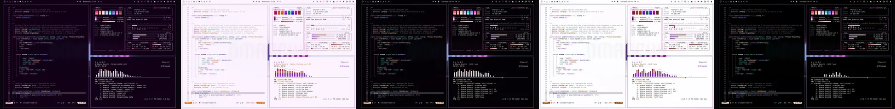](https://bjarneo.github.io/100-themes/#retrowave)

`023` · 目录：[`retrowave/`](retrowave/) · [在画廊中打开](https://bjarneo.github.io/100-themes/#retrowave)

Retrowave 的深色变体用深洋红背景，强调色为洋红。ANSI 色饱和而明亮。原生背景是透视网格上的一轮霓虹太阳。

| 变体 | 主题名 | `background` | `foreground` | `accent` | 图标主题 |
| --- | --- | --- | --- | --- | --- |
| 深色 | [`retrowave`](retrowave/dark/) | `#110016` | `#ece5ed` | `#f945d9` | `Yaru-magenta` |
| 日间 | [`retrowave-day`](retrowave/day/) | `#fcf3fe` | `#2f2033` | `#be08a4` | `Yaru-magenta` |
| 高对比度 | [`retrowave-high-contrast`](retrowave/high-contrast/) | `#040005` | `#f8f3f8` | `#fd49dd` | `Yaru-magenta` |
| 日间高对比度 | [`retrowave-day-high-contrast`](retrowave/day-high-contrast/) | `#fefdff` | `#100413` | `#a3038d` | `Yaru-magenta` |
| OLED | [`retrowave-oled`](retrowave/oled/) | `#000000` | `#ece5ed` | `#f945d9` | `Yaru-magenta` |

<details>
<summary>每个变体的全部 16 个 ANSI 颜色</summary>

| 变体 | 常规，0 到 7 | 亮色，8 到 15 |
| --- | --- | --- |
| 深色 | `#1f0924` `#ff3574` `#d1b4fd` `#fee1d0` `#6075ff` `#f945d9` `#10e8db` `#cfc8d1` | `#785480` `#fe879e` `#eadefe` `#fff7f2` `#879dfc` `#ff91e6` `#a6fef5` `#fcf9fc` |
| 日间 | `#ecddef` `#d10056` `#962fee` `#d46b07` `#3f3cf3` `#be08a4` `#0e867e` `#504254` | `#ad9fb1` `#ae0046` `#8100d4` `#b65b04` `#3306e1` `#9f0089` `#0a6f69` `#1a0f1c` |
| 高对比度 | `#200d24` `#fe5e85` `#d1b4fd` `#fdccad` `#7f95fe` `#fd49dd` `#10e8db` `#e2dce3` | `#917597` `#fda9b6` `#eadefe` `#ffe1cf` `#b1c1fc` `#ff9ee8` `#8efff4` `#ffffff` |
| 日间高对比度 | `#f1e7f4` `#ad0447` `#8201d7` `#894305` `#3c35ee` `#a3038d` `#0c625d` `#322b34` | `#7e7081` `#91003a` `#6b00b3` `#743701` `#3306e1` `#870074` `#00504b` `#020103` |
| OLED | `#140418` `#ff3574` `#d1b4fd` `#fee1d0` `#6075ff` `#f945d9` `#10e8db` `#cfc8d1` | `#785480` `#fe879e` `#eadefe` `#fff7f2` `#879dfc` `#ff91e6` `#a6fef5` `#fcf9fc` |

</details>

```bash
curl -fsSL https://bjarneo.github.io/100-themes/install.sh | bash -s -- retrowave --set
```

### Phonk

[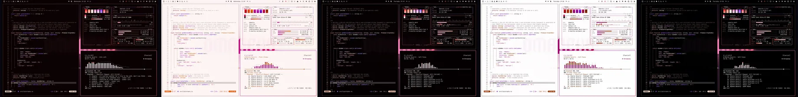](https://bjarneo.github.io/100-themes/#phonk)

`024` · 目录：[`phonk/`](phonk/) · [在画廊中打开](https://bjarneo.github.io/100-themes/#phonk)

Phonk 的深色变体用深红背景，强调色为粉红。ANSI 色饱和而明亮。原生背景是一块 LED 频谱板。

| 变体 | 主题名 | `background` | `foreground` | `accent` | 图标主题 |
| --- | --- | --- | --- | --- | --- |
| 深色 | [`phonk`](phonk/dark/) | `#0a0101` | `#f0e5e4` | `#ff5e7e` | `Yaru-red` |
| 日间 | [`phonk-day`](phonk/day/) | `#fdf5f4` | `#332121` | `#d2004e` | `Yaru-red` |
| 高对比度 | [`phonk-high-contrast`](phonk/high-contrast/) | `#050001` | `#faf3f3` | `#ff5e7e` | `Yaru-red` |
| 日间高对比度 | [`phonk-day-high-contrast`](phonk/day-high-contrast/) | `#fefdfd` | `#130505` | `#b10041` | `Yaru-red` |
| OLED | [`phonk-oled`](phonk/oled/) | `#000000` | `#f0e5e4` | `#ff5e7e` | `Yaru-red` |

<details>
<summary>每个变体的全部 16 个 ANSI 颜色</summary>

| 变体 | 常规，0 到 7 | 亮色，8 到 15 |
| --- | --- | --- |
| 深色 | `#180808` `#fe423b` `#fda4d3` `#fde1d6` `#9f54fe` `#ff5e7e` `#ffa6fc` `#d4c7c6` | `#7d5857` `#fd8c7f` `#fed8eb` `#fef7f4` `#b48bf9` `#fe9faa` `#fee0fc` `#fdf9f9` |
| 日间 | `#efdfde` `#d60012` `#cb038e` `#e65904` `#7c25d4` `#d2004e` `#b81fb9` `#554342` | `#b49f9e` `#b2000c` `#aa0076` `#c44c08` `#6700b8` `#af0040` `#9e009f` `#1e0f0f` |
| 高对比度 | `#250e0e` `#ff6558` `#fda4d3` `#fecab6` `#b080fd` `#ff5e7e` `#ffa6fc` `#e6dbdb` | `#9c7574` `#fdaca2` `#fdd9eb` `#ffe1d5` `#cdb6fd` `#ffa9b3` `#fedbfc` `#ffffff` |
| 日间高对比度 | `#f3e8e8` `#b30710` `#a80075` `#993903` `#7920d1` `#b10041` `#9d019e` `#372a2a` | `#847070` `#950008` `#8c0360` `#7f2e03` `#6700b8` `#910134` `#820083` `#030101` |
| OLED | `#190405` `#fe423b` `#fda4d3` `#fde1d6` `#9f54fe` `#ff5e7e` `#ffa6fc` `#d4c7c6` | `#7d5857` `#fd8c7f` `#fed8eb` `#fef7f4` `#b48bf9` `#fe9faa` `#fee0fc` `#fdf9f9` |

</details>

```bash
curl -fsSL https://bjarneo.github.io/100-themes/install.sh | bash -s -- phonk --set
```

### Drum & Bass

[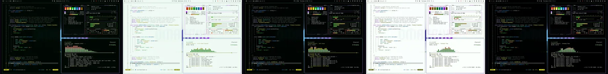](https://bjarneo.github.io/100-themes/#drum-and-bass)

`025` · 目录：[`drum-and-bass/`](drum-and-bass/) · [在画廊中打开](https://bjarneo.github.io/100-themes/#drum-and-bass)

Drum & Bass 的深色变体用深绿背景，强调色为紫。ANSI 色使用极高的彩度，霓虹感强烈。原生背景是一块 LED 频谱板。

| 变体 | 主题名 | `background` | `foreground` | `accent` | 图标主题 |
| --- | --- | --- | --- | --- | --- |
| 深色 | [`drum-and-bass`](drum-and-bass/dark/) | `#000702` | `#e1eae5` | `#b77bfe` | `Yaru-purple` |
| 日间 | [`drum-and-bass-day`](drum-and-bass/day/) | `#effaf4` | `#1a2b22` | `#9515f3` | `Yaru-purple` |
| 高对比度 | [`drum-and-bass-high-contrast`](drum-and-bass/high-contrast/) | `#000301` | `#f1f7f3` | `#b77bfe` | `Yaru-purple` |
| 日间高对比度 | [`drum-and-bass-day-high-contrast`](drum-and-bass/day-high-contrast/) | `#fafffc` | `#010d06` | `#8201d7` | `Yaru-purple` |
| OLED | [`drum-and-bass-oled`](drum-and-bass/oled/) | `#000000` | `#e1eae5` | `#b77bfe` | `Yaru-purple` |

<details>
<summary>每个变体的全部 16 个 ANSI 颜色</summary>

| 变体 | 常规，0 到 7 | 亮色，8 到 15 |
| --- | --- | --- |
| 深色 | `#03130b` `#fe4528` `#16ed11` `#eff31e` `#008cdf` `#b77bfe` `#1de9d6` `#c3cec7` | `#4a6c59` `#fe8d77` `#a5ff9d` `#faffb7` `#44acfd` `#cdaafe` `#a7fff2` `#f7fbf9` |
| 日间 | `#dae7df` `#d02101` `#028e01` `#909303` `#0a68a5` `#9515f3` `#13867b` `#3c4c43` | `#98aa9f` `#ad1900` `#067605` `#7b7d05` `#035387` `#7d00cf` `#0a7066` `#091710` |
| 高对比度 | `#031b10` `#fe674d` `#16ed11` `#dee218` `#2ba5fe` `#b77bfe` `#1de9d6` `#d8e1db` | `#668a76` `#ffac9b` `#a5ff9d` `#eff317` `#92cafc` `#d1b4fd` `#94fef0` `#ffffff` |
| 日间高对比度 | `#e5eee8` `#ae1800` `#036702` `#595b00` `#055b92` `#8201d7` `#00635b` `#25312a` | `#68796f` `#901502` `#005500` `#494a05` `#004b7c` `#6b04b1` `#00514a` `#010201` |
| OLED | `#001006` `#fe4528` `#16ed11` `#eff31e` `#008cdf` `#b77bfe` `#1de9d6` `#c3cec7` | `#4a6c59` `#fe8d77` `#a5ff9d` `#faffb7` `#44acfd` `#cdaafe` `#a7fff2` `#f7fbf9` |

</details>

```bash
curl -fsSL https://bjarneo.github.io/100-themes/install.sh | bash -s -- drum-and-bass --set
```

### Dubstep

[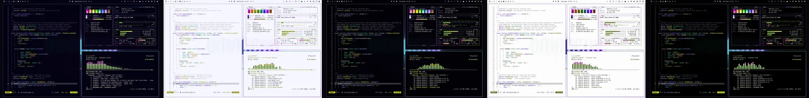](https://bjarneo.github.io/100-themes/#dubstep)

`026` · 目录：[`dubstep/`](dubstep/) · [在画廊中打开](https://bjarneo.github.io/100-themes/#dubstep)

Dubstep 的深色变体用深靛蓝背景，强调色为紫。ANSI 色使用极高的彩度，霓虹感强烈。原生背景是一块 LED 频谱板。

| 变体 | 主题名 | `background` | `foreground` | `accent` | 图标主题 |
| --- | --- | --- | --- | --- | --- |
| 深色 | [`dubstep`](dubstep/dark/) | `#040112` | `#e7e7f0` | `#ac82ff` | `Yaru-purple` |
| 日间 | [`dubstep-day`](dubstep/day/) | `#f6f6ff` | `#262339` | `#8b1bfe` | `Yaru-purple` |
| 高对比度 | [`dubstep-high-contrast`](dubstep/high-contrast/) | `#020107` | `#f5f4fa` | `#ac82ff` | `Yaru-purple` |
| 日间高对比度 | [`dubstep-day-high-contrast`](dubstep/day-high-contrast/) | `#fdfdfc` | `#090618` | `#7908e1` | `Yaru-purple` |
| OLED | [`dubstep-oled`](dubstep/oled/) | `#000000` | `#e7e7f0` | `#ac82ff` | `Yaru-purple` |

<details>
<summary>每个变体的全部 16 个 ANSI 颜色</summary>

| 变体 | 常规，0 到 7 | 亮色，8 到 15 |
| --- | --- | --- |
| 深色 | `#0e0821` `#f403d1` `#82e214` `#e9f516` `#6d71fe` `#ac82ff` `#0beea9` `#cac9d4` | `#625c89` `#fe77df` `#b0ff76` `#f8ffc3` `#8f9aff` `#c5aefd` `#b5fedb` `#fafafd` |
| 日间 | `#e2e0f5` `#bf06a3` `#4a8700` `#8d940d` `#4f24ff` `#8b1bfe` `#038a60` `#47455a` | `#a4a2b7` `#9f0387` `#3d7000` `#787e08` `#4000db` `#7501d9` `#02724f` `#141120` |
| 高对比度 | `#16112b` `#fe48db` `#82e214` `#d9e40e` `#8892fd` `#ac82ff` `#0beea9` `#dedde6` | `#7f7aa2` `#fda0e5` `#b1ff77` `#e9f516` `#b5bfff` `#cbb7fd` `#a4fed4` `#ffffff` |
| 日间高对比度 | `#eae9f8` `#a2008a` `#356203` `#575c04` `#4d18fe` `#7908e1` `#036445` `#2d2c37` | `#757387` `#870372` `#2b5102` `#474b00` `#4000db` `#6400bc` `#065137` `#020103` |
| OLED | `#0c061e` `#f403d1` `#82e214` `#e9f516` `#6d71fe` `#ac82ff` `#0beea9` `#cac9d4` | `#625c89` `#fe77df` `#b0ff76` `#f8ffc3` `#8f9aff` `#c5aefd` `#b5fedb` `#fafafd` |

</details>

```bash
curl -fsSL https://bjarneo.github.io/100-themes/install.sh | bash -s -- dubstep --set
```

### Techno

[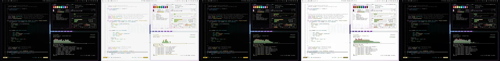](https://bjarneo.github.io/100-themes/#techno)

`027` · 目录：[`techno/`](techno/) · [在画廊中打开](https://bjarneo.github.io/100-themes/#techno)

Techno 的深色变体用中性黑背景，强调色为紫。ANSI 色饱和而明亮。原生背景是一块 LED 频谱板。

| 变体 | 主题名 | `background` | `foreground` | `accent` | 图标主题 |
| --- | --- | --- | --- | --- | --- |
| 深色 | [`techno`](techno/dark/) | `#020202` | `#efe5e7` | `#d368f7` | `Yaru-purple` |
| 日间 | [`techno-day`](techno/day/) | `#f7f7f7` | `#2b2426` | `#a235c4` | `Yaru-purple` |
| 高对比度 | [`techno-high-contrast`](techno/high-contrast/) | `#020202` | `#faf3f5` | `#d368f7` | `Yaru-purple` |
| 日间高对比度 | [`techno-day-high-contrast`](techno/day-high-contrast/) | `#fdfdfd` | `#0d0809` | `#8d19ae` | `Yaru-purple` |
| OLED | [`techno-oled`](techno/oled/) | `#000000` | `#efe5e7` | `#d368f7` | `Yaru-purple` |

<details>
<summary>每个变体的全部 16 个 ANSI 颜色</summary>

| 变体 | 常规，0 到 7 | 亮色，8 到 15 |
| --- | --- | --- |
| 深色 | `#0b0b0b` `#fc4353` `#6ae54c` `#fee79e` `#0992c4` `#d368f7` `#14e8da` `#d3c7ca` | `#6e5f63` `#f88e8d` `#b6faa8` `#fff8e4` `#3ab2e7` `#dfa3f5` `#a4fff5` `#fdf9fa` |
| 日间 | `#e3e3e3` `#d40432` `#298c01` `#a88905` `#076c92` `#a235c4` `#0f867e` `#4d4647` | `#aaa2a4` `#b00529` `#227403` `#8f7402` `#055777` `#8e06b1` `#007068` `#181214` |
| 高对比度 | `#1a1416` `#fe6368` `#6ae54c` `#ffd32e` `#12ace6` `#d368f7` `#14e8da` `#e5dbdd` | `#8b7b80` `#ffaaa7` `#a9ff96` `#fee79d` `#78d0fd` `#e7a8ff` `#93fef3` `#ffffff` |
| 日间高对比度 | `#ebebeb` `#b30029` `#1a6600` `#685507` `#055d7e` `#8d19ae` `#0d625c` `#372a2d` | `#7a7274` `#920521` `#135200` `#574602` `#004d6a` `#780296` `#06504b` `#030102` |
| OLED | `#0f090b` `#fc4353` `#6ae54c` `#fee79e` `#0992c4` `#d368f7` `#14e8da` `#d3c7ca` | `#6e5f63` `#f88e8d` `#b6faa8` `#fff8e4` `#3ab2e7` `#dfa3f5` `#a4fff5` `#fdf9fa` |

</details>

```bash
curl -fsSL https://bjarneo.github.io/100-themes/install.sh | bash -s -- techno --set
```

### House

[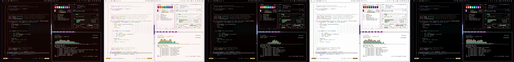](https://bjarneo.github.io/100-themes/#house)

`028` · 目录：[`house/`](house/) · [在画廊中打开](https://bjarneo.github.io/100-themes/#house)

House 的深色变体用深红背景，强调色为洋红。ANSI 色饱和而明亮。原生背景是一块 LED 频谱板。

| 变体 | 主题名 | `background` | `foreground` | `accent` | 图标主题 |
| --- | --- | --- | --- | --- | --- |
| 深色 | [`house`](house/dark/) | `#110402` | `#f0e5e3` | `#f451d3` | `Yaru-magenta` |
| 日间 | [`house-day`](house/day/) | `#fcf5f3` | `#33211e` | `#bf06a3` | `Yaru-magenta` |
| 高对比度 | [`house-high-contrast`](house/high-contrast/) | `#050100` | `#faf3f2` | `#f653d5` | `Yaru-magenta` |
| 日间高对比度 | [`house-day-high-contrast`](house/day-high-contrast/) | `#fefdfd` | `#130504` | `#a2008a` | `Yaru-magenta` |
| OLED | [`house-oled`](house/oled/) | `#000000` | `#f0e5e3` | `#f451d3` | `Yaru-magenta` |

<details>
<summary>每个变体的全部 16 个 ANSI 颜色</summary>

| 变体 | 常规，0 到 7 | 亮色，8 到 15 |
| --- | --- | --- |
| 深色 | `#200e0c` `#fe3f50` `#11e97e` `#ffe5b3` `#387eff` `#f451d3` `#17e8d9` `#d4c7c5` | `#7d5952` `#ff8988` `#9cfeba` `#fef8eb` `#71a3fd` `#ff92e4` `#a5fff4` `#fdf9f8` |
| 日间 | `#eedfdc` `#d40432` `#008c48` `#b28307` `#0054dd` `#bf06a3` `#10867d` `#544340` | `#b49f9b` `#b00328` `#00743b` `#987001` `#0043b6` `#a00088` `#106f67` `#1e0f0d` |
| 高对比度 | `#250e0b` `#fe6368` `#11e97e` `#fed076` `#669cfe` `#f653d5` `#17e8d9` `#e6dbd9` | `#9c756f` `#fdaba8` `#9cfeba` `#fee5b5` `#a4c5fe` `#fe9fe6` `#92fff2` `#ffffff` |
| 日间高对比度 | `#f3e8e6` `#b30028` `#016533` `#715200` `#004ccd` `#a2008a` `#0a615a` `#372a28` | `#84716d` `#930320` `#055229` `#5d4300` `#003eaa` `#870072` `#04504a` `#030101` |
| OLED | `#190403` `#fe3f50` `#11e97e` `#ffe5b3` `#387eff` `#f451d3` `#17e8d9` `#d4c7c5` | `#7d5952` `#ff8988` `#9cfeba` `#fef8eb` `#71a3fd` `#ff92e4` `#a5fff4` `#fdf9f8` |

</details>

```bash
curl -fsSL https://bjarneo.github.io/100-themes/install.sh | bash -s -- house --set
```

### Trance

[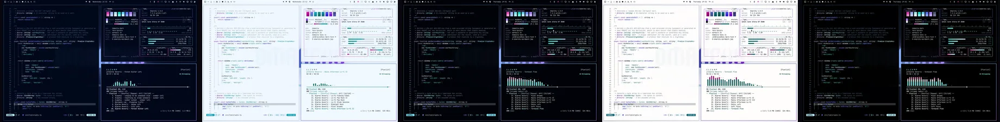](https://bjarneo.github.io/100-themes/#trance)

`029` · 目录：[`trance/`](trance/) · [在画廊中打开](https://bjarneo.github.io/100-themes/#trance)

Trance 的深色变体用深蓝背景，强调色为紫。ANSI 色饱和而明亮。原生背景是层层叠叠的声波带。

| 变体 | 主题名 | `background` | `foreground` | `accent` | 图标主题 |
| --- | --- | --- | --- | --- | --- |
| 深色 | [`trance`](trance/dark/) | `#00071a` | `#e2e9f0` | `#b080fd` | `Yaru-purple` |
| 日间 | [`trance-day`](trance/day/) | `#f1f8ff` | `#172839` | `#8a3ae6` | `Yaru-purple` |
| 高对比度 | [`trance-high-contrast`](trance/high-contrast/) | `#000208` | `#f1f6fa` | `#b080fd` | `Yaru-purple` |
| 日间高对比度 | [`trance-day-high-contrast`](trance/day-high-contrast/) | `#fefdfc` | `#000919` | `#7820d1` | `Yaru-purple` |
| OLED | [`trance-oled`](trance/oled/) | `#000000` | `#e2e9f0` | `#b080fd` | `Yaru-purple` |

<details>
<summary>每个变体的全部 16 个 ANSI 颜色</summary>

| 变体 | 常规，0 到 7 | 亮色，8 到 15 |
| --- | --- | --- |
| 深色 | `#011429` `#ec3eba` `#1de1d3` `#baf3ff` `#5c77fc` `#b080fd` `#67dcfe` `#c3cbd4` | `#43668a` `#eb8dc9` `#78fff2` `#eefbfe` `#869ff9` `#c8adfd` `#cff2fe` `#f8fafd` |
| 日间 | `#d5e5f6` `#c30496` `#0f867e` `#089db2` `#3a45e8` `#8a3ae6` `#09829d` `#39495a` | `#97a7b7` `#a3007d` `#0f6f68` `#0b8698` `#2c22d6` `#770bd3` `#086b82` `#091521` |
| 高对比度 | `#03172c` `#fc4fc8` `#1de1d3` `#7ceaff` `#7b96fe` `#b080fd` `#67dcfe` `#d8dfe6` | `#6583a3` `#ffa1dc` `#75fff2` `#bcf3fe` `#afc2fd` `#cdb6fd` `#c6f0fe` `#ffffff` |
| 日间高对比度 | `#e2edf8` `#a6007f` `#0d625c` `#0b606d` `#363ee1` `#7820d1` `#065f74` `#262f38` | `#687686` `#8a0169` `#03504b` `#024e59` `#2c1fd4` `#6700b9` `#004f61` `#010203` |
| OLED | `#000b1f` `#ec3eba` `#1de1d3` `#baf3ff` `#5c77fc` `#b080fd` `#67dcfe` `#c3cbd4` | `#43668a` `#eb8dc9` `#78fff2` `#eefbfe` `#869ff9` `#c8adfd` `#cff2fe` `#f8fafd` |

</details>

```bash
curl -fsSL https://bjarneo.github.io/100-themes/install.sh | bash -s -- trance --set
```

### Acid House

[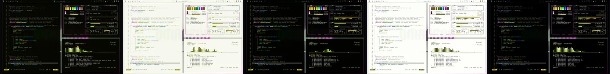](https://bjarneo.github.io/100-themes/#acid-house)

`030` · 目录：[`acid-house/`](acid-house/) · [在画廊中打开](https://bjarneo.github.io/100-themes/#acid-house)

Acid House 的深色变体用深橄榄背景，强调色为洋红。ANSI 色使用极高的彩度，霓虹感强烈。原生背景是一块 LED 频谱板。

| 变体 | 主题名 | `background` | `foreground` | `accent` | 图标主题 |
| --- | --- | --- | --- | --- | --- |
| 深色 | [`acid-house`](acid-house/dark/) | `#060600` | `#e8e9e0` | `#f73ced` | `Yaru-magenta` |
| 日间 | [`acid-house-day`](acid-house/day/) | `#f7f8ee` | `#272818` | `#ba00b3` | `Yaru-magenta` |
| 高对比度 | [`acid-house-high-contrast`](acid-house/high-contrast/) | `#020200` | `#f5f6f0` | `#fb41f0` | `Yaru-magenta` |
| 日间高对比度 | [`acid-house-day-high-contrast`](acid-house/day-high-contrast/) | `#fdfef9` | `#0a0a01` | `#9f0598` | `Yaru-magenta` |
| OLED | [`acid-house-oled`](acid-house/oled/) | `#000000` | `#e8e9e0` | `#f73ced` | `Yaru-magenta` |

<details>
<summary>每个变体的全部 16 个 ANSI 颜色</summary>

| 变体 | 常规，0 到 7 | 亮色，8 到 15 |
| --- | --- | --- |
| 深色 | `#121304` `#a99206` `#a4da13` `#ffec24` `#008ed8` `#f73ced` `#14f42c` `#cbccc1` | `#656644` `#cdb001` `#c0fd30` `#fffbcf` `#31aefe` `#fe8ef4` `#bfffbb` `#fafaf7` |
| 日间 | `#e3e4d7` `#83710c` `#608207` `#9b8f00` `#0169a1` `#ba00b3` `#028e12` `#48493a` | `#a5a695` `#6d5d00` `#4f6c01` `#847a04` `#005584` `#9b0095` `#087511` `#141507` |
| 高对比度 | `#171702` `#b79e00` `#a4da13` `#eddc04` `#12a7fb` `#fb41f0` `#14f42c` `#dedfd6` | `#828360` `#e3c302` `#c0fd2b` `#ffec28` `#8dccfc` `#fe9cf4` `#b3ffaf` `#ffffff` |
| 日间高对比度 | `#ebece3` `#655600` `#466000` `#605802` `#005c8e` `#9f0598` `#05670d` `#2e2f23` | `#757665` `#544700` `#394f02` `#504901` `#044c76` `#83007e` `#005405` `#020201` |
| OLED | `#0c0c00` `#a99206` `#a4da13` `#ffec24` `#008ed8` `#f73ced` `#14f42c` `#cbccc1` | `#656644` `#cdb001` `#c0fd30` `#fffbcf` `#31aefe` `#fe8ef4` `#bfffbb` `#fafaf7` |

</details>

```bash
curl -fsSL https://bjarneo.github.io/100-themes/install.sh | bash -s -- acid-house --set
```

### Jungle

[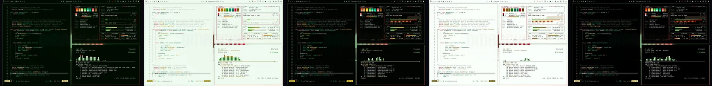](https://bjarneo.github.io/100-themes/#jungle)

`031` · 目录：[`jungle/`](jungle/) · [在画廊中打开](https://bjarneo.github.io/100-themes/#jungle)

Jungle 的深色变体用深绿背景，强调色为红。ANSI 色饱和而明亮。原生背景是一张等高线地形图。

| 变体 | 主题名 | `background` | `foreground` | `accent` | 图标主题 |
| --- | --- | --- | --- | --- | --- |
| 深色 | [`jungle`](jungle/dark/) | `#000b01` | `#e3eae3` | `#ff6362` | `Yaru-red` |
| 日间 | [`jungle-day`](jungle/day/) | `#f0faf0` | `#1c2b1c` | `#d40729` | `Yaru-red` |
| 高对比度 | [`jungle-high-contrast`](jungle/high-contrast/) | `#000300` | `#f2f7f2` | `#ff6362` | `Yaru-red` |
| 日间高对比度 | [`jungle-day-high-contrast`](jungle/day-high-contrast/) | `#fafffa` | `#020d02` | `#b30221` | `Yaru-red` |
| OLED | [`jungle-oled`](jungle/oled/) | `#000000` | `#e3eae3` | `#ff6362` | `Yaru-red` |

<details>
<summary>每个变体的全部 16 个 ANSI 颜色</summary>

| 变体 | 常规，0 到 7 | 亮色，8 到 15 |
| --- | --- | --- |
| 深色 | `#071808` `#fb4c04` `#5fe654` `#ffe887` `#079e77` `#ff6362` `#00ef99` `#c5cdc5` | `#4d6d4e` `#fe8d6d` `#a6ff9d` `#fff9df` `#0ec192` `#fda19b` `#b8fed5` `#f8fbf8` |
| 日间 | `#dae7da` `#c53900` `#098e00` `#a38b09` `#077558` `#d40729` `#008b57` `#3e4c3e` | `#99aa99` `#a42e00` `#077600` `#8b7705` `#045e46` `#b00721` `#087348` `#0b170b` |
| 高对比度 | `#051c07` `#ff673a` `#5fe654` `#fad60c` `#12b98d` `#ff6362` `#00ef99` `#d9e0d9` | `#6a8a6a` `#fead96` `#a6ff9c` `#ffe886` `#0ae5ae` `#ffaaa4` `#a6ffcc` `#ffffff` |
| 日间高对比度 | `#e5eee5` `#a22d00` `#066700` `#675700` `#02634a` `#b30221` `#08643e` `#283128` | `#6a796a` `#872300` `#035300` `#544703` `#08523d` `#940018` `#005332` `#010201` |
| OLED | `#001001` `#fb4c04` `#5fe654` `#ffe887` `#079e77` `#ff6362` `#00ef99` `#c5cdc5` | `#4d6d4e` `#fe8d6d` `#a6ff9d` `#fff9df` `#0ec192` `#fda19b` `#b8fed5` `#f8fbf8` |

</details>

```bash
curl -fsSL https://bjarneo.github.io/100-themes/install.sh | bash -s -- jungle --set
```

### Grime

[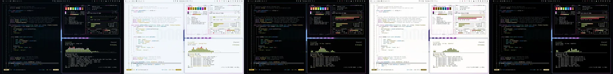](https://bjarneo.github.io/100-themes/#grime)

`032` · 目录：[`grime/`](grime/) · [在画廊中打开](https://bjarneo.github.io/100-themes/#grime)

Grime 的深色变体用深蓝背景，强调色为洋红。ANSI 色饱和而明亮。原生背景是一座城市的天际线。

| 变体 | 主题名 | `background` | `foreground` | `accent` | 图标主题 |
| --- | --- | --- | --- | --- | --- |
| 深色 | [`grime`](grime/dark/) | `#02060a` | `#e1e9ef` | `#db64ed` | `Yaru-purple` |
| 日间 | [`grime-day`](grime/day/) | `#f3f7fb` | `#1e282f` | `#a930bb` | `Yaru-purple` |
| 高对比度 | [`grime-high-contrast`](grime/high-contrast/) | `#010203` | `#f0f6fa` | `#dd66ef` | `Yaru-purple` |
| 日间高对比度 | [`grime-day-high-contrast`](grime/day-high-contrast/) | `#fefdfc` | `#030a10` | `#9411a5` | `Yaru-purple` |
| OLED | [`grime-oled`](grime/oled/) | `#000000` | `#e1e9ef` | `#db64ed` | `Yaru-purple` |

<details>
<summary>每个变体的全部 16 个 ANSI 颜色</summary>

| 变体 | 常规，0 到 7 | 亮色，8 到 15 |
| --- | --- | --- |
| 深色 | `#0c1318` `#fc4353` `#9edb11` `#fee6a2` `#008be3` `#db64ed` `#1ce6e9` `#c2ccd3` | `#516676` `#ff8a89` `#c5f978` `#fef8e8` `#48abfe` `#ef96fd` `#a3feff` `#f7fbfd` |
| 日间 | `#dee4e8` `#d40433` `#5c8301` `#aa8804` `#0867a9` `#a930bb` `#028587` `#3f4950` | `#9ba6af` `#b00529` `#4c6d03` `#917402` `#00538b` `#9403a6` `#0b6e70` `#0d151b` |
| 高对比度 | `#0b1820` `#fe6368` `#9edb11` `#ffd343` `#33a4ff` `#dd66ef` `#1ce6e9` `#d7dfe5` | `#6e8393` `#ffaaa7` `#c4fa70` `#fee6a1` `#94cafd` `#f2a1fe` `#90fdfe` `#ffffff` |
| 日间高对比度 | `#e8ecef` `#b30029` `#436003` `#6c5500` `#055b97` `#9411a5` `#066263` `#252f37` | `#6c767e` `#920521` `#364e00` `#584501` `#014a7d` `#7d018d` `#015051` `#010203` |
| OLED | `#030c15` `#fc4353` `#9edb11` `#fee6a2` `#008be3` `#db64ed` `#1ce6e9` `#c2ccd3` | `#516676` `#ff8a89` `#c5f978` `#fef8e8` `#48abfe` `#ef96fd` `#a3feff` `#f7fbfd` |

</details>

```bash
curl -fsSL https://bjarneo.github.io/100-themes/install.sh | bash -s -- grime --set
```

### Trap

[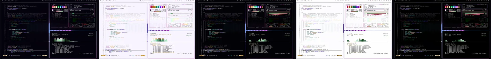](https://bjarneo.github.io/100-themes/#trap)

`033` · 目录：[`trap/`](trap/) · [在画廊中打开](https://bjarneo.github.io/100-themes/#trap)

Trap 的深色变体用深紫背景，强调色为洋红。ANSI 色饱和而明亮。原生背景是一块 LED 频谱板。

| 变体 | 主题名 | `background` | `foreground` | `accent` | 图标主题 |
| --- | --- | --- | --- | --- | --- |
| 深色 | [`trap`](trap/dark/) | `#04020b` | `#e9e6ef` | `#ea53ed` | `Yaru-magenta` |
| 日间 | [`trap-day`](trap/day/) | `#f8f5ff` | `#282332` | `#b60bba` | `Yaru-magenta` |
| 高对比度 | [`trap-high-contrast`](trap/high-contrast/) | `#020105` | `#f6f4fa` | `#ec55ee` | `Yaru-magenta` |
| 日间高对比度 | [`trap-day-high-contrast`](trap/day-high-contrast/) | `#fdfdfe` | `#0b0713` | `#9c03a0` | `Yaru-magenta` |
| OLED | [`trap-oled`](trap/oled/) | `#000000` | `#e9e6ef` | `#ea53ed` | `Yaru-magenta` |

<details>
<summary>每个变体的全部 16 个 ANSI 颜色</summary>

| 变体 | 常规，0 到 7 | 亮色，8 到 15 |
| --- | --- | --- |
| 深色 | `#0f0a18` `#fe396b` `#17ea6d` `#fee4bc` `#776cff` `#ea53ed` `#1ce5f3` `#ccc8d3` | `#675d7c` `#fe8898` `#9fffb2` `#fef8ef` `#9697fe` `#f495f4` `#b9f8fe` `#faf9fd` |
| 日间 | `#e4e1ed` `#d2004d` `#048c3d` `#b7810f` `#5935ea` `#b60bba` `#02848d` `#4a4553` | `#a7a1b2` `#af003f` `#007531` `#9d6d05` `#4a00d5` `#98009c` `#046e75` `#15111d` |
| 高对比度 | `#191125` `#ff5f7d` `#17ea6d` `#fecf86` `#8f8ffe` `#ec55ee` `#1ce5f3` `#dfdce5` | `#857a9a` `#fea9b2` `#9effb2` `#fee4bc` `#babefe` `#ff98fe` `#abf7fe` `#ffffff` |
| 日间高对比度 | `#ece9f2` `#ae043f` `#00662a` `#755002` `#552ee4` `#9c03a0` `#066168` `#2f2c37` | `#787383` `#920133` `#025422` `#614203` `#4a00d5` `#810084` `#004f55` `#020103` |
| OLED | `#0e0719` `#fe396b` `#17ea6d` `#fee4bc` `#776cff` `#ea53ed` `#1ce5f3` `#ccc8d3` | `#675d7c` `#fe8898` `#9fffb2` `#fef8ef` `#9697fe` `#f495f4` `#b9f8fe` `#faf9fd` |

</details>

```bash
curl -fsSL https://bjarneo.github.io/100-themes/install.sh | bash -s -- trap --set
```

### Hyperpop

[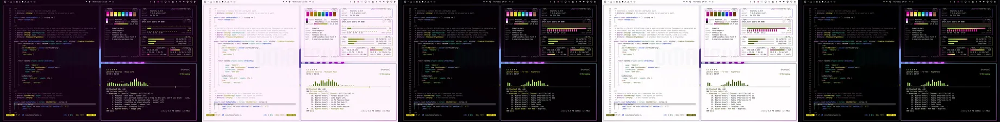](https://bjarneo.github.io/100-themes/#hyperpop)

`034` · 目录：[`hyperpop/`](hyperpop/) · [在画廊中打开](https://bjarneo.github.io/100-themes/#hyperpop)

Hyperpop 的深色变体用深洋红背景，强调色为洋红。ANSI 色使用极高的彩度，霓虹感强烈。原生背景是墙上的霓虹灯管造型。

| 变体 | 主题名 | `background` | `foreground` | `accent` | 图标主题 |
| --- | --- | --- | --- | --- | --- |
| 深色 | [`hyperpop`](hyperpop/dark/) | `#150114` | `#ede5ec` | `#e949ff` | `Yaru-magenta` |
| 日间 | [`hyperpop-day`](hyperpop/day/) | `#fef3fc` | `#321f30` | `#b201c6` | `Yaru-magenta` |
| 高对比度 | [`hyperpop-high-contrast`](hyperpop/high-contrast/) | `#040004` | `#f8f3f8` | `#ea53ff` | `Yaru-magenta` |
| 日间高对比度 | [`hyperpop-day-high-contrast`](hyperpop/day-high-contrast/) | `#fffdfe` | `#120411` | `#9804a9` | `Yaru-magenta` |
| OLED | [`hyperpop-oled`](hyperpop/oled/) | `#000000` | `#ede5ec` | `#e949ff` | `Yaru-magenta` |

<details>
<summary>每个变体的全部 16 个 ANSI 颜色</summary>

| 变体 | 常规，0 到 7 | 亮色，8 到 15 |
| --- | --- | --- |
| 深色 | `#240a23` `#fe06ad` `#92de08` `#fcee13` `#4d7bfd` `#e949ff` `#02e8df` `#d0c7cf` | `#7d5279` `#ff7ec3` `#b5ff58` `#fffcc7` `#7aa1fe` `#f295fe` `#a3fff8` `#fcf9fc` |
| 日间 | `#efdcec` `#c80187` `#568503` `#999003` `#1c3cff` `#b201c6` `#0a8681` `#534151` | `#b09eae` `#a60270` `#476e05` `#837a03` `#1505eb` `#9404a5` `#006f6b` `#1b0f1a` |
| 高对比度 | `#220c21` `#fe54b6` `#92de08` `#ebdd0e` `#7199fe` `#ea53ff` `#02e8df` `#e3dbe2` | `#957391` `#fda4d1` `#b5ff58` `#fcee1d` `#a9c3fe` `#f3a1fe` `#90fef7` `#ffffff` |
| 日间高对比度 | `#f3e7f2` `#a80771` `#3e6203` `#5f5903` `#1930ff` `#9804a9` `#0a625e` `#342a33` | `#81707e` `#8d005e` `#314f00` `#4e4800` `#1505eb` `#7d028c` `#09514e` `#030102` |
| OLED | `#160315` `#fe06ad` `#92de08` `#fcee13` `#4d7bfd` `#e949ff` `#02e8df` `#d0c7cf` | `#7d5279` `#ff7ec3` `#b5ff58` `#fffcc7` `#7aa1fe` `#f295fe` `#a3fff8` `#fcf9fc` |

</details>

```bash
curl -fsSL https://bjarneo.github.io/100-themes/install.sh | bash -s -- hyperpop --set
```

### Glitchcore

[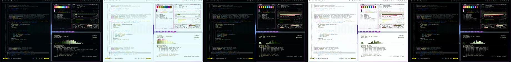](https://bjarneo.github.io/100-themes/#glitchcore)

`035` · 目录：[`glitchcore/`](glitchcore/) · [在画廊中打开](https://bjarneo.github.io/100-themes/#glitchcore)

Glitchcore 的深色变体用深青蓝背景，强调色为洋红。ANSI 色使用极高的彩度，霓虹感强烈。原生背景是带跟踪噪点的 VHS 画面。

| 变体 | 主题名 | `background` | `foreground` | `accent` | 图标主题 |
| --- | --- | --- | --- | --- | --- |
| 深色 | [`glitchcore`](glitchcore/dark/) | `#000507` | `#dfeaeb` | `#df57ff` | `Yaru-purple` |
| 日间 | [`glitchcore-day`](glitchcore/day/) | `#eafbfc` | `#0f2b2d` | `#af00cf` | `Yaru-purple` |
| 高对比度 | [`glitchcore-high-contrast`](glitchcore/high-contrast/) | `#000304` | `#eff7f7` | `#e05bff` | `Yaru-purple` |
| 日间高对比度 | [`glitchcore-day-high-contrast`](glitchcore/day-high-contrast/) | `#fbfefe` | `#000c0e` | `#9502b1` | `Yaru-purple` |
| OLED | [`glitchcore-oled`](glitchcore/oled/) | `#000000` | `#dfeaeb` | `#df57ff` | `Yaru-purple` |

<details>
<summary>每个变体的全部 16 个 ANSI 颜色</summary>

| 变体 | 常规，0 到 7 | 亮色，8 到 15 |
| --- | --- | --- |
| 深色 | `#001112` `#fd3e5e` `#89e014` `#f5f007` `#1382fd` `#df57ff` `#1ce6ea` `#c0cece` | `#356e71` `#fe8990` `#b3ff6f` `#ffffa5` `#64a6fe` `#ea99fe` `#a4feff` `#f6fbfb` |
| 日间 | `#d2e8e9` `#d30040` `#4f8604` `#94910e` `#0360c1` `#af00cf` `#028588` `#344d4e` | `#90abac` `#af0234` `#416f02` `#7f7c07` `#024d9d` `#9100ac` `#0a6e70` `#021819` |
| 高对比度 | `#001b1c` `#fe6273` `#89e014` `#e4df00` `#599ffd` `#e05bff` `#1ce6ea` `#d5e1e1` | `#528b8e` `#ffa9ad` `#b3ff6f` `#f6f000` `#9ec7ff` `#eca5fd` `#90fdff` `#ffffff` |
| 日间高对比度 | `#e0efef` `#af0534` `#376100` `#5c5a07` `#0056b0` `#9502b1` `#066264` `#223132` | `#607a7b` `#92042a` `#2c5000` `#4b4900` `#004693` `#7b0092` `#015051` `#000202` |
| OLED | `#000f10` `#fd3e5e` `#89e014` `#f5f007` `#1382fd` `#df57ff` `#1ce6ea` `#c0cece` | `#356e71` `#fe8990` `#b3ff6f` `#ffffa5` `#64a6fe` `#ea99fe` `#a4feff` `#f6fbfb` |

</details>

```bash
curl -fsSL https://bjarneo.github.io/100-themes/install.sh | bash -s -- glitchcore --set
```

### Chiptune

[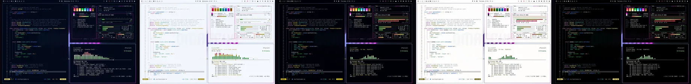](https://bjarneo.github.io/100-themes/#chiptune)

`036` · 目录：[`chiptune/`](chiptune/) · [在画廊中打开](https://bjarneo.github.io/100-themes/#chiptune)

Chiptune 的深色变体用深蓝背景，强调色为洋红。ANSI 色使用极高的彩度，霓虹感强烈。原生背景是一处像素风景。

| 变体 | 主题名 | `background` | `foreground` | `accent` | 图标主题 |
| --- | --- | --- | --- | --- | --- |
| 深色 | [`chiptune`](chiptune/dark/) | `#030819` | `#e4e8f0` | `#fc29f3` | `Yaru-magenta` |
| 日间 | [`chiptune-day`](chiptune/day/) | `#f4f7fc` | `#1e2637` | `#ba01b4` | `Yaru-magenta` |
| 高对比度 | [`chiptune-high-contrast`](chiptune/high-contrast/) | `#000108` | `#f2f5fb` | `#ff3bf5` | `Yaru-magenta` |
| 日间高对比度 | [`chiptune-day-high-contrast`](chiptune/day-high-contrast/) | `#fefdfc` | `#040817` | `#9d0197` | `Yaru-magenta` |
| OLED | [`chiptune-oled`](chiptune/oled/) | `#000000` | `#e4e8f0` | `#fc29f3` | `Yaru-magenta` |

<details>
<summary>每个变体的全部 16 个 ANSI 颜色</summary>

| 变体 | 常规，0 到 7 | 亮色，8 到 15 |
| --- | --- | --- |
| 深色 | `#0d1528` `#fe3f52` `#01ec3f` `#fee979` `#307fff` `#fc29f3` `#1be6ec` `#c6cbd5` | `#526386` `#fe8a8a` `#a4fea6` `#fffada` `#6ea4fc` `#fe8ef4` `#a8fdff` `#f8fafe` |
| 日间 | `#dbe3f3` `#d40333` `#088d24` `#a08c0c` `#0259d2` `#ba01b4` `#018589` `#404858` | `#9ba5b8` `#b0072a` `#01751b` `#89780c` `#0047ad` `#9b0096` `#0e6e71` `#0d1321` |
| 高对比度 | `#0b152c` `#fe6369` `#01ec3f` `#f6d813` `#629dfe` `#ff3bf5` `#1be6ec` `#dadee6` | `#6f80a5` `#fdaba9` `#a4fea6` `#ffe977` `#a3c6fd` `#fe9bf5` `#9afbfe` `#ffffff` |
| 日间高对比度 | `#e6ebf6` `#b3002a` `#026617` `#645700` `#0050c1` `#9d0197` `#066264` `#292e38` | `#6c7587` `#940020` `#035312` `#514603` `#0042a1` `#83007f` `#044f52` `#010203` |
| OLED | `#030920` `#fe3f52` `#01ec3f` `#fee979` `#307fff` `#fc29f3` `#1be6ec` `#c6cbd5` | `#526386` `#fe8a8a` `#a4fea6` `#fffada` `#6ea4fc` `#fe8ef4` `#a8fdff` `#f8fafe` |

</details>

```bash
curl -fsSL https://bjarneo.github.io/100-themes/install.sh | bash -s -- chiptune --set
```

### 8-Bit

[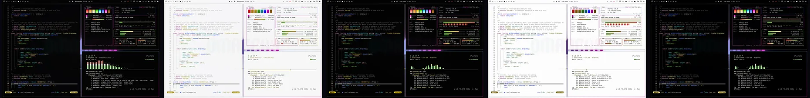](https://bjarneo.github.io/100-themes/#8-bit)

`037` · 目录：[`8-bit/`](8-bit/) · [在画廊中打开](https://bjarneo.github.io/100-themes/#8-bit)

8-Bit 的深色变体用中性黑背景，强调色为洋红。ANSI 色使用极高的彩度，霓虹感强烈。原生背景是一处像素风景。

| 变体 | 主题名 | `background` | `foreground` | `accent` | 图标主题 |
| --- | --- | --- | --- | --- | --- |
| 深色 | [`8-bit`](8-bit/dark/) | `#040404` | `#efe5e7` | `#fe39dc` | `Yaru-magenta` |
| 日间 | [`8-bit-day`](8-bit/day/) | `#f7f7f7` | `#2b2426` | `#bf07a4` | `Yaru-magenta` |
| 高对比度 | [`8-bit-high-contrast`](8-bit/high-contrast/) | `#020202` | `#faf3f5` | `#ff45dd` | `Yaru-magenta` |
| 日间高对比度 | [`8-bit-day-high-contrast`](8-bit/day-high-contrast/) | `#fdfdfd` | `#0d0809` | `#a3038c` | `Yaru-magenta` |
| OLED | [`8-bit-oled`](8-bit/oled/) | `#000000` | `#efe5e7` | `#fe39dc` | `Yaru-magenta` |

<details>
<summary>每个变体的全部 16 个 ANSI 颜色</summary>

| 变体 | 常规，0 到 7 | 亮色，8 到 15 |
| --- | --- | --- |
| 深色 | `#0f0f0f` `#fe4335` `#5be809` `#ffe97e` `#4b7bfd` `#fe39dc` `#1fe4f6` `#d3c7ca` | `#6e5f63` `#fe8c7c` `#aaff90` `#fff9de` `#7aa1fd` `#fe93e4` `#bff7fe` `#fdf9fa` |
| 日间 | `#e3e3e3` `#d60203` `#338b01` `#a18c0b` `#193dff` `#bf07a4` `#04848f` `#4d4647` | `#aaa2a4` `#b20404` `#287300` `#89770b` `#1200ed` `#9f0488` `#0f6d76` `#181214` |
| 高对比度 | `#1a1416` `#fe6554` `#5be809` `#f7d710` `#709afe` `#ff45dd` `#1fe4f6` `#e5dbdd` | `#8b7b80` `#feac9f` `#aaff91` `#ffe97e` `#aac4fc` `#ff9ee7` `#b0f6ff` `#ffffff` |
| 日间高对比度 | `#ebebeb` `#b20404` `#226500` `#655600` `#1531ff` `#a3038c` `#076169` `#372a2d` | `#7a7274` `#940403` `#1c5302` `#524603` `#1200ed` `#870074` `#054f56` `#030102` |
| OLED | `#0f090b` `#fe4335` `#5be809` `#ffe97e` `#4b7bfd` `#fe39dc` `#1fe4f6` `#d3c7ca` | `#6e5f63` `#fe8c7c` `#aaff90` `#fff9de` `#7aa1fd` `#fe93e4` `#bff7fe` `#fdf9fa` |

</details>

```bash
curl -fsSL https://bjarneo.github.io/100-themes/install.sh | bash -s -- 8-bit --set
```

### Industrial

[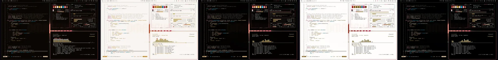](https://bjarneo.github.io/100-themes/#industrial)

`038` · 目录：[`industrial/`](industrial/) · [在画廊中打开](https://bjarneo.github.io/100-themes/#industrial)

Industrial 的深色变体用深棕背景，强调色为粉红。ANSI 色使用中彩度，观感更平静。原生背景是一座城市的天际线。

| 变体 | 主题名 | `background` | `foreground` | `accent` | 图标主题 |
| --- | --- | --- | --- | --- | --- |
| 深色 | [`industrial`](industrial/dark/) | `#090502` | `#ede7df` | `#f9667f` | `Yaru-red` |
| 日间 | [`industrial-day`](industrial/day/) | `#faf6f2` | `#2d251c` | `#bc2c4f` | `Yaru-red` |
| 高对比度 | [`industrial-high-contrast`](industrial/high-contrast/) | `#030100` | `#f9f4ef` | `#f9667f` | `Yaru-red` |
| 日间高对比度 | [`industrial-day-high-contrast`](industrial/day-high-contrast/) | `#fffdfb` | `#0e0803` | `#ab1541` | `Yaru-red` |
| OLED | [`industrial-oled`](industrial/oled/) | `#000000` | `#ede7df` | `#f9667f` | `Yaru-red` |

<details>
<summary>每个变体的全部 16 个 ANSI 颜色</summary>

| 变体 | 常规，0 到 7 | 亮色，8 到 15 |
| --- | --- | --- |
| 深色 | `#16100a` `#c5372f` `#e1b019` `#fddfb9` `#0095b7` `#f9667f` `#ffc390` `#d1c9c0` | `#70604e` `#cf7065` `#f9d375` `#fdf7f0` `#31b5db` `#ff9ea9` `#fdefe4` `#fcfaf7` |
| 日间 | `#e7e2dd` `#b3241f` `#8c6d08` `#b77b0f` `#0a6e88` `#bc2c4f` `#a95f00` `#4e463e` | `#aca399` `#990309` `#755900` `#9d6800` `#01596f` `#a5003b` `#8d4e00` `#19120b` |
| 高对比度 | `#1d1409` `#fa695c` `#e1b019` `#fdcf90` `#1aafd6` `#f9667f` `#ffc390` `#e3ddd6` | `#8e7d6a` `#feaca0` `#fed261` `#fee3c1` `#56d6fd` `#fdaab3` `#fee2cb` `#ffffff` |
| 日间高对比度 | `#eeeae7` `#ac1b18` `#6e5400` `#774f06` `#0a5f75` `#ab1541` `#824906` `#342c23` | `#7d746b` `#940509` `#5a4405` `#644103` `#004f63` `#920033` `#6c3b00` `#030101` |
| OLED | `#120902` `#c5372f` `#e1b019` `#fddfb9` `#0095b7` `#f9667f` `#ffc390` `#d1c9c0` | `#70604e` `#cf7065` `#f9d375` `#fdf7f0` `#31b5db` `#ff9ea9` `#fdefe4` `#fcfaf7` |

</details>

```bash
curl -fsSL https://bjarneo.github.io/100-themes/install.sh | bash -s -- industrial --set
```

### Punk

[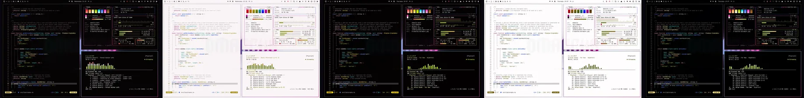](https://bjarneo.github.io/100-themes/#punk)

`039` · 目录：[`punk/`](punk/) · [在画廊中打开](https://bjarneo.github.io/100-themes/#punk)

Punk 的深色变体用中性黑背景，强调色为洋红。ANSI 色使用极高的彩度，霓虹感强烈。原生背景是一块 LED 频谱板。

| 变体 | 主题名 | `background` | `foreground` | `accent` | 图标主题 |
| --- | --- | --- | --- | --- | --- |
| 深色 | [`punk`](punk/dark/) | `#050303` | `#efe5e7` | `#fe49c2` | `Yaru-magenta` |
| 日间 | [`punk-day`](punk/day/) | `#faf5f6` | `#2d2326` | `#c50092` | `Yaru-magenta` |
| 高对比度 | [`punk-high-contrast`](punk/high-contrast/) | `#030102` | `#faf3f5` | `#fe4ec3` | `Yaru-magenta` |
| 日间高对比度 | [`punk-day-high-contrast`](punk/day-high-contrast/) | `#fffdfd` | `#0f0709` | `#a6047a` | `Yaru-magenta` |
| OLED | [`punk-oled`](punk/oled/) | `#000000` | `#efe5e7` | `#fe49c2` | `Yaru-magenta` |

<details>
<summary>每个变体的全部 16 个 ANSI 颜色</summary>

| 变体 | 常规，0 到 7 | 亮色，8 到 15 |
| --- | --- | --- |
| 深色 | `#110c0d` `#fe423b` `#acd809` `#ffe887` `#497cfd` `#fe49c2` `#1ce5f2` `#d3c7ca` | `#725c62` `#fe8b7e` `#cdf855` `#fef9e2` `#79a1fd` `#ff96d4` `#b7f9ff` `#fdf9fa` |
| 日间 | `#e6e1e3` `#d60012` `#668008` `#a38b08` `#133eff` `#c50092` `#02848d` `#4f4447` | `#ada1a4` `#b2020e` `#546b01` `#8b7609` `#0c00ed` `#a40079` `#0e6d74` `#1a1113` |
| 高对比度 | `#1e1216` `#ff6558` `#acd809` `#fad60b` `#6f9afe` `#fe4ec3` `#1ce5f2` `#e5dbdd` | `#90797f` `#feaba0` `#c9fb08` `#ffe887` `#a9c4fc` `#fda3d8` `#abf7fe` `#ffffff` |
| 日间高对比度 | `#eeeaeb` `#b30710` `#4a5e01` `#685700` `#0f32ff` `#a6047a` `#066167` `#372a2d` | `#7e7275` `#94020a` `#3d4e03` `#544704` `#0c00ed` `#8b0266` `#065056` `#030102` |
| OLED | `#12080b` `#fe423b` `#acd809` `#ffe887` `#497cfd` `#fe49c2` `#1ce5f2` `#d3c7ca` | `#725c62` `#fe8b7e` `#cdf855` `#fef9e2` `#79a1fd` `#ff96d4` `#b7f9ff` `#fdf9fa` |

</details>

```bash
curl -fsSL https://bjarneo.github.io/100-themes/install.sh | bash -s -- punk --set
```

### Metal

[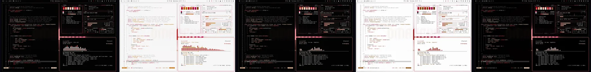](https://bjarneo.github.io/100-themes/#metal)

`040` · 目录：[`metal/`](metal/) · [在画廊中打开](https://bjarneo.github.io/100-themes/#metal)

Metal 的深色变体用中性黑背景，强调色为粉红。6 个 ANSI 色相都靠近红，整组读起来像一个颜色。原生背景是一块 LED 频谱板。

| 变体 | 主题名 | `background` | `foreground` | `accent` | 图标主题 |
| --- | --- | --- | --- | --- | --- |
| 深色 | [`metal`](metal/dark/) | `#020202` | `#efe5e7` | `#ff5c89` | `Yaru-red` |
| 日间 | [`metal-day`](metal/day/) | `#f7f7f7` | `#2b2426` | `#c50657` | `Yaru-red` |
| 高对比度 | [`metal-high-contrast`](metal/high-contrast/) | `#020202` | `#faf3f5` | `#ff5c89` | `Yaru-red` |
| 日间高对比度 | [`metal-day-high-contrast`](metal/day-high-contrast/) | `#fdfdfd` | `#0d0809` | `#ac054b` | `Yaru-red` |
| OLED | [`metal-oled`](metal/oled/) | `#000000` | `#efe5e7` | `#ff5c89` | `Yaru-red` |

<details>
<summary>每个变体的全部 16 个 ANSI 颜色</summary>

| 变体 | 常规，0 到 7 | 亮色，8 到 15 |
| --- | --- | --- |
| 深色 | `#0b0b0b` `#d40924` `#fd9888` `#ffddc4` `#ee3342` `#ff5c89` `#ffc1a7` `#d3c7ca` | `#6e5f63` `#e65a56` `#fdc9c0` `#fef7f2` `#fd7271` `#fd9eb1` `#feeee7` `#fdf9fa` |
| 日间 | `#e3e3e3` `#bb061f` `#d41004` `#c96e00` `#ba0426` `#c50657` `#bf4a00` `#4d4647` | `#aaa2a4` `#990015` `#b20300` `#ab5e05` `#98041e` `#a40046` `#9e3e06` `#181214` |
| 高对比度 | `#1a1416` `#ff645f` `#fd9888` `#fecca6` `#ff6365` `#ff5c89` `#ffc1a7` `#e5dbdd` | `#8b7b80` `#ffaaa3` `#fdc9c0` `#fee2cd` `#ffaaa6` `#fda9b9` `#fee1d5` `#ffffff` |
| 日间高对比度 | `#ebebeb` `#b2001b` `#b20500` `#854700` `#b20022` `#ac054b` `#983800` `#372a2d` | `#7a7274` `#940014` `#940300` `#6e3a00` `#94001b` `#90043e` `#7d2e00` `#030102` |
| OLED | `#0f090b` `#d40924` `#fd9888` `#ffddc4` `#ee3342` `#ff5c89` `#ffc1a7` `#d3c7ca` | `#6e5f63` `#e65a56` `#fdc9c0` `#fef7f2` `#fd7271` `#fd9eb1` `#feeee7` `#fdf9fa` |

</details>

```bash
curl -fsSL https://bjarneo.github.io/100-themes/install.sh | bash -s -- metal --set
```

### Goth

[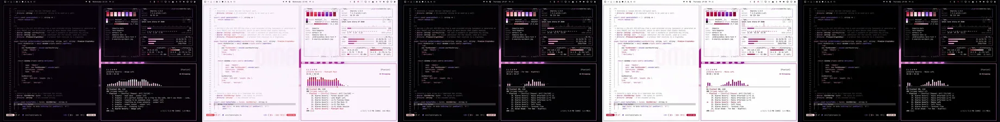](https://bjarneo.github.io/100-themes/#goth)

`041` · 目录：[`goth/`](goth/) · [在画廊中打开](https://bjarneo.github.io/100-themes/#goth)

Goth 的深色变体用深洋红背景，强调色为洋红。ANSI 色饱和而明亮。原生背景是层层叠叠的声波带。

| 变体 | 主题名 | `background` | `foreground` | `accent` | 图标主题 |
| --- | --- | --- | --- | --- | --- |
| 深色 | [`goth`](goth/dark/) | `#060108` | `#ece5ed` | `#dc6adf` | `Yaru-magenta` |
| 日间 | [`goth-day`](goth/day/) | `#fbf4fd` | `#2d222f` | `#a331a7` | `Yaru-magenta` |
| 高对比度 | [`goth-high-contrast`](goth/high-contrast/) | `#030104` | `#f8f3f8` | `#dc6adf` | `Yaru-magenta` |
| 日间高对比度 | [`goth-day-high-contrast`](goth/day-high-contrast/) | `#fefdfe` | `#0e0610` | `#942099` | `Yaru-magenta` |
| OLED | [`goth-oled`](goth/oled/) | `#000000` | `#ece5ed` | `#dc6adf` | `Yaru-magenta` |

<details>
<summary>每个变体的全部 16 个 ANSI 颜色</summary>

| 变体 | 常规，0 到 7 | 亮色，8 到 15 |
| --- | --- | --- |
| 深色 | `#130915` `#cc2445` `#fe85e0` `#ffdbd9` `#9762ec` `#dc6adf` `#fdbbd9` `#cfc8d1` | `#705a75` `#dc626d` `#fec2ec` `#fef6f6` `#b18df7` `#f099f1` `#ffecf4` `#fcf9fc` |
| 日间 | `#e8dfea` `#ba0037` `#b5319a` `#e94553` `#743bc3` `#a331a7` `#c32e85` `#4e4350` | `#aca0af` `#97042c` `#a00286` `#d41f3b` `#621bb0` `#8e0694` `#ac0070` `#19101b` |
| 高对比度 | `#1e1021` `#fe6272` `#fe85e0` `#fdc9c7` `#ad81fe` `#dc6adf` `#fdbbd9` `#e2dce3` | `#8e7793` `#feaaad` `#ffc1ed` `#ffdfde` `#cbb6fd` `#f99dfb` `#fedeec` `#ffffff` |
| 日间高对比度 | `#efe9f0` `#af0534` `#9f1586` `#b3002b` `#6f34bd` `#942099` `#a9056f` `#322b34` | `#7d717f` `#930029` `#870371` `#940021` `#6119af` `#800385` `#8b005a` `#020103` |
| OLED | `#120515` `#cc2445` `#fe85e0` `#ffdbd9` `#9762ec` `#dc6adf` `#fdbbd9` `#cfc8d1` | `#705a75` `#dc626d` `#fec2ec` `#fef6f6` `#b18df7` `#f099f1` `#ffecf4` `#fcf9fc` |

</details>

```bash
curl -fsSL https://bjarneo.github.io/100-themes/install.sh | bash -s -- goth --set
```

### Grunge

[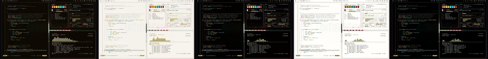](https://bjarneo.github.io/100-themes/#grunge)

`042` · 目录：[`grunge/`](grunge/) · [在画廊中打开](https://bjarneo.github.io/100-themes/#grunge)

Grunge 的深色变体用深橄榄背景，强调色为红。ANSI 色使用中彩度，观感更平静。原生背景是层层叠叠的声波带。

| 变体 | 主题名 | `background` | `foreground` | `accent` | 图标主题 |
| --- | --- | --- | --- | --- | --- |
| 深色 | [`grunge`](grunge/dark/) | `#0d0802` | `#ece7df` | `#fe838c` | `Yaru-red` |
| 日间 | [`grunge-day`](grunge/day/) | `#f7f3ed` | `#2c251a` | `#bc4754` | `Yaru-red` |
| 高对比度 | [`grunge-high-contrast`](grunge/high-contrast/) | `#030100` | `#f8f5ef` | `#fe838c` | `Yaru-red` |
| 日间高对比度 | [`grunge-day-high-contrast`](grunge/day-high-contrast/) | `#fffdfa` | `#0e0802` | `#9f2c3d` | `Yaru-red` |
| OLED | [`grunge-oled`](grunge/oled/) | `#000000` | `#ece7df` | `#fe838c` | `Yaru-red` |

<details>
<summary>每个变体的全部 16 个 ANSI 颜色</summary>

| 变体 | 常规，0 到 7 | 亮色，8 到 15 |
| --- | --- | --- |
| 深色 | `#1b150b` `#f37e60` `#c5c541` `#fcca4b` `#04b4e9` `#fe838c` `#39dcaa` `#d0cac0` | `#6f6149` `#fead97` `#e4e57f` `#fef1d4` `#69d3ff` `#feb9bb` `#82f9cd` `#fcfaf6` |
| 日间 | `#e4dfd7` `#bb4c30` `#7d7d0e` `#ae8604` `#0e7699` `#bc4754` `#088c69` `#4d473c` | `#aba397` `#a73311` `#686803` `#94720f` `#07617e` `#a72d3f` `#007557` `#191309` |
| 高对比度 | `#1d1406` `#f37e60` `#c5c541` `#fcca4b` `#04b4e9` `#fe838c` `#39dcaa` `#e2ddd5` | `#8d7e65` `#fead97` `#e4e57f` `#fee5ae` `#69d3ff` `#feb9bb` `#82f9cd` `#ffffff` |
| 日间高对比度 | `#eeebe5` `#9f3213` `#5b5b00` `#6f5400` `#0c5f7c` `#9f2c3d` `#036349` `#332d23` | `#7b7368` `#882201` `#4a4a00` `#5b4400` `#004e67` `#8f102c` `#05523c` `#020201` |
| OLED | `#120900` `#f37e60` `#c5c541` `#fcca4b` `#04b4e9` `#fe838c` `#39dcaa` `#d0cac0` | `#6f6149` `#fead97` `#e4e57f` `#fef1d4` `#69d3ff` `#feb9bb` `#82f9cd` `#fcfaf6` |

</details>

```bash
curl -fsSL https://bjarneo.github.io/100-themes/install.sh | bash -s -- grunge --set
```

### Shoegaze

[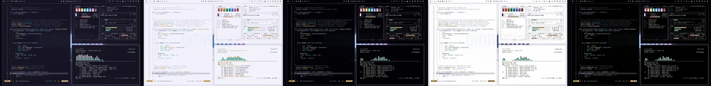](https://bjarneo.github.io/100-themes/#shoegaze)

`043` · 目录：[`shoegaze/`](shoegaze/) · [在画廊中打开](https://bjarneo.github.io/100-themes/#shoegaze)

Shoegaze 的深色变体用深靛蓝背景，强调色为紫。ANSI 色是浅淡的粉彩色。原生背景是山湖上空的极光。

| 变体 | 主题名 | `background` | `foreground` | `accent` | 图标主题 |
| --- | --- | --- | --- | --- | --- |
| 深色 | [`shoegaze`](shoegaze/dark/) | `#161423` | `#e7e7f0` | `#dea5f0` | `Yaru-purple` |
| 日间 | [`shoegaze-day`](shoegaze/day/) | `#f3f2fc` | `#262433` | `#9762a8` | `Yaru-purple` |
| 高对比度 | [`shoegaze-high-contrast`](shoegaze/high-contrast/) | `#020106` | `#f5f4fa` | `#dea5f0` | `Yaru-purple` |
| 日间高对比度 | [`shoegaze-day-high-contrast`](shoegaze/day-high-contrast/) | `#fdfdfe` | `#090714` | `#764286` | `Yaru-purple` |
| OLED | [`shoegaze-oled`](shoegaze/oled/) | `#000000` | `#e7e7f0` | `#dea5f0` | `Yaru-purple` |

<details>
<summary>每个变体的全部 16 个 ANSI 颜色</summary>

| 变体 | 常规，0 到 7 | 亮色，8 到 15 |
| --- | --- | --- |
| 深色 | `#242232` `#f297c1` `#6be4c3` `#ffd895` `#98abfd` `#dea5f0` `#69e5fe` `#cac9d4` | `#625f7e` `#fec5dd` `#b2fee6` `#fef8ec` `#c2cffe` `#f2d0fe` `#dbf8ff` `#fafafd` |
| 日间 | `#dfdeeb` `#ae5a83` `#039679` `#b8892c` `#5b6bb7` `#9762a8` `#0090a5` `#474655` | `#a4a2b4` `#9a436f` `#057e66` `#a27404` `#4756a4` `#834c94` `#08798b` `#14121e` |
| 高对比度 | `#161227` `#f297c1` `#6be4c3` `#ffd07c` `#98abfd` `#dea5f0` `#69e5fe` `#dedde6` | `#7f7c9d` `#fdc5dd` `#a2fde1` `#ffe4b6` `#c2cffd` `#f2d0fd` `#bef2fe` `#ffffff` |
| 日间高对比度 | `#ebeaf3` `#8c3b64` `#056450` `#735100` `#44529c` `#764286` `#0d606e` `#2d2c37` | `#757484` `#7b2754` `#005241` `#5f4305` `#35418d` `#673177` `#084f5b` `#020103` |
| OLED | `#0b081b` `#f297c1` `#6be4c3` `#ffd895` `#98abfd` `#dea5f0` `#69e5fe` `#cac9d4` | `#625f7e` `#fec5dd` `#b2fee6` `#fef8ec` `#c2cffe` `#f2d0fe` `#dbf8ff` `#fafafd` |

</details>

```bash
curl -fsSL https://bjarneo.github.io/100-themes/install.sh | bash -s -- shoegaze --set
```

### Jazz Club

[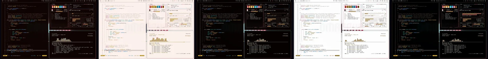](https://bjarneo.github.io/100-themes/#jazz-club)

`044` · 目录：[`jazz-club/`](jazz-club/) · [在画廊中打开](https://bjarneo.github.io/100-themes/#jazz-club)

Jazz Club 的深色变体用深红背景，强调色为粉红。ANSI 色使用中彩度，观感更平静。原生背景是层层叠叠的声波带。

| 变体 | 主题名 | `background` | `foreground` | `accent` | 图标主题 |
| --- | --- | --- | --- | --- | --- |
| 深色 | [`jazz-club`](jazz-club/dark/) | `#0e0301` | `#efe6e1` | `#fd8295` | `Yaru-red` |
| 日间 | [`jazz-club-day`](jazz-club/day/) | `#fcf1ec` | `#32221b` | `#bf425c` | `Yaru-red` |
| 高对比度 | [`jazz-club-high-contrast`](jazz-club/high-contrast/) | `#050100` | `#faf4f1` | `#fd8295` | `Yaru-red` |
| 日间高对比度 | [`jazz-club-day-high-contrast`](jazz-club/day-high-contrast/) | `#fefdfd` | `#120602` | `#a32746` | `Yaru-red` |
| OLED | [`jazz-club-oled`](jazz-club/oled/) | `#000000` | `#efe6e1` | `#fd8295` | `Yaru-red` |

<details>
<summary>每个变体的全部 16 个 ANSI 颜色</summary>

| 变体 | 常规，0 到 7 | 亮色，8 到 15 |
| --- | --- | --- |
| 深色 | `#1c0d06` `#f9786b` `#fea844` `#fdc93a` `#4eaafe` `#fd8295` `#19d9d2` `#d3c8c3` | `#7c5a4c` `#feaba1` `#fed6ad` `#fff1d0` `#96c9fc` `#fdb9c0` `#6ef7f1` `#fdf9f7` |
| 日间 | `#eadcd6` `#c0453c` `#a86605` `#ad8604` `#016fbb` `#bf425c` `#118985` `#54443d` | `#b3a098` `#ab2924` `#8c5508` `#93720d` `#065b99` `#aa2547` `#0d726f` `#1d100a` |
| 高对比度 | `#250f06` `#f9786b` `#fea844` `#fdc93a` `#4eaafe` `#fd8295` `#19d9d2` `#e5dcd8` | `#9a7768` `#fdaca1` `#fed6af` `#fee6ac` `#94cafe` `#ffb8c0` `#61f9f2` `#ffffff` |
| 日间高对比度 | `#f3e9e5` `#a32824` `#7e4c07` `#6e5400` `#005998` `#a32746` `#09625f` `#372b26` | `#83726a` `#93060d` `#683e03` `#5a4400` `#034a7e` `#920035` `#00504e` `#030101` |
| OLED | `#180501` `#f9786b` `#fea844` `#fdc93a` `#4eaafe` `#fd8295` `#19d9d2` `#d3c8c3` | `#7c5a4c` `#feaba1` `#fed6ad` `#fff1d0` `#96c9fc` `#fdb9c0` `#6ef7f1` `#fdf9f7` |

</details>

```bash
curl -fsSL https://bjarneo.github.io/100-themes/install.sh | bash -s -- jazz-club --set
```

### Blues

[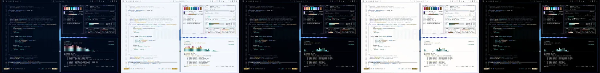](https://bjarneo.github.io/100-themes/#blues)

`045` · 目录：[`blues/`](blues/) · [在画廊中打开](https://bjarneo.github.io/100-themes/#blues)

Blues 的深色变体用深蓝背景，强调色为靛蓝。ANSI 色使用中彩度，观感更平静。原生背景是层层叠叠的声波带。

| 变体 | 主题名 | `background` | `foreground` | `accent` | 图标主题 |
| --- | --- | --- | --- | --- | --- |
| 深色 | [`blues`](blues/dark/) | `#010919` | `#e3e8f0` | `#998bff` | `Yaru-purple` |
| 日间 | [`blues-day`](blues/day/) | `#f3f7fc` | `#1b2737` | `#6e5bce` | `Yaru-purple` |
| 高对比度 | [`blues-high-contrast`](blues/high-contrast/) | `#000208` | `#f2f5fb` | `#998bff` | `Yaru-purple` |
| 日间高对比度 | [`blues-day-high-contrast`](blues/day-high-contrast/) | `#fefdfc` | `#020917` | `#5a44b5` | `Yaru-purple` |
| OLED | [`blues-oled`](blues/oled/) | `#000000` | `#e3e8f0` | `#998bff` | `Yaru-purple` |

<details>
<summary>每个变体的全部 16 个 ANSI 颜色</summary>

| 变体 | 常规，0 到 7 | 亮色，8 到 15 |
| --- | --- | --- |
| 深色 | `#091628` `#e65e74` `#05e0dd` `#fee5b3` `#3d84ea` `#998bff` `#2ae2ff` `#c4cbd4` | `#4c6585` `#ea969f` `#8efaf7` `#fff8e9` `#7da6e4` `#b9b4fc` `#c5f5ff` `#f8fafd` |
| 日间 | `#d9e4f3` `#bf3955` `#058684` `#b18406` `#145fc1` `#6e5bce` `#0d8395` `#3d4958` | `#98a6b8` `#aa1740` `#026f6d` `#96710c` `#004aa4` `#5b44bb` `#086d7c` `#0a1421` |
| 高对比度 | `#05162c` `#f46a80` `#05e0dd` `#fed171` `#5e9efd` `#998bff` `#2ae2ff` `#d9dfe6` | `#6882a4` `#fea9b2` `#6bfffc` `#fee5b2` `#a2c6fc` `#bfbcfd` `#bdf3fe` `#ffffff` |
| 日间高对比度 | `#e4ecf6` `#a71f42` `#086261` `#715300` `#0254b6` `#5a44b5` `#0c606d` `#272e38` | `#697686` `#920032` `#09504e` `#5c4300` `#014497` `#4c30a7` `#004e5a` `#010203` |
| OLED | `#000b1f` `#e65e74` `#05e0dd` `#fee5b3` `#3d84ea` `#998bff` `#2ae2ff` `#c4cbd4` | `#4c6585` `#ea969f` `#8efaf7` `#fff8e9` `#7da6e4` `#b9b4fc` `#c5f5ff` `#f8fafd` |

</details>

```bash
curl -fsSL https://bjarneo.github.io/100-themes/install.sh | bash -s -- blues --set
```

### Disco

[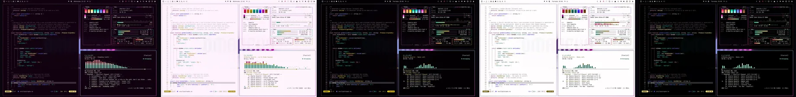](https://bjarneo.github.io/100-themes/#disco)

`046` · 目录：[`disco/`](disco/) · [在画廊中打开](https://bjarneo.github.io/100-themes/#disco)

Disco 的深色变体用深洋红背景，强调色为洋红。ANSI 色使用极高的彩度，霓虹感强烈。原生背景是墙上的霓虹灯管造型。

| 变体 | 主题名 | `background` | `foreground` | `accent` | 图标主题 |
| --- | --- | --- | --- | --- | --- |
| 深色 | [`disco`](disco/dark/) | `#110110` | `#ede5ec` | `#ff3cd7` | `Yaru-magenta` |
| 日间 | [`disco-day`](disco/day/) | `#fef3fc` | `#321f30` | `#c003a1` | `Yaru-magenta` |
| 高对比度 | [`disco-high-contrast`](disco/high-contrast/) | `#040004` | `#f8f3f8` | `#fe4bd7` | `Yaru-magenta` |
| 日间高对比度 | [`disco-day-high-contrast`](disco/day-high-contrast/) | `#fffdfe` | `#120411` | `#a50089` | `Yaru-magenta` |
| OLED | [`disco-oled`](disco/oled/) | `#000000` | `#ede5ec` | `#ff3cd7` | `Yaru-magenta` |

<details>
<summary>每个变体的全部 16 个 ANSI 颜色</summary>

| 变体 | 常规，0 到 7 | 亮色，8 到 15 |
| --- | --- | --- |
| 深色 | `#200a1e` `#fe3968` `#03e5b7` `#ffe983` `#5e76fc` `#ff3cd7` `#1ce6e9` `#d0c7cf` | `#7a5476` `#fe8896` `#8bfeda` `#fff9dd` `#859dfe` `#fe93e1` `#a2feff` `#fcf9fc` |
| 日间 | `#efdcec` `#d2004a` `#00896c` `#a28c0a` `#3c33fe` `#c003a1` `#028587` `#534151` | `#b09eae` `#ae043d` `#037159` `#8a770a` `#3005e2` `#a00185` `#0e6e70` `#1b0f1a` |
| 高对比度 | `#220c21` `#fd617b` `#03e5b7` `#f8d70e` `#7d96fe` `#fe4bd7` `#1ce6e9` `#e3dbe2` | `#957391` `#fea9b1` `#89ffda` `#ffe983` `#b0c1fc` `#fe9fe4` `#91fdfe` `#ffffff` |
| 日间高对比度 | `#f3e7f2` `#b2003d` `#0a644f` `#655600` `#3a2afd` `#a50089` `#066263` `#342a33` | `#81707e` `#910532` `#035240` `#544705` `#3005e2` `#870270` `#044f51` `#030102` |
| OLED | `#160315` `#fe3968` `#03e5b7` `#ffe983` `#5e76fc` `#ff3cd7` `#1ce6e9` `#d0c7cf` | `#7a5476` `#fe8896` `#8bfeda` `#fff9dd` `#859dfe` `#fe93e1` `#a2feff` `#fcf9fc` |

</details>

```bash
curl -fsSL https://bjarneo.github.io/100-themes/install.sh | bash -s -- disco --set
```

### Funk

[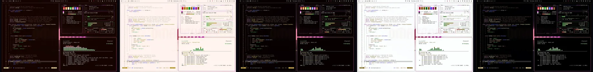](https://bjarneo.github.io/100-themes/#funk)

`047` · 目录：[`funk/`](funk/) · [在画廊中打开](https://bjarneo.github.io/100-themes/#funk)

Funk 的深色变体用深棕背景，强调色为洋红。ANSI 色饱和而明亮。原生背景是层层叠叠的声波带。

| 变体 | 主题名 | `background` | `foreground` | `accent` | 图标主题 |
| --- | --- | --- | --- | --- | --- |
| 深色 | [`funk`](funk/dark/) | `#150400` | `#efe6e1` | `#ee54de` | `Yaru-magenta` |
| 日间 | [`funk-day`](funk/day/) | `#fff4ef` | `#342117` | `#ba12ad` | `Yaru-magenta` |
| 高对比度 | [`funk-high-contrast`](funk/high-contrast/) | `#060000` | `#faf4f0` | `#f056e0` | `Yaru-magenta` |
| 日间高对比度 | [`funk-day-high-contrast`](funk/day-high-contrast/) | `#fcfefe` | `#140501` | `#a10295` | `Yaru-magenta` |
| OLED | [`funk-oled`](funk/oled/) | `#000000` | `#efe6e1` | `#ee54de` | `Yaru-magenta` |

<details>
<summary>每个变体的全部 16 个 ANSI 颜色</summary>

| 变体 | 常规，0 到 7 | 亮色，8 到 15 |
| --- | --- | --- |
| 深色 | `#241005` `#fe4048` `#43e94b` `#fee6a6` `#5e75ff` `#ee54de` `#feba7e` `#d3c8c2` | `#7f5944` `#fd8c86` `#abfda8` `#fef8e7` `#879efb` `#f19be5` `#ffe6d2` `#fdf9f7` |
| 日间 | `#f1dfd5` `#d40728` `#008e14` `#ab8704` `#3d44e8` `#ba12ad` `#a7610c` `#554339` | `#b5a094` `#b1051f` `#00760f` `#927300` `#3020d6` `#9c0091` `#8c4f02` `#1f1007` |
| 高对比度 | `#270e01` `#ff6361` `#43e94b` `#fed252` `#7d96fe` `#f056e0` `#feba7e` `#e5dcd7` | `#9e7660` `#fdaba5` `#a4ffa1` `#ffe6a5` `#b0c1fd` `#ff9cf1` `#fde2cc` `#ffffff` |
| 日间高对比度 | `#f5e8e2` `#b30320` `#02670e` `#6d5500` `#393de1` `#a10295` `#824a04` `#362b25` | `#857166` `#930519` `#005308` `#594500` `#3020d6` `#84007b` `#6b3c02` `#030101` |
| OLED | `#1b0400` `#fe4048` `#43e94b` `#fee6a6` `#5e75ff` `#ee54de` `#feba7e` `#d3c8c2` | `#7f5944` `#fd8c86` `#abfda8` `#fef8e7` `#879efb` `#f19be5` `#ffe6d2` `#fdf9f7` |

</details>

```bash
curl -fsSL https://bjarneo.github.io/100-themes/install.sh | bash -s -- funk --set
```

### Soul

[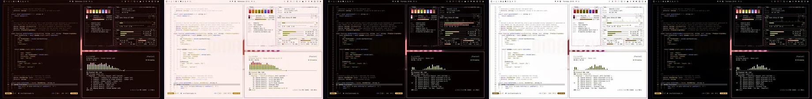](https://bjarneo.github.io/100-themes/#soul)

`048` · 目录：[`soul/`](soul/) · [在画廊中打开](https://bjarneo.github.io/100-themes/#soul)

Soul 的深色变体用深红背景，强调色为洋红。ANSI 色使用中彩度，观感更平静。原生背景是层层叠叠的声波带。

| 变体 | 主题名 | `background` | `foreground` | `accent` | 图标主题 |
| --- | --- | --- | --- | --- | --- |
| 深色 | [`soul`](soul/dark/) | `#160605` | `#f0e5e3` | `#f97acc` | `Yaru-magenta` |
| 日间 | [`soul-day`](soul/day/) | `#fcf0ee` | `#33211e` | `#b73d90` | `Yaru-magenta` |
| 高对比度 | [`soul-high-contrast`](soul/high-contrast/) | `#050100` | `#faf3f2` | `#f97acc` | `Yaru-magenta` |
| 日间高对比度 | [`soul-day-high-contrast`](soul/day-high-contrast/) | `#fefdfd` | `#130504` | `#9c2178` | `Yaru-magenta` |
| OLED | [`soul-oled`](soul/oled/) | `#000000` | `#f0e5e3` | `#f97acc` | `Yaru-magenta` |

<details>
<summary>每个变体的全部 16 个 ANSI 颜色</summary>

| 变体 | 常规，0 到 7 | 亮色，8 到 15 |
| --- | --- | --- |
| 深色 | `#241310` `#fd7467` `#adce2c` `#ffc667` `#829eff` `#f97acc` `#ffa750` `#d4c7c5` | `#7d5952` `#ffaba0` `#d3e99d` `#fdf0db` `#aec2fd` `#fdb4e0` `#ffd5b1` `#fdf9f8` |
| 日间 | `#ebdcd9` `#c83a33` `#6c8307` `#b6810e` `#465ed2` `#b73d90` `#ac6302` `#544340` | `#b49f9b` `#b31517` `#596d03` `#9d6d00` `#3346bf` `#a21e7c` `#905201` `#1e0f0d` |
| 高对比度 | `#250e0b` `#fd7467` `#adce2c` `#ffc667` `#829eff` `#f97acc` `#ffa750` `#e6dbd9` | `#9c756f` `#feaca1` `#cfed7b` `#fee4bc` `#aec2ff` `#feb3e0` `#fed5b3` `#ffffff` |
| 日间高对比度 | `#f3e8e6` `#ac1a1a` `#4d5e07` `#745001` `#374bbe` `#9c2178` `#824a03` `#372a28` | `#84716d` `#94040b` `#3f4d02` `#614200` `#2938b0` `#880266` `#6c3b00` `#030101` |
| OLED | `#190403` `#fd7467` `#adce2c` `#ffc667` `#829eff` `#f97acc` `#ffa750` `#d4c7c5` | `#7d5952` `#ffaba0` `#d3e99d` `#fdf0db` `#aec2fd` `#fdb4e0` `#ffd5b1` `#fdf9f8` |

</details>

```bash
curl -fsSL https://bjarneo.github.io/100-themes/install.sh | bash -s -- soul --set
```

### Reggae

[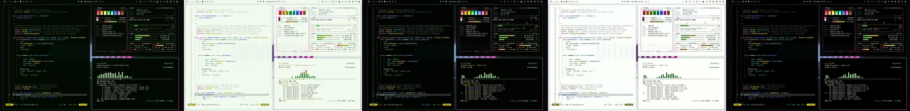](https://bjarneo.github.io/100-themes/#reggae)

`049` · 目录：[`reggae/`](reggae/) · [在画廊中打开](https://bjarneo.github.io/100-themes/#reggae)

Reggae 的深色变体用深绿背景，强调色为洋红。ANSI 色饱和而明亮。原生背景是层层叠叠的声波带。

| 变体 | 主题名 | `background` | `foreground` | `accent` | 图标主题 |
| --- | --- | --- | --- | --- | --- |
| 深色 | [`reggae`](reggae/dark/) | `#010900` | `#e4eae2` | `#fc4cc4` | `Yaru-magenta` |
| 日间 | [`reggae-day`](reggae/day/) | `#f1faef` | `#1d2b1b` | `#c40294` | `Yaru-magenta` |
| 高对比度 | [`reggae-high-contrast`](reggae/high-contrast/) | `#000300` | `#f2f6f1` | `#fe53c7` | `Yaru-magenta` |
| 日间高对比度 | [`reggae-day-high-contrast`](reggae/day-high-contrast/) | `#fbfffa` | `#030c02` | `#a8007e` | `Yaru-magenta` |
| OLED | [`reggae-oled`](reggae/oled/) | `#000000` | `#e4eae2` | `#fc4cc4` | `Yaru-magenta` |

<details>
<summary>每个变体的全部 16 个 ANSI 颜色</summary>

| 变体 | 常规，0 到 7 | 亮色，8 到 15 |
| --- | --- | --- |
| 深色 | `#071605` `#fe4141` `#3fe94d` `#ffed0d` `#427dfc` `#fc4cc4` `#04e8df` `#c6cdc4` | `#516c4b` `#fd8c82` `#a5fea4` `#fffbce` `#74a2fe` `#ff95d7` `#a3fff8` `#f8fbf8` |
| 日间 | `#dbe7d8` `#d40a1f` `#058d1d` `#9a8f00` `#094ee8` `#c40294` `#0a8680` `#3f4c3d` | `#9baa98` `#b10718` `#047517` `#837a0c` `#003ac6` `#a4007b` `#0c6f6a` `#0c170a` |
| 高对比度 | `#081b05` `#ff645c` `#3fe94d` `#eddc07` `#6a9bfe` `#fe53c7` `#04e8df` `#dae0d9` | `#6d8967` `#fdaca3` `#a3ffa2` `#feed1e` `#a7c4fd` `#fda2da` `#91fef6` `#ffffff` |
| 日间高对比度 | `#e6eee4` `#b30518` `#006710` `#605902` `#0045e0` `#a8007e` `#0a625e` `#293027` | `#6b7968` `#960111` `#00550b` `#4f4904` `#0036be` `#8a0068` `#01504d` `#010201` |
| OLED | `#011000` `#fe4141` `#3fe94d` `#ffed0d` `#427dfc` `#fc4cc4` `#04e8df` `#c6cdc4` | `#516c4b` `#fd8c82` `#a5fea4` `#fffbce` `#74a2fe` `#ff95d7` `#a3fff8` `#f8fbf8` |

</details>

```bash
curl -fsSL https://bjarneo.github.io/100-themes/install.sh | bash -s -- reggae --set
```

### Ambient

[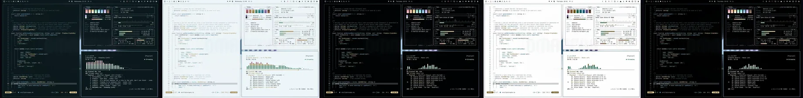](https://bjarneo.github.io/100-themes/#ambient)

`050` · 目录：[`ambient/`](ambient/) · [在画廊中打开](https://bjarneo.github.io/100-themes/#ambient)

Ambient 的深色变体用深青蓝背景，强调色为紫。ANSI 色是浅淡的粉彩色。原生背景是山湖上空的极光。

| 变体 | 主题名 | `background` | `foreground` | `accent` | 图标主题 |
| --- | --- | --- | --- | --- | --- |
| 深色 | [`ambient`](ambient/dark/) | `#0b181c` | `#e0eaed` | `#c6b2ea` | `Yaru-purple` |
| 日间 | [`ambient-day`](ambient/day/) | `#edf5f8` | `#1a292e` | `#826fa3` | `Yaru-purple` |
| 高对比度 | [`ambient-high-contrast`](ambient/high-contrast/) | `#000203` | `#f0f6f9` | `#c6b2ea` | `Yaru-purple` |
| 日间高对比度 | [`ambient-day-high-contrast`](ambient/day-high-contrast/) | `#fefdfd` | `#010b0f` | `#614f7f` | `Yaru-purple` |
| OLED | [`ambient-oled`](ambient/oled/) | `#000000` | `#e0eaed` | `#c6b2ea` | `Yaru-purple` |

<details>
<summary>每个变体的全部 16 个 ANSI 颜色</summary>

| 变体 | 常规，0 到 7 | 亮色，8 到 15 |
| --- | --- | --- |
| 深色 | `#19262b` `#e6a3a8` `#9cdbb9` `#f4dca1` `#7fb9de` `#c6b2ea` `#90e1e7` `#c0cdd1` | `#496973` `#f9cacd` `#cdf7df` `#fef8ea` `#b0d7f0` `#e3d6fd` `#d0fbfe` `#f7fbfc` |
| 日间 | `#d8e2e5` `#a4666c` `#528f70` `#a79057` `#3f799a` `#826fa3` `#3b8e94` `#3c4a4f` | `#98a8ad` `#905157` `#3a7b5b` `#927a3f` `#256487` `#6e5a8f` `#197a80` `#09161a` |
| 高对比度 | `#04191f` `#e6a3a8` `#9cdbb9` `#eed59b` `#7fb9de` `#c6b2ea` `#90e1e7` `#d6e0e3` | `#668691` `#ffc7cb` `#c3f6da` `#fae6b8` `#a9d8f6` `#e3d7fd` `#b6f5fa` `#ffffff` |
| 日间高对比度 | `#e6ecef` `#81474d` `#256346` `#6b551b` `#225d7d` `#614f7f` `#066167` `#233035` | `#68777d` `#71353c` `#075235` `#594505` `#034c6d` `#503d6f` `#095055` `#000203` |
| OLED | `#000e14` `#e6a3a8` `#9cdbb9` `#f4dca1` `#7fb9de` `#c6b2ea` `#90e1e7` `#c0cdd1` | `#496973` `#f9cacd` `#cdf7df` `#fef8ea` `#b0d7f0` `#e3d6fd` `#d0fbfe` `#f7fbfc` |

</details>

```bash
curl -fsSL https://bjarneo.github.io/100-themes/install.sh | bash -s -- ambient --set
```

### Midnight

[](https://bjarneo.github.io/100-themes/#midnight)

`051` · 目录：[`midnight/`](midnight/) · [在画廊中打开](https://bjarneo.github.io/100-themes/#midnight)

Midnight 的深色变体用深蓝背景，强调色为紫。ANSI 色使用中彩度，观感更平静。原生背景是星野里的一片星云。

| 变体 | 主题名 | `background` | `foreground` | `accent` | 图标主题 |
| --- | --- | --- | --- | --- | --- |
| 深色 | [`midnight`](midnight/dark/) | `#010210` | `#e4e8f0` | `#af80fd` | `Yaru-purple` |
| 日间 | [`midnight-day`](midnight/day/) | `#f4f7fc` | `#1e2637` | `#8251ca` | `Yaru-purple` |
| 高对比度 | [`midnight-high-contrast`](midnight/high-contrast/) | `#000108` | `#f2f5fb` | `#af80fd` | `Yaru-purple` |
| 日间高对比度 | [`midnight-day-high-contrast`](midnight/day-high-contrast/) | `#fefdfc` | `#040817` | `#6e3bb2` | `Yaru-purple` |
| OLED | [`midnight-oled`](midnight/oled/) | `#000000` | `#e4e8f0` | `#af80fd` | `Yaru-purple` |

<details>
<summary>每个变体的全部 16 个 ANSI 颜色</summary>

| 变体 | 常规，0 到 7 | 亮色，8 到 15 |
| --- | --- | --- |
| 深色 | `#050c1e` `#eb5968` `#13e79d` `#fee799` `#4181f1` `#af80fd` `#20e4f7` `#c6cbd5` | `#526386` `#f59094` `#95feca` `#fff9e4` `#78a5f1` `#c8adff` `#bff7fe` `#f8fafe` |
| 日间 | `#dbe3f3` `#c43449` `#008a5c` `#a78905` `#1d5bc7` `#8251ca` `#058490` `#404858` | `#9ba5b8` `#af0733` `#00734c` `#8e750a` `#0045b2` `#6f38b6` `#006e78` `#0d1321` |
| 高对比度 | `#0b152c` `#fa6774` `#13e79d` `#ffd320` `#649dfe` `#af80fd` `#20e4f7` `#dadee6` | `#6f80a5` `#feaaac` `#94ffca` `#fee79a` `#a3c5fe` `#cdb5fe` `#b1f6ff` `#ffffff` |
| 日间高对比度 | `#e6ebf6` `#ac1635` `#006441` `#6a5600` `#1051bc` `#6e3bb2` `#07616a` `#292e38` | `#6c7587` `#930028` `#065236` `#564605` `#0040a6` `#5f23a2` `#074f56` `#010203` |
| OLED | `#030920` `#eb5968` `#13e79d` `#fee799` `#4181f1` `#af80fd` `#20e4f7` `#c6cbd5` | `#526386` `#f59094` `#95feca` `#fff9e4` `#78a5f1` `#c8adff` `#bff7fe` `#f8fafe` |

</details>

```bash
curl -fsSL https://bjarneo.github.io/100-themes/install.sh | bash -s -- midnight --set
```

### Dawn

[](https://bjarneo.github.io/100-themes/#dawn)

`052` · 目录：[`dawn/`](dawn/) · [在画廊中打开](https://bjarneo.github.io/100-themes/#dawn)

Dawn 的深色变体用深红背景，强调色为粉红。ANSI 色是浅淡的粉彩色。原生背景是山湖上空的极光。

| 变体 | 主题名 | `background` | `foreground` | `accent` | 图标主题 |
| --- | --- | --- | --- | --- | --- |
| 深色 | [`dawn`](dawn/dark/) | `#200e0e` | `#f0e5e4` | `#fe98ca` | `Yaru-magenta` |
| 日间 | [`dawn-day`](dawn/day/) | `#fdf0f0` | `#332121` | `#b94f87` | `Yaru-magenta` |
| 高对比度 | [`dawn-high-contrast`](dawn/high-contrast/) | `#050001` | `#faf3f3` | `#fe98ca` | `Yaru-magenta` |
| 日间高对比度 | [`dawn-day-high-contrast`](dawn/day-high-contrast/) | `#fefdfd` | `#130505` | `#97306a` | `Yaru-magenta` |
| OLED | [`dawn-oled`](dawn/oled/) | `#000000` | `#f0e5e4` | `#fe98ca` | `Yaru-magenta` |

<details>
<summary>每个变体的全部 16 个 ANSI 颜色</summary>

| 变体 | 常规，0 到 7 | 亮色，8 到 15 |
| --- | --- | --- |
| 深色 | `#2f1c1c` `#fd9598` `#7ce695` `#ffd899` `#83b2fd` `#fe98ca` `#fdc2a3` `#d4c7c6` | `#7d5857` `#fdc8c8` `#bbffc8` `#fef8ee` `#b8d3fc` `#fecfe4` `#feeee7` `#fdf9f9` |
| 日间 | `#ebdbdb` `#c34e57` `#26984c` `#be870a` `#386fc8` `#b94f87` `#c55f1b` `#554342` | `#b49f9e` `#ae3441` `#0b813b` `#a47300` `#1e59b4` `#a43673` `#ab4c01` `#1e0f0f` |
| 高对比度 | `#250e0e` `#fd9598` `#7ce695` `#ffcf81` `#83b2fd` `#fe98ca` `#fdc2a3` `#e6dbdb` | `#9c7574` `#fdc8c8` `#adffbd` `#fee4bb` `#b8d3fc` `#fecee4` `#fde2d4` `#ffffff` |
| 日间高对比度 | `#f3e8e8` `#9f2c3a` `#06652d` `#745001` `#1e55ab` `#97306a` `#904003` `#372a2a` | `#847070` `#8f1129` `#005423` `#5f4101` `#03429c` `#861659` `#793300` `#030101` |
| OLED | `#190405` `#fd9598` `#7ce695` `#ffd899` `#83b2fd` `#fe98ca` `#fdc2a3` `#d4c7c6` | `#7d5857` `#fdc8c8` `#bbffc8` `#fef8ee` `#b8d3fc` `#fecfe4` `#feeee7` `#fdf9f9` |

</details>

```bash
curl -fsSL https://bjarneo.github.io/100-themes/install.sh | bash -s -- dawn --set
```

### Dusk

[](https://bjarneo.github.io/100-themes/#dusk)

`053` · 目录：[`dusk/`](dusk/) · [在画廊中打开](https://bjarneo.github.io/100-themes/#dusk)

Dusk 的深色变体用深靛蓝背景，强调色为紫。ANSI 色饱和而明亮。原生背景是透视网格上的一轮霓虹太阳。

| 变体 | 主题名 | `background` | `foreground` | `accent` | 图标主题 |
| --- | --- | --- | --- | --- | --- |
| 深色 | [`dusk`](dusk/dark/) | `#0e0821` | `#e7e7f0` | `#c98fff` | `Yaru-purple` |
| 日间 | [`dusk-day`](dusk/day/) | `#f3f2ff` | `#262339` | `#9349ce` | `Yaru-purple` |
| 高对比度 | [`dusk-high-contrast`](dusk/high-contrast/) | `#020107` | `#f5f4fa` | `#c98fff` | `Yaru-purple` |
| 日间高对比度 | [`dusk-day-high-contrast`](dusk/day-high-contrast/) | `#fdfdfc` | `#090618` | `#7b2eb3` | `Yaru-purple` |
| OLED | [`dusk-oled`](dusk/oled/) | `#000000` | `#e7e7f0` | `#c98fff` | `Yaru-purple` |

<details>
<summary>每个变体的全部 16 个 ANSI 颜色</summary>

| 变体 | 常规，0 到 7 | 亮色，8 到 15 |
| --- | --- | --- |
| 深色 | `#1b1630` `#fe6f83` `#ff94dd` `#ffc390` `#919afe` `#c98fff` `#ffa28f` `#cac9d4` | `#625c89` `#fdaab1` `#ffcdec` `#feefe2` `#b6bffe` `#debeff` `#fdd3ca` `#fafafd` |
| 日间 | `#dfddf2` `#cf284f` `#be379b` `#c9740d` `#5854db` `#9349ce` `#d33318` `#47455a` | `#a4a2b7` `#b4023d` `#a90e87` `#ad6206` `#463ac8` `#802cbb` `#b71d00` `#141120` |
| 高对比度 | `#16112b` `#fe6f83` `#ff94dd` `#ffc390` `#919afe` `#c98fff` `#ffa28f` `#dedde6` | `#7f7aa2` `#fea9b0` `#ffcded` `#ffe2ca` `#b6bffe` `#debeff` `#fdd3ca` `#ffffff` |
| 日间高对比度 | `#eae9f8` `#ae043b` `#a11281` `#824906` `#4a42c8` `#7b2eb3` `#ac1d02` `#2d2c37` | `#757387` `#910530` `#89006d` `#6d3b00` `#3e2bbb` `#6d0da5` `#901400` `#020103` |
| OLED | `#0c061e` `#fe6f83` `#ff94dd` `#ffc390` `#919afe` `#c98fff` `#ffa28f` `#cac9d4` | `#625c89` `#fdaab1` `#ffcdec` `#feefe2` `#b6bffe` `#debeff` `#fdd3ca` `#fafafd` |

</details>

```bash
curl -fsSL https://bjarneo.github.io/100-themes/install.sh | bash -s -- dusk --set
```

### Aurora

[](https://bjarneo.github.io/100-themes/#aurora)

`054` · 目录：[`aurora/`](aurora/) · [在画廊中打开](https://bjarneo.github.io/100-themes/#aurora)

Aurora 的深色变体用深青蓝背景，强调色为紫。ANSI 色饱和而明亮。原生背景是山湖上空的极光。

| 变体 | 主题名 | `background` | `foreground` | `accent` | 图标主题 |
| --- | --- | --- | --- | --- | --- |
| 深色 | [`aurora`](aurora/dark/) | `#000506` | `#dfeaea` | `#b77bfe` | `Yaru-purple` |
| 日间 | [`aurora-day`](aurora/day/) | `#eafbfa` | `#0f2c2c` | `#9037e1` | `Yaru-purple` |
| 高对比度 | [`aurora-high-contrast`](aurora/high-contrast/) | `#000303` | `#eff7f7` | `#b77bfe` | `Yaru-purple` |
| 日间高对比度 | [`aurora-day-high-contrast`](aurora/day-high-contrast/) | `#fbfefe` | `#000d0d` | `#7f1bcc` | `Yaru-purple` |
| OLED | [`aurora-oled`](aurora/oled/) | `#000000` | `#dfeaea` | `#b77bfe` | `Yaru-purple` |

<details>
<summary>每个变体的全部 16 个 ANSI 颜色</summary>

| 变体 | 常规，0 到 7 | 亮色，8 到 15 |
| --- | --- | --- |
| 深色 | `#001111` `#0caf4b` `#15e6a8` `#d5fc10` `#0096af` `#b77bfe` `#1be9d7` `#c0cecd` | `#356e6e` `#4ccf6e` `#8fffd0` `#f3ffd7` `#1bb7d5` `#ceaaff` `#a5fff3` `#f6fbfb` |
| 日间 | `#d2e8e8` `#048939` `#0d8963` `#80990b` `#0e6f81` `#9037e1` `#12867c` `#344d4d` | `#90abaa` `#00712d` `#047252` `#6d8200` `#005a6a` `#7d00ce` `#007067` `#021818` |
| 高对比度 | `#001b1b` `#12be53` `#15e6a8` `#c6ea00` `#19b1cd` `#b77bfe` `#1be9d7` `#d5e1e0` | `#538c8b` `#55e57a` `#90ffd0` `#d7fa51` `#1adafd` `#d2b3fe` `#93fff1` `#ffffff` |
| 日间高对比度 | `#e0efee` `#036629` `#006548` `#4e5d05` `#026172` `#7f1bcc` `#00635b` `#223131` | `#607a7a` `#00541f` `#00523a` `#404d04` `#084f5d` `#6c00b2` `#04504a` `#000202` |
| OLED | `#000f0f` `#0caf4b` `#15e6a8` `#d5fc10` `#0096af` `#b77bfe` `#1be9d7` `#c0cecd` | `#356e6e` `#4ccf6e` `#8fffd0` `#f3ffd7` `#1bb7d5` `#ceaaff` `#a5fff3` `#f6fbfb` |

</details>

```bash
curl -fsSL https://bjarneo.github.io/100-themes/install.sh | bash -s -- aurora --set
```

### Nebula

[](https://bjarneo.github.io/100-themes/#nebula)

`055` · 目录：[`nebula/`](nebula/) · [在画廊中打开](https://bjarneo.github.io/100-themes/#nebula)

Nebula 的深色变体用深靛蓝背景，强调色为紫。ANSI 色饱和而明亮。原生背景是星野里的一片星云。

| 变体 | 主题名 | `background` | `foreground` | `accent` | 图标主题 |
| --- | --- | --- | --- | --- | --- |
| 深色 | [`nebula`](nebula/dark/) | `#040112` | `#e7e7f0` | `#b77bfe` | `Yaru-purple` |
| 日间 | [`nebula-day`](nebula/day/) | `#f6f6ff` | `#262339` | `#9036e1` | `Yaru-purple` |
| 高对比度 | [`nebula-high-contrast`](nebula/high-contrast/) | `#020107` | `#f5f4fa` | `#b77bfe` | `Yaru-purple` |
| 日间高对比度 | [`nebula-day-high-contrast`](nebula/day-high-contrast/) | `#fdfdfc` | `#090618` | `#7f1bcc` | `Yaru-purple` |
| OLED | [`nebula-oled`](nebula/oled/) | `#000000` | `#e7e7f0` | `#b77bfe` | `Yaru-purple` |

<details>
<summary>每个变体的全部 16 个 ANSI 颜色</summary>

| 变体 | 常规，0 到 7 | 亮色，8 到 15 |
| --- | --- | --- |
| 深色 | `#0e0821` `#ed3db9` `#afc2fc` `#fadcfe` `#0a8ae3` `#b77bfe` `#1be5f1` `#cac9d4` | `#625c89` `#ee8bc9` `#dbe4fe` `#fcf6fd` `#54abf8` `#ceaafe` `#b6f9fe` `#fafafd` |
| 日间 | `#e2e0f5` `#c40395` `#445bfe` `#cc46df` `#0066ab` `#9036e1` `#01858c` `#47455a` | `#a4a2b7` `#a3007c` `#343eeb` `#b720cb` `#00528c` `#7e00ce` `#066e74` `#141120` |
| 高对比度 | `#16112b` `#fd4fc7` `#afc2fc` `#f8c2fe` `#36a4ff` `#b77bfe` `#1be5f1` `#dedde6` | `#7f7aa2` `#ffa1db` `#dbe4fe` `#fbdcff` `#94cafd` `#d2b3fd` `#a4f9ff` `#ffffff` |
| 日间高对比度 | `#eae9f8` `#a5067d` `#323fe1` `#9804aa` `#065a95` `#7f1bcc` `#066167` `#2d2c37` | `#757387` `#8a0168` `#2821d4` `#7e008c` `#024a7e` `#6c00b2` `#004f54` `#020103` |
| OLED | `#0c061e` `#ed3db9` `#afc2fc` `#fadcfe` `#0a8ae3` `#b77bfe` `#1be5f1` `#cac9d4` | `#625c89` `#ee8bc9` `#dbe4fe` `#fcf6fd` `#54abf8` `#ceaafe` `#b6f9fe` `#fafafd` |

</details>

```bash
curl -fsSL https://bjarneo.github.io/100-themes/install.sh | bash -s -- nebula --set
```

### Galaxy

[](https://bjarneo.github.io/100-themes/#galaxy)

`056` · 目录：[`galaxy/`](galaxy/) · [在画廊中打开](https://bjarneo.github.io/100-themes/#galaxy)

Galaxy 的深色变体用深靛蓝背景，强调色为紫。ANSI 色饱和而明亮。原生背景是星野里的一片星云。

| 变体 | 主题名 | `background` | `foreground` | `accent` | 图标主题 |
| --- | --- | --- | --- | --- | --- |
| 深色 | [`galaxy`](galaxy/dark/) | `#010111` | `#e5e8f0` | `#ce6afc` | `Yaru-purple` |
| 日间 | [`galaxy-day`](galaxy/day/) | `#f5f7fc` | `#1f253a` | `#9e37c8` | `Yaru-purple` |
| 高对比度 | [`galaxy-high-contrast`](galaxy/high-contrast/) | `#010108` | `#f3f5fb` | `#ce6afc` | `Yaru-purple` |
| 日间高对比度 | [`galaxy-day-high-contrast`](galaxy/day-high-contrast/) | `#fefdfc` | `#040819` | `#8b1fb4` | `Yaru-purple` |
| OLED | [`galaxy-oled`](galaxy/oled/) | `#000000` | `#e5e8f0` | `#ce6afc` | `Yaru-purple` |

<details>
<summary>每个变体的全部 16 个 ANSI 颜色</summary>

| 变体 | 常规，0 到 7 | 亮色，8 到 15 |
| --- | --- | --- |
| 深色 | `#050920` `#fc4356` `#23dee4` `#fee799` `#3f7efc` `#ce6afc` `#8ed5fc` `#c6cad5` | `#54618c` `#fe8a8b` `#87fafe` `#fef9e6` `#72a3ff` `#dfa0ff` `#d8effd` `#f9fafe` |
| 日间 | `#dbe3f7` `#d40336` `#018589` `#a78905` `#0e53dd` `#9e37c8` `#097ead` `#40475b` | `#9da4b8` `#b0042c` `#0a6e71` `#8e7503` `#003fbe` `#8a0db5` `#056990` `#0f1321` |
| 高对比度 | `#0d142c` `#fe626b` `#23dee4` `#fed420` `#689cfe` `#ce6afc` `#8ed5fc` `#dbdee6` | `#727fa5` `#ffaaa9` `#86fbff` `#fee799` `#a6c5fd` `#e2abfd` `#d1edfd` `#ffffff` |
| 日间高对比度 | `#e6ebf9` `#b0062c` `#066265` `#6a5600` `#0249d3` `#8b1fb4` `#005e83` `#2a2d38` | `#6f7588` `#920523` `#014f52` `#564602` `#003ab2` `#77039d` `#034d6b` `#010203` |
| OLED | `#050920` `#fc4356` `#23dee4` `#fee799` `#3f7efc` `#ce6afc` `#8ed5fc` `#c6cad5` | `#54618c` `#fe8a8b` `#87fafe` `#fef9e6` `#72a3ff` `#dfa0ff` `#d8effd` `#f9fafe` |

</details>

```bash
curl -fsSL https://bjarneo.github.io/100-themes/install.sh | bash -s -- galaxy --set
```

### Supernova

[](https://bjarneo.github.io/100-themes/#supernova)

`057` · 目录：[`supernova/`](supernova/) · [在画廊中打开](https://bjarneo.github.io/100-themes/#supernova)

Supernova 的深色变体用深红背景，强调色为洋红。ANSI 色使用极高的彩度，霓虹感强烈。原生背景是星野里的一片星云。

| 变体 | 主题名 | `background` | `foreground` | `accent` | 图标主题 |
| --- | --- | --- | --- | --- | --- |
| 深色 | [`supernova`](supernova/dark/) | `#0d0000` | `#f0e5e3` | `#fe39dd` | `Yaru-magenta` |
| 日间 | [`supernova-day`](supernova/day/) | `#fcf5f4` | `#35201c` | `#b6009d` | `Yaru-magenta` |
| 高对比度 | [`supernova-high-contrast`](supernova/high-contrast/) | `#060000` | `#faf3f2` | `#ff45de` | `Yaru-magenta` |
| 日间高对比度 | [`supernova-day-high-contrast`](supernova/day-high-contrast/) | `#fcfefe` | `#150403` | `#a3038d` | `Yaru-magenta` |
| OLED | [`supernova-oled`](supernova/oled/) | `#000000` | `#f0e5e3` | `#fe39dd` | `Yaru-magenta` |

<details>
<summary>每个变体的全部 16 个 ANSI 颜色</summary>

| 变体 | 常规，0 到 7 | 亮色，8 到 15 |
| --- | --- | --- |
| 深色 | `#1b0604` `#d4052e` `#fd9b5f` `#ffe815` `#c46c07` `#fe39dd` `#fec92f` `#d4c7c5` | `#82564f` `#f5454f` `#ffcbad` `#fffad3` `#ef8611` `#fe93e5` `#fff1cf` `#fdf9f8` |
| 日间 | `#f2deda` `#ba0427` `#af5408` `#998b09` `#925008` `#b6009d` `#916f00` `#57423e` | `#b79e9a` `#99001d` `#924401` `#82760c` `#774005` `#960081` `#785c03` `#200e0c` |
| 高对比度 | `#290c08` `#ff6365` `#fd9b5f` `#f0da1c` `#e78004` `#ff45de` `#fec92f` `#e6dbd9` | `#a1736b` `#feaba7` `#fecbaf` `#ffeb50` `#fdb173` `#fe9fe7` `#fee6ab` `#ffffff` |
| 日间高对比度 | `#f6e7e5` `#b30125` `#8e4304` `#635903` `#854700` `#a3038d` `#6e5400` `#372a28` | `#87706c` `#94011c` `#753604` `#514900` `#703a00` `#870074` `#5a4405` `#030101` |
| OLED | `#1c0201` `#d4052e` `#fd9b5f` `#ffe815` `#c46c07` `#fe39dd` `#fec92f` `#d4c7c5` | `#82564f` `#f5454f` `#ffcbad` `#fffad3` `#ef8611` `#fe93e5` `#fff1cf` `#fdf9f8` |

</details>

```bash
curl -fsSL https://bjarneo.github.io/100-themes/install.sh | bash -s -- supernova --set
```

### Black Hole

[](https://bjarneo.github.io/100-themes/#black-hole)

`058` · 目录：[`black-hole/`](black-hole/) · [在画廊中打开](https://bjarneo.github.io/100-themes/#black-hole)

Black Hole 的深色变体用中性黑背景，强调色为紫。ANSI 色使用中彩度，观感更平静。原生背景是一个黑洞，日间变体里则是一次日食。

| 变体 | 主题名 | `background` | `foreground` | `accent` | 图标主题 |
| --- | --- | --- | --- | --- | --- |
| 深色 | [`black-hole`](black-hole/dark/) | `#010101` | `#efe5e7` | `#c47ce1` | `Yaru-purple` |
| 日间 | [`black-hole-day`](black-hole/day/) | `#f7f7f7` | `#2b2426` | `#944eb0` | `Yaru-purple` |
| 高对比度 | [`black-hole-high-contrast`](black-hole/high-contrast/) | `#020202` | `#faf3f5` | `#c47ce1` | `Yaru-purple` |
| 日间高对比度 | [`black-hole-day-high-contrast`](black-hole/day-high-contrast/) | `#fdfdfd` | `#0d0809` | `#7d3898` | `Yaru-purple` |
| OLED | [`black-hole-oled`](black-hole/oled/) | `#000000` | `#efe5e7` | `#c47ce1` | `Yaru-purple` |

<details>
<summary>每个变体的全部 16 个 ANSI 颜色</summary>

| 变体 | 常规，0 到 7 | 亮色，8 到 15 |
| --- | --- | --- |
| 深色 | `#070707` `#e3655b` `#74e086` `#fee88c` `#4a83e5` `#c47ce1` `#1be6ed` `#d3c7ca` | `#6e5f63` `#f49288` `#adfbb7` `#fff9df` `#78a5f0` `#dba6f2` `#affbfe` `#fdf9fa` |
| 日间 | `#e3e3e3` `#bd423c` `#0a8c37` `#a38b08` `#265ebc` `#944eb0` `#018589` `#4d4647` | `#aaa2a4` `#a82424` `#00752b` `#8c7600` `#0948aa` `#80369c` `#016e72` `#181214` |
| 高对比度 | `#1a1416` `#f27167` `#74e086` `#f6d645` `#649dfe` `#c47ce1` `#1be6ed` `#e5dbdd` | `#8b7b80` `#fdaca2` `#a8fcb4` `#ffe889` `#a3c5fe` `#e4aafd` `#9efafe` `#ffffff` |
| 日间高对比度 | `#ebebeb` `#a32826` `#006624` `#665600` `#1c53b1` `#7d3898` `#066265` `#372a2d` | `#7a7274` `#930511` `#01541d` `#554700` `#0040a1` `#6e2389` `#094f52` `#030102` |
| OLED | `#0f090b` `#e3655b` `#74e086` `#fee88c` `#4a83e5` `#c47ce1` `#1be6ed` `#d3c7ca` | `#6e5f63` `#f49288` `#adfbb7` `#fff9df` `#78a5f0` `#dba6f2` `#affbfe` `#fdf9fa` |

</details>

```bash
curl -fsSL https://bjarneo.github.io/100-themes/install.sh | bash -s -- black-hole --set
```

### Mars

[](https://bjarneo.github.io/100-themes/#mars)

`059` · 目录：[`mars/`](mars/) · [在画廊中打开](https://bjarneo.github.io/100-themes/#mars)

Mars 的深色变体用深红背景，强调色为粉红。ANSI 色使用中彩度，观感更平静。原生背景是天空中的一颗行星。

| 变体 | 主题名 | `background` | `foreground` | `accent` | 图标主题 |
| --- | --- | --- | --- | --- | --- |
| 深色 | [`mars`](mars/dark/) | `#140201` | `#f0e5e2` | `#f6668e` | `Yaru-red` |
| 日间 | [`mars-day`](mars/day/) | `#fcf5f3` | `#35201b` | `#ba2c5d` | `Yaru-red` |
| 高对比度 | [`mars-high-contrast`](mars/high-contrast/) | `#060000` | `#faf3f1` | `#f6668e` | `Yaru-red` |
| 日间高对比度 | [`mars-day-high-contrast`](mars/day-high-contrast/) | `#fcfefe` | `#150402` | `#a8164f` | `Yaru-red` |
| OLED | [`mars-oled`](mars/oled/) | `#000000` | `#f0e5e2` | `#f6668e` | `Yaru-red` |

<details>
<summary>每个变体的全部 16 个 ANSI 颜色</summary>

| 变体 | 常规，0 到 7 | 亮色，8 到 15 |
| --- | --- | --- |
| 深色 | `#230c07` `#c5372e` `#fe996d` `#fedfb9` `#dd4c5d` `#f6668e` `#fec29d` `#d4c7c4` | `#82574c` `#d66b5e` `#ffcab4` `#fef7f0` `#ee7e85` `#fe9db3` `#ffeee4` `#fdf9f8` |
| 日间 | `#f2ded9` `#b3241f` `#ba4900` `#ba7900` `#b3203c` `#ba2c5d` `#b15804` `#57423d` | `#b69e98` `#990309` `#9a3c00` `#9e6702` `#98002a` `#a30149` `#954800` `#1f0f0a` |
| 高对比度 | `#290c06` `#fa695c` `#fe996d` `#ffce91` `#fa6674` `#f6668e` `#fec29d` `#e6dbd9` | `#a17468` `#feaca0` `#fdcbb6` `#ffe3c1` `#feaaad` `#fea8ba` `#fee2d0` `#ffffff` |
| 日间高对比度 | `#f6e8e4` `#ac1b18` `#953a02` `#7b4f00` `#ac1636` `#a8164f` `#8d4400` `#372a27` | `#87706a` `#940509` `#7c2f00` `#644005` `#930029` `#900040` `#743700` `#030101` |
| OLED | `#1c0300` `#c5372e` `#fe996d` `#fedfb9` `#dd4c5d` `#f6668e` `#fec29d` `#d4c7c4` | `#82574c` `#d66b5e` `#ffcab4` `#fef7f0` `#ee7e85` `#fe9db3` `#ffeee4` `#fdf9f8` |

</details>

```bash
curl -fsSL https://bjarneo.github.io/100-themes/install.sh | bash -s -- mars --set
```

### Deep Space

[](https://bjarneo.github.io/100-themes/#deep-space)

`060` · 目录：[`deep-space/`](deep-space/) · [在画廊中打开](https://bjarneo.github.io/100-themes/#deep-space)

Deep Space 的深色变体用深蓝背景，强调色为紫。ANSI 色饱和而明亮。原生背景是星野里的一片星云。

| 变体 | 主题名 | `background` | `foreground` | `accent` | 图标主题 |
| --- | --- | --- | --- | --- | --- |
| 深色 | [`deep-space`](deep-space/dark/) | `#000208` | `#e2e9f0` | `#a486fd` | `Yaru-purple` |
| 日间 | [`deep-space-day`](deep-space/day/) | `#f3f7fc` | `#1c2834` | `#7a4fd9` | `Yaru-purple` |
| 高对比度 | [`deep-space-high-contrast`](deep-space/high-contrast/) | `#000206` | `#f1f6fa` | `#a486fd` | `Yaru-purple` |
| 日间高对比度 | [`deep-space-day-high-contrast`](deep-space/day-high-contrast/) | `#fdfdfe` | `#020a14` | `#6738c1` | `Yaru-purple` |
| OLED | [`deep-space-oled`](deep-space/oled/) | `#000000` | `#e2e9f0` | `#a486fd` | `Yaru-purple` |

<details>
<summary>每个变体的全部 16 个 ANSI 颜色</summary>

| 变体 | 常规，0 到 7 | 亮色，8 到 15 |
| --- | --- | --- |
| 深色 | `#020a15` `#f34e6e` `#17e798` `#ffe887` `#108cdd` `#a486fd` `#1ce6e9` `#c3cbd4` | `#4d667f` `#fe8897` `#94ffc6` `#fff9e1` `#43acfd` `#c0b1fd` `#a2feff` `#f8fafd` |
| 日间 | `#dae4ee` `#cb234f` `#0e8a59` `#a38b08` `#0968a5` `#7a4fd9` `#028587` `#3e4955` | `#99a6b4` `#ae043d` `#087349` `#8b7609` `#015388` `#6834c6` `#0e6e6f` `#0b151f` |
| 高对比度 | `#071727` `#ff5f7b` `#17e798` `#fad60b` `#2aa5fe` `#a486fd` `#1ce6e9` `#d8dfe6` | `#6a839d` `#ffa9b1` `#94ffc6` `#fee88a` `#92cbfd` `#c6b9fe` `#8efeff` `#ffffff` |
| 日间高对比度 | `#e5ecf3` `#ae043d` `#06643f` `#665600` `#045b92` `#6738c1` `#066263` `#262f38` | `#6a7683` `#910532` `#005333` `#544704` `#054b7a` `#5a1eb3` `#045051` `#010203` |
| OLED | `#010c1b` `#f34e6e` `#17e798` `#ffe887` `#108cdd` `#a486fd` `#1ce6e9` `#c3cbd4` | `#4d667f` `#fe8897` `#94ffc6` `#fff9e1` `#43acfd` `#c0b1fd` `#a2feff` `#f8fafd` |

</details>

```bash
curl -fsSL https://bjarneo.github.io/100-themes/install.sh | bash -s -- deep-space --set
```

### Lagoon

[](https://bjarneo.github.io/100-themes/#lagoon)

`061` · 目录：[`lagoon/`](lagoon/) · [在画廊中打开](https://bjarneo.github.io/100-themes/#lagoon)

Lagoon 的深色变体用深青背景，强调色为洋红。ANSI 色饱和而明亮。原生背景是水中的光线。

| 变体 | 主题名 | `background` | `foreground` | `accent` | 图标主题 |
| --- | --- | --- | --- | --- | --- |
| 深色 | [`lagoon`](lagoon/dark/) | `#000b0a` | `#dfebe9` | `#ea63c7` | `Yaru-magenta` |
| 日间 | [`lagoon-day`](lagoon/day/) | `#eafbf9` | `#102c2a` | `#af2991` | `Yaru-magenta` |
| 高对比度 | [`lagoon-high-contrast`](lagoon/high-contrast/) | `#000303` | `#eff7f6` | `#ea63c7` | `Yaru-magenta` |
| 日间高对比度 | [`lagoon-day-high-contrast`](lagoon/day-high-contrast/) | `#fbfefe` | `#000d0c` | `#a01483` | `Yaru-magenta` |
| OLED | [`lagoon-oled`](lagoon/oled/) | `#000000` | `#dfebe9` | `#ea63c7` | `Yaru-magenta` |

<details>
<summary>每个变体的全部 16 个 ANSI 颜色</summary>

| 变体 | 常规，0 到 7 | 亮色，8 到 15 |
| --- | --- | --- |
| 深色 | `#001917` `#078756` `#0dd5b3` `#cbf94b` `#1296ab` `#ea63c7` `#16eeed` `#c0cecd` | `#366e6b` `#48a475` `#7df0d4` `#f2ffdb` `#33b7ce` `#eea1d6` `#c5fffd` `#f7fbfb` |
| 日间 | `#d2e8e6` `#01764a` `#0f846f` `#779702` `#09707f` `#af2991` `#048685` `#354d4b` | `#90aba9` `#00603b` `#006e5b` `#65810a` `#005a68` `#98017c` `#0f6e6e` `#021817` |
| 高对比度 | `#001b1a` `#09bb79` `#0dd5b3` `#beec38` `#10b1ca` `#ea63c7` `#16eeed` `#d6e1e0` | `#548c88` `#50e39d` `#27f9d3` `#d3f97a` `#1adbf9` `#fda1e1` `#8cfefc` `#ffffff` |
| 日间高对比度 | `#e0efed` `#07643f` `#006453` `#495f02` `#0c606d` `#a01483` `#076261` `#223130` | `#617a78` `#005333` `#085143` `#3c4e04` `#084e59` `#88016f` `#05504f` `#000202` |
| OLED | `#000f0e` `#078756` `#0dd5b3` `#cbf94b` `#1296ab` `#ea63c7` `#16eeed` `#c0cecd` | `#366e6b` `#48a475` `#7df0d4` `#f2ffdb` `#33b7ce` `#eea1d6` `#c5fffd` `#f7fbfb` |

</details>

```bash
curl -fsSL https://bjarneo.github.io/100-themes/install.sh | bash -s -- lagoon --set
```

### Coral Reef

[](https://bjarneo.github.io/100-themes/#coral-reef)

`062` · 目录：[`coral-reef/`](coral-reef/) · [在画廊中打开](https://bjarneo.github.io/100-themes/#coral-reef)

Coral Reef 的深色变体用深青蓝背景，强调色为粉红。ANSI 色饱和而明亮。原生背景是水中的光线。

| 变体 | 主题名 | `background` | `foreground` | `accent` | 图标主题 |
| --- | --- | --- | --- | --- | --- |
| 深色 | [`coral-reef`](coral-reef/dark/) | `#000a0c` | `#dfeaeb` | `#fe4fb6` | `Yaru-magenta` |
| 日间 | [`coral-reef-day`](coral-reef/day/) | `#eafbfc` | `#0f2b2d` | `#c70288` | `Yaru-magenta` |
| 高对比度 | [`coral-reef-high-contrast`](coral-reef/high-contrast/) | `#000304` | `#eff7f7` | `#fe54b7` | `Yaru-magenta` |
| 日间高对比度 | [`coral-reef-day-high-contrast`](coral-reef/day-high-contrast/) | `#fbfefe` | `#000c0e` | `#a90072` | `Yaru-magenta` |
| OLED | [`coral-reef-oled`](coral-reef/oled/) | `#000000` | `#dfeaeb` | `#fe4fb6` | `Yaru-magenta` |

<details>
<summary>每个变体的全部 16 个 ANSI 颜色</summary>

| 变体 | 常规，0 到 7 | 亮色，8 到 15 |
| --- | --- | --- |
| 深色 | `#00181a` `#fe404c` `#01e5b0` `#ffe4bc` `#1296ab` `#fe4fb6` `#1ee9d6` `#c0cece` | `#356e71` `#fd8b87` `#8efed6` `#fef7ee` `#0cb8d1` `#ff97cd` `#a9fef2` `#f6fbfb` |
| 日间 | `#d2e8e9` `#d4052d` `#0d8969` `#b78010` `#09707f` `#c70288` `#13867b` `#344d4e` | `#90abac` `#b00424` `#067256` `#9d6d07` `#095a67` `#a60070` `#007066` `#021819` |
| 高对比度 | `#001b1c` `#ff6365` `#01e5b0` `#fecf86` `#0fb1c9` `#fe54b7` `#1ee9d6` `#d5e1e1` | `#528b8e` `#fdaba7` `#8bffd6` `#fee4be` `#0adcf9` `#ffa3d1` `#93fff0` `#ffffff` |
| 日间高对比度 | `#e0efef` `#b30224` `#00634b` `#765105` `#0c606d` `#a90072` `#00635b` `#223132` | `#607a7b` `#93041d` `#04523d` `#614205` `#024e5a` `#8c025e` `#055049` `#000202` |
| OLED | `#000f10` `#fe404c` `#01e5b0` `#ffe4bc` `#1296ab` `#fe4fb6` `#1ee9d6` `#c0cece` | `#356e71` `#fd8b87` `#8efed6` `#fef7ee` `#0cb8d1` `#ff97cd` `#a9fef2` `#f6fbfb` |

</details>

```bash
curl -fsSL https://bjarneo.github.io/100-themes/install.sh | bash -s -- coral-reef --set
```

### Rainforest

[](https://bjarneo.github.io/100-themes/#rainforest)

`063` · 目录：[`rainforest/`](rainforest/) · [在画廊中打开](https://bjarneo.github.io/100-themes/#rainforest)

Rainforest 的深色变体用深绿背景，强调色为红。ANSI 色饱和而明亮。原生背景是一张等高线地形图。

| 变体 | 主题名 | `background` | `foreground` | `accent` | 图标主题 |
| --- | --- | --- | --- | --- | --- |
| 深色 | [`rainforest`](rainforest/dark/) | `#000900` | `#e3eae3` | `#fe6651` | `Yaru` |
| 日间 | [`rainforest-day`](rainforest/day/) | `#f0faf0` | `#1c2b1c` | `#c91401` | `Yaru` |
| 高对比度 | [`rainforest-high-contrast`](rainforest/high-contrast/) | `#000300` | `#f2f7f2` | `#fe6651` | `Yaru` |
| 日间高对比度 | [`rainforest-day-high-contrast`](rainforest/day-high-contrast/) | `#fafffa` | `#020d02` | `#b01001` | `Yaru` |
| OLED | [`rainforest-oled`](rainforest/oled/) | `#000000` | `#e3eae3` | `#fe6651` | `Yaru` |

<details>
<summary>每个变体的全部 16 个 ANSI 颜色</summary>

| 变体 | 常规，0 到 7 | 亮色，8 到 15 |
| --- | --- | --- |
| 深色 | `#051606` `#8b6d08` `#6dd528` `#f5ec11` `#119d7b` `#fe6651` `#15f79c` `#c5cdc5` | `#4d6d4e` `#ad8b20` `#b2eb99` `#fffdb7` `#3ebd98` `#fea292` `#d2fee3` `#f8fbf8` |
| 日间 | `#dae7da` `#7a6006` `#3d8600` `#938e00` `#00755a` `#c91401` `#088b55` `#3e4c3e` | `#99aa99` `#624d04` `#336e06` `#7d780d` `#005f48` `#a51002` `#007346` `#0b170b` |
| 高对比度 | `#051c07` `#c19910` `#6dd528` `#e7de17` `#18b991` `#fe6651` `#15f79c` `#d9e0d9` | `#6a8a6a` `#efbd0c` `#9ff178` `#f6ef4b` `#11e5b4` `#ffac9d` `#a7ffcb` `#ffffff` |
| 日间高对比度 | `#e5eee5` `#6d5500` `#2b6300` `#5d5a06` `#0a634c` `#b01001` `#00653c` `#283128` | `#6a796a` `#594501` `#235201` `#4e4a00` `#03523e` `#920c01` `#025331` `#010201` |
| OLED | `#001001` `#8b6d08` `#6dd528` `#f5ec11` `#119d7b` `#fe6651` `#15f79c` `#c5cdc5` | `#4d6d4e` `#ad8b20` `#b2eb99` `#fffdb7` `#3ebd98` `#fea292` `#d2fee3` `#f8fbf8` |

</details>

```bash
curl -fsSL https://bjarneo.github.io/100-themes/install.sh | bash -s -- rainforest --set
```

### Desert

[](https://bjarneo.github.io/100-themes/#desert)

`064` · 目录：[`desert/`](desert/) · [在画廊中打开](https://bjarneo.github.io/100-themes/#desert)

Desert 的深色变体用深棕背景，强调色为粉红。ANSI 色使用中彩度，观感更平静。原生背景是沙丘上的余烬或尘土。

| 变体 | 主题名 | `background` | `foreground` | `accent` | 图标主题 |
| --- | --- | --- | --- | --- | --- |
| 深色 | [`desert`](desert/dark/) | `#140801` | `#eee6e0` | `#f06e85` | `Yaru-red` |
| 日间 | [`desert-day`](desert/day/) | `#fdf5ee` | `#302418` | `#b43854` | `Yaru-red` |
| 高对比度 | [`desert-high-contrast`](desert/high-contrast/) | `#040100` | `#f9f4f0` | `#f06e85` | `Yaru-red` |
| 日间高对比度 | [`desert-day-high-contrast`](desert/day-high-contrast/) | `#fefdfd` | `#110701` | `#a32746` | `Yaru-red` |
| OLED | [`desert-oled`](desert/oled/) | `#000000` | `#eee6e0` | `#f06e85` | `Yaru-red` |

<details>
<summary>每个变体的全部 16 个 ANSI 颜色</summary>

| 变体 | 常规，0 到 7 | 亮色，8 到 15 |
| --- | --- | --- |
| 深色 | `#221509` `#bd4238` `#e4af00` `#fee0ac` `#d35e2c` `#f06e85` `#fdc583` `#d2c9c1` | `#775e45` `#c3786d` `#f4d48c` `#fef8ec` `#d99074` `#f5a4ae` `#feefdf` `#fdf9f7` |
| 日间 | `#ebe1d7` `#ac3229` `#8e6c09` `#b17f00` `#a63d03` `#b43854` `#a06603` `#51453a` | `#b0a295` `#970e0d` `#765901` `#966c09` `#863003` `#9f1840` `#855407` `#1c1108` |
| 高对比度 | `#221202` `#f17264` `#e4af00` `#fed07c` `#ef7747` `#f06e85` `#fdc583` `#e4ddd6` | `#967a61` `#fdaca0` `#fcd26d` `#fee4b9` `#feae8f` `#ffa8b3` `#fde3c6` `#ffffff` |
| 日间高对比度 | `#f1eae3` `#a32922` `#6f5300` `#735100` `#9b3700` `#a32746` `#7c4e01` `#352c23` | `#817367` `#930609` `#5b4400` `#5e4200` `#7e2c01` `#910035` `#663f00` `#030101` |
| OLED | `#160700` `#bd4238` `#e4af00` `#fee0ac` `#d35e2c` `#f06e85` `#fdc583` `#d2c9c1` | `#775e45` `#c3786d` `#f4d48c` `#fef8ec` `#d99074` `#f5a4ae` `#feefdf` `#fdf9f7` |

</details>

```bash
curl -fsSL https://bjarneo.github.io/100-themes/install.sh | bash -s -- desert --set
```

### Volcano

[](https://bjarneo.github.io/100-themes/#volcano)

`065` · 目录：[`volcano/`](volcano/) · [在画廊中打开](https://bjarneo.github.io/100-themes/#volcano)

Volcano 的深色变体用深红背景，强调色为粉红。6 个 ANSI 色相都靠近粉红，整组读起来像一个颜色。原生背景是沙丘上的余烬或尘土。

| 变体 | 主题名 | `background` | `foreground` | `accent` | 图标主题 |
| --- | --- | --- | --- | --- | --- |
| 深色 | [`volcano`](volcano/dark/) | `#0d0000` | `#f0e5e4` | `#fe5c90` | `Yaru-red` |
| 日间 | [`volcano-day`](volcano/day/) | `#fcf5f4` | `#35201e` | `#c4085e` | `Yaru-red` |
| 高对比度 | [`volcano-high-contrast`](volcano/high-contrast/) | `#060000` | `#faf3f2` | `#fe5c90` | `Yaru-red` |
| 日间高对比度 | [`volcano-day-high-contrast`](volcano/day-high-contrast/) | `#fcfefe` | `#150404` | `#af0052` | `Yaru-red` |
| OLED | [`volcano-oled`](volcano/oled/) | `#000000` | `#f0e5e4` | `#fe5c90` | `Yaru-red` |

<details>
<summary>每个变体的全部 16 个 ANSI 颜色</summary>

| 变体 | 常规，0 到 7 | 亮色，8 到 15 |
| --- | --- | --- |
| 深色 | `#1b0605` `#d4052f` `#ff939e` `#fddec3` `#e64700` `#fe5c90` `#fdc1ab` `#d4c7c6` | `#825652` `#e06061` `#fdc8cb` `#fef7f1` `#f77c56` `#ff9cb5` `#ffeee7` `#fdf9f8` |
| 日间 | `#f2dddb` `#ba0428` `#d20049` `#c3730d` `#ac3300` `#c4085e` `#c24700` `#574240` | `#b79e9b` `#98011f` `#af003b` `#a76100` `#8d2700` `#a2044c` `#a23a00` `#200e0d` |
| 高对比度 | `#290b0a` `#ff6366` `#ff939e` `#fecda1` `#ff6837` `#fe5c90` `#fdc1ab` `#e6dbda` | `#a1726e` `#feaba7` `#fec7cb` `#fde2cb` `#ffad94` `#fda8bc` `#fce1d7` `#ffffff` |
| 日间高对比度 | `#f6e7e6` `#b30126` `#b2003c` `#814a01` `#a03002` `#af0052` `#9b3700` `#372a29` | `#876f6d` `#93021e` `#920030` `#6b3c00` `#862500` `#8f0242` `#7e2c01` `#030101` |
| OLED | `#1c0202` `#d4052f` `#ff939e` `#fddec3` `#e64700` `#fe5c90` `#fdc1ab` `#d4c7c6` | `#825652` `#e06061` `#fdc8cb` `#fef7f1` `#f77c56` `#ff9cb5` `#ffeee7` `#fdf9f8` |

</details>

```bash
curl -fsSL https://bjarneo.github.io/100-themes/install.sh | bash -s -- volcano --set
```

### Tundra

[](https://bjarneo.github.io/100-themes/#tundra)

`066` · 目录：[`tundra/`](tundra/) · [在画廊中打开](https://bjarneo.github.io/100-themes/#tundra)

Tundra 的深色变体用深蓝背景，强调色为紫。ANSI 色是浅淡的粉彩色。原生背景是山湖上空的极光。

| 变体 | 主题名 | `background` | `foreground` | `accent` | 图标主题 |
| --- | --- | --- | --- | --- | --- |
| 深色 | [`tundra`](tundra/dark/) | `#0a1316` | `#e0eaed` | `#cbaef3` | `Yaru-purple` |
| 日间 | [`tundra-day`](tundra/day/) | `#eff5f7` | `#1c292d` | `#876bab` | `Yaru-purple` |
| 高对比度 | [`tundra-high-contrast`](tundra/high-contrast/) | `#000203` | `#f0f6f9` | `#cbaef3` | `Yaru-purple` |
| 日间高对比度 | [`tundra-day-high-contrast`](tundra/day-high-contrast/) | `#fbfeff` | `#020b0e` | `#674b88` | `Yaru-purple` |
| OLED | [`tundra-oled`](tundra/oled/) | `#000000` | `#e0eaed` | `#cbaef3` | `Yaru-purple` |

<details>
<summary>每个变体的全部 16 个 ANSI 颜色</summary>

| 变体 | 常规，0 到 7 | 亮色，8 到 15 |
| --- | --- | --- |
| 深色 | `#172124` `#f09da2` `#7ce0ca` `#f4dd90` `#6cbce7` `#cbaef3` `#79e5e9` `#c0cdd1` | `#4d6871` `#fbc9cb` `#c3f8eb` `#fef9e4` `#add8f1` `#e6d5fe` `#cafdfe` `#f7fbfc` |
| 日间 | `#dae1e4` `#ad6066` `#269380` `#a79144` `#277aa3` `#876bab` `#0d9296` `#3e4a4e` | `#99a7ac` `#994a51` `#0d7d6b` `#927b27` `#02668d` `#735697` `#017b7e` `#0b1619` |
| 高对比度 | `#08191e` `#f09da2` `#7ce0ca` `#edd789` `#6cbce7` `#cbaef3` `#79e5e9` `#d6e0e3` | `#69868f` `#fdc8ca` `#adfae8` `#fae8ab` `#9ddafe` `#e5d6fd` `#a7f9fb` `#ffffff` |
| 日间高对比度 | `#e7ecee` `#8a4147` `#0a6355` `#6a5600` `#015e83` `#674b88` `#066264` `#233035` | `#6a777c` `#7a2f38` `#055145` `#564604` `#064d6b` `#573a78` `#044f51` `#000203` |
| OLED | `#010d12` `#f09da2` `#7ce0ca` `#f4dd90` `#6cbce7` `#cbaef3` `#79e5e9` `#c0cdd1` | `#4d6871` `#fbc9cb` `#c3f8eb` `#fef9e4` `#add8f1` `#e6d5fe` `#cafdfe` `#f7fbfc` |

</details>

```bash
curl -fsSL https://bjarneo.github.io/100-themes/install.sh | bash -s -- tundra --set
```

### Swamp

[](https://bjarneo.github.io/100-themes/#swamp)

`067` · 目录：[`swamp/`](swamp/) · [在画廊中打开](https://bjarneo.github.io/100-themes/#swamp)

Swamp 的深色变体用深橄榄绿背景，强调色为红。ANSI 色使用中彩度，观感更平静。原生背景是一张等高线地形图。

| 变体 | 主题名 | `background` | `foreground` | `accent` | 图标主题 |
| --- | --- | --- | --- | --- | --- |
| 深色 | [`swamp`](swamp/dark/) | `#050700` | `#e7e9e0` | `#fa695d` | `Yaru-red` |
| 日间 | [`swamp-day`](swamp/day/) | `#f5f8ee` | `#252919` | `#be2f2a` | `Yaru-red` |
| 高对比度 | [`swamp-high-contrast`](swamp/high-contrast/) | `#010200` | `#f4f6f0` | `#fa695d` | `Yaru-red` |
| 日间高对比度 | [`swamp-day-high-contrast`](swamp/day-high-contrast/) | `#fdfefa` | `#080b01` | `#ac1a1a` | `Yaru-red` |
| OLED | [`swamp-oled`](swamp/oled/) | `#000000` | `#e7e9e0` | `#fa695d` | `Yaru-red` |

<details>
<summary>每个变体的全部 16 个 ANSI 颜色</summary>

| 变体 | 常规，0 到 7 | 亮色，8 到 15 |
| --- | --- | --- |
| 深色 | `#101305` `#a35e01` `#a7c81f` `#ffe47a` `#0fa143` `#fa695d` `#86ee7c` `#c9ccc1` | `#5f6847` `#bf7f41` `#cce38f` `#fff9e2` `#72b87d` `#fda296` `#d7ffd3` `#f9fbf7` |
| 日间 | `#e1e5d8` `#905200` `#667c07` `#a18800` `#00782e` `#be2f2a` `#1b8d13` `#464a3b` | `#a2a796` `#754100` `#546703` `#897304` `#006124` `#a8000b` `#0a7602` `#121508` |
| 高对比度 | `#141903` `#e28400` `#a7c81f` `#fcd508` `#34bb59` `#fa695d` `#86ee7c` `#dddfd7` | `#7c8563` `#ffb166` `#c9e674` `#ffe88d` `#7ede8e` `#feaca1` `#b3ffab` `#ffffff` |
| 日间高对比度 | `#eaece4` `#824a02` `#4e5f00` `#685700` `#076628` `#ac1a1a` `#066700` `#2c2f24` | `#727767` `#6c3b00` `#3f4d02` `#564700` `#03531e` `#94040b` `#005500` `#020201` |
| OLED | `#090d00` `#a35e01` `#a7c81f` `#ffe47a` `#0fa143` `#fa695d` `#86ee7c` `#c9ccc1` | `#5f6847` `#bf7f41` `#cce38f` `#fff9e2` `#72b87d` `#fda296` `#d7ffd3` `#f9fbf7` |

</details>

```bash
curl -fsSL https://bjarneo.github.io/100-themes/install.sh | bash -s -- swamp --set
```

### Mushroom

[](https://bjarneo.github.io/100-themes/#mushroom)

`068` · 目录：[`mushroom/`](mushroom/) · [在画廊中打开](https://bjarneo.github.io/100-themes/#mushroom)

Mushroom 的深色变体用深紫背景，强调色为紫。ANSI 色饱和而明亮。原生背景是一张等高线地形图。

| 变体 | 主题名 | `background` | `foreground` | `accent` | 图标主题 |
| --- | --- | --- | --- | --- | --- |
| 深色 | [`mushroom`](mushroom/dark/) | `#080312` | `#e9e6ef` | `#d06fee` | `Yaru-purple` |
| 日间 | [`mushroom-day`](mushroom/day/) | `#f8f5ff` | `#292335` | `#9f3ebb` | `Yaru-purple` |
| 高对比度 | [`mushroom-high-contrast`](mushroom/high-contrast/) | `#020107` | `#f6f4fa` | `#d06fee` | `Yaru-purple` |
| 日间高对比度 | [`mushroom-day-high-contrast`](mushroom/day-high-contrast/) | `#fdfefc` | `#0b0615` | `#8b27a6` | `Yaru-purple` |
| OLED | [`mushroom-oled`](mushroom/oled/) | `#000000` | `#e9e6ef` | `#d06fee` | `Yaru-purple` |

<details>
<summary>每个变体的全部 16 个 ANSI 颜色</summary>

| 变体 | 常规，0 到 7 | 亮色，8 到 15 |
| --- | --- | --- |
| 深色 | `#140d20` `#f24e75` `#8bdf47` `#fee3c4` `#826bf6` `#d06fee` `#20e7e4` `#ccc8d3` | `#685c81` `#ff869b` `#bafb90` `#fef7f0` `#9f94fe` `#e69dfd` `#a3fefb` `#faf9fd` |
| 日间 | `#e5e0f1` `#ca2355` `#4a8701` `#bf7b0e` `#6144cc` `#9f3ebb` `#058684` `#4a4456` | `#a7a1b5` `#ae0444` `#3c7001` `#a3690b` `#5027ba` `#8b1ea8` `#106e6d` `#16111f` |
| 高对比度 | `#1a1029` `#fe5e81` `#8bdf47` `#fece96` `#998bff` `#d06fee` `#20e7e4` `#dfdce5` | `#85789f` `#fda9b5` `#b8fc8a` `#fee3c4` `#bfbcfc` `#eaa6ff` `#8cfefb` `#ffffff` |
| 日间高对比度 | `#ede9f5` `#b10044` `#346204` `#7c4e01` `#5c3dc6` `#8b27a6` `#076261` `#2f2c37` | `#787285` `#900537` `#2a5102` `#664005` `#4f25b8` `#790294` `#075150` `#020103` |
| OLED | `#0f051d` `#f24e75` `#8bdf47` `#fee3c4` `#826bf6` `#d06fee` `#20e7e4` `#ccc8d3` | `#685c81` `#ff869b` `#bafb90` `#fef7f0` `#9f94fe` `#e69dfd` `#a3fefb` `#faf9fd` |

</details>

```bash
curl -fsSL https://bjarneo.github.io/100-themes/install.sh | bash -s -- mushroom --set
```

### Firefly

[](https://bjarneo.github.io/100-themes/#firefly)

`069` · 目录：[`firefly/`](firefly/) · [在画廊中打开](https://bjarneo.github.io/100-themes/#firefly)

Firefly 的深色变体用深橄榄绿背景，强调色为红。ANSI 色饱和而明亮。原生背景是一张等高线地形图。

| 变体 | 主题名 | `background` | `foreground` | `accent` | 图标主题 |
| --- | --- | --- | --- | --- | --- |
| 深色 | [`firefly`](firefly/dark/) | `#020300` | `#e7e9e0` | `#fe6a27` | `Yaru` |
| 日间 | [`firefly-day`](firefly/day/) | `#f5f8ee` | `#252919` | `#b44203` | `Yaru` |
| 高对比度 | [`firefly-high-contrast`](firefly/high-contrast/) | `#010200` | `#f4f6f0` | `#fe6a27` | `Yaru` |
| 日间高对比度 | [`firefly-day-high-contrast`](firefly/day-high-contrast/) | `#fdfefa` | `#080b01` | `#9c3700` | `Yaru` |
| OLED | [`firefly-oled`](firefly/oled/) | `#000000` | `#e7e9e0` | `#fe6a27` | `Yaru` |

<details>
<summary>每个变体的全部 16 个 ANSI 颜色</summary>

| 变体 | 常规，0 到 7 | 亮色，8 到 15 |
| --- | --- | --- |
| 深色 | `#0a0d01` `#7e7403` `#9eca14` `#e8f11c` `#0e97a8` `#fe6a27` `#00fa78` `#c9ccc1` | `#5f6847` `#9e9210` `#bced36` `#f9ffbe` `#0bb9ce` `#fea381` `#d4ffdc` `#f9fbf7` |
| 日间 | `#e1e5d8` `#6e6501` `#617e05` `#8b9100` `#06707e` `#b44203` `#0a8c42` `#464a3b` | `#a2a796` `#595106` `#506804` `#767b06` `#065a65` `#943504` `#037435` `#121508` |
| 高对比度 | `#141903` `#afa10d` `#9eca14` `#dbe302` `#08b2c7` `#fe6a27` `#00fa78` `#dddfd7` | `#7c8563` `#d8c81a` `#bced36` `#ecf418` `#1ddcf5` `#feae90` `#adffbf` `#ffffff` |
| 日间高对比度 | `#eaece4` `#605802` `#485f04` `#585c02` `#0a606c` `#9c3700` `#03652d` `#2c2f24` | `#727767` `#504903` `#3b4e01` `#484b00` `#02505a` `#812c00` `#005423` `#020201` |
| OLED | `#090d00` `#7e7403` `#9eca14` `#e8f11c` `#0e97a8` `#fe6a27` `#00fa78` `#c9ccc1` | `#5f6847` `#9e9210` `#bced36` `#f9ffbe` `#0bb9ce` `#fea381` `#d4ffdc` `#f9fbf7` |

</details>

```bash
curl -fsSL https://bjarneo.github.io/100-themes/install.sh | bash -s -- firefly --set
```

### Jellyfish

[](https://bjarneo.github.io/100-themes/#jellyfish)

`070` · 目录：[`jellyfish/`](jellyfish/) · [在画廊中打开](https://bjarneo.github.io/100-themes/#jellyfish)

Jellyfish 的深色变体用深蓝背景，强调色为紫。ANSI 色饱和而明亮。原生背景是水中的光线。

| 变体 | 主题名 | `background` | `foreground` | `accent` | 图标主题 |
| --- | --- | --- | --- | --- | --- |
| 深色 | [`jellyfish`](jellyfish/dark/) | `#00040e` | `#e1e9ef` | `#d06afa` | `Yaru-purple` |
| 日间 | [`jellyfish-day`](jellyfish/day/) | `#eff8ff` | `#162935` | `#9f36c7` | `Yaru-purple` |
| 高对比度 | [`jellyfish-high-contrast`](jellyfish/high-contrast/) | `#000207` | `#f0f6fa` | `#d06afa` | `Yaru-purple` |
| 日间高对比度 | [`jellyfish-day-high-contrast`](jellyfish/day-high-contrast/) | `#fefdfc` | `#000a16` | `#8b1bb1` | `Yaru-purple` |
| OLED | [`jellyfish-oled`](jellyfish/oled/) | `#000000` | `#e1e9ef` | `#d06afa` | `Yaru-purple` |

<details>
<summary>每个变体的全部 16 个 ANSI 颜色</summary>

| 变体 | 常规，0 到 7 | 亮色，8 到 15 |
| --- | --- | --- |
| 深色 | `#000f1c` `#d951cf` `#17e1d6` `#bff2fe` `#497cfd` `#d06afa` `#1ce5f2` `#c2ccd3` | `#426882` `#eb87e1` `#7afef4` `#effbfe` `#78a1fe` `#e19fff` `#b9f8fe` `#f7fbfd` |
| 日间 | `#d6e5f1` `#b329ab` `#0c867f` `#109db5` `#2351de` `#9f36c7` `#02848d` `#394a56` | `#94a8b6` `#9b0494` `#106f69` `#14859a` `#0f35cb` `#8b0ab3` `#0a6e74` `#061520` |
| 高对比度 | `#00182a` `#e861de` `#17e1d6` `#89e8fe` `#6e9afe` `#d06afa` `#1ce5f2` `#d7dfe5` | `#5f85a1` `#fe9bf4` `#76fff4` `#bef2ff` `#a9c4fd` `#e4aafe` `#aaf8fe` `#ffffff` |
| 日间高对比度 | `#e2edf5` `#9f0598` `#0b625d` `#006070` `#1c48d5` `#8b1bb1` `#066167` `#252f37` | `#657785` `#83037d` `#05504c` `#094f5c` `#0d31c8` `#78019c` `#014f54` `#010203` |
| OLED | `#000d1c` `#d951cf` `#17e1d6` `#bff2fe` `#497cfd` `#d06afa` `#1ce5f2` `#c2ccd3` | `#426882` `#eb87e1` `#7afef4` `#effbfe` `#78a1fe` `#e19fff` `#b9f8fe` `#f7fbfd` |

</details>

```bash
curl -fsSL https://bjarneo.github.io/100-themes/install.sh | bash -s -- jellyfish --set
```

### Candy

[](https://bjarneo.github.io/100-themes/#candy)

`071` · 目录：[`candy/`](candy/) · [在画廊中打开](https://bjarneo.github.io/100-themes/#candy)

Candy 的深色变体用深梅红背景，强调色为洋红。ANSI 色是浅淡的粉彩色。原生背景是带虚化的柔和光斑。

| 变体 | 主题名 | `background` | `foreground` | `accent` | 图标主题 |
| --- | --- | --- | --- | --- | --- |
| 深色 | [`candy`](candy/dark/) | `#1c0712` | `#efe5e9` | `#ff93e1` | `Yaru-magenta` |
| 日间 | [`candy-day`](candy/day/) | `#feeff5` | `#332029` | `#c03ca2` | `Yaru-magenta` |
| 高对比度 | [`candy-high-contrast`](candy/high-contrast/) | `#050002` | `#faf3f6` | `#ff93e1` | `Yaru-magenta` |
| 日间高对比度 | [`candy-day-high-contrast`](candy/day-high-contrast/) | `#fffdfe` | `#13040b` | `#9f1585` | `Yaru-magenta` |
| OLED | [`candy-oled`](candy/oled/) | `#000000` | `#efe5e9` | `#ff93e1` | `Yaru-magenta` |

<details>
<summary>每个变体的全部 16 个 ANSI 颜色</summary>

| 变体 | 常规，0 到 7 | 亮色，8 到 15 |
| --- | --- | --- |
| 深色 | `#2b1520` `#fd93a9` `#37ef8a` `#fedb72` `#99abfd` `#ff93e1` `#16eeed` `#d3c7cc` | `#7e5568` `#fdc7d1` `#b9ffcd` `#fff8e5` `#c2cffe` `#ffccef` `#c6fffd` `#fdf9fa` |
| 日间 | `#eddae2` `#d33066` `#0d9953` `#b18e00` `#515ee3` `#c03ca2` `#109392` `#55414a` | `#b49da7` `#bc0052` `#018145` `#987902` `#3f45d1` `#aa178e` `#037c7b` `#1e0e16` |
| 高对比度 | `#260b19` `#fd93a9` `#37ef8a` `#ffd343` `#99abfd` `#ff93e1` `#16eeed` `#e5dbdf` | `#9c7285` `#fec6d0` `#aaffc4` `#fee6a2` `#c3cffd` `#fecdee` `#8cfefd` `#ffffff` |
| 日间高对比度 | `#f4e7ed` `#b0004c` `#096535` `#6c5500` `#3f46ca` `#9f1585` `#076262` `#362a2f` | `#846f78` `#91003d` `#00542a` `#584503` `#3230bc` `#870270` `#05504f` `#030102` |
| OLED | `#19020e` `#fd93a9` `#37ef8a` `#fedb72` `#99abfd` `#ff93e1` `#16eeed` `#d3c7cc` | `#7e5568` `#fdc7d1` `#b9ffcd` `#fff8e5` `#c2cffe` `#ffccef` `#c6fffd` `#fdf9fa` |

</details>

```bash
curl -fsSL https://bjarneo.github.io/100-themes/install.sh | bash -s -- candy --set
```

### Bubblegum

[](https://bjarneo.github.io/100-themes/#bubblegum)

`072` · 目录：[`bubblegum/`](bubblegum/) · [在画廊中打开](https://bjarneo.github.io/100-themes/#bubblegum)

Bubblegum 的深色变体用深梅红背景，强调色为洋红。ANSI 色是浅淡的粉彩色。原生背景是带虚化的柔和光斑。

| 变体 | 主题名 | `background` | `foreground` | `accent` | 图标主题 |
| --- | --- | --- | --- | --- | --- |
| 深色 | [`bubblegum`](bubblegum/dark/) | `#1b0412` | `#eee5ea` | `#fb8ff6` | `Yaru-magenta` |
| 日间 | [`bubblegum-day`](bubblegum/day/) | `#fdeff6` | `#341e2b` | `#b14aae` | `Yaru-magenta` |
| 高对比度 | [`bubblegum-high-contrast`](bubblegum/high-contrast/) | `#050003` | `#f9f3f6` | `#fb8ff6` | `Yaru-magenta` |
| 日间高对比度 | [`bubblegum-day-high-contrast`](bubblegum/day-high-contrast/) | `#fffdfe` | `#14030d` | `#90298e` | `Yaru-magenta` |
| OLED | [`bubblegum-oled`](bubblegum/oled/) | `#000000` | `#eee5ea` | `#fb8ff6` | `Yaru-magenta` |

<details>
<summary>每个变体的全部 16 个 ANSI 颜色</summary>

| 变体 | 常规，0 到 7 | 亮色，8 到 15 |
| --- | --- | --- |
| 深色 | `#2a1020` `#fe8ebd` `#20ebc4` `#ffdb6c` `#b4a0ff` `#fb8ff6` `#56e7fd` `#d2c7cd` | `#80536c` `#ffc4da` `#acffe7` `#fff8e4` `#d2c9fd` `#ffcafb` `#daf8fe` `#fdf9fb` |
| 日间 | `#efd8e4` `#c64080` `#13957c` `#b08e00` `#7855cf` `#b14aae` `#1490a1` `#56404c` | `#b39da9` `#b11f6c` `#067e68` `#977a07` `#653cbc` `#9c2f9a` `#0c7988` `#1d0e17` |
| 高对比度 | `#250b1b` `#fe8ebd` `#20ebc4` `#ffd339` `#b4a0ff` `#fb8ff6` `#56e7fd` `#e4dbe0` | `#9b7288` `#fec5da` `#99ffe3` `#ffe79f` `#d2c9fe` `#fecbfa` `#bbf3fd` `#ffffff` |
| 日间高对比度 | `#f6e6ee` `#a51c65` `#016452` `#6b5500` `#653fb8` `#90298e` `#0a606c` `#352a30` | `#846f7a` `#8f0154` `#005242` `#574605` `#5628a8` `#810980` `#00505a` `#030102` |
| OLED | `#190310` `#fe8ebd` `#20ebc4` `#ffdb6c` `#b4a0ff` `#fb8ff6` `#56e7fd` `#d2c7cd` | `#80536c` `#ffc4da` `#acffe7` `#fff8e4` `#d2c9fd` `#ffcafb` `#daf8fe` `#fdf9fb` |

</details>

```bash
curl -fsSL https://bjarneo.github.io/100-themes/install.sh | bash -s -- bubblegum --set
```

### Lemonade

[](https://bjarneo.github.io/100-themes/#lemonade)

`073` · 目录：[`lemonade/`](lemonade/) · [在画廊中打开](https://bjarneo.github.io/100-themes/#lemonade)

Lemonade 的深色变体用深橄榄背景，强调色为洋红。ANSI 色饱和而明亮。原生背景是带虚化的柔和光斑。

| 变体 | 主题名 | `background` | `foreground` | `accent` | 图标主题 |
| --- | --- | --- | --- | --- | --- |
| 深色 | [`lemonade`](lemonade/dark/) | `#0c0900` | `#e9e8df` | `#fb4dc6` | `Yaru-magenta` |
| 日间 | [`lemonade-day`](lemonade/day/) | `#f9f7ed` | `#2a2717` | `#c40395` | `Yaru-magenta` |
| 高对比度 | [`lemonade-high-contrast`](lemonade/high-contrast/) | `#030200` | `#f6f5ef` | `#fd4fc7` | `Yaru-magenta` |
| 日间高对比度 | [`lemonade-day-high-contrast`](lemonade/day-high-contrast/) | `#fefef9` | `#0c0900` | `#a6007e` | `Yaru-magenta` |
| OLED | [`lemonade-oled`](lemonade/oled/) | `#000000` | `#e9e8df` | `#fb4dc6` | `Yaru-magenta` |

<details>
<summary>每个变体的全部 16 个 ANSI 颜色</summary>

| 变体 | 常规，0 到 7 | 亮色，8 到 15 |
| --- | --- | --- |
| 深色 | `#191606` `#fe423e` `#8ae00e` `#ffe983` `#0892c4` `#fb4dc6` `#d9d102` `#cccbc0` | `#6a6443` `#ff8b7f` `#b9fc7d` `#fff9dd` `#00b3f0` `#fe96d7` `#f9f355` `#fbfaf6` |
| 日间 | `#e5e3d6` `#d60017` `#508601` `#a28c0a` `#076c92` `#c40395` `#7d7801` `#4b4839` | `#a8a594` `#b20011` `#416f00` `#8b7702` `#025777` `#a3007c` `#676408` `#161407` |
| 高对比度 | `#1a1601` `#ff645a` `#8ae00e` `#f8d70e` `#12ace6` `#fd4fc7` `#d9d102` `#e0ded5` | `#87815f` `#fdaca2` `#b4fe6d` `#ffe981` `#77d0fe` `#ffa1db` `#f7ef29` `#ffffff` |
| 日间高对比度 | `#edebe3` `#b30614` `#3a6300` `#655600` `#085f80` `#a6007e` `#5d5a06` `#302e23` | `#787564` `#95000c` `#2e5002` `#544701` `#004d6b` `#8a0168` `#4d4a00` `#020201` |
| OLED | `#0f0b00` `#fe423e` `#8ae00e` `#ffe983` `#0892c4` `#fb4dc6` `#d9d102` `#cccbc0` | `#6a6443` `#ff8b7f` `#b9fc7d` `#fff9dd` `#00b3f0` `#fe96d7` `#f9f355` `#fbfaf6` |

</details>

```bash
curl -fsSL https://bjarneo.github.io/100-themes/install.sh | bash -s -- lemonade --set
```

### Mint

[](https://bjarneo.github.io/100-themes/#mint)

`074` · 目录：[`mint/`](mint/) · [在画廊中打开](https://bjarneo.github.io/100-themes/#mint)

Mint 的深色变体用深青背景，强调色为洋红。ANSI 色使用中彩度，观感更平静。原生背景是带虚化的柔和光斑。

| 变体 | 主题名 | `background` | `foreground` | `accent` | 图标主题 |
| --- | --- | --- | --- | --- | --- |
| 深色 | [`mint`](mint/dark/) | `#000d06` | `#e1ebe6` | `#d676cb` | `Yaru-magenta` |
| 日间 | [`mint-day`](mint/day/) | `#effaf4` | `#192b23` | `#9d4195` | `Yaru-magenta` |
| 高对比度 | [`mint-high-contrast`](mint/high-contrast/) | `#000301` | `#f0f7f4` | `#d676cb` | `Yaru-magenta` |
| 日间高对比度 | [`mint-day-high-contrast`](mint/day-high-contrast/) | `#fafffc` | `#000d07` | `#8d3286` | `Yaru-magenta` |
| OLED | [`mint-oled`](mint/oled/) | `#000000` | `#e1ebe6` | `#d676cb` | `Yaru-magenta` |

<details>
<summary>每个变体的全部 16 个 ANSI 颜色</summary>

| 变体 | 常规，0 到 7 | 亮色，8 到 15 |
| --- | --- | --- |
| 深色 | `#071a13` `#bd404b` `#46d58e` `#eaee63` `#0398a1` `#d676cb` `#03f2ce` `#c2cec8` | `#476d5c` `#c07879` `#a6eac0` `#fbffb8` `#57b5bc` `#e0a9d8` `#ccfff1` `#f7fbf9` |
| 日间 | `#d9e7e0` `#ab2f3d` `#028752` `#8e900d` `#007178` `#9d4195` `#148773` `#3b4c44` | `#97aaa1` `#960828` `#027043` `#797a00` `#005b61` `#892782` `#0d705f` `#081711` |
| 高对比度 | `#011c11` `#f16f76` `#46d58e` `#dde154` `#1bb3bc` `#d676cb` `#03f2ce` `#d7e1dc` | `#648a79` `#fdaaab` `#8af1b6` `#ecf088` `#3adce7` `#f4a5ea` `#98ffe6` `#ffffff` |
| 日间高对比度 | `#e4eee9` `#a52838` `#01653c` `#5a5b00` `#066167` `#8d3286` `#0d6354` `#25312b` | `#677971` `#930126` `#005330` `#4a4b00` `#094f53` `#7c1976` `#005144` `#010201` |
| OLED | `#001007` `#bd404b` `#46d58e` `#eaee63` `#0398a1` `#d676cb` `#03f2ce` `#c2cec8` | `#476d5c` `#c07879` `#a6eac0` `#fbffb8` `#57b5bc` `#e0a9d8` `#ccfff1` `#f7fbf9` |

</details>

```bash
curl -fsSL https://bjarneo.github.io/100-themes/install.sh | bash -s -- mint --set
```

### Grape

[](https://bjarneo.github.io/100-themes/#grape)

`075` · 目录：[`grape/`](grape/) · [在画廊中打开](https://bjarneo.github.io/100-themes/#grape)

Grape 的深色变体用深紫背景，强调色为紫。ANSI 色饱和而明亮。原生背景是带虚化的柔和光斑。

| 变体 | 主题名 | `background` | `foreground` | `accent` | 图标主题 |
| --- | --- | --- | --- | --- | --- |
| 深色 | [`grape`](grape/dark/) | `#090215` | `#e9e6ef` | `#b27efe` | `Yaru-purple` |
| 日间 | [`grape-day`](grape/day/) | `#f8f5fe` | `#292237` | `#833bd4` | `Yaru-purple` |
| 高对比度 | [`grape-high-contrast`](grape/high-contrast/) | `#020107` | `#f6f4fa` | `#b27efe` | `Yaru-purple` |
| 日间高对比度 | [`grape-day-high-contrast`](grape/day-high-contrast/) | `#fdfefc` | `#0c0517` | `#762ac5` | `Yaru-purple` |
| OLED | [`grape-oled`](grape/oled/) | `#000000` | `#e9e6ef` | `#b27efe` | `Yaru-purple` |

<details>
<summary>每个变体的全部 16 个 ANSI 颜色</summary>

| 变体 | 常规，0 到 7 | 亮色，8 到 15 |
| --- | --- | --- |
| 深色 | `#150b24` `#b528a9` `#b4abfd` `#f2daff` `#5978fd` `#b27efe` `#c9ccff` `#ccc8d3` | `#695a85` `#c764bb` `#d5d2fd` `#fbf7fd` `#819efe` `#caacff` `#eff1ff` `#faf9fd` |
| 日间 | `#e5dff4` `#a40b99` `#734de7` `#b753e4` `#384cde` `#833bd4` `#6855ee` `#4a4458` | `#a7a1b5` `#87007e` `#612ed4` `#a335d0` `#282fcb` `#7016c1` `#5739dc` `#16111f` |
| 高对比度 | `#1a1029` `#ea60db` `#b4abfd` `#ebc8fd` `#7997fe` `#b27efe` `#c9ccff` `#dfdce5` | `#85789f` `#fe9cf1` `#d5d2fe` `#f3dffe` `#aec2fd` `#cfb5ff` `#e4e6fd` `#ffffff` |
| 日间高对比度 | `#ede8f7` `#a00296` `#6236d0` `#8b1fb5` `#3244d5` `#762ac5` `#5439d2` `#2f2c37` | `#787285` `#84017b` `#5516c3` `#77049e` `#272bc8` `#6800b7` `#491fc7` `#020103` |
| OLED | `#0f051d` `#b528a9` `#b4abfd` `#f2daff` `#5978fd` `#b27efe` `#c9ccff` `#ccc8d3` | `#695a85` `#c764bb` `#d5d2fd` `#fbf7fd` `#819efe` `#caacff` `#eff1ff` `#faf9fd` |

</details>

```bash
curl -fsSL https://bjarneo.github.io/100-themes/install.sh | bash -s -- grape --set
```

### Watermelon

[](https://bjarneo.github.io/100-themes/#watermelon)

`076` · 目录：[`watermelon/`](watermelon/) · [在画廊中打开](https://bjarneo.github.io/100-themes/#watermelon)

Watermelon 的深色变体用深绿背景，强调色为粉红。ANSI 色饱和而明亮。原生背景是带虚化的柔和光斑。

| 变体 | 主题名 | `background` | `foreground` | `accent` | 图标主题 |
| --- | --- | --- | --- | --- | --- |
| 深色 | [`watermelon`](watermelon/dark/) | `#010a03` | `#e3eae4` | `#ff53a8` | `Yaru-magenta` |
| 日间 | [`watermelon-day`](watermelon/day/) | `#f1faf2` | `#1d2a1f` | `#ca047b` | `Yaru-magenta` |
| 高对比度 | [`watermelon-high-contrast`](watermelon/high-contrast/) | `#000300` | `#f1f7f2` | `#ff58a9` | `Yaru-magenta` |
| 日间高对比度 | [`watermelon-day-high-contrast`](watermelon/day-high-contrast/) | `#fbfffb` | `#020c04` | `#ab0067` | `Yaru-magenta` |
| OLED | [`watermelon-oled`](watermelon/oled/) | `#000000` | `#e3eae4` | `#ff53a8` | `Yaru-magenta` |

<details>
<summary>每个变体的全部 16 个 ANSI 颜色</summary>

| 变体 | 常规，0 到 7 | 亮色，8 到 15 |
| --- | --- | --- |
| 深色 | `#09180c` `#fe396b` `#2aea56` `#dafa18` `#109d75` `#ff53a8` `#1eef96` `#c4cdc5` | `#4f6c54` `#fd8999` `#a2ffa8` `#f3ffd1` `#10c190` `#ff99c4` `#b8fed3` `#f8fbf8` |
| 日间 | `#dbe6dd` `#d2004d` `#058d2c` `#839801` `#0c7556` `#ca047b` `#0c8a55` `#3e4c41` | `#9aa99c` `#af003f` `#077524` `#708106` `#055f45` `#a80265` `#007345` `#0b170e` |
| 高对比度 | `#071b0c` `#ff5f7d` `#2aea56` `#cae90d` `#1ab98b` `#ff58a9` `#1eef96` `#d9e0da` | `#6b8971` `#fea9b2` `#a2ffa8` `#dbf946` `#17e5ac` `#fda6c9` `#a7ffca` `#ffffff` |
| 日间高对比度 | `#e6eee7` `#b20040` `#03661d` `#515e04` `#056349` `#ab0067` `#02653c` `#273129` | `#6b796d` `#910133` `#045418` `#414d01` `#08523c` `#8f0055` `#015330` `#010201` |
| OLED | `#001003` `#fe396b` `#2aea56` `#dafa18` `#109d75` `#ff53a8` `#1eef96` `#c4cdc5` | `#4f6c54` `#fd8999` `#a2ffa8` `#f3ffd1` `#10c190` `#ff99c4` `#b8fed3` `#f8fbf8` |

</details>

```bash
curl -fsSL https://bjarneo.github.io/100-themes/install.sh | bash -s -- watermelon --set
```

### Espresso

[](https://bjarneo.github.io/100-themes/#espresso)

`077` · 目录：[`espresso/`](espresso/) · [在画廊中打开](https://bjarneo.github.io/100-themes/#espresso)

Espresso 的深色变体用深棕背景，强调色为红。ANSI 色使用低彩度，柔和而不刺眼。原生背景是带虚化的柔和光斑。

| 变体 | 主题名 | `background` | `foreground` | `accent` | 图标主题 |
| --- | --- | --- | --- | --- | --- |
| 深色 | [`espresso`](espresso/dark/) | `#0b0402` | `#efe6e1` | `#df7e81` | `Yaru-red` |
| 日间 | [`espresso-day`](espresso/day/) | `#fcf5f1` | `#2f231d` | `#a64b50` | `Yaru-red` |
| 高对比度 | [`espresso-high-contrast`](espresso/high-contrast/) | `#040100` | `#faf4f0` | `#df7e81` | `Yaru-red` |
| 日间高对比度 | [`espresso-day-high-contrast`](espresso/day-high-contrast/) | `#fdfdfe` | `#100703` | `#923940` | `Yaru-red` |
| OLED | [`espresso-oled`](espresso/oled/) | `#000000` | `#efe6e1` | `#df7e81` | `Yaru-red` |

<details>
<summary>每个变体的全部 16 个 ANSI 颜色</summary>

| 变体 | 常规，0 到 7 | 亮色，8 到 15 |
| --- | --- | --- |
| 深色 | `#190f0a` `#ac5442` `#dbb155` `#fde0b5` `#c06d43` `#df7e81` `#fec48a` `#d3c8c2` | `#775d4f` `#b68074` `#edd5a3` `#fef7ed` `#ca977f` `#e8acac` `#feefe0` `#fdf9f7` |
| 日间 | `#eae1dc` `#9c4534` `#8f6b0a` `#b17e22` `#99491e` `#a64b50` `#a3640f` `#51453e` | `#b0a19a` `#872e1d` `#775806` `#9a6a04` `#833500` `#91343c` `#885208` `#1b110c` |
| 高对比度 | `#211209` `#df816e` `#dbb155` `#fecf86` `#db855b` `#df7e81` `#fec48a` `#e5dcd7` | `#957a6b` `#fcad9d` `#f5d38d` `#fde4bf` `#f9b18f` `#fcabac` `#fee2c8` `#ffffff` |
| 日间高对比度 | `#f0eae6` `#923c2c` `#705300` `#755003` `#8f4113` `#923940` `#804b00` `#362b25` | `#80736c` `#822919` `#5c4302` `#604105` `#7b3100` `#822630` `#693d00` `#030101` |
| OLED | `#150702` `#ac5442` `#dbb155` `#fde0b5` `#c06d43` `#df7e81` `#fec48a` `#d3c8c2` | `#775d4f` `#b68074` `#edd5a3` `#fef7ed` `#ca977f` `#e8acac` `#feefe0` `#fdf9f7` |

</details>

```bash
curl -fsSL https://bjarneo.github.io/100-themes/install.sh | bash -s -- espresso --set
```

### Matcha

[](https://bjarneo.github.io/100-themes/#matcha)

`078` · 目录：[`matcha/`](matcha/) · [在画廊中打开](https://bjarneo.github.io/100-themes/#matcha)

Matcha 的深色变体用深橄榄绿背景，强调色为红。ANSI 色使用中彩度，观感更平静。原生背景是带虚化的柔和光斑。

| 变体 | 主题名 | `background` | `foreground` | `accent` | 图标主题 |
| --- | --- | --- | --- | --- | --- |
| 深色 | [`matcha`](matcha/dark/) | `#050c02` | `#e4eae2` | `#f1735a` | `Yaru` |
| 日间 | [`matcha-day`](matcha/day/) | `#f3f9f0` | `#212a1c` | `#b63d27` | `Yaru` |
| 高对比度 | [`matcha-high-contrast`](matcha/high-contrast/) | `#010200` | `#f3f6f1` | `#f1735a` | `Yaru` |
| 日间高对比度 | [`matcha-day-high-contrast`](matcha/day-high-contrast/) | `#fcfefa` | `#050c02` | `#a42c16` | `Yaru` |
| OLED | [`matcha-oled`](matcha/oled/) | `#000000` | `#e4eae2` | `#f1735a` | `Yaru` |

<details>
<summary>每个变体的全部 16 个 ANSI 颜色</summary>

| 变体 | 常规，0 到 7 | 亮色，8 到 15 |
| --- | --- | --- |
| 深色 | `#10190b` `#a45e05` `#91cc58` `#f1ec5f` `#009f6e` `#f1735a` `#86ed8f` `#c6cdc3` | `#576a4d` `#b98250` `#c1e5a4` `#fffeb3` `#69b793` `#f4a797` `#d7fed8` `#f9fbf7` |
| 日间 | `#dee6da` `#905100` `#4f8205` `#938e01` `#0c7551` `#b63d27` `#1a8c33` `#424b3d` | `#9ea899` `#754102` `#406c00` `#7d7808` `#015f40` `#a11f04` `#037524` `#0f160b` |
| 高对比度 | `#0e1a07` `#e38405` `#91cc58` `#e3de4f` `#0dbb82` `#f1735a` `#86ed8f` `#dbe0d8` | `#748769` `#fdb16d` `#b9e98f` `#f1ee85` `#6cdeac` `#fdad9c` `#b1feb6` `#ffffff` |
| 日间高对比度 | `#e8ede5` `#824a04` `#3a6200` `#5d5a06` `#046444` `#a42c16` `#01661e` `#2a3026` | `#6e7869` `#6c3b00` `#2e5000` `#4d4a05` `#045238` `#8f1700` `#005316` `#010201` |
| OLED | `#040f01` `#a45e05` `#91cc58` `#f1ec5f` `#009f6e` `#f1735a` `#86ed8f` `#c6cdc3` | `#576a4d` `#b98250` `#c1e5a4` `#fffeb3` `#69b793` `#f4a797` `#d7fed8` `#f9fbf7` |

</details>

```bash
curl -fsSL https://bjarneo.github.io/100-themes/install.sh | bash -s -- matcha --set
```

### Cotton Candy

[](https://bjarneo.github.io/100-themes/#cotton-candy)

`079` · 目录：[`cotton-candy/`](cotton-candy/) · [在画廊中打开](https://bjarneo.github.io/100-themes/#cotton-candy)

Cotton Candy 的深色变体用深紫背景，强调色为洋红。ANSI 色是浅淡的粉彩色。原生背景是带虚化的柔和光斑。

| 变体 | 主题名 | `background` | `foreground` | `accent` | 图标主题 |
| --- | --- | --- | --- | --- | --- |
| 深色 | [`cotton-candy`](cotton-candy/dark/) | `#191125` | `#e9e6ef` | `#e1a4ed` | `Yaru-purple` |
| 日间 | [`cotton-candy-day`](cotton-candy/day/) | `#f5f1fe` | `#292335` | `#9a61a5` | `Yaru-purple` |
| 高对比度 | [`cotton-candy-high-contrast`](cotton-candy/high-contrast/) | `#020107` | `#f6f4fa` | `#e1a4ed` | `Yaru-purple` |
| 日间高对比度 | [`cotton-candy-day-high-contrast`](cotton-candy/day-high-contrast/) | `#fdfefc` | `#0b0615` | `#7a4284` | `Yaru-purple` |
| OLED | [`cotton-candy-oled`](cotton-candy/oled/) | `#000000` | `#e9e6ef` | `#e1a4ed` | `Yaru-purple` |

<details>
<summary>每个变体的全部 16 个 ANSI 颜色</summary>

| 变体 | 常规，0 到 7 | 亮色，8 到 15 |
| --- | --- | --- |
| 深色 | `#271f35` `#f097c5` `#58e3dc` `#f9dd7d` `#8eaffe` `#e1a4ed` `#61e6ff` `#ccc8d3` | `#685c81` `#ffc3e1` `#a4fef8` `#fef9e4` `#bdd1fe` `#f6cefd` `#daf8ff` `#faf9fd` |
| 日间 | `#e2dced` `#ad5a87` `#14938e` `#ab902b` `#516eb7` `#9a61a5` `#0090a5` `#4a4456` | `#a7a1b5` `#984473` `#027c78` `#967b00` `#3c58a4` `#864b91` `#07798a` `#16111f` |
| 高对比度 | `#1a1029` `#f097c5` `#58e3dc` `#f2d676` `#8eaffe` `#e1a4ed` `#61e6ff` `#dfdce5` | `#85789f` `#fec4e0` `#97fdf6` `#fde79d` `#bdd1fd` `#f7cdff` `#bdf3fe` `#ffffff` |
| 日间高对比度 | `#ede9f5` `#8b3c68` `#09625f` `#6a5600` `#3a559c` `#7a4284` `#0c606e` `#2f2c37` | `#787285` `#7b2959` `#06514e` `#564602` `#29438c` `#6a2f74` `#084f5b` `#020103` |
| OLED | `#0f051d` `#f097c5` `#58e3dc` `#f9dd7d` `#8eaffe` `#e1a4ed` `#61e6ff` `#ccc8d3` | `#685c81` `#ffc3e1` `#a4fef8` `#fef9e4` `#bdd1fe` `#f6cefd` `#daf8ff` `#faf9fd` |

</details>

```bash
curl -fsSL https://bjarneo.github.io/100-themes/install.sh | bash -s -- cotton-candy --set
```

### Blood Moon

[](https://bjarneo.github.io/100-themes/#blood-moon)

`080` · 目录：[`blood-moon/`](blood-moon/) · [在画廊中打开](https://bjarneo.github.io/100-themes/#blood-moon)

Blood Moon 的深色变体用深红背景，强调色为粉红。6 个 ANSI 色相都靠近粉红，整组读起来像一个颜色。原生背景是天空中的一颗行星。

| 变体 | 主题名 | `background` | `foreground` | `accent` | 图标主题 |
| --- | --- | --- | --- | --- | --- |
| 深色 | [`blood-moon`](blood-moon/dark/) | `#0a0000` | `#f0e5e4` | `#ff53a8` | `Yaru-magenta` |
| 日间 | [`blood-moon-day`](blood-moon/day/) | `#fcf5f4` | `#35201f` | `#c00874` | `Yaru-magenta` |
| 高对比度 | [`blood-moon-high-contrast`](blood-moon/high-contrast/) | `#060000` | `#faf3f3` | `#ff53a8` | `Yaru-magenta` |
| 日间高对比度 | [`blood-moon-day-high-contrast`](blood-moon/day-high-contrast/) | `#fcfefe` | `#150404` | `#ab0067` | `Yaru-magenta` |
| OLED | [`blood-moon-oled`](blood-moon/oled/) | `#000000` | `#f0e5e4` | `#ff53a8` | `Yaru-magenta` |

<details>
<summary>每个变体的全部 16 个 ANSI 颜色</summary>

| 变体 | 常规，0 到 7 | 亮色，8 到 15 |
| --- | --- | --- |
| 深色 | `#190405` `#d4052d` `#ff939f` `#fdddd0` `#ef1a77` `#ff53a8` `#ffbfb7` `#d4c7c6` | `#825555` `#db6563` `#ffc7cb` `#fef7f3` `#f0799b` `#fe9ac3` `#ffedeb` `#fdf9f9` |
| 日间 | `#f2dddc` `#ba0426` `#d2004a` `#dd5b0b` `#b50357` `#c00874` `#d9091b` `#574141` | `#b79e9d` `#98031d` `#af003d` `#be4c03` `#940246` `#9e045f` `#b60615` `#200e0e` |
| 高对比度 | `#290b0c` `#ff6365` `#ff939f` `#fdcbb5` `#fd5c91` `#ff53a8` `#ffbfb7` `#e6dbdb` | `#a17271` `#fdaba7` `#fec7cb` `#fee1d4` `#ffa7bd` `#fda5c9` `#fde0dd` `#ffffff` |
| 日间高对比度 | `#f6e7e7` `#b30224` `#b2003d` `#993a00` `#ae0153` `#ab0067` `#b30614` `#372a2a` | `#876f6f` `#93041d` `#920131` `#7d2d00` `#8f0343` `#8f0055` `#95000c` `#030101` |
| OLED | `#1c0204` `#d4052d` `#ff939f` `#fdddd0` `#ef1a77` `#ff53a8` `#ffbfb7` `#d4c7c6` | `#825555` `#db6563` `#ffc7cb` `#fef7f3` `#f0799b` `#fe9ac3` `#ffedeb` `#fdf9f9` |

</details>

```bash
curl -fsSL https://bjarneo.github.io/100-themes/install.sh | bash -s -- blood-moon --set
```

### Poison

[](https://bjarneo.github.io/100-themes/#poison)

`081` · 目录：[`poison/`](poison/) · [在画廊中打开](https://bjarneo.github.io/100-themes/#poison)

Poison 的深色变体用深绿背景，强调色为洋红。ANSI 色使用极高的彩度，霓虹感强烈。原生背景是一张等高线地形图。

| 变体 | 主题名 | `background` | `foreground` | `accent` | 图标主题 |
| --- | --- | --- | --- | --- | --- |
| 深色 | [`poison`](poison/dark/) | `#000500` | `#e4eae2` | `#e550fe` | `Yaru-purple` |
| 日间 | [`poison-day`](poison/day/) | `#f1faef` | `#1d2b1b` | `#b105c9` | `Yaru-purple` |
| 高对比度 | [`poison-high-contrast`](poison/high-contrast/) | `#000300` | `#f2f6f1` | `#e659fe` | `Yaru-purple` |
| 日间高对比度 | [`poison-day-high-contrast`](poison/day-high-contrast/) | `#fbfffa` | `#030c02` | `#9800ad` | `Yaru-purple` |
| OLED | [`poison-oled`](poison/oled/) | `#000000` | `#e4eae2` | `#e550fe` | `Yaru-purple` |

<details>
<summary>每个变体的全部 16 个 ANSI 颜色</summary>

| 变体 | 常规，0 到 7 | 亮色，8 到 15 |
| --- | --- | --- |
| 深色 | `#041102` `#69a701` `#d0b4fe` `#eef300` `#0aa14e` `#e550fe` `#15f441` `#c6cdc4` | `#516c4b` `#8ac645` `#e9dffc` `#faffbb` `#3ac26a` `#ee97fe` `#bfffbf` `#f8fbf8` |
| 日间 | `#dbe7d8` `#518200` `#9429f4` `#909305` `#007838` `#b105c9` `#008e1f` `#3f4c3d` | `#9baa98` `#436b05` `#7e02d6` `#7b7d07` `#05602d` `#9300a8` `#07751b` `#0c170a` |
| 高对比度 | `#081b05` `#73b405` `#d0b4fe` `#dde219` `#13bd5e` `#e659fe` `#15f441` `#dae0d9` | `#6d8967` `#91de20` `#eadeff` `#eef31b` `#1de976` `#f1a2ff` `#b3feb3` `#ffffff` |
| 日间高对比度 | `#e6eee4` `#3d6205` `#8005d9` `#595b01` `#00662e` `#9800ad` `#046616` `#293027` | `#6b7968` `#315100` `#6a00b5` `#484a00` `#035426` `#7e0290` `#025510` `#010201` |
| OLED | `#011000` `#69a701` `#d0b4fe` `#eef300` `#0aa14e` `#e550fe` `#15f441` `#c6cdc4` | `#516c4b` `#8ac645` `#e9dffc` `#faffbb` `#3ac26a` `#ee97fe` `#bfffbf` `#f8fbf8` |

</details>

```bash
curl -fsSL https://bjarneo.github.io/100-themes/install.sh | bash -s -- poison --set
```

### Hazard

[](https://bjarneo.github.io/100-themes/#hazard)

`082` · 目录：[`hazard/`](hazard/) · [在画廊中打开](https://bjarneo.github.io/100-themes/#hazard)

Hazard 的深色变体用深橄榄背景，强调色为粉红。ANSI 色饱和而明亮。原生背景是沙丘上的余烬或尘土。

| 变体 | 主题名 | `background` | `foreground` | `accent` | 图标主题 |
| --- | --- | --- | --- | --- | --- |
| 深色 | [`hazard`](hazard/dark/) | `#050300` | `#ebe8df` | `#fd6178` | `Yaru-red` |
| 日间 | [`hazard-day`](hazard/day/) | `#f9f7f0` | `#2b261a` | `#c80543` | `Yaru-red` |
| 高对比度 | [`hazard-high-contrast`](hazard/high-contrast/) | `#030200` | `#f7f5ef` | `#fd6178` | `Yaru-red` |
| 日间高对比度 | [`hazard-day-high-contrast`](hazard/day-high-contrast/) | `#fefdfa` | `#0d0902` | `#af0439` | `Yaru-red` |
| OLED | [`hazard-oled`](hazard/oled/) | `#000000` | `#ebe8df` | `#fd6178` | `Yaru-red` |

<details>
<summary>每个变体的全部 16 个 ANSI 颜色</summary>

| 变体 | 常规，0 到 7 | 亮色，8 到 15 |
| --- | --- | --- |
| 深色 | `#110d04` `#d40727` `#d5b604` `#fee575` `#bf7003` `#fd6178` `#fec93a` `#cecac0` | `#6c6349` `#ef4f50` `#fad601` `#fef9e2` `#e98b0c` `#fda0a7` `#fef1d3` `#fbfaf6` |
| 日间 | `#e6e3da` `#bb0621` `#84710b` `#a08800` `#8e5309` `#c80543` `#916f00` `#4c473c` | `#a9a497` `#980419` `#6e5d05` `#87740c` `#744201` `#a50436` `#785c09` `#171309` |
| 高对比度 | `#1b1505` `#ff6461` `#d5b604` `#fad60c` `#e08612` `#fd6178` `#fec93a` `#e1ded5` | `#898065` `#fdaca6` `#fad601` `#ffe886` `#fdb268` `#ffa9af` `#fee5ae` `#ffffff` |
| 日间高对比度 | `#edebe5` `#b2001d` `#665600` `#675700` `#814a01` `#af0439` `#6f5400` `#322e22` | `#797467` `#930519` `#554701` `#544701` `#6b3c00` `#92022e` `#5b4400` `#020201` |
| OLED | `#100a00` `#d40727` `#d5b604` `#fee575` `#bf7003` `#fd6178` `#fec93a` `#cecac0` | `#6c6349` `#ef4f50` `#fad601` `#fef9e2` `#e98b0c` `#fda0a7` `#fef1d3` `#fbfaf6` |

</details>

```bash
curl -fsSL https://bjarneo.github.io/100-themes/install.sh | bash -s -- hazard --set
```

### Radioactive

[](https://bjarneo.github.io/100-themes/#radioactive)

`083` · 目录：[`radioactive/`](radioactive/) · [在画廊中打开](https://bjarneo.github.io/100-themes/#radioactive)

Radioactive 的深色变体用深橄榄绿背景，强调色为黄。6 个 ANSI 色相都靠近黄绿，整组读起来像一个颜色。原生背景是一张等高线地形图。

| 变体 | 主题名 | `background` | `foreground` | `accent` | 图标主题 |
| --- | --- | --- | --- | --- | --- |
| 深色 | [`radioactive`](radioactive/dark/) | `#020500` | `#e6e9e1` | `#aaa300` | `Yaru-olive` |
| 日间 | [`radioactive-day`](radioactive/day/) | `#f4f9ec` | `#232917` | `#746f0b` | `Yaru-olive` |
| 高对比度 | [`radioactive-high-contrast`](radioactive/high-contrast/) | `#010200` | `#f4f6f0` | `#aaa300` | `Yaru-olive` |
| 日间高对比度 | [`radioactive-day-high-contrast`](radioactive/day-high-contrast/) | `#fcfef9` | `#060b00` | `#5d5a05` | `Yaru-olive` |
| OLED | [`radioactive-oled`](radioactive/oled/) | `#000000` | `#e6e9e1` | `#aaa300` | `Yaru-olive` |

<details>
<summary>每个变体的全部 16 个 ANSI 颜色</summary>

| 变体 | 常规，0 到 7 | 亮色，8 到 15 |
| --- | --- | --- |
| 深色 | `#091000` `#6b7b0a` `#77d312` `#daf619` `#07a301` `#aaa300` `#00f6ae` `#c8ccc2` | `#5b6943` `#879a09` `#9bf454` `#f5ffd1` `#40c339` `#ccc40b` `#d1fee8` `#f9fbf7` |
| 日间 | `#dfe6d5` `#5e6b04` `#488407` `#839405` `#027900` `#746f0b` `#018a60` `#444b39` | `#a0a894` `#4b5703` `#3a6d00` `#6f7e03` `#056202` `#5f5b00` `#047250` `#111607` |
| 高对比度 | `#111a00` `#96ab10` `#77d312` `#cee81a` `#12c008` `#aaa300` `#00f6ae` `#dcdfd7` | `#78875f` `#bad30f` `#96f644` `#ddf910` `#5be652` `#d3ca0b` `#a5fed5` `#ffffff` |
| 日间高对比度 | `#e9ede2` `#505c00` `#346204` `#515c00` `#046701` `#5d5a05` `#026445` `#2b3025` | `#707865` `#424d00` `#295100` `#434c04` `#045302` `#4d4a03` `#005338` `#010201` |
| OLED | `#070e00` `#6b7b0a` `#77d312` `#daf619` `#07a301` `#aaa300` `#00f6ae` `#c8ccc2` | `#5b6943` `#879a09` `#9bf454` `#f5ffd1` `#40c339` `#ccc40b` `#d1fee8` `#f9fbf7` |

</details>

```bash
curl -fsSL https://bjarneo.github.io/100-themes/install.sh | bash -s -- radioactive --set
```

### Plasma Arc

[](https://bjarneo.github.io/100-themes/#plasma-arc)

`084` · 目录：[`plasma-arc/`](plasma-arc/) · [在画廊中打开](https://bjarneo.github.io/100-themes/#plasma-arc)

Plasma Arc 的深色变体用深蓝背景，强调色为洋红。ANSI 色使用极高的彩度，霓虹感强烈。原生背景是墙上的霓虹灯管造型。

| 变体 | 主题名 | `background` | `foreground` | `accent` | 图标主题 |
| --- | --- | --- | --- | --- | --- |
| 深色 | [`plasma-arc`](plasma-arc/dark/) | `#00020e` | `#e3e8f0` | `#e74dfe` | `Yaru-purple` |
| 日间 | [`plasma-arc-day`](plasma-arc/day/) | `#f4f7fc` | `#1d2737` | `#b203c8` | `Yaru-purple` |
| 高对比度 | [`plasma-arc-high-contrast`](plasma-arc/high-contrast/) | `#000108` | `#f2f5fb` | `#e856fe` | `Yaru-purple` |
| 日间高对比度 | [`plasma-arc-day-high-contrast`](plasma-arc/day-high-contrast/) | `#fefdfc` | `#030917` | `#9705aa` | `Yaru-purple` |
| OLED | [`plasma-arc-oled`](plasma-arc/oled/) | `#000000` | `#e3e8f0` | `#e74dfe` | `Yaru-purple` |

<details>
<summary>每个变体的全部 16 个 ANSI 颜色</summary>

| 变体 | 常规，0 到 7 | 亮色，8 到 15 |
| --- | --- | --- |
| 深色 | `#030b1c` `#a26ffe` `#1bdbf9` `#cfedff` `#407dfc` `#e74dfe` `#22e7e2` `#c5cbd5` | `#4f6486` `#bb9dfe` `#b3f1fe` `#f3fafe` `#73a2fe` `#f096fe` `#a2fffb` `#f8fafe` |
| 日间 | `#dae4f3` `#8b1cfe` `#0e8395` `#0c98ce` `#004deb` `#b203c8` `#068683` `#3e4858` | `#9aa5b8` `#7401d9` `#026d7d` `#0c82b0` `#003cc3` `#9305a6` `#116f6c` `#0c1421` |
| 高对比度 | `#08152c` `#ac82ff` `#1bdbf9` `#aae0ff` `#699bfe` `#e856fe` `#22e7e2` `#d9dee6` | `#6b81a5` `#cab7fe` `#b3f1fe` `#cfedff` `#a7c5fc` `#f1a2fd` `#8cfffa` `#ffffff` |
| 日间高对比度 | `#e5ecf6` `#7a00e3` `#0c606e` `#085d7f` `#0047dd` `#9705aa` `#086260` `#282e38` | `#6a7587` `#6400bd` `#084e59` `#034d6a` `#0038b6` `#7d038d` `#05504e` `#010203` |
| OLED | `#010a20` `#a26ffe` `#1bdbf9` `#cfedff` `#407dfc` `#e74dfe` `#22e7e2` `#c5cbd5` | `#4f6486` `#bb9dfe` `#b3f1fe` `#f3fafe` `#73a2fe` `#f096fe` `#a2fffb` `#f8fafe` |

</details>

```bash
curl -fsSL https://bjarneo.github.io/100-themes/install.sh | bash -s -- plasma-arc --set
```

### Laser Tag

[](https://bjarneo.github.io/100-themes/#laser-tag)

`085` · 目录：[`laser-tag/`](laser-tag/) · [在画廊中打开](https://bjarneo.github.io/100-themes/#laser-tag)

Laser Tag 的深色变体用中性黑背景，强调色为洋红。ANSI 色使用极高的彩度，霓虹感强烈。原生背景是墙上的霓虹灯管造型。

| 变体 | 主题名 | `background` | `foreground` | `accent` | 图标主题 |
| --- | --- | --- | --- | --- | --- |
| 深色 | [`laser-tag`](laser-tag/dark/) | `#020202` | `#efe5e7` | `#ff20f1` | `Yaru-magenta` |
| 日间 | [`laser-tag-day`](laser-tag/day/) | `#f7f7f7` | `#2b2426` | `#bb00b1` | `Yaru-magenta` |
| 高对比度 | [`laser-tag-high-contrast`](laser-tag/high-contrast/) | `#020202` | `#faf3f5` | `#ff3ef1` | `Yaru-magenta` |
| 日间高对比度 | [`laser-tag-day-high-contrast`](laser-tag/day-high-contrast/) | `#fdfdfd` | `#0d0809` | `#9e0095` | `Yaru-magenta` |
| OLED | [`laser-tag-oled`](laser-tag/oled/) | `#000000` | `#efe5e7` | `#ff20f1` | `Yaru-magenta` |

<details>
<summary>每个变体的全部 16 个 ANSI 颜色</summary>

| 变体 | 常规，0 到 7 | 亮色，8 到 15 |
| --- | --- | --- |
| 深色 | `#0b0b0b` `#fe423d` `#1dec0b` `#f4f10c` `#2a80fe` `#ff20f1` `#1be6ed` `#d3c7ca` | `#6e5f63` `#fd8c80` `#a7ff9e` `#feffa8` `#6ba5fd` `#fe8ff1` `#abfcff` `#fdf9fa` |
| 日间 | `#e3e3e3` `#d60015` `#078e00` `#94920f` `#025bcc` `#bb00b1` `#018589` `#4d4647` | `#aaa2a4` `#b20010` `#057600` `#7e7c09` `#0049a8` `#9b0293` `#0a6e72` `#181214` |
| 高对比度 | `#1a1416` `#ff655a` `#1dec0b` `#e3e004` `#609efd` `#ff3ef1` `#1be6ed` `#e5dbdd` | `#8b7b80` `#feaca2` `#a7ff9e` `#f4f116` `#a1c6fe` `#fe9cf3` `#9efbfe` `#ffffff` |
| 日间高对比度 | `#ebebeb` `#b20111` `#056701` `#5b5a08` `#0052bb` `#9e0095` `#066265` `#372a2d` | `#7a7274` `#94000c` `#025300` `#4b4900` `#00439b` `#83027c` `#014f52` `#030102` |
| OLED | `#0f090b` `#fe423d` `#1dec0b` `#f4f10c` `#2a80fe` `#ff20f1` `#1be6ed` `#d3c7ca` | `#6e5f63` `#fd8c80` `#a7ff9e` `#feffa8` `#6ba5fd` `#fe8ff1` `#abfcff` `#fdf9fa` |

</details>

```bash
curl -fsSL https://bjarneo.github.io/100-themes/install.sh | bash -s -- laser-tag --set
```

### Stealth

[](https://bjarneo.github.io/100-themes/#stealth)

`086` · 目录：[`stealth/`](stealth/) · [在画廊中打开](https://bjarneo.github.io/100-themes/#stealth)

Stealth 的深色变体用深青蓝背景，强调色为紫。ANSI 色使用中彩度，观感更平静。原生背景是一列列坠落的代码字符。

| 变体 | 主题名 | `background` | `foreground` | `accent` | 图标主题 |
| --- | --- | --- | --- | --- | --- |
| 深色 | [`stealth`](stealth/dark/) | `#000405` | `#dfeaeb` | `#a88aea` | `Yaru-purple` |
| 日间 | [`stealth-day`](stealth/day/) | `#f2f8f8` | `#1b292a` | `#7557b2` | `Yaru-purple` |
| 高对比度 | [`stealth-high-contrast`](stealth/high-contrast/) | `#000202` | `#eff7f7` | `#a88aea` | `Yaru-purple` |
| 日间高对比度 | [`stealth-day-high-contrast`](stealth/day-high-contrast/) | `#fbfefe` | `#020b0c` | `#6646a0` | `Yaru-purple` |
| OLED | [`stealth-oled`](stealth/oled/) | `#000000` | `#dfeaeb` | `#a88aea` | `Yaru-purple` |

<details>
<summary>每个变体的全部 16 个 ANSI 颜色</summary>

| 变体 | 常规，0 到 7 | 亮色，8 到 15 |
| --- | --- | --- |
| 深色 | `#060f10` `#128185` `#73d084` `#f5e973` `#1492c0` `#a88aea` `#3aeee0` `#c0cece` | `#4c6a6b` `#37a1a4` `#ade9b5` `#fffbcd` `#61b0d5` `#c4b1f4` `#c9fef8` `#f6fbfb` |
| 日间 | `#dde5e5` `#007275` `#24873f` `#978c0c` `#006d91` `#7557b2` `#10867d` `#3d4b4b` | `#99a8a9` `#045c5e` `#02712c` `#817703` `#005876` `#62409e` `#0f6f68` `#0a1617` |
| 高对比度 | `#07191a` `#1bb4b8` `#73d084` `#e8dc65` `#01ade4` `#a88aea` `#3aeee0` `#d5e1e1` | `#688788` `#5adadf` `#a3ecae` `#f5ec92` `#70d2ff` `#cbb6ff` `#92fef3` `#ffffff` |
| 日间高对比度 | `#e7eced` `#066264` `#066628` `#605802` `#035f7f` `#6646a0` `#0d625c` `#223132` | `#697878` `#005052` `#00541e` `#504904` `#054d68` `#563390` `#03504b` `#000202` |
| OLED | `#000e0f` `#128185` `#73d084` `#f5e973` `#1492c0` `#a88aea` `#3aeee0` `#c0cece` | `#4c6a6b` `#37a1a4` `#ade9b5` `#fffbcd` `#61b0d5` `#c4b1f4` `#c9fef8` `#f6fbfb` |

</details>

```bash
curl -fsSL https://bjarneo.github.io/100-themes/install.sh | bash -s -- stealth --set
```

### Mainframe

[](https://bjarneo.github.io/100-themes/#mainframe)

`087` · 目录：[`mainframe/`](mainframe/) · [在画廊中打开](https://bjarneo.github.io/100-themes/#mainframe)

Mainframe 的深色变体用深蓝背景，强调色为紫。ANSI 色饱和而明亮。原生背景是一列列坠落的代码字符。

| 变体 | 主题名 | `background` | `foreground` | `accent` | 图标主题 |
| --- | --- | --- | --- | --- | --- |
| 深色 | [`mainframe`](mainframe/dark/) | `#000408` | `#e1e9ef` | `#b87bfd` | `Yaru-purple` |
| 日间 | [`mainframe-day`](mainframe/day/) | `#f2f8fc` | `#1d2830` | `#8b48ce` | `Yaru-purple` |
| 高对比度 | [`mainframe-high-contrast`](mainframe/high-contrast/) | `#000204` | `#f0f6fa` | `#b87bfd` | `Yaru-purple` |
| 日间高对比度 | [`mainframe-day-high-contrast`](mainframe/day-high-contrast/) | `#fefdfd` | `#030a11` | `#7832b8` | `Yaru-purple` |
| OLED | [`mainframe-oled`](mainframe/oled/) | `#000000` | `#e1e9ef` | `#b87bfd` | `Yaru-purple` |

<details>
<summary>每个变体的全部 16 个 ANSI 颜色</summary>

| 变体 | 常规，0 到 7 | 亮色，8 到 15 |
| --- | --- | --- |
| 深色 | `#060e15` `#f4524a` `#58e570` `#fee88c` `#1090cd` `#b87bfd` `#1ce6e9` `#c2ccd3` | `#4f6778` `#ff8b7f` `#a3feac` `#fff9e1` `#14b0fb` `#ceaafe` `#a2feff` `#f7fbfd` |
| 日间 | `#dce4ea` `#cc2828` `#0a8d31` `#a48b08` `#056b9a` `#8b48ce` `#028587` `#3e4952` | `#9aa7b0` `#b20113` `#057527` `#8c7609` `#02567e` `#782bbb` `#0e6e70` `#0b151c` |
| 高对比度 | `#081822` `#ff645b` `#58e570` `#fbd609` `#08aaf3` `#b87bfd` `#1ce6e9` `#d7dfe5` | `#6b8496` `#feaba1` `#a1ffaa` `#fee88c` `#84cefe` `#d3b3ff` `#91fdff` `#ffffff` |
| 日间高对比度 | `#e7ecf0` `#b30615` `#00661f` `#685700` `#045d88` `#7832b8` `#066263` `#252f37` | `#6a767f` `#94020e` `#03541a` `#554704` `#064c6e` `#6912a9` `#044f51` `#010203` |
| OLED | `#010d16` `#f4524a` `#58e570` `#fee88c` `#1090cd` `#b87bfd` `#1ce6e9` `#c2ccd3` | `#4f6778` `#ff8b7f` `#a3feac` `#fff9e1` `#14b0fb` `#ceaafe` `#a2feff` `#f7fbfd` |

</details>

```bash
curl -fsSL https://bjarneo.github.io/100-themes/install.sh | bash -s -- mainframe --set
```

### Terminal Green

[](https://bjarneo.github.io/100-themes/#terminal-green)

`088` · 目录：[`terminal-green/`](terminal-green/) · [在画廊中打开](https://bjarneo.github.io/100-themes/#terminal-green)

Terminal Green 的深色变体用深绿背景，强调色为绿。6 个 ANSI 色相都靠近绿，整组读起来像一个颜色。原生背景是一列列坠落的代码字符。

| 变体 | 主题名 | `background` | `foreground` | `accent` | 图标主题 |
| --- | --- | --- | --- | --- | --- |
| 深色 | [`terminal-green`](terminal-green/dark/) | `#010301` | `#e3eae3` | `#37bd1d` | `Yaru-sage` |
| 日间 | [`terminal-green-day`](terminal-green/day/) | `#f3f8f3` | `#202920` | `#1a8200` | `Yaru-sage` |
| 高对比度 | [`terminal-green-high-contrast`](terminal-green/high-contrast/) | `#010201` | `#f2f7f2` | `#37bd1d` | `Yaru-sage` |
| 日间高对比度 | [`terminal-green-day-high-contrast`](terminal-green/day-high-contrast/) | `#fcfefc` | `#040b05` | `#146603` | `Yaru-sage` |
| OLED | [`terminal-green-oled`](terminal-green/oled/) | `#000000` | `#e3eae3` | `#37bd1d` | `Yaru-sage` |

<details>
<summary>每个变体的全部 16 个 ANSI 颜色</summary>

| 变体 | 常规，0 到 7 | 亮色，8 到 15 |
| --- | --- | --- |
| 深色 | `#060d06` `#1d8904` `#11db5f` `#a5ff9e` `#0fa13d` `#37bd1d` `#4ff675` `#c5cdc5` | `#556a55` `#4fa643` `#85f49a` `#edfeeb` `#53bf66` `#7fd772` `#d5ffd9` `#f8fbf8` |
| 日间 | `#dee5de` `#177801` `#078938` `#00a700` `#09782b` `#1a8200` `#008d33` `#414b41` | `#9da89d` `#116102` `#03712d` `#008e00` `#036121` `#156b01` `#08752b` `#0e160e` |
| 高对比度 | `#0d1a0d` `#36bd1e` `#11db5f` `#73fa6a` `#0dbe48` `#37bd1d` `#4ff675` `#d9e0d9` | `#728772` `#7ee06f` `#7af794` `#b4ffad` `#6ae27d` `#7ee06f` `#b0feb9` `#ffffff` |
| 日间高对比度 | `#e8ede8` `#146603` `#046628` `#036702` `#046623` `#146603` `#026624` `#283128` | `#6d786d` `#0d5301` `#01541f` `#005400` `#005319` `#0e5301` `#03531c` `#010201` |
| OLED | `#040e04` `#1d8904` `#11db5f` `#a5ff9e` `#0fa13d` `#37bd1d` `#4ff675` `#c5cdc5` | `#556a55` `#4fa643` `#85f49a` `#edfeeb` `#53bf66` `#7fd772` `#d5ffd9` `#f8fbf8` |

</details>

```bash
curl -fsSL https://bjarneo.github.io/100-themes/install.sh | bash -s -- terminal-green --set
```

### Terminal Blue

[](https://bjarneo.github.io/100-themes/#terminal-blue)

`089` · 目录：[`terminal-blue/`](terminal-blue/) · [在画廊中打开](https://bjarneo.github.io/100-themes/#terminal-blue)

Terminal Blue 的深色变体用深蓝背景，强调色为靛蓝。ANSI 色使用中彩度，观感更平静。原生背景是一列列坠落的代码字符。

| 变体 | 主题名 | `background` | `foreground` | `accent` | 图标主题 |
| --- | --- | --- | --- | --- | --- |
| 深色 | [`terminal-blue`](terminal-blue/dark/) | `#000412` | `#e3e8f0` | `#7f95fe` | `Yaru-blue` |
| 日间 | [`terminal-blue-day`](terminal-blue/day/) | `#f3f7fc` | `#1b2737` | `#4c5dd2` | `Yaru-blue` |
| 高对比度 | [`terminal-blue-high-contrast`](terminal-blue/high-contrast/) | `#000208` | `#f2f5fb` | `#7f95fe` | `Yaru-blue` |
| 日间高对比度 | [`terminal-blue-day-high-contrast`](terminal-blue/day-high-contrast/) | `#fefdfc` | `#020917` | `#3d4abd` | `Yaru-blue` |
| OLED | [`terminal-blue-oled`](terminal-blue/oled/) | `#000000` | `#e3e8f0` | `#7f95fe` | `Yaru-blue` |

<details>
<summary>每个变体的全部 16 个 ANSI 颜色</summary>

| 变体 | 常规，0 到 7 | 亮色，8 到 15 |
| --- | --- | --- |
| 深色 | `#041020` `#017ca5` `#01cee7` `#cfe8fe` `#507ef1` `#7f95fe` `#10edf4` `#c4cbd4` | `#4c6585` `#269cca` `#7bebfe` `#f3f9ff` `#80a3f0` `#a8baff` `#cbfdfe` `#f8fafd` |
| 日间 | `#d9e4f3` `#016d91` `#018090` `#1190dc` `#2f58c8` `#4c5dd2` `#018589` `#3d4958` | `#98a6b8` `#065775` `#106976` `#0a7bbc` `#1b40b5` `#3a44bf` `#006f72` `#0a1421` |
| 高对比度 | `#05162c` `#03ade5` `#01cee7` `#b6ddfd` `#6f9afe` `#7f95fe` `#10edf4` `#d9dfe6` | `#6882a4` `#73d1fe` `#7deafe` `#d5ebfd` `#a8c4ff` `#b0c1ff` `#98fcff` `#ffffff` |
| 日间高对比度 | `#e4ecf6` `#045f7f` `#0a606c` `#035b8f` `#274fbe` `#3d4abd` `#066264` `#272e38` | `#697686` `#004d69` `#094e58` `#054a75` `#163aae` `#3036b0` `#064f52` `#010203` |
| OLED | `#000b1f` `#017ca5` `#01cee7` `#cfe8fe` `#507ef1` `#7f95fe` `#10edf4` `#c4cbd4` | `#4c6585` `#269cca` `#7bebfe` `#f3f9ff` `#80a3f0` `#a8baff` `#cbfdfe` `#f8fafd` |

</details>

```bash
curl -fsSL https://bjarneo.github.io/100-themes/install.sh | bash -s -- terminal-blue --set
```

### Neon Tokyo

[](https://bjarneo.github.io/100-themes/#neon-tokyo)

`090` · 目录：[`neon-tokyo/`](neon-tokyo/) · [在画廊中打开](https://bjarneo.github.io/100-themes/#neon-tokyo)

Neon Tokyo 的深色变体用深洋红背景，强调色为洋红。ANSI 色使用极高的彩度，霓虹感强烈。原生背景是一座城市的天际线。

| 变体 | 主题名 | `background` | `foreground` | `accent` | 图标主题 |
| --- | --- | --- | --- | --- | --- |
| 深色 | [`neon-tokyo`](neon-tokyo/dark/) | `#0b000f` | `#ece5ed` | `#f63def` | `Yaru-magenta` |
| 日间 | [`neon-tokyo-day`](neon-tokyo/day/) | `#fcf3fe` | `#2f2033` | `#b903b5` | `Yaru-magenta` |
| 高对比度 | [`neon-tokyo-high-contrast`](neon-tokyo/high-contrast/) | `#040005` | `#f8f3f8` | `#f942f2` | `Yaru-magenta` |
| 日间高对比度 | [`neon-tokyo-day-high-contrast`](neon-tokyo/day-high-contrast/) | `#fefdff` | `#100413` | `#9f009b` | `Yaru-magenta` |
| OLED | [`neon-tokyo-oled`](neon-tokyo/oled/) | `#000000` | `#ece5ed` | `#f63def` | `Yaru-magenta` |

<details>
<summary>每个变体的全部 16 个 ANSI 颜色</summary>

| 变体 | 常规，0 到 7 | 亮色，8 到 15 |
| --- | --- | --- |
| 深色 | `#19071d` `#fe3575` `#0de79e` `#ffe795` `#0889ea` `#f63def` `#1ce5f3` `#cfc8d1` | `#75567c` `#fe879f` `#92ffca` `#fef9e5` `#52a9ff` `#fe8df6` `#b7f9ff` `#fcf9fc` |
| 日间 | `#ecddef` `#d00158` `#108a5d` `#a68a06` `#0765af` `#b903b5` `#02848d` `#504254` | `#ad9fb1` `#ad0748` `#00734c` `#8e750b` `#005190` `#9a0096` `#006e76` `#1a0f1c` |
| 高对比度 | `#200d24` `#fd5e86` `#0de79e` `#ffd403` `#44a3fd` `#f942f2` `#1ce5f3` `#e2dce3` | `#917597` `#ffa8b7` `#94ffca` `#ffe796` `#98c9fc` `#fe9bf7` `#acf7fe` `#ffffff` |
| 日间高对比度 | `#f1e7f4` `#b00049` `#0a6443` `#6a5600` `#035a9d` `#9f009b` `#066168` `#322b34` | `#7e7081` `#91003a` `#055236` `#564606` `#014982` `#83007f` `#095056` `#020103` |
| OLED | `#140418` `#fe3575` `#0de79e` `#ffe795` `#0889ea` `#f63def` `#1ce5f3` `#cfc8d1` | `#75567c` `#fe879f` `#92ffca` `#fef9e5` `#52a9ff` `#fe8df6` `#b7f9ff` `#fcf9fc` |

</details>

```bash
curl -fsSL https://bjarneo.github.io/100-themes/install.sh | bash -s -- neon-tokyo --set
```

### Neon Vegas

[](https://bjarneo.github.io/100-themes/#neon-vegas)

`091` · 目录：[`neon-vegas/`](neon-vegas/) · [在画廊中打开](https://bjarneo.github.io/100-themes/#neon-vegas)

Neon Vegas 的深色变体用深洋红背景，强调色为洋红。ANSI 色使用极高的彩度，霓虹感强烈。原生背景是一座城市的天际线。

| 变体 | 主题名 | `background` | `foreground` | `accent` | 图标主题 |
| --- | --- | --- | --- | --- | --- |
| 深色 | [`neon-vegas`](neon-vegas/dark/) | `#0a0006` | `#eee5ea` | `#fe26ef` | `Yaru-magenta` |
| 日间 | [`neon-vegas-day`](neon-vegas/day/) | `#fdf4f9` | `#32202c` | `#bb09af` | `Yaru-magenta` |
| 高对比度 | [`neon-vegas-high-contrast`](neon-vegas/high-contrast/) | `#050003` | `#f9f3f7` | `#ff37f0` | `Yaru-magenta` |
| 日间高对比度 | [`neon-vegas-day-high-contrast`](neon-vegas/day-high-contrast/) | `#fffdfe` | `#12040d` | `#a00396` | `Yaru-magenta` |
| OLED | [`neon-vegas-oled`](neon-vegas/oled/) | `#000000` | `#eee5ea` | `#fe26ef` | `Yaru-magenta` |

<details>
<summary>每个变体的全部 16 个 ANSI 颜色</summary>

| 变体 | 常规，0 到 7 | 亮色，8 到 15 |
| --- | --- | --- |
| 深色 | `#180613` `#ff3964` `#17ea6d` `#fee5af` `#5c77fc` `#fe26ef` `#feb98c` `#d2c7ce` | `#7b566e` `#fe8894` `#9ffeb2` `#fef8eb` `#839efe` `#fe8ff0` `#fee6d7` `#fdf9fb` |
| 日间 | `#eedde8` `#d20047` `#048c3d` `#ae8504` `#3734fe` `#bb09af` `#b15901` `#53424d` | `#b29eab` `#af043a` `#047432` `#957206` `#2d00e5` `#9c0492` `#934a06` `#1d0e18` |
| 高对比度 | `#240c1d` `#fd6178` `#17ea6d` `#fed166` `#7b96fe` `#ff37f0` `#feb98c` `#e4dbe0` | `#99728c` `#fea9b0` `#9effb2` `#fee5af` `#afc2fc` `#fe9df1` `#fee1cf` `#ffffff` |
| 日间高对比度 | `#f3e7ee` `#b2003a` `#00662a` `#6f5300` `#362cfd` `#a00396` `#8b4506` `#352a31` | `#836f7b` `#91052f` `#005421` `#5a4403` `#2d00e5` `#84037b` `#733804` `#030102` |
| OLED | `#180312` `#ff3964` `#17ea6d` `#fee5af` `#5c77fc` `#fe26ef` `#feb98c` `#d2c7ce` | `#7b566e` `#fe8894` `#9ffeb2` `#fef8eb` `#839efe` `#fe8ff0` `#fee6d7` `#fdf9fb` |

</details>

```bash
curl -fsSL https://bjarneo.github.io/100-themes/install.sh | bash -s -- neon-vegas --set
```

### Miami Night

[](https://bjarneo.github.io/100-themes/#miami-night)

`092` · 目录：[`miami-night/`](miami-night/) · [在画廊中打开](https://bjarneo.github.io/100-themes/#miami-night)

Miami Night 的深色变体用深紫背景，强调色为洋红。ANSI 色饱和而明亮。原生背景是透视网格上的一轮霓虹太阳。

| 变体 | 主题名 | `background` | `foreground` | `accent` | 图标主题 |
| --- | --- | --- | --- | --- | --- |
| 深色 | [`miami-night`](miami-night/dark/) | `#0b0113` | `#eae6ee` | `#ec4df0` | `Yaru-magenta` |
| 日间 | [`miami-night-day`](miami-night/day/) | `#f9f5fd` | `#2c2135` | `#b700bc` | `Yaru-magenta` |
| 高对比度 | [`miami-night-high-contrast`](miami-night/high-contrast/) | `#030106` | `#f7f4f9` | `#f051f3` | `Yaru-magenta` |
| 日间高对比度 | [`miami-night-day-high-contrast`](miami-night/day-high-contrast/) | `#fefdff` | `#0e0515` | `#9c03a0` | `Yaru-magenta` |
| OLED | [`miami-night-oled`](miami-night/oled/) | `#000000` | `#eae6ee` | `#ec4df0` | `Yaru-magenta` |

<details>
<summary>每个变体的全部 16 个 ANSI 颜色</summary>

| 变体 | 常规，0 到 7 | 亮色，8 到 15 |
| --- | --- | --- |
| 深色 | `#180a22` `#fe1e9c` `#1ce3c0` `#fee4b7` `#7b6bfd` `#ec4df0` `#23e7e1` `#cdc8d2` | `#705881` `#fe82b8` `#87fee1` `#fef8ec` `#9a96fc` `#f793f7` `#a4fefa` `#fbf9fd` |
| 日间 | `#e9def2` `#ca047a` `#008872` `#b38309` `#5e2ced` `#b700bc` `#078682` `#4d4356` | `#aaa0b3` `#a90065` `#0e705e` `#9a6f00` `#4e01d1` `#98009c` `#056f6c` `#18101e` |
| 高对比度 | `#1d0f27` `#ff58a9` `#1ce3c0` `#fed07c` `#938efd` `#f051f3` `#23e7e1` `#e0dce4` | `#8b769b` `#fea5c9` `#85ffe1` `#ffe4b5` `#bcbdff` `#fe99fe` `#8ffef9` `#ffffff` |
| 日间高对比度 | `#efe8f5` `#ab0066` `#006453` `#725200` `#5c27ea` `#9c03a0` `#086260` `#312b35` | `#7b7183` `#8e0354` `#005143` `#5e4200` `#4e01d1` `#810084` `#00504e` `#020103` |
| OLED | `#12051a` `#fe1e9c` `#1ce3c0` `#fee4b7` `#7b6bfd` `#ec4df0` `#23e7e1` `#cdc8d2` | `#705881` `#fe82b8` `#87fee1` `#fef8ec` `#9a96fc` `#f793f7` `#a4fefa` `#fbf9fd` |

</details>

```bash
curl -fsSL https://bjarneo.github.io/100-themes/install.sh | bash -s -- miami-night --set
```

### Hong Kong Rain

[](https://bjarneo.github.io/100-themes/#hong-kong-rain)

`093` · 目录：[`hong-kong-rain/`](hong-kong-rain/) · [在画廊中打开](https://bjarneo.github.io/100-themes/#hong-kong-rain)

Hong Kong Rain 的深色变体用深青蓝背景，强调色为洋红。ANSI 色饱和而明亮。原生背景是一座城市的天际线。

| 变体 | 主题名 | `background` | `foreground` | `accent` | 图标主题 |
| --- | --- | --- | --- | --- | --- |
| 深色 | [`hong-kong-rain`](hong-kong-rain/dark/) | `#00080a` | `#dfeaeb` | `#fa4dc8` | `Yaru-magenta` |
| 日间 | [`hong-kong-rain-day`](hong-kong-rain/day/) | `#edfafa` | `#152b2c` | `#c30698` | `Yaru-magenta` |
| 高对比度 | [`hong-kong-rain-high-contrast`](hong-kong-rain/high-contrast/) | `#000303` | `#eff7f7` | `#fc4fca` | `Yaru-magenta` |
| 日间高对比度 | [`hong-kong-rain-day-high-contrast`](hong-kong-rain/day-high-contrast/) | `#f9ffff` | `#000c0e` | `#a50080` | `Yaru-magenta` |
| OLED | [`hong-kong-rain-oled`](hong-kong-rain/oled/) | `#000000` | `#dfeaeb` | `#fa4dc8` | `Yaru-magenta` |

<details>
<summary>每个变体的全部 16 个 ANSI 颜色</summary>

| 变体 | 常规，0 到 7 | 亮色，8 到 15 |
| --- | --- | --- |
| 深色 | `#001517` `#fe396a` `#15e6a3` `#fee6aa` `#0c91c9` `#fa4dc8` `#1be6ec` `#c0cece` | `#3f6c6e` `#f98c99` `#93fecd` `#fff8e8` `#3db1eb` `#f79bd6` `#acfcfe` `#f6fbfb` |
| 日间 | `#d6e7e7` `#d2004c` `#068a60` `#ad8604` `#066b96` `#c30698` `#018589` `#384c4d` | `#93aaab` `#af003e` `#00734e` `#947200` `#00577b` `#a3007e` `#066e72` `#051718` |
| 高对比度 | `#001b1c` `#ff5f7c` `#15e6a3` `#ffd259` `#17abeb` `#fc4fca` `#1be6ec` `#d5e1e1` | `#5c8a8c` `#ffa9b2` `#93fecd` `#fee6a9` `#7fcffd` `#fea1dd` `#9afbff` `#ffffff` |
| 日间高对比度 | `#e2eeee` `#b2003f` `#076546` `#6e5400` `#065e84` `#a50080` `#066265` `#223132` | `#64797a` `#910133` `#055238` `#5a4400` `#054c6c` `#89026a` `#005154` `#000202` |
| OLED | `#000f10` `#fe396a` `#15e6a3` `#fee6aa` `#0c91c9` `#fa4dc8` `#1be6ec` `#c0cece` | `#3f6c6e` `#f98c99` `#93fecd` `#fff8e8` `#3db1eb` `#f79bd6` `#acfcfe` `#f6fbfb` |

</details>

```bash
curl -fsSL https://bjarneo.github.io/100-themes/install.sh | bash -s -- hong-kong-rain --set
```

### Berlin Club

[](https://bjarneo.github.io/100-themes/#berlin-club)

`094` · 目录：[`berlin-club/`](berlin-club/) · [在画廊中打开](https://bjarneo.github.io/100-themes/#berlin-club)

Berlin Club 的深色变体用中性黑背景，强调色为洋红。ANSI 色饱和而明亮。原生背景是墙上的霓虹灯管造型。

| 变体 | 主题名 | `background` | `foreground` | `accent` | 图标主题 |
| --- | --- | --- | --- | --- | --- |
| 深色 | [`berlin-club`](berlin-club/dark/) | `#020202` | `#efe5e7` | `#e25bf1` | `Yaru-magenta` |
| 日间 | [`berlin-club-day`](berlin-club/day/) | `#f7f7f7` | `#2b2426` | `#b01fbe` | `Yaru-magenta` |
| 高对比度 | [`berlin-club-high-contrast`](berlin-club/high-contrast/) | `#020202` | `#faf3f5` | `#e45cf2` | `Yaru-magenta` |
| 日间高对比度 | [`berlin-club-day-high-contrast`](berlin-club/day-high-contrast/) | `#fdfdfd` | `#0d0809` | `#9901a7` | `Yaru-magenta` |
| OLED | [`berlin-club-oled`](berlin-club/oled/) | `#000000` | `#efe5e7` | `#e25bf1` | `Yaru-magenta` |

<details>
<summary>每个变体的全部 16 个 ANSI 颜色</summary>

| 变体 | 常规，0 到 7 | 亮色，8 到 15 |
| --- | --- | --- |
| 深色 | `#090909` `#fe4143` `#a1db00` `#feec24` `#2780fe` `#e25bf1` `#15e8d9` `#d3c7ca` | `#6e5f63` `#fd8c83` `#c4fa61` `#fffbce` `#6aa5fd` `#f492fe` `#a4fff4` `#fdf9fa` |
| 日间 | `#e3e3e3` `#d40922` `#5f8209` `#9b8f00` `#005ccc` `#b01fbe` `#10867d` `#4d4647` | `#aaa2a4` `#b1061b` `#4f6c07` `#847a0c` `#004aa6` `#9600a3` `#0f6f68` `#181214` |
| 高对比度 | `#1a1416` `#ff645e` `#a1db00` `#eddc05` `#5f9efd` `#e45cf2` `#15e8d9` `#e5dbdd` | `#8b7b80` `#fdaca4` `#c4fb5e` `#ffec1d` `#a2c6fd` `#f59ffe` `#92fef2` `#ffffff` |
| 日间高对比度 | `#ebebeb` `#b20019` `#456000` `#605802` `#0053b8` `#9901a7` `#0d625c` `#372a2d` | `#7a7274` `#950012` `#384f00` `#4e4802` `#014399` `#7f008b` `#03504b` `#030102` |
| OLED | `#0f090b` `#fe4143` `#a1db00` `#feec24` `#2780fe` `#e25bf1` `#15e8d9` `#d3c7ca` | `#6e5f63` `#fd8c83` `#c4fa61` `#fffbce` `#6aa5fd` `#f492fe` `#a4fff4` `#fdf9fa` |

</details>

```bash
curl -fsSL https://bjarneo.github.io/100-themes/install.sh | bash -s -- berlin-club --set
```

### Arcade Carpet

[](https://bjarneo.github.io/100-themes/#arcade-carpet)

`095` · 目录：[`arcade-carpet/`](arcade-carpet/) · [在画廊中打开](https://bjarneo.github.io/100-themes/#arcade-carpet)

Arcade Carpet 的深色变体用深靛蓝背景，强调色为洋红。ANSI 色使用极高的彩度，霓虹感强烈。原生背景是一处像素风景。

| 变体 | 主题名 | `background` | `foreground` | `accent` | 图标主题 |
| --- | --- | --- | --- | --- | --- |
| 深色 | [`arcade-carpet`](arcade-carpet/dark/) | `#020113` | `#e6e7f0` | `#fe2fe7` | `Yaru-magenta` |
| 日间 | [`arcade-carpet-day`](arcade-carpet/day/) | `#f5f6ff` | `#23243a` | `#bd03ab` | `Yaru-magenta` |
| 高对比度 | [`arcade-carpet-high-contrast`](arcade-carpet/high-contrast/) | `#010108` | `#f4f5fb` | `#ff3de8` | `Yaru-magenta` |
| 日间高对比度 | [`arcade-carpet-day-high-contrast`](arcade-carpet/day-high-contrast/) | `#fefdfc` | `#070719` | `#9f0490` | `Yaru-magenta` |
| OLED | [`arcade-carpet-oled`](arcade-carpet/oled/) | `#000000` | `#e6e7f0` | `#fe2fe7` | `Yaru-magenta` |

<details>
<summary>每个变体的全部 16 个 ANSI 颜色</summary>

| 变体 | 常规，0 到 7 | 亮色，8 到 15 |
| --- | --- | --- |
| 深色 | `#0a0922` `#fe3f4f` `#10ec33` `#fee983` `#6d71fe` `#fe2fe7` `#1de4f4` `#c8cad4` | `#5b5f8b` `#fe8a88` `#a4ffa2` `#fff9de` `#8f9aff` `#fe90ec` `#bbf8fe` `#f9fafd` |
| 日间 | `#dfe1f6` `#d40530` `#088d1c` `#a28c0a` `#4f25ff` `#bd03ab` `#03848e` `#44465b` | `#a0a3b8` `#b00727` `#007612` `#8a770a` `#4001db` `#9d008e` `#0f6d75` `#111221` |
| 高对比度 | `#12132c` `#ff6367` `#10ec33` `#f8d70e` `#8892fd` `#ff3de8` `#1de4f4` `#dcdde6` | `#797da4` `#ffaaa7` `#a5ffa3` `#fee983` `#b5bfff` `#fe9eed` `#abf7ff` `#ffffff` |
| 日间高对比度 | `#e8eaf9` `#b30126` `#00670f` `#655600` `#4d19fe` `#9f0490` `#066168` `#2c2d38` | `#727488` `#94001d` `#01530b` `#544705` `#4001db` `#850078` `#075056` `#010203` |
| OLED | `#08071f` `#fe3f4f` `#10ec33` `#fee983` `#6d71fe` `#fe2fe7` `#1de4f4` `#c8cad4` | `#5b5f8b` `#fe8a88` `#a4ffa2` `#fff9de` `#8f9aff` `#fe90ec` `#bbf8fe` `#f9fafd` |

</details>

```bash
curl -fsSL https://bjarneo.github.io/100-themes/install.sh | bash -s -- arcade-carpet --set
```

### Pinball

[](https://bjarneo.github.io/100-themes/#pinball)

`096` · 目录：[`pinball/`](pinball/) · [在画廊中打开](https://bjarneo.github.io/100-themes/#pinball)

Pinball 的深色变体用深红背景，强调色为洋红。ANSI 色使用极高的彩度，霓虹感强烈。原生背景是一处像素风景。

| 变体 | 主题名 | `background` | `foreground` | `accent` | 图标主题 |
| --- | --- | --- | --- | --- | --- |
| 深色 | [`pinball`](pinball/dark/) | `#0d0202` | `#f0e5e4` | `#fe47c8` | `Yaru-magenta` |
| 日间 | [`pinball-day`](pinball/day/) | `#fdf5f4` | `#332121` | `#c30496` | `Yaru-magenta` |
| 高对比度 | [`pinball-high-contrast`](pinball/high-contrast/) | `#050001` | `#faf3f3` | `#fe4cc9` | `Yaru-magenta` |
| 日间高对比度 | [`pinball-day-high-contrast`](pinball/day-high-contrast/) | `#fefdfd` | `#130505` | `#a6007f` | `Yaru-magenta` |
| OLED | [`pinball-oled`](pinball/oled/) | `#000000` | `#f0e5e4` | `#fe47c8` | `Yaru-magenta` |

<details>
<summary>每个变体的全部 16 个 ANSI 颜色</summary>

| 变体 | 常规，0 到 7 | 亮色，8 到 15 |
| --- | --- | --- |
| 深色 | `#1b0a0a` `#fe423f` `#13ea73` `#fee6a2` `#038ae7` `#fe47c8` `#1de6e8` `#d4c7c6` | `#7d5857` `#fe8b81` `#9efeb5` `#fff8e5` `#4eaafe` `#ff95d8` `#9fffff` `#fdf9f9` |
| 日间 | `#efdfde` `#d40b1d` `#088c42` `#a98804` `#0766ac` `#c30496` `#028587` `#554342` | `#b49f9e` `#b20114` `#097436` `#907406` `#00528e` `#a2037d` `#0f6e6f` `#1e0f0f` |
| 高对比度 | `#250e0e` `#ff645b` `#13ea73` `#fed343` `#3fa4fc` `#fe4cc9` `#1de6e8` `#e6dbdb` | `#9c7574` `#ffaba2` `#9ffeb5` `#fee6a2` `#96c9fc` `#fea1db` `#8bfeff` `#ffffff` |
| 日间高对比度 | `#f3e8e8` `#b30516` `#02652e` `#6c5500` `#015998` `#a6007f` `#066263` `#372a2a` | `#847070` `#94020f` `#025425` `#584503` `#004a80` `#8a0069` `#045050` `#030101` |
| OLED | `#190405` `#fe423f` `#13ea73` `#fee6a2` `#038ae7` `#fe47c8` `#1de6e8` `#d4c7c6` | `#7d5857` `#fe8b81` `#9efeb5` `#fff8e5` `#4eaafe` `#ff95d8` `#9fffff` `#fdf9f9` |

</details>

```bash
curl -fsSL https://bjarneo.github.io/100-themes/install.sh | bash -s -- pinball --set
```

### Racing

[](https://bjarneo.github.io/100-themes/#racing)

`097` · 目录：[`racing/`](racing/) · [在画廊中打开](https://bjarneo.github.io/100-themes/#racing)

Racing 的深色变体用中性黑背景，强调色为洋红。ANSI 色使用极高的彩度，霓虹感强烈。原生背景是透视网格上的一轮霓虹太阳。

| 变体 | 主题名 | `background` | `foreground` | `accent` | 图标主题 |
| --- | --- | --- | --- | --- | --- |
| 深色 | [`racing`](racing/dark/) | `#050303` | `#efe5e7` | `#fe42d1` | `Yaru-magenta` |
| 日间 | [`racing-day`](racing/day/) | `#faf5f6` | `#2d2326` | `#c2009d` | `Yaru-magenta` |
| 高对比度 | [`racing-high-contrast`](racing/high-contrast/) | `#030102` | `#faf3f5` | `#fe4dd2` | `Yaru-magenta` |
| 日间高对比度 | [`racing-day-high-contrast`](racing/day-high-contrast/) | `#fffdfd` | `#0f0709` | `#a30284` | `Yaru-magenta` |
| OLED | [`racing-oled`](racing/oled/) | `#000000` | `#efe5e7` | `#fe42d1` | `Yaru-magenta` |

<details>
<summary>每个变体的全部 16 个 ANSI 颜色</summary>

| 变体 | 常规，0 到 7 | 亮色，8 到 15 |
| --- | --- | --- |
| 深色 | `#110c0d` `#fe423e` `#00ea7a` `#ffe795` `#1493bb` `#fe42d1` `#feba8b` `#d3c7ca` | `#725c62` `#fd8c80` `#9cffb8` `#fff9e2` `#15b5e5` `#fe94de` `#ffe6d5` `#fdf9fa` |
| 日间 | `#e6e1e3` `#d60018` `#078c47` `#a68a06` `#036d8d` `#c2009d` `#af5b09` `#4f4447` | `#ada1a4` `#b10314` `#007439` `#8d750b` `#0a5871` `#a10082` `#924b04` `#1a1113` |
| 高对比度 | `#1e1216` `#ff645b` `#00ea7a` `#fed404` `#19aedc` `#fe4dd2` `#feba8b` `#e5dbdd` | `#90797f` `#feaba2` `#9cffb8` `#fee796` `#63d4ff` `#fda1e0` `#fde2d0` `#ffffff` |
| 日间高对比度 | `#eeeaeb` `#b30615` `#046532` `#695600` `#045e79` `#a30284` `#8a4602` `#372a2d` | `#7e7275` `#94030f` `#005427` `#564606` `#044e65` `#88016e` `#723903` `#030102` |
| OLED | `#12080b` `#fe423e` `#00ea7a` `#ffe795` `#1493bb` `#fe42d1` `#feba8b` `#d3c7ca` | `#725c62` `#fd8c80` `#9cffb8` `#fff9e2` `#15b5e5` `#fe94de` `#ffe6d5` `#fdf9fa` |

</details>

```bash
curl -fsSL https://bjarneo.github.io/100-themes/install.sh | bash -s -- racing --set
```

### VHS

[](https://bjarneo.github.io/100-themes/#vhs)

`098` · 目录：[`vhs/`](vhs/) · [在画廊中打开](https://bjarneo.github.io/100-themes/#vhs)

VHS 的深色变体用深蓝背景，强调色为紫。ANSI 色使用中彩度，观感更平静。原生背景是带跟踪噪点的 VHS 画面。

| 变体 | 主题名 | `background` | `foreground` | `accent` | 图标主题 |
| --- | --- | --- | --- | --- | --- |
| 深色 | [`vhs`](vhs/dark/) | `#030915` | `#e3e8f0` | `#db85f8` | `Yaru-purple` |
| 日间 | [`vhs-day`](vhs/day/) | `#eef4fd` | `#1e2734` | `#9d4ab8` | `Yaru-purple` |
| 高对比度 | [`vhs-high-contrast`](vhs/high-contrast/) | `#000206` | `#f2f5fb` | `#db85f8` | `Yaru-purple` |
| 日间高对比度 | [`vhs-day-high-contrast`](vhs/day-high-contrast/) | `#fdfdfe` | `#040915` | `#84309e` | `Yaru-purple` |
| OLED | [`vhs-oled`](vhs/oled/) | `#000000` | `#e3e8f0` | `#db85f8` | `Yaru-purple` |

<details>
<summary>每个变体的全部 16 个 ANSI 颜色</summary>

| 变体 | 常规，0 到 7 | 亮色，8 到 15 |
| --- | --- | --- |
| 深色 | `#0e1624` `#fe6f86` `#0bdf9a` `#fec921` `#56a9ff` `#db85f8` `#0cd7de` `#c5cbd5` | `#536480` `#fda9b2` `#94f6c6` `#fef1d1` `#99c8fd` `#ebb7fd` `#74f5fa` `#f8fafe` |
| 日间 | `#d9e0ec` `#c73756` `#028d60` `#ac8704` `#046dc1` `#9d4ab8` `#0b888c` `#404855` | `#9ca5b5` `#b10f42` `#04764f` `#937309` `#04599f` `#892fa5` `#057175` `#0d141f` |
| 高对比度 | `#0b1628` `#fe6f86` `#0bdf9a` `#fec921` `#56a9ff` `#db85f8` `#0cd7de` `#d9dee6` | `#6f819f` `#fdaab2` `#79fcc0` `#ffe6a7` `#9ac8fd` `#ebb8fd` `#52f9ff` `#ffffff` |
| 日间高对比度 | `#e7ebf3` `#ab1540` `#086443` `#6e5400` `#0259a0` `#84309e` `#066265` `#282e38` | `#6d7685` `#920032` `#045237` `#594505` `#004885` `#751690` `#064f52` `#010203` |
| OLED | `#030b1c` `#fe6f86` `#0bdf9a` `#fec921` `#56a9ff` `#db85f8` `#0cd7de` `#c5cbd5` | `#536480` `#fda9b2` `#94f6c6` `#fef1d1` `#99c8fd` `#ebb7fd` `#74f5fa` `#f8fafe` |

</details>

```bash
curl -fsSL https://bjarneo.github.io/100-themes/install.sh | bash -s -- vhs --set
```

### Polaroid

[](https://bjarneo.github.io/100-themes/#polaroid)

`099` · 目录：[`polaroid/`](polaroid/) · [在画廊中打开](https://bjarneo.github.io/100-themes/#polaroid)

Polaroid 的深色变体用深棕背景，强调色为洋红。ANSI 色使用低彩度，柔和而不刺眼。原生背景是带虚化的柔和光斑。

| 变体 | 主题名 | `background` | `foreground` | `accent` | 图标主题 |
| --- | --- | --- | --- | --- | --- |
| 深色 | [`polaroid`](polaroid/dark/) | `#19120d` | `#eee6e0` | `#e08fc7` | `Yaru-magenta` |
| 日间 | [`polaroid-day`](polaroid/day/) | `#f7f2ef` | `#2e241d` | `#a1568c` | `Yaru-magenta` |
| 高对比度 | [`polaroid-high-contrast`](polaroid/high-contrast/) | `#030100` | `#f9f4f0` | `#e08fc7` | `Yaru-magenta` |
| 日间高对比度 | [`polaroid-day-high-contrast`](polaroid/day-high-contrast/) | `#fffdfb` | `#0f0703` | `#863e72` | `Yaru-magenta` |
| OLED | [`polaroid-oled`](polaroid/oled/) | `#000000` | `#eee6e0` | `#e08fc7` | `Yaru-magenta` |

<details>
<summary>每个变体的全部 16 个 ANSI 颜色</summary>

| 变体 | 常规，0 到 7 | 亮色，8 到 15 |
| --- | --- | --- |
| 深色 | `#27201a` `#e6857d` `#8bd28e` `#f3cc6f` `#5aade9` `#e08fc7` `#45d6d5` `#d2c8c1` | `#735f4f` `#f9aea6` `#b9eeba` `#fff1d0` `#90ccfa` `#f6b7e1` `#93f1f0` `#fdf9f7` |
| 日间 | `#e4deda` `#b0554f` `#448a49` `#ab8722` `#1472ab` `#a1568c` `#0d8888` `#4f463e` | `#ada29a` `#9b3e39` `#297532` `#957202` `#005d90` `#8d4078` `#007272` `#1a120c` |
| 高对比度 | `#1e130a` `#e6857d` `#8bd28e` `#f3cc6f` `#5aade9` `#e08fc7` `#45d6d5` `#e4dcd6` | `#907c6c` `#fcaca4` `#b6f0b7` `#fee5ae` `#8cccfd` `#f8b6e3` `#8cf2f1` `#ffffff` |
| 日间高对比度 | `#eeeae7` `#923a36` `#1b6425` `#6f5400` `#005c8e` `#863e72` `#076262` `#362c24` | `#7d726a` `#832725` `#005312` `#5a4401` `#004b75` `#752a62` `#025050` `#030101` |
| OLED | `#130802` `#e6857d` `#8bd28e` `#f3cc6f` `#5aade9` `#e08fc7` `#45d6d5` `#d2c8c1` | `#735f4f` `#f9aea6` `#b9eeba` `#fff1d0` `#90ccfa` `#f6b7e1` `#93f1f0` `#fdf9f7` |

</details>

```bash
curl -fsSL https://bjarneo.github.io/100-themes/install.sh | bash -s -- polaroid --set
```

### Cathode

[](https://bjarneo.github.io/100-themes/#cathode)

`100` · 目录：[`cathode/`](cathode/) · [在画廊中打开](https://bjarneo.github.io/100-themes/#cathode)

Cathode 的深色变体用深青蓝背景，强调色为绿。ANSI 色饱和而明亮。原生背景是带跟踪噪点的 VHS 画面。

| 变体 | 主题名 | `background` | `foreground` | `accent` | 图标主题 |
| --- | --- | --- | --- | --- | --- |
| 深色 | [`cathode`](cathode/dark/) | `#000708` | `#dfeaeb` | `#16bb77` | `Yaru-sage` |
| 日间 | [`cathode-day`](cathode/day/) | `#edfafa` | `#152b2c` | `#00814f` | `Yaru-sage` |
| 高对比度 | [`cathode-high-contrast`](cathode/high-contrast/) | `#000303` | `#eff7f7` | `#16bb77` | `Yaru-sage` |
| 日间高对比度 | [`cathode-day-high-contrast`](cathode/day-high-contrast/) | `#f9ffff` | `#000c0e` | `#00653d` | `Yaru-sage` |
| OLED | [`cathode-oled`](cathode/oled/) | `#000000` | `#dfeaeb` | `#16bb77` | `Yaru-sage` |

<details>
<summary>每个变体的全部 16 个 ANSI 颜色</summary>

| 变体 | 常规，0 到 7 | 亮色，8 到 15 |
| --- | --- | --- |
| 深色 | `#001315` `#128188` `#1dd3c0` `#b8efff` `#0591c8` `#16bb77` `#10edf2` `#c0cece` | `#3f6c6e` `#13a2ab` `#70f1df` `#f0fbfe` `#4eb0e3` `#77d5a1` `#c9fdfe` `#f6fbfb` |
| 日间 | `#d6e7e7` `#007178` `#0f8377` `#1199b5` `#026c96` `#00814f` `#028588` `#384c4d` | `#93aaab` `#0a5b60` `#026d62` `#01829b` `#02577a` `#086941` `#0e6e70` `#051718` |
| 高对比度 | `#001b1c` `#1bb3bc` `#1dd3c0` `#90e7fe` `#11abeb` `#16bb77` `#10edf2` `#d5e1e1` | `#5c8a8c` `#23dde9` `#14f8e1` `#c3f1fe` `#7ccffe` `#54e39b` `#97fcfe` `#ffffff` |
| 日间高对比度 | `#e2eeee` `#066167` `#006359` `#026072` `#035e83` `#00653d` `#066264` `#223132` | `#64797a` `#065055` `#01524a` `#024f5f` `#074c6b` `#035332` `#044f51` `#000202` |
| OLED | `#000f10` `#128188` `#1dd3c0` `#b8efff` `#0591c8` `#16bb77` `#10edf2` `#c0cece` | `#3f6c6e` `#13a2ab` `#70f1df` `#f0fbfe` `#4eb0e3` `#77d5a1` `#c9fdfe` `#f6fbfb` |

</details>

```bash
curl -fsSL https://bjarneo.github.io/100-themes/install.sh | bash -s -- cathode --set
```
