# 100 Omarchy themes

[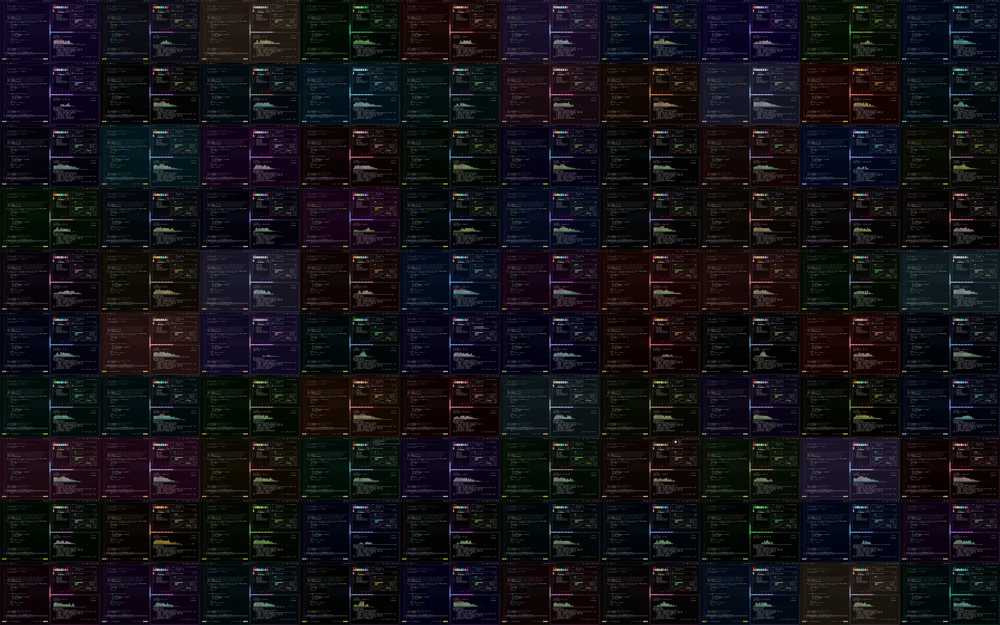](https://bjarneo.github.io/100-themes)

This repo has 100 dark themes for [Omarchy](https://omarchy.org). Each theme has a 16-color ANSI palette, a background with the Omarchy wordmark, and a background drawn for its colors.

- Gallery: [bjarneo.github.io/100-themes](https://bjarneo.github.io/100-themes)
- Promo video: [`assets/promo.mp4`](assets/promo.mp4)
- Themes: 100 folders at the root of this repo, one folder for each theme.
- Light versions: [100 day themes](https://github.com/bjarneo/100-themes-day), with the same hues on a light background.

## Install

`install.sh` copies themes into `~/.config/omarchy/themes`. Each theme becomes a normal Omarchy theme folder.

### Install one theme without a clone

The script downloads only the themes that you name:

```bash
curl -fsSL https://bjarneo.github.io/100-themes/install.sh | bash -s -- synthwave --set
```

`--set` applies the theme after the install. Name more than one theme to install more than one:

```bash
curl -fsSL https://bjarneo.github.io/100-themes/install.sh | bash -s -- synthwave hacker neon-tokyo
```

### Install from a clone

```bash
git clone --depth 1 https://github.com/bjarneo/100-themes ~/.local/share/100-themes
cd ~/.local/share/100-themes
./install.sh --all
omarchy theme set synthwave
```

The full repo is about 580 MB because it has 200 backgrounds at 6K, 6144×3456.

### Apply with Aether

[Aether](https://github.com/omacom/aether) can apply a theme straight from the [gallery](https://bjarneo.github.io/100-themes). Open a theme and select 1 of these buttons:

| Button | Result |
| --- | --- |
| Apply with Aether | Aether loads the palette and the background, then applies them at once through its own theme. This works again and again. |
| Install as Omarchy theme | Aether adds the theme to `~/.config/omarchy/themes` and activates it at once. This stops if a theme with the same name exists, for example after `install.sh`. |
| Open in editor | Aether opens the palette in its editor. Nothing changes until you select Apply. |

Apply and Install use `silent=true`, like the links on the omarchy-themes site. They run at once, without the Aether window. The links use the background that you select in the gallery. The native background is the default.

Aether stops a download after 60 seconds. On a slow connection, a 6K background can take longer, so the links download a 3840×2160 copy from `assets/aether/`. The largest copy is about 670 KB.

GitHub does not render `aether://` links, so use the gallery or build a link yourself:

```text
aether://apply?colors=https://bjarneo.github.io/100-themes/synthwave/colors.toml&wallpaper=https://bjarneo.github.io/100-themes/assets/aether/synthwave/1-sunset-grid.jpg&silent=true
```

Add `&as_omarchy_theme=synthwave` to install the theme, or `&edit=true` to open the editor. Leave out `silent=true` to see a preview in Aether first.

### Options

| Command | Result |
| --- | --- |
| `install.sh synthwave hacker` | Installs the named themes |
| `install.sh --all` | Installs all 100 themes |
| `install.sh --list` | Lists the theme names |
| `install.sh synthwave --set` | Installs the theme, then applies it |
| `install.sh --update` | Installs again every theme that the script installed |
| `install.sh --remove synthwave` | Removes a theme that the script installed |
| `install.sh --link synthwave` | Links to the clone instead of copying. Run `git pull` in the clone to update. |
| `install.sh --force sakura` | Replaces a theme with the same name that the script did not install |

The script writes a `.100-themes` marker file in each theme that it copies. `--update` and `--remove` use this file, so they never change a theme that you made.

### Name conflicts

The script does not replace a theme that it did not install. If `~/.config/omarchy/themes/sakura` exists, the script skips `sakura` and tells you. Rename your theme, or use `--force` to replace it.

`omarchy theme install <url>` does not work with this repo. That command expects one theme at the root of a repo.

## Switch themes and backgrounds

```bash
omarchy theme set neon-tokyo   # apply a theme
omarchy theme bg next          # show the next background of the current theme
omarchy theme current          # show the name of the current theme
```

Omarchy starts with the first background in alphabetical order. That is `0-omarchy-wordmark.jpg`. Run `omarchy theme bg next` to show the native background. Omarchy remembers the last background for each theme.

## What is in a theme folder

The folders use the same layout as other Omarchy Quattro themes:

```text
synthwave/
├── colors.toml                     # the palette that Omarchy reads
├── icons.theme                     # the Yaru icon theme for the accent color
├── preview.png                     # a screenshot of workspace 7 with the theme applied
└── backgrounds/
    ├── 0-omarchy-wordmark.jpg      # the Omarchy wordmark in the theme colors
    └── 1-sunset-grid.jpg           # the native background for the theme colors
```

Omarchy generates the configs for Hyprland, the terminals, Neovim, btop, VS Code and other apps from `colors.toml`. The themes do not ship app configs.

### `colors.toml`

Every theme sets all keys that Omarchy reads, so no key falls back to a derived value.

| Key | Source |
| --- | --- |
| `background`, `foreground` | The background and foreground of the palette |
| `red`, `green`, `yellow`, `blue`, `magenta`, `cyan` | ANSI colors 1 to 6 |
| `bright_red` to `bright_magenta` | ANSI colors 9 to 14 |
| `lighter_background` | ANSI color 0 |
| `muted` | ANSI color 8. Terminals use it as bright black. |
| `light_foreground` | ANSI color 7 |
| `bright_foreground` | ANSI color 15 |
| `accent` | ANSI color 5. The design uses this color for the title glow. |
| `selection` | The background mixed with 28% of the accent |
| `dark_background`, `darker_background` | The background mixed with 25% and 50% black |
| `dark_foreground` | The foreground mixed with 35% of the background |
| `orange` | The OKLCH midpoint between red and yellow |
| `brown` | Orange mixed with 50% black |
| `hyprland_active_border` | A 45° gradient from cyan to magenta |
| `hyprland_inactive_border` | `muted` at 67% opacity |

Terminals map the normal black slot to `background` and the normal white slot to `foreground`. That is how Omarchy builds every terminal theme.

## How the palettes work

The palettes come from the Neon ANSI Palette design. The design builds each palette in the OKLCH color space from 5 values:

- The hue, lightness and chroma of the background.
- 6 hues for red, green, yellow, blue, magenta and cyan.
- 1 chroma value for the 6 colors.
- 1 of 4 lightness sets: neon, pastel, mono or soft.

The bright colors use the same hues with 0.1 more lightness and less chroma. A seeded random offset of up to 4° moves each hue, so two palettes with the same hues are not identical. Colors outside sRGB lose chroma until they fit.

`tools/palettes.mjs` has the same table and the same math as the design. Neon Wave is the one palette with fixed hex values.

## Backgrounds

Each theme has 2 backgrounds at 6K, 6144×3456. The important content stays near the center, so the images also fill 16:10 and 21:9 screens.

- `0-omarchy-wordmark.jpg` shows the Omarchy wordmark with a cyan to magenta gradient from the palette. The 6 normal and 6 bright ANSI colors are below it.
- `1-<motif>.jpg` is drawn only with colors from the palette. The motif fits the theme name.

| Motif | Themes |
| --- | --- |
| sunset grid | [Synthwave](#synthwave), [Neon Wave](#neon-wave), [Vaporwave](#vaporwave), [Outrun](#outrun), [Retrowave](#retrowave), [Dusk](#dusk), [Miami Night](#miami-night), [Racing](#racing) |
| code rain | [Hacker](#hacker), [Stealth](#stealth), [Mainframe](#mainframe), [Terminal Green](#terminal-green), [Terminal Blue](#terminal-blue) |
| nebula | [Ultraviolet](#ultraviolet), [Midnight](#midnight), [Nebula](#nebula), [Galaxy](#galaxy), [Supernova](#supernova), [Deep Space](#deep-space) |
| aurora | [Glacier](#glacier), [Chillwave](#chillwave), [Shoegaze](#shoegaze), [Ambient](#ambient), [Dawn](#dawn), [Aurora](#aurora), [Tundra](#tundra) |
| skyline | [Cyberpunk](#cyberpunk), [Noir Rain](#noir-rain), [Grime](#grime), [Industrial](#industrial), [Neon Tokyo](#neon-tokyo), [Neon Vegas](#neon-vegas), [Hong Kong Rain](#hong-kong-rain) |
| equalizer | [Phonk](#phonk), [Drum & Bass](#drum--bass), [Dubstep](#dubstep), [Techno](#techno), [House](#house), [Acid House](#acid-house), [Trap](#trap), [Punk](#punk), [Metal](#metal) |
| waveform | [Lofi](#lofi), [Darkwave](#darkwave), [Trance](#trance), [Goth](#goth), [Grunge](#grunge), [Jazz Club](#jazz-club), [Blues](#blues), [Funk](#funk), [Soul](#soul), [Reggae](#reggae) |
| light spots | [Sakura](#sakura), [Dreampop](#dreampop), [Candy](#candy), [Bubblegum](#bubblegum), [Lemonade](#lemonade), [Mint](#mint), [Grape](#grape), [Watermelon](#watermelon), [Espresso](#espresso), [Matcha](#matcha), [Cotton Candy](#cotton-candy), [Polaroid](#polaroid) |
| deep water | [Abyss](#abyss), [Tropical](#tropical), [Bioluminescent](#bioluminescent), [Lagoon](#lagoon), [Coral Reef](#coral-reef), [Jellyfish](#jellyfish) |
| embers | [Ember](#ember), [Solar Flare](#solar-flare), [Desert](#desert), [Volcano](#volcano), [Hazard](#hazard) |
| pixel art | [Arcade](#arcade), [Chiptune](#chiptune), [8-Bit](#8-bit), [Arcade Carpet](#arcade-carpet), [Pinball](#pinball) |
| VHS | [Amber CRT](#amber-crt), [Glitchcore](#glitchcore), [VHS](#vhs), [Cathode](#cathode) |
| contours | [Toxic](#toxic), [Jungle](#jungle), [Rainforest](#rainforest), [Swamp](#swamp), [Mushroom](#mushroom), [Firefly](#firefly), [Poison](#poison), [Radioactive](#radioactive) |
| neon tubes | [Hyperpop](#hyperpop), [Disco](#disco), [Plasma Arc](#plasma-arc), [Laser Tag](#laser-tag), [Berlin Club](#berlin-club) |
| planet | [Black Hole](#black-hole), [Mars](#mars), [Blood Moon](#blood-moon) |

## Regenerate the themes

The `tools/` folder has every script that made this repo. You need Node.js 22 or later, `chromium`, `magick` and `ffmpeg`.

| Command | Result |
| --- | --- |
| `node tools/build.mjs` | Writes `colors.toml`, `icons.theme` and `assets/themes.js` |
| `node tools/render.mjs [theme...]` | Renders the backgrounds at 6144×3456 with headless Chromium. Set `SIZE=3840x2160` for another 16:9 size. |
| `node tools/aether.mjs` | Writes the 3840×2160 copies in `assets/aether` that the Aether links download |
| `tools/capture.sh [theme...]` | Applies each theme, takes a screenshot of workspace 7, and writes `preview.png` |
| `node tools/promo.mjs <song.mp3>` | Renders `assets/promo.mp4` with one theme per beat |
| `node tools/readme.mjs` | Writes this README |

`tools/capture.sh` changes your desktop while it runs. It switches to workspace 7 and applies each theme. When it stops, it applies your original theme again and removes the links that it added. If another workspace becomes active, the script stops before it takes a screenshot.

To change a palette, edit the table in `tools/palettes.mjs`. Then run the commands in the order of the table.

## All themes

| | | | | |
| --- | --- | --- | --- | --- |
| 001 [Synthwave](#synthwave) | 002 [Neon Wave](#neon-wave) | 003 [Lofi](#lofi) | 004 [Hacker](#hacker) | 005 [Ember](#ember) |
| 006 [Vaporwave](#vaporwave) | 007 [Cyberpunk](#cyberpunk) | 008 [Outrun](#outrun) | 009 [Toxic](#toxic) | 010 [Abyss](#abyss) |
| 011 [Ultraviolet](#ultraviolet) | 012 [Arcade](#arcade) | 013 [Noir Rain](#noir-rain) | 014 [Glacier](#glacier) | 015 [Tropical](#tropical) |
| 016 [Sakura](#sakura) | 017 [Amber CRT](#amber-crt) | 018 [Dreampop](#dreampop) | 019 [Solar Flare](#solar-flare) | 020 [Bioluminescent](#bioluminescent) |
| 021 [Darkwave](#darkwave) | 022 [Chillwave](#chillwave) | 023 [Retrowave](#retrowave) | 024 [Phonk](#phonk) | 025 [Drum & Bass](#drum--bass) |
| 026 [Dubstep](#dubstep) | 027 [Techno](#techno) | 028 [House](#house) | 029 [Trance](#trance) | 030 [Acid House](#acid-house) |
| 031 [Jungle](#jungle) | 032 [Grime](#grime) | 033 [Trap](#trap) | 034 [Hyperpop](#hyperpop) | 035 [Glitchcore](#glitchcore) |
| 036 [Chiptune](#chiptune) | 037 [8-Bit](#8-bit) | 038 [Industrial](#industrial) | 039 [Punk](#punk) | 040 [Metal](#metal) |
| 041 [Goth](#goth) | 042 [Grunge](#grunge) | 043 [Shoegaze](#shoegaze) | 044 [Jazz Club](#jazz-club) | 045 [Blues](#blues) |
| 046 [Disco](#disco) | 047 [Funk](#funk) | 048 [Soul](#soul) | 049 [Reggae](#reggae) | 050 [Ambient](#ambient) |
| 051 [Midnight](#midnight) | 052 [Dawn](#dawn) | 053 [Dusk](#dusk) | 054 [Aurora](#aurora) | 055 [Nebula](#nebula) |
| 056 [Galaxy](#galaxy) | 057 [Supernova](#supernova) | 058 [Black Hole](#black-hole) | 059 [Mars](#mars) | 060 [Deep Space](#deep-space) |
| 061 [Lagoon](#lagoon) | 062 [Coral Reef](#coral-reef) | 063 [Rainforest](#rainforest) | 064 [Desert](#desert) | 065 [Volcano](#volcano) |
| 066 [Tundra](#tundra) | 067 [Swamp](#swamp) | 068 [Mushroom](#mushroom) | 069 [Firefly](#firefly) | 070 [Jellyfish](#jellyfish) |
| 071 [Candy](#candy) | 072 [Bubblegum](#bubblegum) | 073 [Lemonade](#lemonade) | 074 [Mint](#mint) | 075 [Grape](#grape) |
| 076 [Watermelon](#watermelon) | 077 [Espresso](#espresso) | 078 [Matcha](#matcha) | 079 [Cotton Candy](#cotton-candy) | 080 [Blood Moon](#blood-moon) |
| 081 [Poison](#poison) | 082 [Hazard](#hazard) | 083 [Radioactive](#radioactive) | 084 [Plasma Arc](#plasma-arc) | 085 [Laser Tag](#laser-tag) |
| 086 [Stealth](#stealth) | 087 [Mainframe](#mainframe) | 088 [Terminal Green](#terminal-green) | 089 [Terminal Blue](#terminal-blue) | 090 [Neon Tokyo](#neon-tokyo) |
| 091 [Neon Vegas](#neon-vegas) | 092 [Miami Night](#miami-night) | 093 [Hong Kong Rain](#hong-kong-rain) | 094 [Berlin Club](#berlin-club) | 095 [Arcade Carpet](#arcade-carpet) |
| 096 [Pinball](#pinball) | 097 [Racing](#racing) | 098 [VHS](#vhs) | 099 [Polaroid](#polaroid) | 100 [Cathode](#cathode) |

### Synthwave

[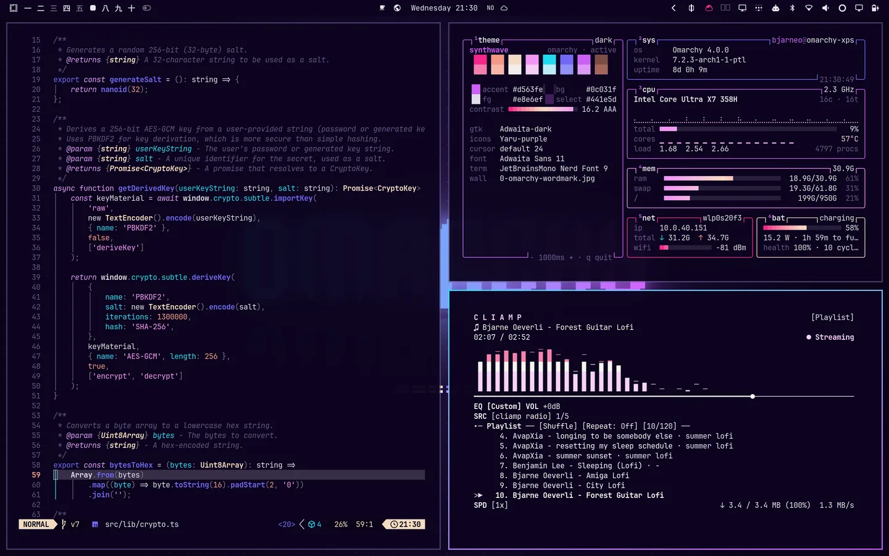](synthwave/preview.png)

`001` · Folder: [`synthwave/`](synthwave/) · [Open in the gallery](https://bjarneo.github.io/100-themes/#synthwave)

Synthwave has a dark violet background and a violet accent. The ANSI colors are saturated and bright. The native background shows a neon sun over a perspective grid.

| Key | Value |
| --- | --- |
| `background` | `#0c031f` |
| `foreground` | `#e8e6ef` |
| `accent` | `#d563fe` |
| `selection` | `#441e5d` |
| Icon theme | `Yaru-purple` |
| Backgrounds | [`0-omarchy-wordmark.jpg`](synthwave/backgrounds/0-omarchy-wordmark.jpg), [`1-sunset-grid.jpg`](synthwave/backgrounds/1-sunset-grid.jpg) |

<details>
<summary>All 16 ANSI colors</summary>

| # | Normal | # | Bright |
| --- | --- | --- | --- |
| 0 black | `#190f2e` | 8 bright black | `#665a8c` |
| 1 red | `#fe288f` | 9 bright red | `#fe83af` |
| 2 green | `#fc9afe` | 10 bright green | `#fed5fe` |
| 3 yellow | `#fde3c9` | 11 bright yellow | `#fdf7f2` |
| 4 blue | `#766dff` | 12 bright blue | `#9698fd` |
| 5 magenta | `#d563fe` | 13 bright magenta | `#e39efe` |
| 6 cyan | `#21e4f8` | 14 bright cyan | `#c1f6fe` |
| 7 white | `#cbc9d4` | 15 bright white | `#faf9fd` |

</details>

```bash
curl -fsSL https://bjarneo.github.io/100-themes/install.sh | bash -s -- synthwave --set
```

### Neon Wave

[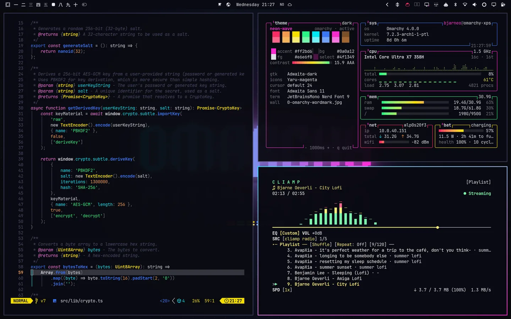](neon-wave/preview.png)

`002` · Folder: [`neon-wave/`](neon-wave/) · [Open in the gallery](https://bjarneo.github.io/100-themes/#neon-wave)

Neon Wave has a dark indigo background and a magenta accent. The ANSI colors use very high chroma for a strong neon look. The native background shows a neon sun over a perspective grid.

| Key | Value |
| --- | --- |
| `background` | `#0a0a12` |
| `foreground` | `#e6e6f0` |
| `accent` | `#ff2bd6` |
| `selection` | `#4f1349` |
| Icon theme | `Yaru-magenta` |
| Backgrounds | [`0-omarchy-wordmark.jpg`](neon-wave/backgrounds/0-omarchy-wordmark.jpg), [`1-sunset-grid.jpg`](neon-wave/backgrounds/1-sunset-grid.jpg) |

<details>
<summary>All 16 ANSI colors</summary>

| # | Normal | # | Bright |
| --- | --- | --- | --- |
| 0 black | `#12121c` | 8 bright black | `#4f4f70` |
| 1 red | `#ff2e63` | 9 bright red | `#ff6b8f` |
| 2 green | `#2bff88` | 10 bright green | `#7dffb0` |
| 3 yellow | `#ffe600` | 11 bright yellow | `#fff27a` |
| 4 blue | `#3d7bff` | 12 bright blue | `#7aa8ff` |
| 5 magenta | `#ff2bd6` | 13 bright magenta | `#ff7ae6` |
| 6 cyan | `#00f0ff` | 14 bright cyan | `#7af7ff` |
| 7 white | `#c8c8d8` | 15 bright white | `#ffffff` |

</details>

```bash
curl -fsSL https://bjarneo.github.io/100-themes/install.sh | bash -s -- neon-wave --set
```

### Lofi

[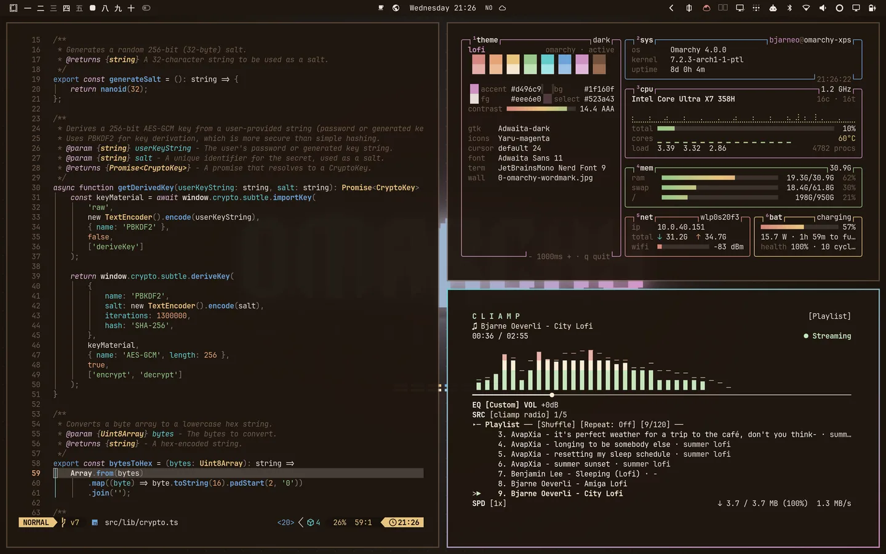](lofi/preview.png)

`003` · Folder: [`lofi/`](lofi/) · [Open in the gallery](https://bjarneo.github.io/100-themes/#lofi)

Lofi has a dark brown background and a magenta accent. The ANSI colors use low chroma for a soft, muted look. The native background shows layered sound wave ribbons.

| Key | Value |
| --- | --- |
| `background` | `#1f160f` |
| `foreground` | `#eee6e0` |
| `accent` | `#d496c9` |
| `selection` | `#523a43` |
| Icon theme | `Yaru-magenta` |
| Backgrounds | [`0-omarchy-wordmark.jpg`](lofi/backgrounds/0-omarchy-wordmark.jpg), [`1-waveform.jpg`](lofi/backgrounds/1-waveform.jpg) |

<details>
<summary>All 16 ANSI colors</summary>

| # | Normal | # | Bright |
| --- | --- | --- | --- |
| 0 black | `#2e241d` | 8 bright black | `#755e4c` |
| 1 red | `#dc8c82` | 9 bright red | `#ecb4ad` |
| 2 green | `#9dce8f` | 10 bright green | `#c9e9bf` |
| 3 yellow | `#f2cb83` | 11 bright yellow | `#fef0d7` |
| 4 blue | `#72aae1` | 12 bright blue | `#a3c8ee` |
| 5 magenta | `#d496c9` | 13 bright magenta | `#e9bee1` |
| 6 cyan | `#65d2d4` | 14 bright cyan | `#aaeced` |
| 7 white | `#d2c8c1` | 15 bright white | `#fdf9f7` |

</details>

```bash
curl -fsSL https://bjarneo.github.io/100-themes/install.sh | bash -s -- lofi --set
```

### Hacker

[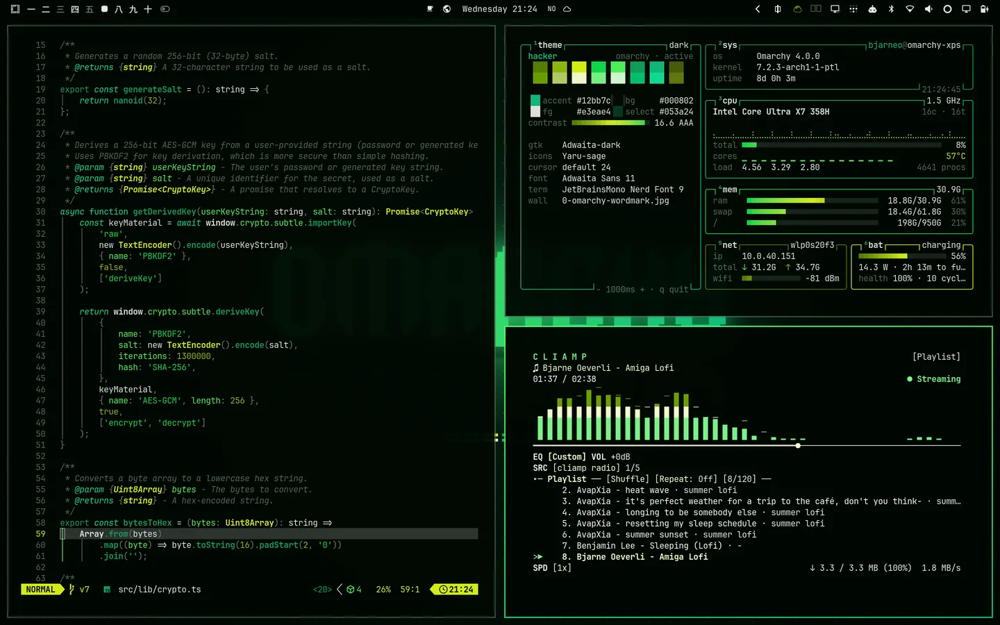](hacker/preview.png)

`004` · Folder: [`hacker/`](hacker/) · [Open in the gallery](https://bjarneo.github.io/100-themes/#hacker)

Hacker has a dark green background and a green accent. The 6 ANSI hues stay close to green, so the palette reads as one color. The native background shows columns of falling code glyphs.

| Key | Value |
| --- | --- |
| `background` | `#000802` |
| `foreground` | `#e3eae4` |
| `accent` | `#12bb7c` |
| `selection` | `#053a24` |
| Icon theme | `Yaru-sage` |
| Backgrounds | [`0-omarchy-wordmark.jpg`](hacker/backgrounds/0-omarchy-wordmark.jpg), [`1-code-rain.jpg`](hacker/backgrounds/1-code-rain.jpg) |

<details>
<summary>All 16 ANSI colors</summary>

| # | Normal | # | Bright |
| --- | --- | --- | --- |
| 0 black | `#07150a` | 8 bright black | `#4f6c54` |
| 1 red | `#568104` | 9 bright red | `#6da200` |
| 2 green | `#11dc4b` | 10 bright green | `#7af888` |
| 3 yellow | `#dbf515` | 11 bright yellow | `#f5ffcf` |
| 4 blue | `#12a05c` | 12 bright blue | `#03c470` |
| 5 magenta | `#12bb7c` | 13 bright magenta | `#11e095` |
| 6 cyan | `#51f75b` | 14 bright cyan | `#d7ffd5` |
| 7 white | `#c4cdc5` | 15 bright white | `#f8fbf8` |

</details>

```bash
curl -fsSL https://bjarneo.github.io/100-themes/install.sh | bash -s -- hacker --set
```

### Ember

[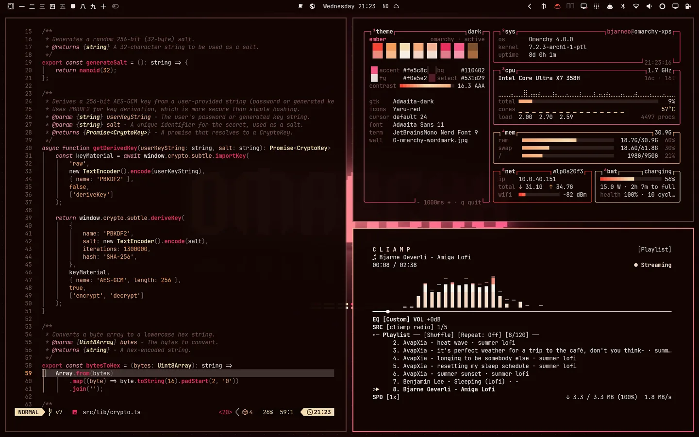](ember/preview.png)

`005` · Folder: [`ember/`](ember/) · [Open in the gallery](https://bjarneo.github.io/100-themes/#ember)

Ember has a dark red background and a pink accent. The ANSI colors are saturated and bright. The native background shows embers that rise over dunes.

| Key | Value |
| --- | --- |
| `background` | `#110402` |
| `foreground` | `#f0e5e2` |
| `accent` | `#fe5c8c` |
| `selection` | `#531d29` |
| Icon theme | `Yaru-red` |
| Backgrounds | [`0-omarchy-wordmark.jpg`](ember/backgrounds/0-omarchy-wordmark.jpg), [`1-embers.jpg`](ember/backgrounds/1-embers.jpg) |

<details>
<summary>All 16 ANSI colors</summary>

| # | Normal | # | Bright |
| --- | --- | --- | --- |
| 0 black | `#1f0f0a` | 8 bright black | `#7d5950` |
| 1 red | `#fc4735` | 9 bright red | `#f59282` |
| 2 green | `#ffaf7c` | 10 bright green | `#fddecb` |
| 3 yellow | `#fee5b7` | 11 bright yellow | `#fff8eb` |
| 4 blue | `#ec3060` | 12 bright blue | `#e6838f` |
| 5 magenta | `#fe5c8c` | 13 bright magenta | `#fe9db2` |
| 6 cyan | `#fdb89a` | 14 bright cyan | `#fce6dc` |
| 7 white | `#d4c7c4` | 15 bright white | `#fdf9f8` |

</details>

```bash
curl -fsSL https://bjarneo.github.io/100-themes/install.sh | bash -s -- ember --set
```

### Vaporwave

[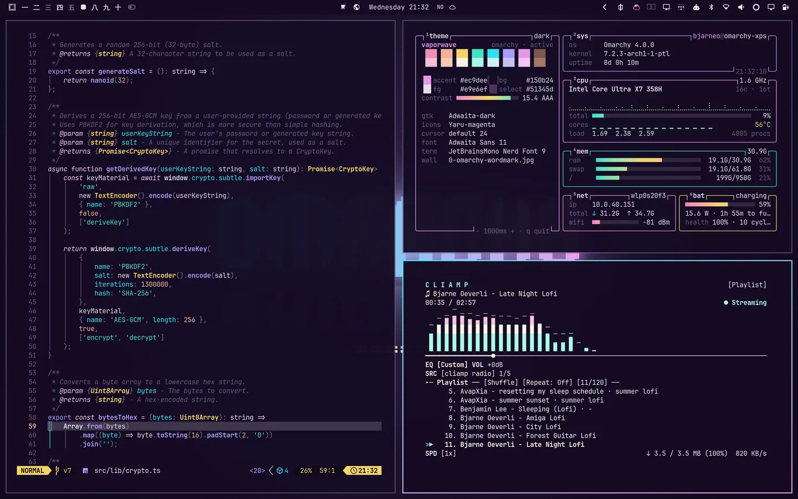](vaporwave/preview.png)

`006` · Folder: [`vaporwave/`](vaporwave/) · [Open in the gallery](https://bjarneo.github.io/100-themes/#vaporwave)

Vaporwave has a dark violet background and a magenta accent. The ANSI colors are light pastels with high lightness and low chroma. The native background shows a neon sun over a perspective grid.

| Key | Value |
| --- | --- |
| `background` | `#150b24` |
| `foreground` | `#e9e6ef` |
| `accent` | `#ec9dee` |
| `selection` | `#51345d` |
| Icon theme | `Yaru-magenta` |
| Backgrounds | [`0-omarchy-wordmark.jpg`](vaporwave/backgrounds/0-omarchy-wordmark.jpg), [`1-sunset-grid.jpg`](vaporwave/backgrounds/1-sunset-grid.jpg) |

<details>
<summary>All 16 ANSI colors</summary>

| # | Normal | # | Bright |
| --- | --- | --- | --- |
| 0 black | `#231933` | 8 bright black | `#695a85` |
| 1 red | `#fb90bf` | 9 bright red | `#fec5dc` |
| 2 green | `#44e8c8` | 10 bright green | `#acffea` |
| 3 yellow | `#fedc67` | 11 bright yellow | `#fef8e6` |
| 4 blue | `#aea3ff` | 12 bright blue | `#cecafd` |
| 5 magenta | `#ec9dee` | 13 bright magenta | `#fecafe` |
| 6 cyan | `#2debf9` | 14 bright cyan | `#d3fafe` |
| 7 white | `#ccc8d3` | 15 bright white | `#faf9fd` |

</details>

```bash
curl -fsSL https://bjarneo.github.io/100-themes/install.sh | bash -s -- vaporwave --set
```

### Cyberpunk

[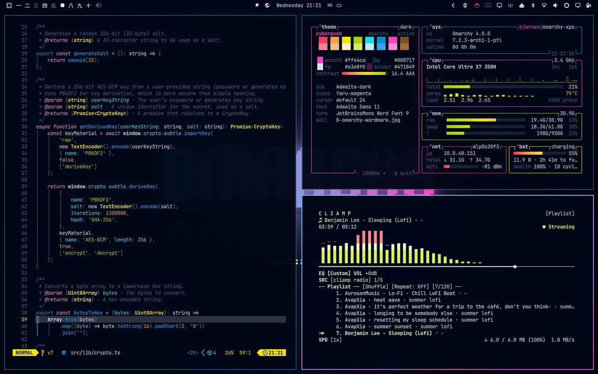](cyberpunk/preview.png)

`007` · Folder: [`cyberpunk/`](cyberpunk/) · [Open in the gallery](https://bjarneo.github.io/100-themes/#cyberpunk)

Cyberpunk has a dark blue background and a magenta accent. The ANSI colors use very high chroma for a strong neon look. The native background shows a city skyline at night in the rain.

| Key | Value |
| --- | --- |
| `background` | `#000717` |
| `foreground` | `#e3e8f0` |
| `accent` | `#ff44ca` |
| `selection` | `#471849` |
| Icon theme | `Yaru-magenta` |
| Backgrounds | [`0-omarchy-wordmark.jpg`](cyberpunk/backgrounds/0-omarchy-wordmark.jpg), [`1-skyline.jpg`](cyberpunk/backgrounds/1-skyline.jpg) |

<details>
<summary>All 16 ANSI colors</summary>

| # | Normal | # | Bright |
| --- | --- | --- | --- |
| 0 black | `#071425` | 8 bright black | `#4c6585` |
| 1 red | `#ff3965` | 9 bright red | `#fe8895` |
| 2 green | `#b1d60f` | 10 bright green | `#d4f56b` |
| 3 yellow | `#feed0d` | 11 bright yellow | `#fffbca` |
| 4 blue | `#118ed5` | 12 bright blue | `#2eaeff` |
| 5 magenta | `#ff44ca` | 13 bright magenta | `#fe95d9` |
| 6 cyan | `#1fe4f6` | 14 bright cyan | `#bef7fe` |
| 7 white | `#c4cbd4` | 15 bright white | `#f8fafd` |

</details>

```bash
curl -fsSL https://bjarneo.github.io/100-themes/install.sh | bash -s -- cyberpunk --set
```

### Outrun

[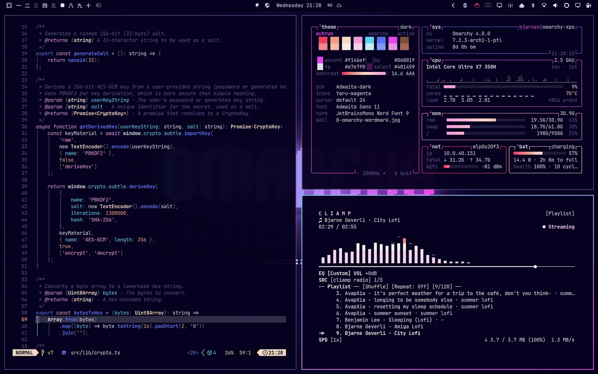](outrun/preview.png)

`008` · Folder: [`outrun/`](outrun/) · [Open in the gallery](https://bjarneo.github.io/100-themes/#outrun)

Outrun has a dark indigo background and a magenta accent. The ANSI colors use very high chroma for a strong neon look. The native background shows a neon sun over a perspective grid.

| Key | Value |
| --- | --- |
| `background` | `#06001f` |
| `foreground` | `#e7e7f0` |
| `accent` | `#f146ef` |
| `selection` | `#481459` |
| Icon theme | `Yaru-magenta` |
| Backgrounds | [`0-omarchy-wordmark.jpg`](outrun/backgrounds/0-omarchy-wordmark.jpg), [`1-sunset-grid.jpg`](outrun/backgrounds/1-sunset-grid.jpg) |

<details>
<summary>All 16 ANSI colors</summary>

| # | Normal | # | Bright |
| --- | --- | --- | --- |
| 0 black | `#100a2e` | 8 bright black | `#5e5b94` |
| 1 red | `#fd3e61` | 9 bright red | `#fd8992` |
| 2 green | `#ffa0de` | 10 bright green | `#fdd8ef` |
| 3 yellow | `#ffe2ca` | 11 bright yellow | `#fef7f1` |
| 4 blue | `#5e75ff` | 12 bright blue | `#869dfc` |
| 5 magenta | `#f146ef` | 13 bright magenta | `#f299ee` |
| 6 cyan | `#5eddfe` | 14 bright cyan | `#cef3fd` |
| 7 white | `#c9c9d4` | 15 bright white | `#fafafd` |

</details>

```bash
curl -fsSL https://bjarneo.github.io/100-themes/install.sh | bash -s -- outrun --set
```

### Toxic

[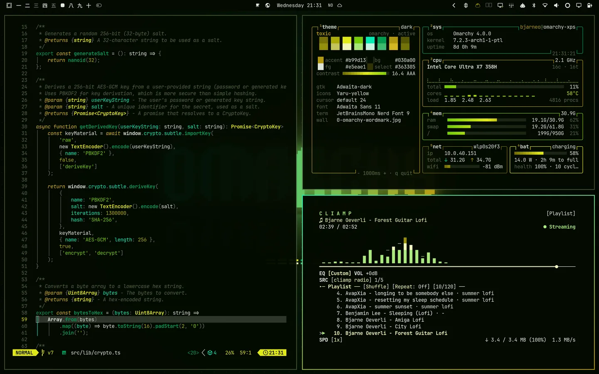](toxic/preview.png)

`009` · Folder: [`toxic/`](toxic/) · [Open in the gallery](https://bjarneo.github.io/100-themes/#toxic)

Toxic has a dark olive green background and a yellow accent. The ANSI colors are saturated and bright. The native background shows a topographic contour map.

| Key | Value |
| --- | --- |
| `background` | `#030a00` |
| `foreground` | `#e5eae1` |
| `accent` | `#b99d13` |
| `selection` | `#363305` |
| Icon theme | `Yaru-yellow` |
| Backgrounds | [`0-omarchy-wordmark.jpg`](toxic/backgrounds/0-omarchy-wordmark.jpg), [`1-contours.jpg`](toxic/backgrounds/1-contours.jpg) |

<details>
<summary>All 16 ANSI colors</summary>

| # | Normal | # | Bright |
| --- | --- | --- | --- |
| 0 black | `#0e1704` | 8 bright black | `#586a46` |
| 1 red | `#7b7508` | 9 bright red | `#9a930b` |
| 2 green | `#79d30b` | 10 bright green | `#adee7f` |
| 3 yellow | `#e8f11c` | 11 bright yellow | `#f9ffbf` |
| 4 blue | `#02a054` | 12 bright blue | `#44c073` |
| 5 magenta | `#b99d13` | 13 bright magenta | `#ddbc24` |
| 6 cyan | `#06f4b9` | 14 bright cyan | `#ceffea` |
| 7 white | `#c7cdc3` | 15 bright white | `#f9fbf7` |

</details>

```bash
curl -fsSL https://bjarneo.github.io/100-themes/install.sh | bash -s -- toxic --set
```

### Abyss

[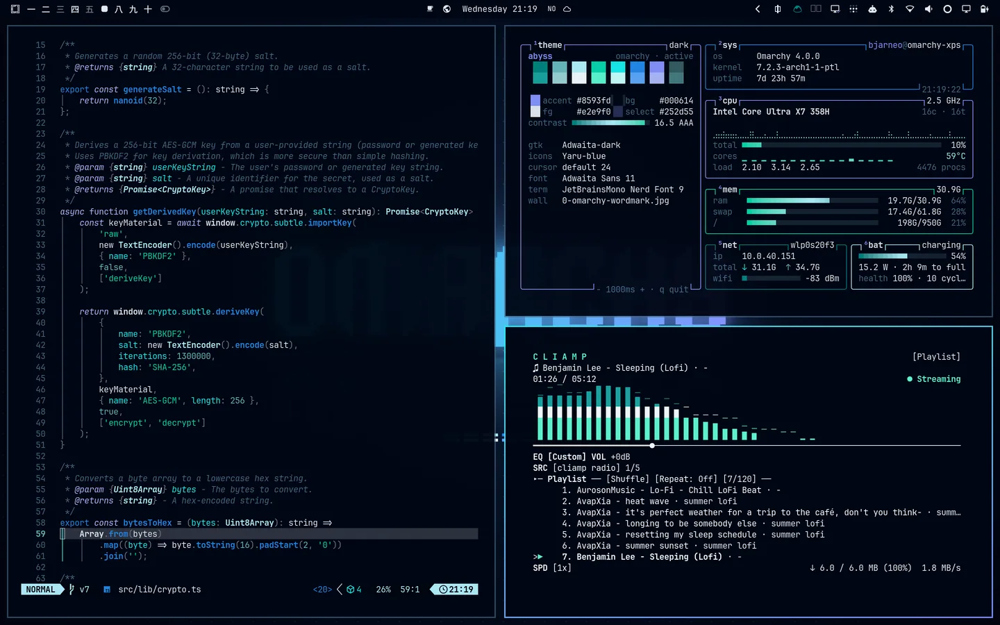](abyss/preview.png)

`010` · Folder: [`abyss/`](abyss/) · [Open in the gallery](https://bjarneo.github.io/100-themes/#abyss)

Abyss has a dark blue background and a indigo accent. The ANSI colors use medium chroma for a calmer look. The native background shows light rays in deep water.

| Key | Value |
| --- | --- |
| `background` | `#000614` |
| `foreground` | `#e2e9f0` |
| `accent` | `#8593fd` |
| `selection` | `#252d55` |
| Icon theme | `Yaru-blue` |
| Backgrounds | [`0-omarchy-wordmark.jpg`](abyss/backgrounds/0-omarchy-wordmark.jpg), [`1-depths.jpg`](abyss/backgrounds/1-depths.jpg) |

<details>
<summary>All 16 ANSI colors</summary>

| # | Normal | # | Bright |
| --- | --- | --- | --- |
| 0 black | `#021322` | 8 bright black | `#456783` |
| 1 red | `#008380` | 9 bright red | `#1aa3a0` |
| 2 green | `#05d6ad` | 10 bright green | `#5cf6ce` |
| 3 yellow | `#b2f1fe` | 11 bright yellow | `#f0fbfd` |
| 4 blue | `#2288e8` | 12 bright blue | `#5da8fa` |
| 5 magenta | `#8593fd` | 13 bright magenta | `#acb9fc` |
| 6 cyan | `#17eeec` | 14 bright cyan | `#c6fffd` |
| 7 white | `#c3ccd4` | 15 bright white | `#f7fafd` |

</details>

```bash
curl -fsSL https://bjarneo.github.io/100-themes/install.sh | bash -s -- abyss --set
```

### Ultraviolet

[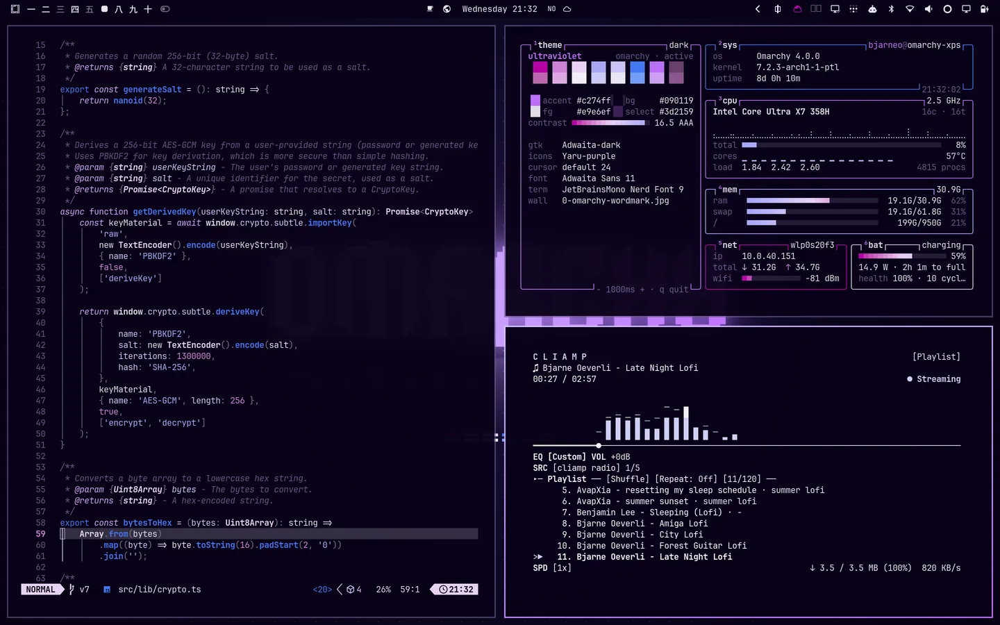](ultraviolet/preview.png)

`011` · Folder: [`ultraviolet/`](ultraviolet/) · [Open in the gallery](https://bjarneo.github.io/100-themes/#ultraviolet)

Ultraviolet has a dark violet background and a violet accent. The ANSI colors are saturated and bright. The native background shows a nebula in a star field.

| Key | Value |
| --- | --- |
| `background` | `#090119` |
| `foreground` | `#e9e6ef` |
| `accent` | `#c274ff` |
| `selection` | `#3d2159` |
| Icon theme | `Yaru-purple` |
| Backgrounds | [`0-omarchy-wordmark.jpg`](ultraviolet/backgrounds/0-omarchy-wordmark.jpg), [`1-nebula.jpg`](ultraviolet/backgrounds/1-nebula.jpg) |

<details>
<summary>All 16 ANSI colors</summary>

| # | Normal | # | Bright |
| --- | --- | --- | --- |
| 0 black | `#160928` | 8 bright black | `#6a588a` |
| 1 red | `#bd02aa` | 9 bright red | `#c26bb3` |
| 2 green | `#adaeff` | 10 bright green | `#d1d3fe` |
| 3 yellow | `#f2daff` | 11 bright yellow | `#fcf6ff` |
| 4 blue | `#467cfd` | 12 bright blue | `#77a2fe` |
| 5 magenta | `#c274ff` | 13 bright magenta | `#d4a7fd` |
| 6 cyan | `#d2c9ff` | 14 bright cyan | `#f2f0fd` |
| 7 white | `#ccc8d3` | 15 bright white | `#faf9fd` |

</details>

```bash
curl -fsSL https://bjarneo.github.io/100-themes/install.sh | bash -s -- ultraviolet --set
```

### Arcade

[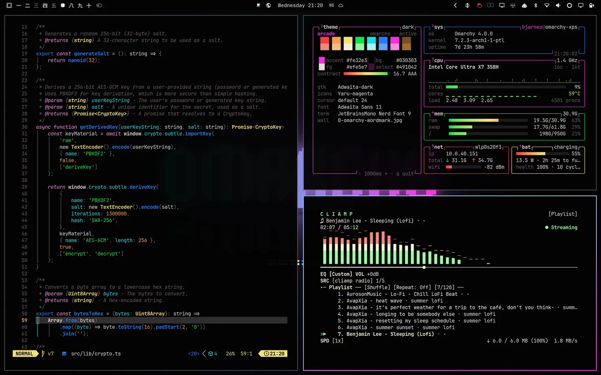](arcade/preview.png)

`012` · Folder: [`arcade/`](arcade/) · [Open in the gallery](https://bjarneo.github.io/100-themes/#arcade)

Arcade has a neutral black background and a magenta accent. The ANSI colors use very high chroma for a strong neon look. The native background shows a pixel art landscape at night.

| Key | Value |
| --- | --- |
| `background` | `#030303` |
| `foreground` | `#efe5e7` |
| `accent` | `#fe32e3` |
| `selection` | `#491042` |
| Icon theme | `Yaru-magenta` |
| Backgrounds | [`0-omarchy-wordmark.jpg`](arcade/backgrounds/0-omarchy-wordmark.jpg), [`1-pixels.jpg`](arcade/backgrounds/1-pixels.jpg) |

<details>
<summary>All 16 ANSI colors</summary>

| # | Normal | # | Bright |
| --- | --- | --- | --- |
| 0 black | `#0d0d0d` | 8 bright black | `#6e5f63` |
| 1 red | `#fe423d` | 9 bright red | `#fd8c80` |
| 2 green | `#14eb4d` | 10 bright green | `#a1ffa7` |
| 3 yellow | `#ffe97e` | 11 bright yellow | `#fff9dc` |
| 4 blue | `#2581fe` | 12 bright blue | `#6aa5fd` |
| 5 magenta | `#fe32e3` | 13 bright magenta | `#fe91e9` |
| 6 cyan | `#1be5ee` | 14 bright cyan | `#b0fbff` |
| 7 white | `#d3c7ca` | 15 bright white | `#fdf9fa` |

</details>

```bash
curl -fsSL https://bjarneo.github.io/100-themes/install.sh | bash -s -- arcade --set
```

### Noir Rain

[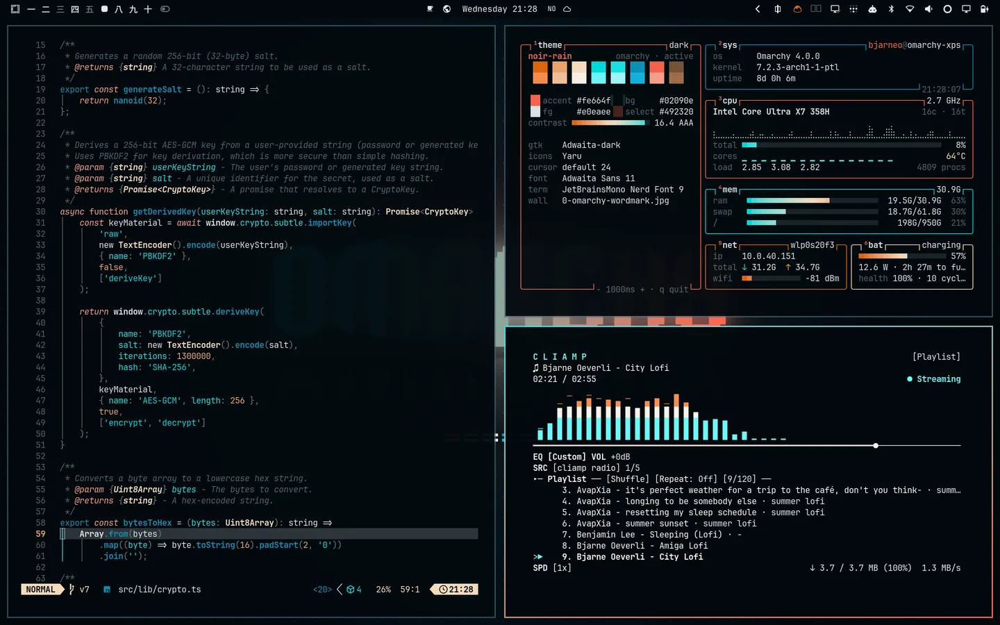](noir-rain/preview.png)

`013` · Folder: [`noir-rain/`](noir-rain/) · [Open in the gallery](https://bjarneo.github.io/100-themes/#noir-rain)

Noir Rain has a dark blue background and a red accent. The ANSI colors are saturated and bright. The native background shows a city skyline at night in the rain.

| Key | Value |
| --- | --- |
| `background` | `#02090e` |
| `foreground` | `#e0eaee` |
| `accent` | `#fe664f` |
| `selection` | `#492320` |
| Icon theme | `Yaru` |
| Backgrounds | [`0-omarchy-wordmark.jpg`](noir-rain/backgrounds/0-omarchy-wordmark.jpg), [`1-skyline.jpg`](noir-rain/backgrounds/1-skyline.jpg) |

<details>
<summary>All 16 ANSI colors</summary>

| # | Normal | # | Bright |
| --- | --- | --- | --- |
| 0 black | `#0a161b` | 8 bright black | `#4c6876` |
| 1 red | `#e4690e` | 9 bright red | `#fe9052` |
| 2 green | `#00e0e1` | 10 bright green | `#6efeff` |
| 3 yellow | `#fee3c4` | 11 bright yellow | `#fff7ef` |
| 4 blue | `#0f94ba` | 12 bright blue | `#15b5e3` |
| 5 magenta | `#fe664f` | 13 bright magenta | `#fea290` |
| 6 cyan | `#1ce6ea` | 14 bright cyan | `#a6fdfe` |
| 7 white | `#c1cdd3` | 15 bright white | `#f7fbfd` |

</details>

```bash
curl -fsSL https://bjarneo.github.io/100-themes/install.sh | bash -s -- noir-rain --set
```

### Glacier

[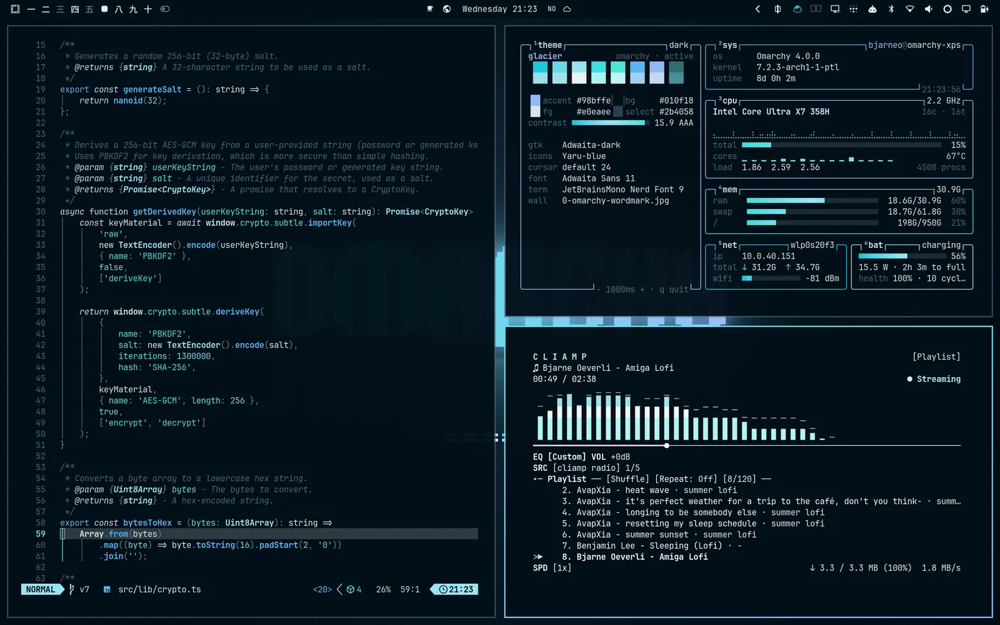](glacier/preview.png)

`014` · Folder: [`glacier/`](glacier/) · [Open in the gallery](https://bjarneo.github.io/100-themes/#glacier)

Glacier has a dark blue background and a blue accent. The ANSI colors are light pastels with high lightness and low chroma. The native background shows an aurora over a mountain lake.

| Key | Value |
| --- | --- |
| `background` | `#010f18` |
| `foreground` | `#e0eaee` |
| `accent` | `#98bffe` |
| `selection` | `#2b4058` |
| Icon theme | `Yaru-blue` |
| Backgrounds | [`0-omarchy-wordmark.jpg`](glacier/backgrounds/0-omarchy-wordmark.jpg), [`1-aurora.jpg`](glacier/backgrounds/1-aurora.jpg) |

<details>
<summary>All 16 ANSI colors</summary>

| # | Normal | # | Bright |
| --- | --- | --- | --- |
| 0 black | `#0a1d26` | 8 bright black | `#45697a` |
| 1 red | `#1ecee2` | 9 bright red | `#9fe5f0` |
| 2 green | `#41e5e3` | 10 bright green | `#b2fbf9` |
| 3 yellow | `#9eedfd` | 11 bright yellow | `#f0fbfd` |
| 4 blue | `#57bcfa` | 12 bright blue | `#a6d8fc` |
| 5 magenta | `#98bffe` | 13 bright magenta | `#ccdffe` |
| 6 cyan | `#50ece0` | 14 bright cyan | `#c7fff8` |
| 7 white | `#c1cdd3` | 15 bright white | `#f7fbfd` |

</details>

```bash
curl -fsSL https://bjarneo.github.io/100-themes/install.sh | bash -s -- glacier --set
```

### Tropical

[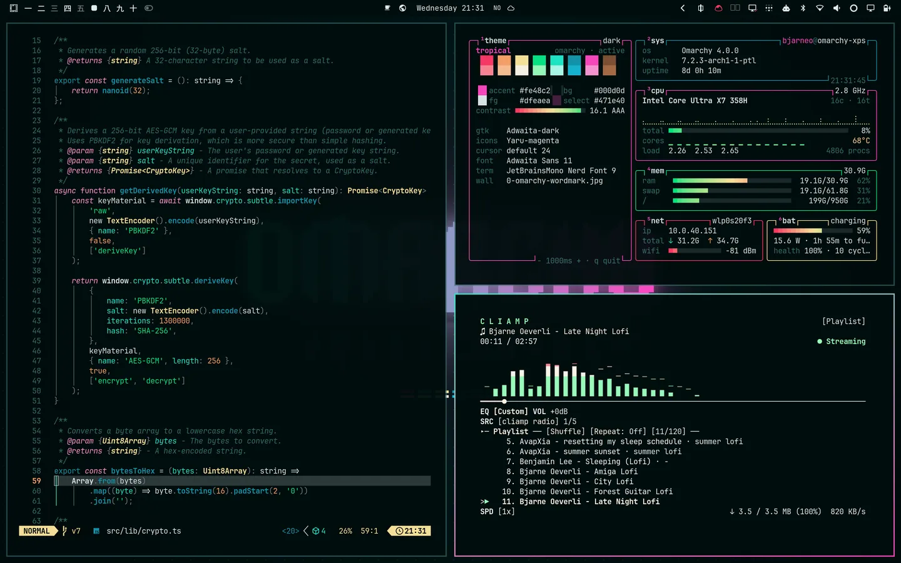](tropical/preview.png)

`015` · Folder: [`tropical/`](tropical/) · [Open in the gallery](https://bjarneo.github.io/100-themes/#tropical)

Tropical has a dark cyan background and a magenta accent. The ANSI colors are saturated and bright. The native background shows light rays in deep water.

| Key | Value |
| --- | --- |
| `background` | `#000d0d` |
| `foreground` | `#dfeaea` |
| `accent` | `#fe48c2` |
| `selection` | `#471e40` |
| Icon theme | `Yaru-magenta` |
| Backgrounds | [`0-omarchy-wordmark.jpg`](tropical/backgrounds/0-omarchy-wordmark.jpg), [`1-depths.jpg`](tropical/backgrounds/1-depths.jpg) |

<details>
<summary>All 16 ANSI colors</summary>

| # | Normal | # | Bright |
| --- | --- | --- | --- |
| 0 black | `#001b1b` | 8 bright black | `#356e6e` |
| 1 red | `#fe3968` | 9 bright red | `#fe8896` |
| 2 green | `#06e984` | 10 bright green | `#99ffbc` |
| 3 yellow | `#ffe79e` | 11 bright yellow | `#fef8e7` |
| 4 blue | `#1596ac` | 12 bright blue | `#15b8d3` |
| 5 magenta | `#fe48c2` | 13 bright magenta | `#fe96d4` |
| 6 cyan | `#1feacc` | 14 bright cyan | `#adfeec` |
| 7 white | `#c0cecd` | 15 bright white | `#f6fbfb` |

</details>

```bash
curl -fsSL https://bjarneo.github.io/100-themes/install.sh | bash -s -- tropical --set
```

### Sakura

[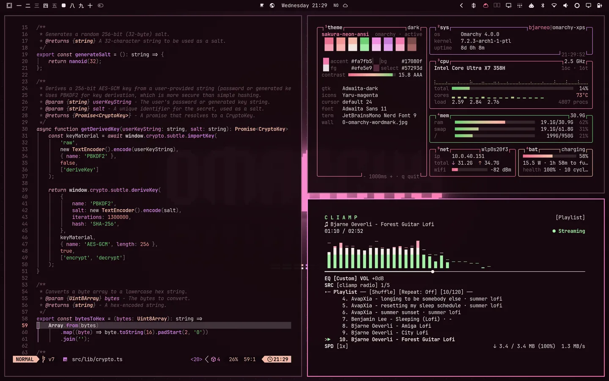](sakura/preview.png)

`016` · Folder: [`sakura/`](sakura/) · [Open in the gallery](https://bjarneo.github.io/100-themes/#sakura)

Sakura has a dark plum background and a pink accent. The ANSI colors use medium chroma for a calmer look. The native background shows soft light spots with bokeh.

| Key | Value |
| --- | --- |
| `background` | `#17080f` |
| `foreground` | `#efe5e9` |
| `accent` | `#fa7fb5` |
| `selection` | `#57293d` |
| Icon theme | `Yaru-magenta` |
| Backgrounds | [`0-omarchy-wordmark.jpg`](sakura/backgrounds/0-omarchy-wordmark.jpg), [`1-blobs.jpg`](sakura/backgrounds/1-blobs.jpg) |

<details>
<summary>All 16 ANSI colors</summary>

| # | Normal | # | Bright |
| --- | --- | --- | --- |
| 0 black | `#25151d` | 8 bright black | `#7a5867` |
| 1 red | `#f57595` | 9 bright red | `#fda8ba` |
| 2 green | `#74d87b` | 10 bright green | `#a7f5aa` |
| 3 yellow | `#fdc1ae` | 11 bright yellow | `#fdeeea` |
| 4 blue | `#d081e2` | 12 bright blue | `#e8a9f8` |
| 5 magenta | `#fa7fb5` | 13 bright magenta | `#ffb5d2` |
| 6 cyan | `#f995eb` | 14 bright cyan | `#feccf5` |
| 7 white | `#d3c7cc` | 15 bright white | `#fdf9fa` |

</details>

```bash
curl -fsSL https://bjarneo.github.io/100-themes/install.sh | bash -s -- sakura --set
```

### Amber CRT

[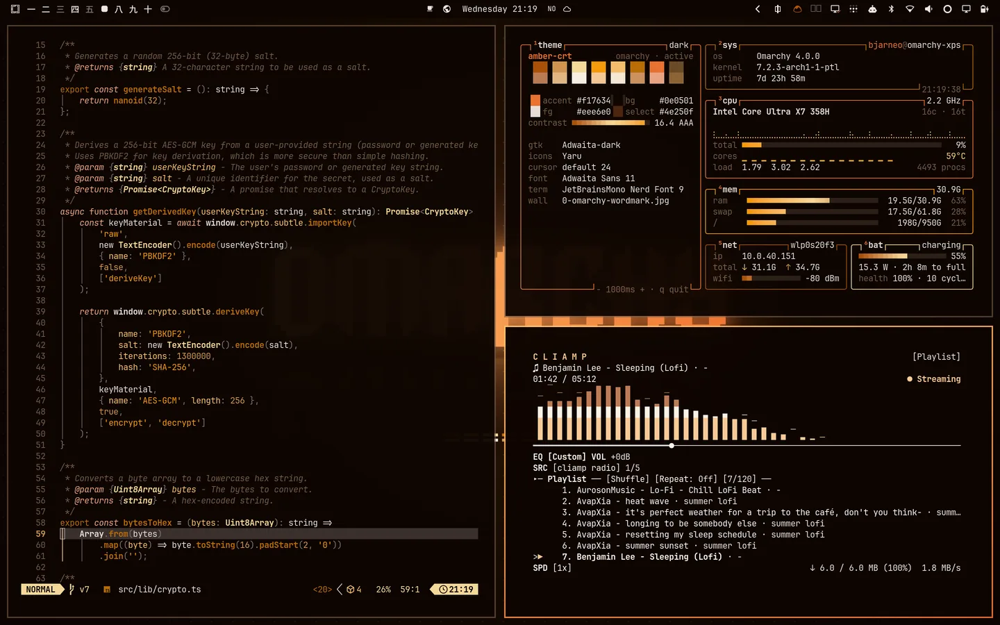](amber-crt/preview.png)

`017` · Folder: [`amber-crt/`](amber-crt/) · [Open in the gallery](https://bjarneo.github.io/100-themes/#amber-crt)

Amber CRT has a dark brown background and a orange accent. The 6 ANSI hues stay close to orange, so the palette reads as one color. The native background shows a VHS screen with tracking noise.

| Key | Value |
| --- | --- |
| `background` | `#0e0501` |
| `foreground` | `#eee6e0` |
| `accent` | `#f17634` |
| `selection` | `#4e250f` |
| Icon theme | `Yaru` |
| Backgrounds | [`0-omarchy-wordmark.jpg`](amber-crt/backgrounds/0-omarchy-wordmark.jpg), [`1-scanlines.jpg`](amber-crt/backgrounds/1-scanlines.jpg) |

<details>
<summary>All 16 ANSI colors</summary>

| # | Normal | # | Bright |
| --- | --- | --- | --- |
| 0 black | `#1c1108` | 8 bright black | `#775d49` |
| 1 red | `#af5408` | 9 bright red | `#be7e57` |
| 2 green | `#fe9f0c` | 10 bright green | `#fecd9a` |
| 3 yellow | `#ffe19f` | 11 bright yellow | `#fff8e9` |
| 4 blue | `#c07006` | 12 bright blue | `#d09763` |
| 5 magenta | `#f17634` | 13 bright magenta | `#f2aa89` |
| 6 cyan | `#fec672` | 14 bright cyan | `#fef0db` |
| 7 white | `#d2c8c1` | 15 bright white | `#fdf9f7` |

</details>

```bash
curl -fsSL https://bjarneo.github.io/100-themes/install.sh | bash -s -- amber-crt --set
```

### Dreampop

[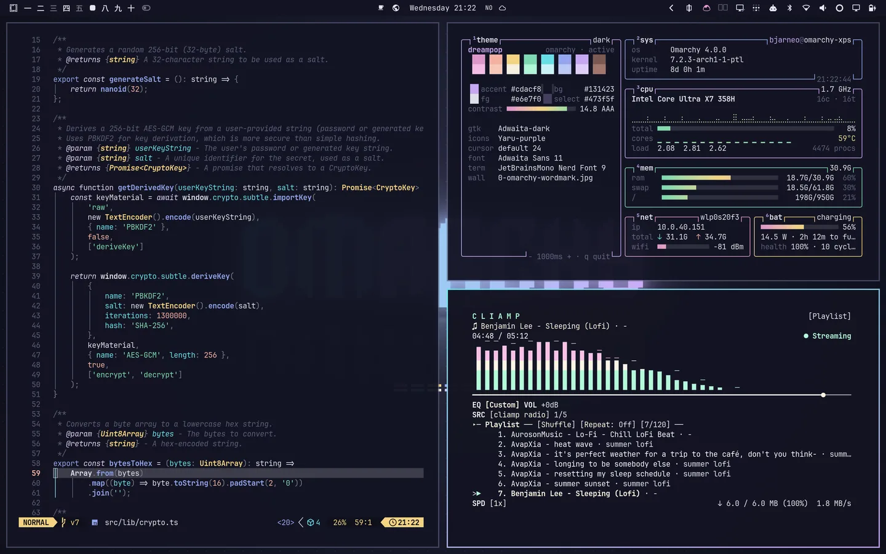](dreampop/preview.png)

`018` · Folder: [`dreampop/`](dreampop/) · [Open in the gallery](https://bjarneo.github.io/100-themes/#dreampop)

Dreampop has a dark indigo background and a violet accent. The ANSI colors are light pastels with high lightness and low chroma. The native background shows soft light spots with bokeh.

| Key | Value |
| --- | --- |
| `background` | `#131423` |
| `foreground` | `#e6e7f0` |
| `accent` | `#cdacf8` |
| `selection` | `#473f5f` |
| Icon theme | `Yaru-purple` |
| Backgrounds | [`0-omarchy-wordmark.jpg`](dreampop/backgrounds/0-omarchy-wordmark.jpg), [`1-blobs.jpg`](dreampop/backgrounds/1-blobs.jpg) |

<details>
<summary>All 16 ANSI colors</summary>

| # | Normal | # | Bright |
| --- | --- | --- | --- |
| 0 black | `#212232` | 8 bright black | `#5d6080` |
| 1 red | `#e59cd1` | 9 bright red | `#fdc3ec` |
| 2 green | `#81e1b7` | 10 bright green | `#b6fedc` |
| 3 yellow | `#fcdb86` | 11 bright yellow | `#fff8e6` |
| 4 blue | `#99acf7` | 12 bright blue | `#c2cffc` |
| 5 magenta | `#cdacf8` | 13 bright magenta | `#e6d5ff` |
| 6 cyan | `#6ce7ef` | 14 bright cyan | `#d0fbfe` |
| 7 white | `#c8cad4` | 15 bright white | `#f9fafd` |

</details>

```bash
curl -fsSL https://bjarneo.github.io/100-themes/install.sh | bash -s -- dreampop --set
```

### Solar Flare

[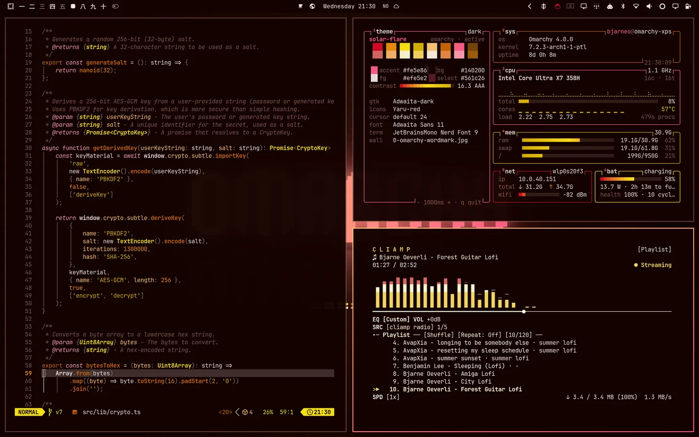](solar-flare/preview.png)

`019` · Folder: [`solar-flare/`](solar-flare/) · [Open in the gallery](https://bjarneo.github.io/100-themes/#solar-flare)

Solar Flare has a dark red background and a pink accent. The ANSI colors are saturated and bright. The native background shows embers that rise over dunes.

| Key | Value |
| --- | --- |
| `background` | `#140200` |
| `foreground` | `#efe5e2` |
| `accent` | `#fe5e86` |
| `selection` | `#561c26` |
| Icon theme | `Yaru-red` |
| Backgrounds | [`0-omarchy-wordmark.jpg`](solar-flare/backgrounds/0-omarchy-wordmark.jpg), [`1-embers.jpg`](solar-flare/backgrounds/1-embers.jpg) |

<details>
<summary>All 16 ANSI colors</summary>

| # | Normal | # | Bright |
| --- | --- | --- | --- |
| 0 black | `#220d06` | 8 bright black | `#815849` |
| 1 red | `#d40924` | 9 bright red | `#d76963` |
| 2 green | `#dab300` | 10 bright green | `#f7d561` |
| 3 yellow | `#ffe714` | 11 bright yellow | `#fffad5` |
| 4 blue | `#cb6605` | 12 bright blue | `#e78a49` |
| 5 magenta | `#fe5e86` | 13 bright magenta | `#fd9eaf` |
| 6 cyan | `#fec678` | 14 bright cyan | `#fef0dd` |
| 7 white | `#d4c7c3` | 15 bright white | `#fdf9f8` |

</details>

```bash
curl -fsSL https://bjarneo.github.io/100-themes/install.sh | bash -s -- solar-flare --set
```

### Bioluminescent

[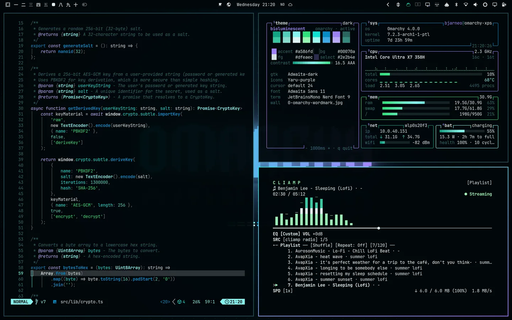](bioluminescent/preview.png)

`020` · Folder: [`bioluminescent/`](bioluminescent/) · [Open in the gallery](https://bjarneo.github.io/100-themes/#bioluminescent)

Bioluminescent has a dark cyan background and a violet accent. The ANSI colors are saturated and bright. The native background shows light rays in deep water.

| Key | Value |
| --- | --- |
| `background` | `#00070a` |
| `foreground` | `#dfeaec` |
| `accent` | `#a586fd` |
| `selection` | `#2e2b4e` |
| Icon theme | `Yaru-purple` |
| Backgrounds | [`0-omarchy-wordmark.jpg`](bioluminescent/backgrounds/0-omarchy-wordmark.jpg), [`1-depths.jpg`](bioluminescent/backgrounds/1-depths.jpg) |

<details>
<summary>All 16 ANSI colors</summary>

| # | Normal | # | Bright |
| --- | --- | --- | --- |
| 0 black | `#001318` | 8 bright black | `#356d76` |
| 1 red | `#12aa8a` | 9 bright red | `#3dcca8` |
| 2 green | `#32e881` | 10 bright green | `#9efeba` |
| 3 yellow | `#8dfff9` | 11 bright yellow | `#e6fefd` |
| 4 blue | `#0890cd` | 12 bright blue | `#44afec` |
| 5 magenta | `#a586fd` | 13 bright magenta | `#c1b0ff` |
| 6 cyan | `#12e8da` | 14 bright cyan | `#a6fef5` |
| 7 white | `#c0cdd0` | 15 bright white | `#f6fbfc` |

</details>

```bash
curl -fsSL https://bjarneo.github.io/100-themes/install.sh | bash -s -- bioluminescent --set
```

### Darkwave

[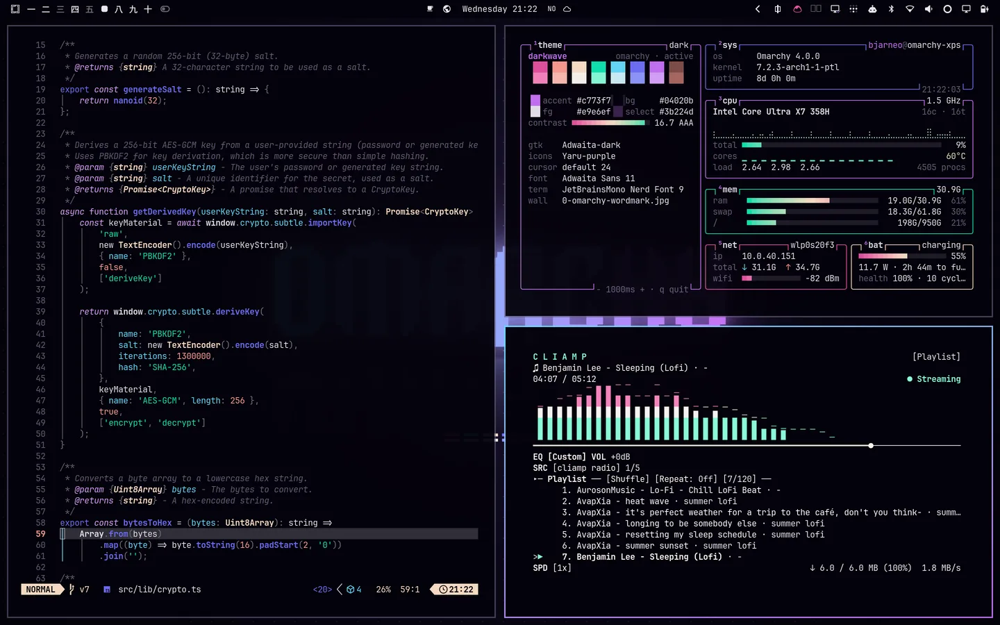](darkwave/preview.png)

`021` · Folder: [`darkwave/`](darkwave/) · [Open in the gallery](https://bjarneo.github.io/100-themes/#darkwave)

Darkwave has a dark violet background and a violet accent. The ANSI colors are saturated and bright. The native background shows layered sound wave ribbons.

| Key | Value |
| --- | --- |
| `background` | `#04020b` |
| `foreground` | `#e9e6ef` |
| `accent` | `#c773f7` |
| `selection` | `#3b224d` |
| Icon theme | `Yaru-purple` |
| Backgrounds | [`0-omarchy-wordmark.jpg`](darkwave/backgrounds/0-omarchy-wordmark.jpg), [`1-waveform.jpg`](darkwave/backgrounds/1-waveform.jpg) |

<details>
<summary>All 16 ANSI colors</summary>

| # | Normal | # | Bright |
| --- | --- | --- | --- |
| 0 black | `#0f0a18` | 8 bright black | `#675d7c` |
| 1 red | `#e651a2` | 9 bright red | `#f885be` |
| 2 green | `#12e5b5` | 10 bright green | `#8bffd9` |
| 3 yellow | `#ffe2ca` | 11 bright yellow | `#fdf7f2` |
| 4 blue | `#7071fa` | 12 bright blue | `#9199fd` |
| 5 magenta | `#c773f7` | 13 bright magenta | `#dba3ff` |
| 6 cyan | `#67dcfe` | 14 bright cyan | `#d0f2fd` |
| 7 white | `#ccc8d3` | 15 bright white | `#faf9fd` |

</details>

```bash
curl -fsSL https://bjarneo.github.io/100-themes/install.sh | bash -s -- darkwave --set
```

### Chillwave

[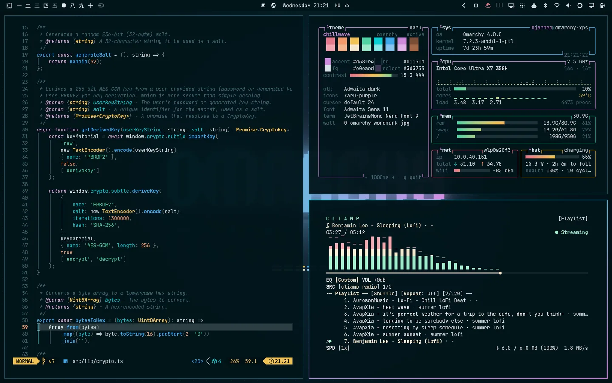](chillwave/preview.png)

`022` · Folder: [`chillwave/`](chillwave/) · [Open in the gallery](https://bjarneo.github.io/100-themes/#chillwave)

Chillwave has a dark cyan background and a magenta accent. The ANSI colors use medium chroma for a calmer look. The native background shows an aurora over a mountain lake.

| Key | Value |
| --- | --- |
| `background` | `#01151b` |
| `foreground` | `#e0eaed` |
| `accent` | `#d68fe4` |
| `selection` | `#3d3753` |
| Icon theme | `Yaru-purple` |
| Backgrounds | [`0-omarchy-wordmark.jpg`](chillwave/backgrounds/0-omarchy-wordmark.jpg), [`1-aurora.jpg`](chillwave/backgrounds/1-aurora.jpg) |

<details>
<summary>All 16 ANSI colors</summary>

| # | Normal | # | Bright |
| --- | --- | --- | --- |
| 0 black | `#0d2329` | 8 bright black | `#416a77` |
| 1 red | `#ee7c8e` | 9 bright red | `#f8acb5` |
| 2 green | `#52daa6` | 10 bright green | `#a4f2cf` |
| 3 yellow | `#fbc959` | 11 bright yellow | `#fef0d4` |
| 4 blue | `#43aef4` | 12 bright blue | `#8eccfa` |
| 5 magenta | `#d68fe4` | 13 bright magenta | `#e9bbf2` |
| 6 cyan | `#0dd8dc` | 14 bright cyan | `#92f1f3` |
| 7 white | `#c0cdd1` | 15 bright white | `#f7fbfc` |

</details>

```bash
curl -fsSL https://bjarneo.github.io/100-themes/install.sh | bash -s -- chillwave --set
```

### Retrowave

[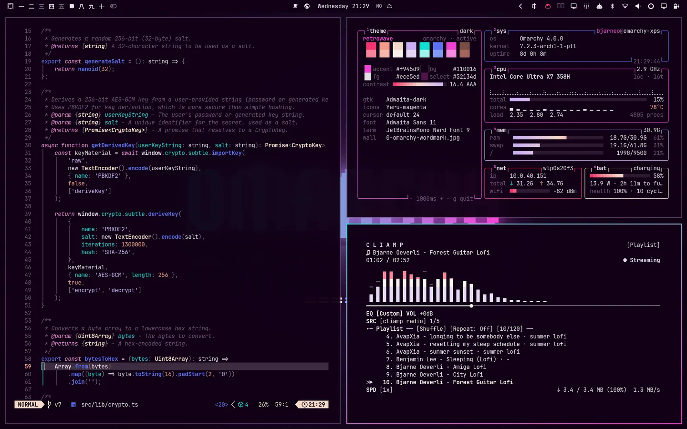](retrowave/preview.png)

`023` · Folder: [`retrowave/`](retrowave/) · [Open in the gallery](https://bjarneo.github.io/100-themes/#retrowave)

Retrowave has a dark magenta background and a magenta accent. The ANSI colors are saturated and bright. The native background shows a neon sun over a perspective grid.

| Key | Value |
| --- | --- |
| `background` | `#110016` |
| `foreground` | `#ece5ed` |
| `accent` | `#f945d9` |
| `selection` | `#52134d` |
| Icon theme | `Yaru-magenta` |
| Backgrounds | [`0-omarchy-wordmark.jpg`](retrowave/backgrounds/0-omarchy-wordmark.jpg), [`1-sunset-grid.jpg`](retrowave/backgrounds/1-sunset-grid.jpg) |

<details>
<summary>All 16 ANSI colors</summary>

| # | Normal | # | Bright |
| --- | --- | --- | --- |
| 0 black | `#1f0924` | 8 bright black | `#785480` |
| 1 red | `#ff3574` | 9 bright red | `#fe879e` |
| 2 green | `#d1b4fd` | 10 bright green | `#eadefe` |
| 3 yellow | `#fee1d0` | 11 bright yellow | `#fff7f2` |
| 4 blue | `#6075ff` | 12 bright blue | `#879dfc` |
| 5 magenta | `#f945d9` | 13 bright magenta | `#ff91e6` |
| 6 cyan | `#10e8db` | 14 bright cyan | `#a6fef5` |
| 7 white | `#cfc8d1` | 15 bright white | `#fcf9fc` |

</details>

```bash
curl -fsSL https://bjarneo.github.io/100-themes/install.sh | bash -s -- retrowave --set
```

### Phonk

[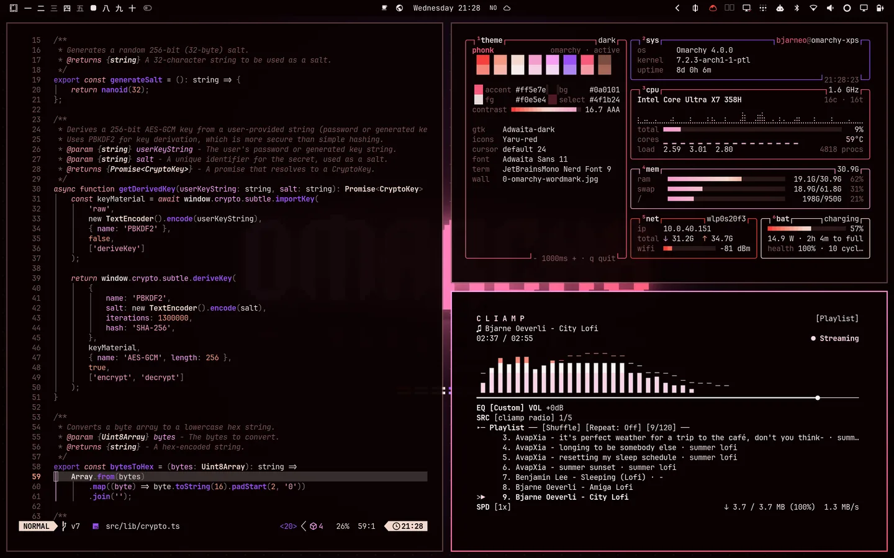](phonk/preview.png)

`024` · Folder: [`phonk/`](phonk/) · [Open in the gallery](https://bjarneo.github.io/100-themes/#phonk)

Phonk has a dark red background and a pink accent. The ANSI colors are saturated and bright. The native background shows an LED spectrum analyzer.

| Key | Value |
| --- | --- |
| `background` | `#0a0101` |
| `foreground` | `#f0e5e4` |
| `accent` | `#ff5e7e` |
| `selection` | `#4f1b24` |
| Icon theme | `Yaru-red` |
| Backgrounds | [`0-omarchy-wordmark.jpg`](phonk/backgrounds/0-omarchy-wordmark.jpg), [`1-equalizer.jpg`](phonk/backgrounds/1-equalizer.jpg) |

<details>
<summary>All 16 ANSI colors</summary>

| # | Normal | # | Bright |
| --- | --- | --- | --- |
| 0 black | `#180808` | 8 bright black | `#7d5857` |
| 1 red | `#fe423b` | 9 bright red | `#fd8c7f` |
| 2 green | `#fda4d3` | 10 bright green | `#fed8eb` |
| 3 yellow | `#fde1d6` | 11 bright yellow | `#fef7f4` |
| 4 blue | `#9f54fe` | 12 bright blue | `#b48bf9` |
| 5 magenta | `#ff5e7e` | 13 bright magenta | `#fe9faa` |
| 6 cyan | `#ffa6fc` | 14 bright cyan | `#fee0fc` |
| 7 white | `#d4c7c6` | 15 bright white | `#fdf9f9` |

</details>

```bash
curl -fsSL https://bjarneo.github.io/100-themes/install.sh | bash -s -- phonk --set
```

### Drum & Bass

[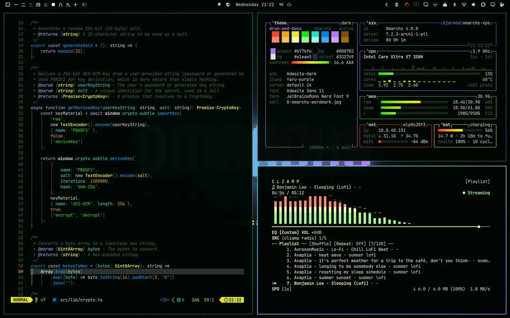](drum-and-bass/preview.png)

`025` · Folder: [`drum-and-bass/`](drum-and-bass/) · [Open in the gallery](https://bjarneo.github.io/100-themes/#drum-and-bass)

Drum & Bass has a dark green background and a violet accent. The ANSI colors use very high chroma for a strong neon look. The native background shows an LED spectrum analyzer.

| Key | Value |
| --- | --- |
| `background` | `#000702` |
| `foreground` | `#e1eae5` |
| `accent` | `#b77bfe` |
| `selection` | `#332749` |
| Icon theme | `Yaru-purple` |
| Backgrounds | [`0-omarchy-wordmark.jpg`](drum-and-bass/backgrounds/0-omarchy-wordmark.jpg), [`1-equalizer.jpg`](drum-and-bass/backgrounds/1-equalizer.jpg) |

<details>
<summary>All 16 ANSI colors</summary>

| # | Normal | # | Bright |
| --- | --- | --- | --- |
| 0 black | `#03130b` | 8 bright black | `#4a6c59` |
| 1 red | `#fe4528` | 9 bright red | `#fe8d77` |
| 2 green | `#16ed11` | 10 bright green | `#a5ff9d` |
| 3 yellow | `#eff31e` | 11 bright yellow | `#faffb7` |
| 4 blue | `#008cdf` | 12 bright blue | `#44acfd` |
| 5 magenta | `#b77bfe` | 13 bright magenta | `#cdaafe` |
| 6 cyan | `#1de9d6` | 14 bright cyan | `#a7fff2` |
| 7 white | `#c3cec7` | 15 bright white | `#f7fbf9` |

</details>

```bash
curl -fsSL https://bjarneo.github.io/100-themes/install.sh | bash -s -- drum-and-bass --set
```

### Dubstep

[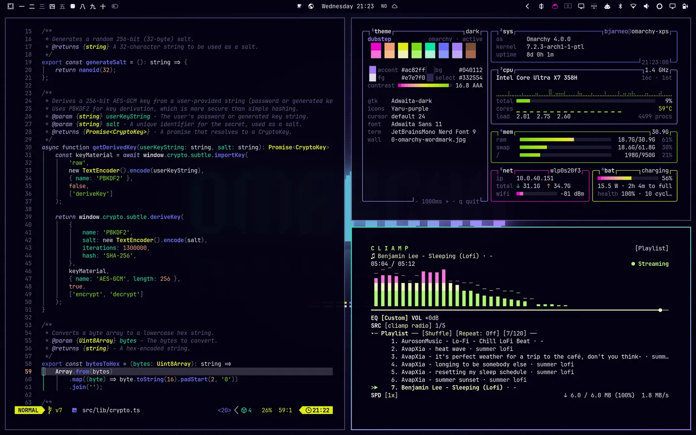](dubstep/preview.png)

`026` · Folder: [`dubstep/`](dubstep/) · [Open in the gallery](https://bjarneo.github.io/100-themes/#dubstep)

Dubstep has a dark indigo background and a violet accent. The ANSI colors use very high chroma for a strong neon look. The native background shows an LED spectrum analyzer.

| Key | Value |
| --- | --- |
| `background` | `#040112` |
| `foreground` | `#e7e7f0` |
| `accent` | `#ac82ff` |
| `selection` | `#332554` |
| Icon theme | `Yaru-purple` |
| Backgrounds | [`0-omarchy-wordmark.jpg`](dubstep/backgrounds/0-omarchy-wordmark.jpg), [`1-equalizer.jpg`](dubstep/backgrounds/1-equalizer.jpg) |

<details>
<summary>All 16 ANSI colors</summary>

| # | Normal | # | Bright |
| --- | --- | --- | --- |
| 0 black | `#0e0821` | 8 bright black | `#625c89` |
| 1 red | `#f403d1` | 9 bright red | `#fe77df` |
| 2 green | `#82e214` | 10 bright green | `#b0ff76` |
| 3 yellow | `#e9f516` | 11 bright yellow | `#f8ffc3` |
| 4 blue | `#6d71fe` | 12 bright blue | `#8f9aff` |
| 5 magenta | `#ac82ff` | 13 bright magenta | `#c5aefd` |
| 6 cyan | `#0beea9` | 14 bright cyan | `#b5fedb` |
| 7 white | `#cac9d4` | 15 bright white | `#fafafd` |

</details>

```bash
curl -fsSL https://bjarneo.github.io/100-themes/install.sh | bash -s -- dubstep --set
```

### Techno

[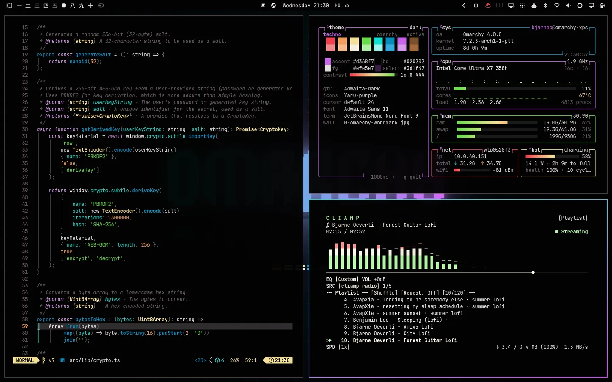](techno/preview.png)

`027` · Folder: [`techno/`](techno/) · [Open in the gallery](https://bjarneo.github.io/100-themes/#techno)

Techno has a neutral black background and a violet accent. The ANSI colors are saturated and bright. The native background shows an LED spectrum analyzer.

| Key | Value |
| --- | --- |
| `background` | `#020202` |
| `foreground` | `#efe5e7` |
| `accent` | `#d368f7` |
| `selection` | `#3d1f47` |
| Icon theme | `Yaru-purple` |
| Backgrounds | [`0-omarchy-wordmark.jpg`](techno/backgrounds/0-omarchy-wordmark.jpg), [`1-equalizer.jpg`](techno/backgrounds/1-equalizer.jpg) |

<details>
<summary>All 16 ANSI colors</summary>

| # | Normal | # | Bright |
| --- | --- | --- | --- |
| 0 black | `#0b0b0b` | 8 bright black | `#6e5f63` |
| 1 red | `#fc4353` | 9 bright red | `#f88e8d` |
| 2 green | `#6ae54c` | 10 bright green | `#b6faa8` |
| 3 yellow | `#fee79e` | 11 bright yellow | `#fff8e4` |
| 4 blue | `#0992c4` | 12 bright blue | `#3ab2e7` |
| 5 magenta | `#d368f7` | 13 bright magenta | `#dfa3f5` |
| 6 cyan | `#14e8da` | 14 bright cyan | `#a4fff5` |
| 7 white | `#d3c7ca` | 15 bright white | `#fdf9fa` |

</details>

```bash
curl -fsSL https://bjarneo.github.io/100-themes/install.sh | bash -s -- techno --set
```

### House

[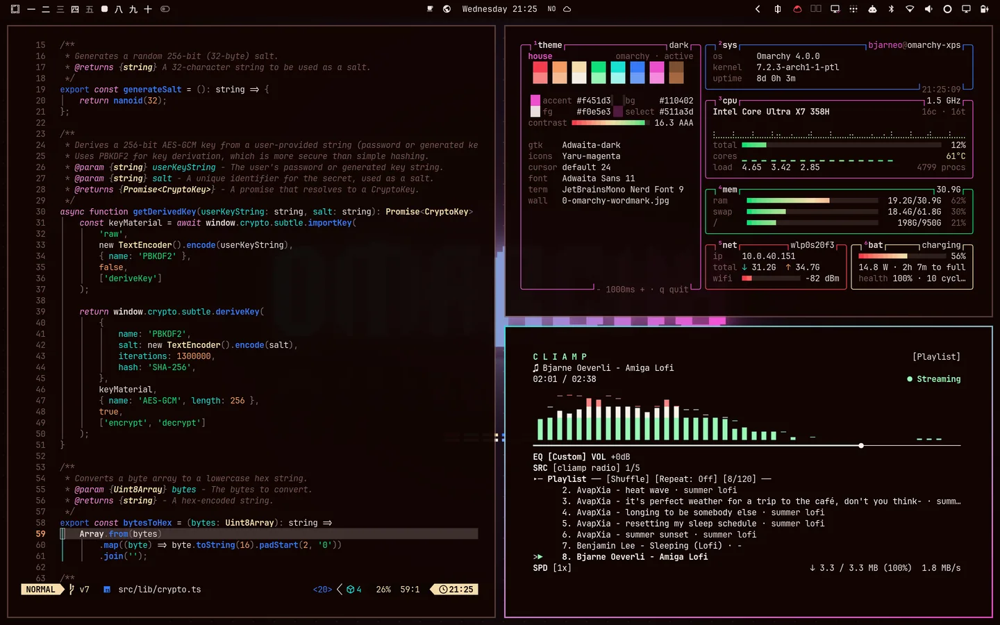](house/preview.png)

`028` · Folder: [`house/`](house/) · [Open in the gallery](https://bjarneo.github.io/100-themes/#house)

House has a dark red background and a magenta accent. The ANSI colors are saturated and bright. The native background shows an LED spectrum analyzer.

| Key | Value |
| --- | --- |
| `background` | `#110402` |
| `foreground` | `#f0e5e3` |
| `accent` | `#f451d3` |
| `selection` | `#511a3d` |
| Icon theme | `Yaru-magenta` |
| Backgrounds | [`0-omarchy-wordmark.jpg`](house/backgrounds/0-omarchy-wordmark.jpg), [`1-equalizer.jpg`](house/backgrounds/1-equalizer.jpg) |

<details>
<summary>All 16 ANSI colors</summary>

| # | Normal | # | Bright |
| --- | --- | --- | --- |
| 0 black | `#200e0c` | 8 bright black | `#7d5952` |
| 1 red | `#fe3f50` | 9 bright red | `#ff8988` |
| 2 green | `#11e97e` | 10 bright green | `#9cfeba` |
| 3 yellow | `#ffe5b3` | 11 bright yellow | `#fef8eb` |
| 4 blue | `#387eff` | 12 bright blue | `#71a3fd` |
| 5 magenta | `#f451d3` | 13 bright magenta | `#ff92e4` |
| 6 cyan | `#17e8d9` | 14 bright cyan | `#a5fff4` |
| 7 white | `#d4c7c5` | 15 bright white | `#fdf9f8` |

</details>

```bash
curl -fsSL https://bjarneo.github.io/100-themes/install.sh | bash -s -- house --set
```

### Trance

[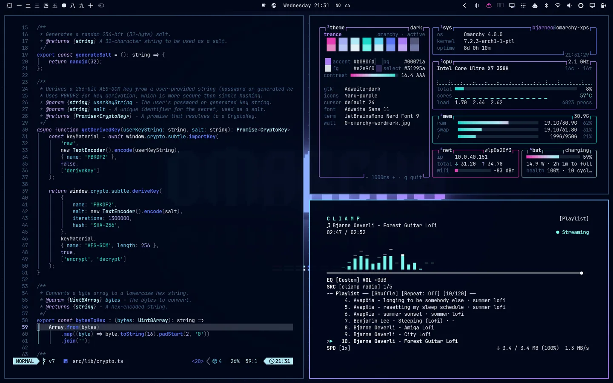](trance/preview.png)

`029` · Folder: [`trance/`](trance/) · [Open in the gallery](https://bjarneo.github.io/100-themes/#trance)

Trance has a dark blue background and a violet accent. The ANSI colors are saturated and bright. The native background shows layered sound wave ribbons.

| Key | Value |
| --- | --- |
| `background` | `#00071a` |
| `foreground` | `#e2e9f0` |
| `accent` | `#b080fd` |
| `selection` | `#31295a` |
| Icon theme | `Yaru-purple` |
| Backgrounds | [`0-omarchy-wordmark.jpg`](trance/backgrounds/0-omarchy-wordmark.jpg), [`1-waveform.jpg`](trance/backgrounds/1-waveform.jpg) |

<details>
<summary>All 16 ANSI colors</summary>

| # | Normal | # | Bright |
| --- | --- | --- | --- |
| 0 black | `#011429` | 8 bright black | `#43668a` |
| 1 red | `#ec3eba` | 9 bright red | `#eb8dc9` |
| 2 green | `#1de1d3` | 10 bright green | `#78fff2` |
| 3 yellow | `#baf3ff` | 11 bright yellow | `#eefbfe` |
| 4 blue | `#5c77fc` | 12 bright blue | `#869ff9` |
| 5 magenta | `#b080fd` | 13 bright magenta | `#c8adfd` |
| 6 cyan | `#67dcfe` | 14 bright cyan | `#cff2fe` |
| 7 white | `#c3cbd4` | 15 bright white | `#f8fafd` |

</details>

```bash
curl -fsSL https://bjarneo.github.io/100-themes/install.sh | bash -s -- trance --set
```

### Acid House

[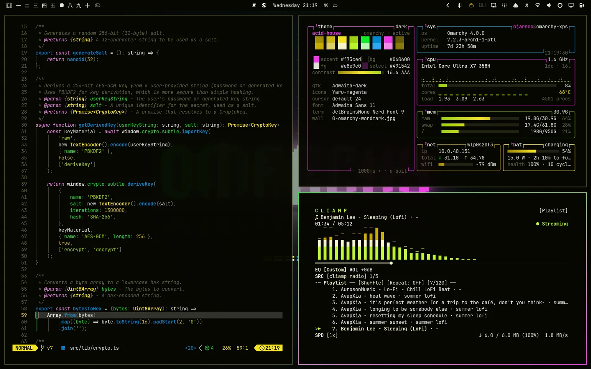](acid-house/preview.png)

`030` · Folder: [`acid-house/`](acid-house/) · [Open in the gallery](https://bjarneo.github.io/100-themes/#acid-house)

Acid House has a dark olive background and a magenta accent. The ANSI colors use very high chroma for a strong neon look. The native background shows an LED spectrum analyzer.

| Key | Value |
| --- | --- |
| `background` | `#060600` |
| `foreground` | `#e8e9e0` |
| `accent` | `#f73ced` |
| `selection` | `#491542` |
| Icon theme | `Yaru-magenta` |
| Backgrounds | [`0-omarchy-wordmark.jpg`](acid-house/backgrounds/0-omarchy-wordmark.jpg), [`1-equalizer.jpg`](acid-house/backgrounds/1-equalizer.jpg) |

<details>
<summary>All 16 ANSI colors</summary>

| # | Normal | # | Bright |
| --- | --- | --- | --- |
| 0 black | `#121304` | 8 bright black | `#656644` |
| 1 red | `#a99206` | 9 bright red | `#cdb001` |
| 2 green | `#a4da13` | 10 bright green | `#c0fd30` |
| 3 yellow | `#ffec24` | 11 bright yellow | `#fffbcf` |
| 4 blue | `#008ed8` | 12 bright blue | `#31aefe` |
| 5 magenta | `#f73ced` | 13 bright magenta | `#fe8ef4` |
| 6 cyan | `#14f42c` | 14 bright cyan | `#bfffbb` |
| 7 white | `#cbccc1` | 15 bright white | `#fafaf7` |

</details>

```bash
curl -fsSL https://bjarneo.github.io/100-themes/install.sh | bash -s -- acid-house --set
```

### Jungle

[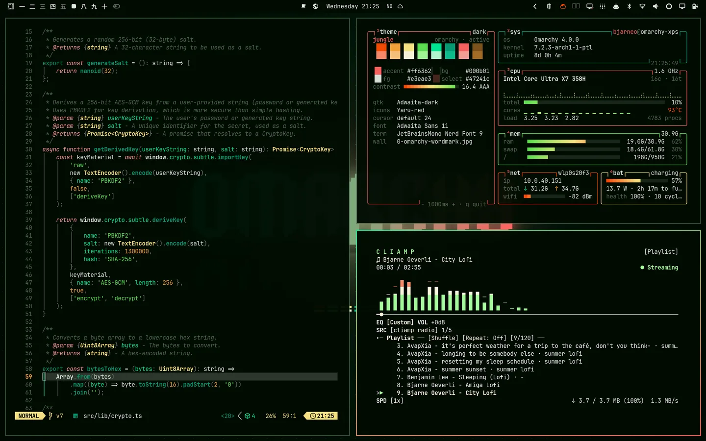](jungle/preview.png)

`031` · Folder: [`jungle/`](jungle/) · [Open in the gallery](https://bjarneo.github.io/100-themes/#jungle)

Jungle has a dark green background and a red accent. The ANSI colors are saturated and bright. The native background shows a topographic contour map.

| Key | Value |
| --- | --- |
| `background` | `#000b01` |
| `foreground` | `#e3eae3` |
| `accent` | `#ff6362` |
| `selection` | `#47241c` |
| Icon theme | `Yaru-red` |
| Backgrounds | [`0-omarchy-wordmark.jpg`](jungle/backgrounds/0-omarchy-wordmark.jpg), [`1-contours.jpg`](jungle/backgrounds/1-contours.jpg) |

<details>
<summary>All 16 ANSI colors</summary>

| # | Normal | # | Bright |
| --- | --- | --- | --- |
| 0 black | `#071808` | 8 bright black | `#4d6d4e` |
| 1 red | `#fb4c04` | 9 bright red | `#fe8d6d` |
| 2 green | `#5fe654` | 10 bright green | `#a6ff9d` |
| 3 yellow | `#ffe887` | 11 bright yellow | `#fff9df` |
| 4 blue | `#079e77` | 12 bright blue | `#0ec192` |
| 5 magenta | `#ff6362` | 13 bright magenta | `#fda19b` |
| 6 cyan | `#00ef99` | 14 bright cyan | `#b8fed5` |
| 7 white | `#c5cdc5` | 15 bright white | `#f8fbf8` |

</details>

```bash
curl -fsSL https://bjarneo.github.io/100-themes/install.sh | bash -s -- jungle --set
```

### Grime

[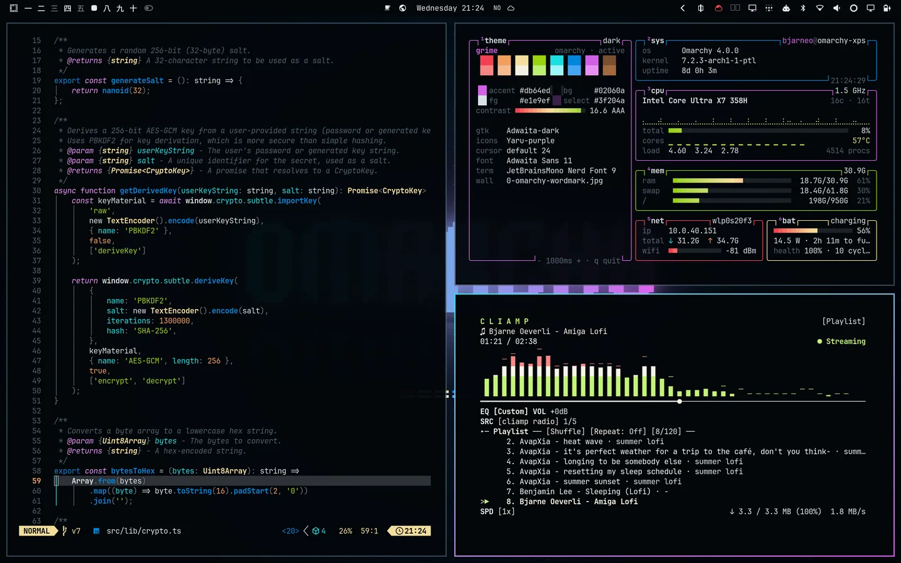](grime/preview.png)

`032` · Folder: [`grime/`](grime/) · [Open in the gallery](https://bjarneo.github.io/100-themes/#grime)

Grime has a dark blue background and a magenta accent. The ANSI colors are saturated and bright. The native background shows a city skyline at night in the rain.

| Key | Value |
| --- | --- |
| `background` | `#02060a` |
| `foreground` | `#e1e9ef` |
| `accent` | `#db64ed` |
| `selection` | `#3f204a` |
| Icon theme | `Yaru-purple` |
| Backgrounds | [`0-omarchy-wordmark.jpg`](grime/backgrounds/0-omarchy-wordmark.jpg), [`1-skyline.jpg`](grime/backgrounds/1-skyline.jpg) |

<details>
<summary>All 16 ANSI colors</summary>

| # | Normal | # | Bright |
| --- | --- | --- | --- |
| 0 black | `#0c1318` | 8 bright black | `#516676` |
| 1 red | `#fc4353` | 9 bright red | `#ff8a89` |
| 2 green | `#9edb11` | 10 bright green | `#c5f978` |
| 3 yellow | `#fee6a2` | 11 bright yellow | `#fef8e8` |
| 4 blue | `#008be3` | 12 bright blue | `#48abfe` |
| 5 magenta | `#db64ed` | 13 bright magenta | `#ef96fd` |
| 6 cyan | `#1ce6e9` | 14 bright cyan | `#a3feff` |
| 7 white | `#c2ccd3` | 15 bright white | `#f7fbfd` |

</details>

```bash
curl -fsSL https://bjarneo.github.io/100-themes/install.sh | bash -s -- grime --set
```

### Trap

[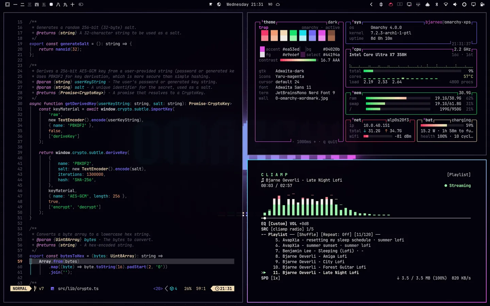](trap/preview.png)

`033` · Folder: [`trap/`](trap/) · [Open in the gallery](https://bjarneo.github.io/100-themes/#trap)

Trap has a dark violet background and a magenta accent. The ANSI colors are saturated and bright. The native background shows an LED spectrum analyzer.

| Key | Value |
| --- | --- |
| `background` | `#04020b` |
| `foreground` | `#e9e6ef` |
| `accent` | `#ea53ed` |
| `selection` | `#44194a` |
| Icon theme | `Yaru-magenta` |
| Backgrounds | [`0-omarchy-wordmark.jpg`](trap/backgrounds/0-omarchy-wordmark.jpg), [`1-equalizer.jpg`](trap/backgrounds/1-equalizer.jpg) |

<details>
<summary>All 16 ANSI colors</summary>

| # | Normal | # | Bright |
| --- | --- | --- | --- |
| 0 black | `#0f0a18` | 8 bright black | `#675d7c` |
| 1 red | `#fe396b` | 9 bright red | `#fe8898` |
| 2 green | `#17ea6d` | 10 bright green | `#9fffb2` |
| 3 yellow | `#fee4bc` | 11 bright yellow | `#fef8ef` |
| 4 blue | `#776cff` | 12 bright blue | `#9697fe` |
| 5 magenta | `#ea53ed` | 13 bright magenta | `#f495f4` |
| 6 cyan | `#1ce5f3` | 14 bright cyan | `#b9f8fe` |
| 7 white | `#ccc8d3` | 15 bright white | `#faf9fd` |

</details>

```bash
curl -fsSL https://bjarneo.github.io/100-themes/install.sh | bash -s -- trap --set
```

### Hyperpop

[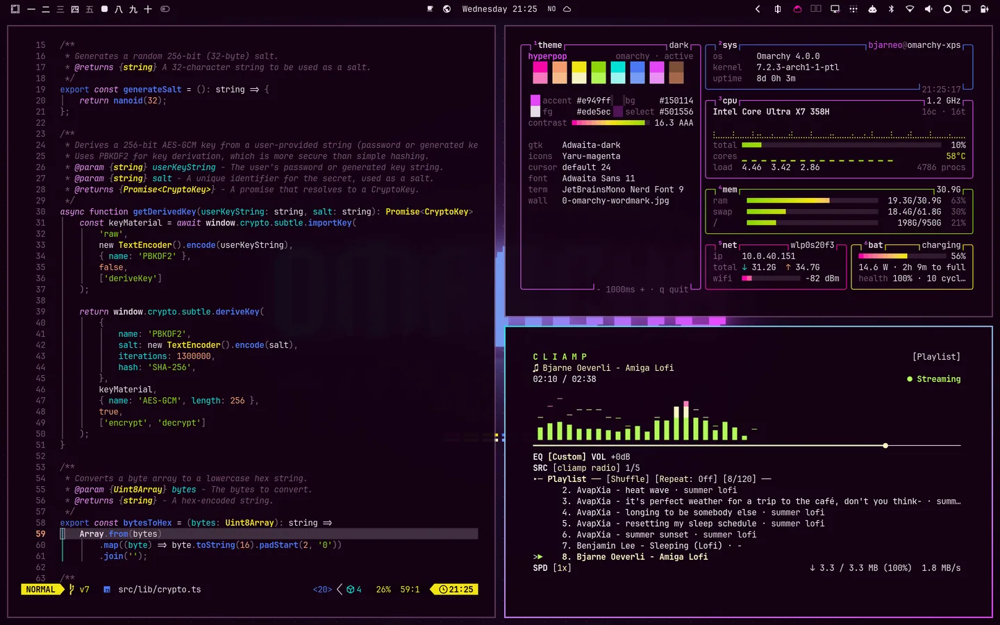](hyperpop/preview.png)

`034` · Folder: [`hyperpop/`](hyperpop/) · [Open in the gallery](https://bjarneo.github.io/100-themes/#hyperpop)

Hyperpop has a dark magenta background and a magenta accent. The ANSI colors use very high chroma for a strong neon look. The native background shows neon tube shapes on a brick wall.

| Key | Value |
| --- | --- |
| `background` | `#150114` |
| `foreground` | `#ede5ec` |
| `accent` | `#e949ff` |
| `selection` | `#501556` |
| Icon theme | `Yaru-magenta` |
| Backgrounds | [`0-omarchy-wordmark.jpg`](hyperpop/backgrounds/0-omarchy-wordmark.jpg), [`1-tubes.jpg`](hyperpop/backgrounds/1-tubes.jpg) |

<details>
<summary>All 16 ANSI colors</summary>

| # | Normal | # | Bright |
| --- | --- | --- | --- |
| 0 black | `#240a23` | 8 bright black | `#7d5279` |
| 1 red | `#fe06ad` | 9 bright red | `#ff7ec3` |
| 2 green | `#92de08` | 10 bright green | `#b5ff58` |
| 3 yellow | `#fcee13` | 11 bright yellow | `#fffcc7` |
| 4 blue | `#4d7bfd` | 12 bright blue | `#7aa1fe` |
| 5 magenta | `#e949ff` | 13 bright magenta | `#f295fe` |
| 6 cyan | `#02e8df` | 14 bright cyan | `#a3fff8` |
| 7 white | `#d0c7cf` | 15 bright white | `#fcf9fc` |

</details>

```bash
curl -fsSL https://bjarneo.github.io/100-themes/install.sh | bash -s -- hyperpop --set
```

### Glitchcore

[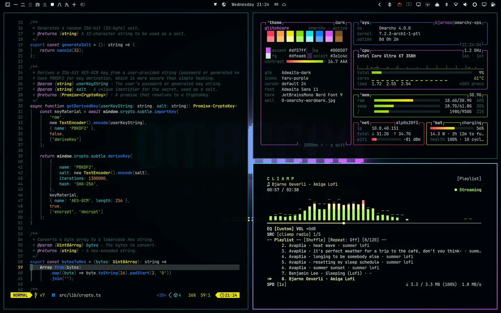](glitchcore/preview.png)

`035` · Folder: [`glitchcore/`](glitchcore/) · [Open in the gallery](https://bjarneo.github.io/100-themes/#glitchcore)

Glitchcore has a dark cyan background and a magenta accent. The ANSI colors use very high chroma for a strong neon look. The native background shows a VHS screen with tracking noise.

| Key | Value |
| --- | --- |
| `background` | `#000507` |
| `foreground` | `#dfeaeb` |
| `accent` | `#df57ff` |
| `selection` | `#3e1c4c` |
| Icon theme | `Yaru-purple` |
| Backgrounds | [`0-omarchy-wordmark.jpg`](glitchcore/backgrounds/0-omarchy-wordmark.jpg), [`1-scanlines.jpg`](glitchcore/backgrounds/1-scanlines.jpg) |

<details>
<summary>All 16 ANSI colors</summary>

| # | Normal | # | Bright |
| --- | --- | --- | --- |
| 0 black | `#001112` | 8 bright black | `#356e71` |
| 1 red | `#fd3e5e` | 9 bright red | `#fe8990` |
| 2 green | `#89e014` | 10 bright green | `#b3ff6f` |
| 3 yellow | `#f5f007` | 11 bright yellow | `#ffffa5` |
| 4 blue | `#1382fd` | 12 bright blue | `#64a6fe` |
| 5 magenta | `#df57ff` | 13 bright magenta | `#ea99fe` |
| 6 cyan | `#1ce6ea` | 14 bright cyan | `#a4feff` |
| 7 white | `#c0cece` | 15 bright white | `#f6fbfb` |

</details>

```bash
curl -fsSL https://bjarneo.github.io/100-themes/install.sh | bash -s -- glitchcore --set
```

### Chiptune

[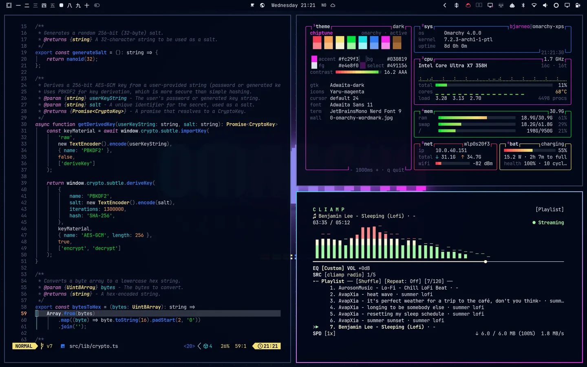](chiptune/preview.png)

`036` · Folder: [`chiptune/`](chiptune/) · [Open in the gallery](https://bjarneo.github.io/100-themes/#chiptune)

Chiptune has a dark blue background and a magenta accent. The ANSI colors use very high chroma for a strong neon look. The native background shows a pixel art landscape at night.

| Key | Value |
| --- | --- |
| `background` | `#030819` |
| `foreground` | `#e4e8f0` |
| `accent` | `#fc29f3` |
| `selection` | `#491156` |
| Icon theme | `Yaru-magenta` |
| Backgrounds | [`0-omarchy-wordmark.jpg`](chiptune/backgrounds/0-omarchy-wordmark.jpg), [`1-pixels.jpg`](chiptune/backgrounds/1-pixels.jpg) |

<details>
<summary>All 16 ANSI colors</summary>

| # | Normal | # | Bright |
| --- | --- | --- | --- |
| 0 black | `#0d1528` | 8 bright black | `#526386` |
| 1 red | `#fe3f52` | 9 bright red | `#fe8a8a` |
| 2 green | `#01ec3f` | 10 bright green | `#a4fea6` |
| 3 yellow | `#fee979` | 11 bright yellow | `#fffada` |
| 4 blue | `#307fff` | 12 bright blue | `#6ea4fc` |
| 5 magenta | `#fc29f3` | 13 bright magenta | `#fe8ef4` |
| 6 cyan | `#1be6ec` | 14 bright cyan | `#a8fdff` |
| 7 white | `#c6cbd5` | 15 bright white | `#f8fafe` |

</details>

```bash
curl -fsSL https://bjarneo.github.io/100-themes/install.sh | bash -s -- chiptune --set
```

### 8-Bit

[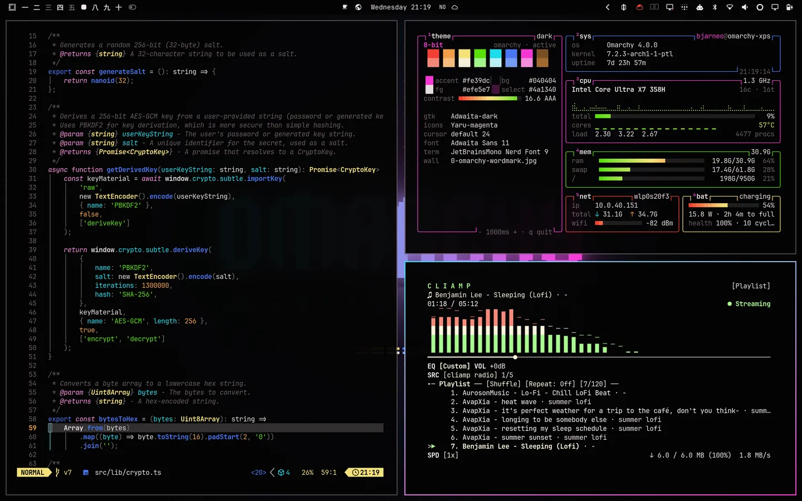](8-bit/preview.png)

`037` · Folder: [`8-bit/`](8-bit/) · [Open in the gallery](https://bjarneo.github.io/100-themes/#8-bit)

8-Bit has a neutral black background and a magenta accent. The ANSI colors use very high chroma for a strong neon look. The native background shows a pixel art landscape at night.

| Key | Value |
| --- | --- |
| `background` | `#040404` |
| `foreground` | `#efe5e7` |
| `accent` | `#fe39dc` |
| `selection` | `#4a1340` |
| Icon theme | `Yaru-magenta` |
| Backgrounds | [`0-omarchy-wordmark.jpg`](8-bit/backgrounds/0-omarchy-wordmark.jpg), [`1-pixels.jpg`](8-bit/backgrounds/1-pixels.jpg) |

<details>
<summary>All 16 ANSI colors</summary>

| # | Normal | # | Bright |
| --- | --- | --- | --- |
| 0 black | `#0f0f0f` | 8 bright black | `#6e5f63` |
| 1 red | `#fe4335` | 9 bright red | `#fe8c7c` |
| 2 green | `#5be809` | 10 bright green | `#aaff90` |
| 3 yellow | `#ffe97e` | 11 bright yellow | `#fff9de` |
| 4 blue | `#4b7bfd` | 12 bright blue | `#7aa1fd` |
| 5 magenta | `#fe39dc` | 13 bright magenta | `#fe93e4` |
| 6 cyan | `#1fe4f6` | 14 bright cyan | `#bff7fe` |
| 7 white | `#d3c7ca` | 15 bright white | `#fdf9fa` |

</details>

```bash
curl -fsSL https://bjarneo.github.io/100-themes/install.sh | bash -s -- 8-bit --set
```

### Industrial

[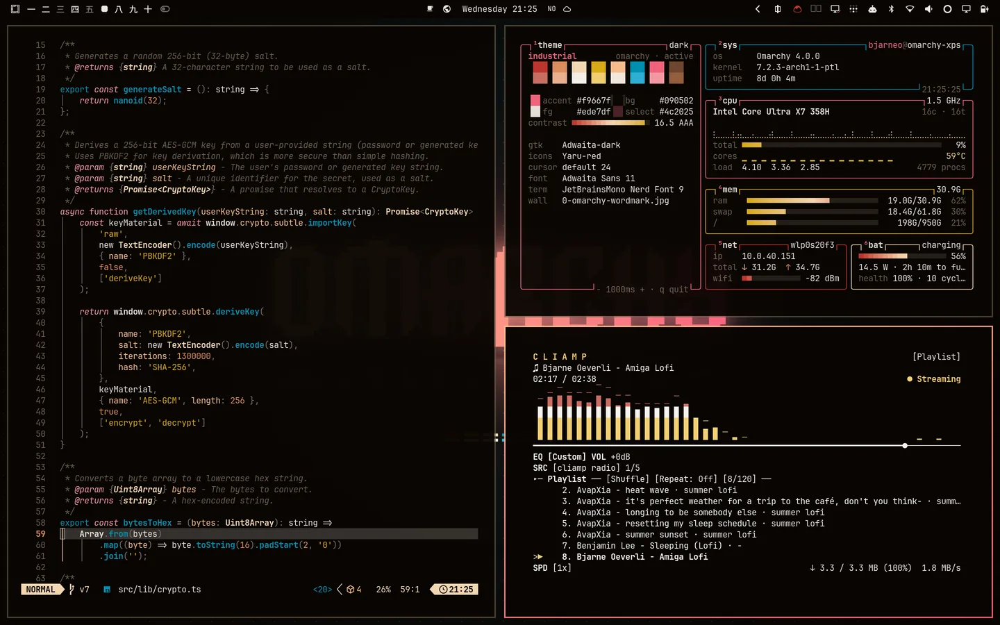](industrial/preview.png)

`038` · Folder: [`industrial/`](industrial/) · [Open in the gallery](https://bjarneo.github.io/100-themes/#industrial)

Industrial has a dark brown background and a pink accent. The ANSI colors use medium chroma for a calmer look. The native background shows a city skyline at night in the rain.

| Key | Value |
| --- | --- |
| `background` | `#090502` |
| `foreground` | `#ede7df` |
| `accent` | `#f9667f` |
| `selection` | `#4c2025` |
| Icon theme | `Yaru-red` |
| Backgrounds | [`0-omarchy-wordmark.jpg`](industrial/backgrounds/0-omarchy-wordmark.jpg), [`1-skyline.jpg`](industrial/backgrounds/1-skyline.jpg) |

<details>
<summary>All 16 ANSI colors</summary>

| # | Normal | # | Bright |
| --- | --- | --- | --- |
| 0 black | `#16100a` | 8 bright black | `#70604e` |
| 1 red | `#c5372f` | 9 bright red | `#cf7065` |
| 2 green | `#e1b019` | 10 bright green | `#f9d375` |
| 3 yellow | `#fddfb9` | 11 bright yellow | `#fdf7f0` |
| 4 blue | `#0095b7` | 12 bright blue | `#31b5db` |
| 5 magenta | `#f9667f` | 13 bright magenta | `#ff9ea9` |
| 6 cyan | `#ffc390` | 14 bright cyan | `#fdefe4` |
| 7 white | `#d1c9c0` | 15 bright white | `#fcfaf7` |

</details>

```bash
curl -fsSL https://bjarneo.github.io/100-themes/install.sh | bash -s -- industrial --set
```

### Punk

[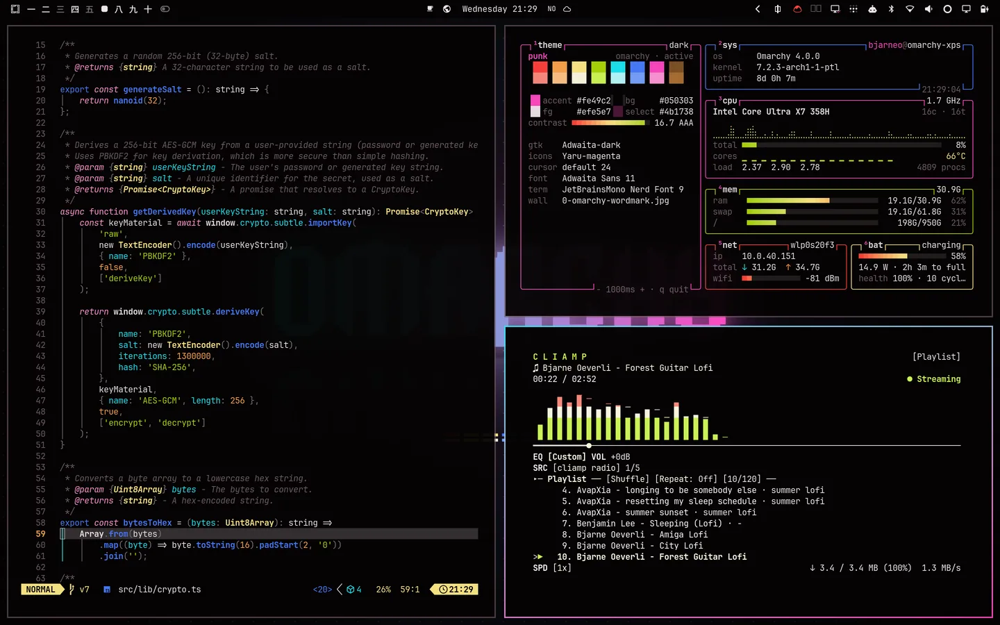](punk/preview.png)

`039` · Folder: [`punk/`](punk/) · [Open in the gallery](https://bjarneo.github.io/100-themes/#punk)

Punk has a neutral black background and a magenta accent. The ANSI colors use very high chroma for a strong neon look. The native background shows an LED spectrum analyzer.

| Key | Value |
| --- | --- |
| `background` | `#050303` |
| `foreground` | `#efe5e7` |
| `accent` | `#fe49c2` |
| `selection` | `#4b1738` |
| Icon theme | `Yaru-magenta` |
| Backgrounds | [`0-omarchy-wordmark.jpg`](punk/backgrounds/0-omarchy-wordmark.jpg), [`1-equalizer.jpg`](punk/backgrounds/1-equalizer.jpg) |

<details>
<summary>All 16 ANSI colors</summary>

| # | Normal | # | Bright |
| --- | --- | --- | --- |
| 0 black | `#110c0d` | 8 bright black | `#725c62` |
| 1 red | `#fe423b` | 9 bright red | `#fe8b7e` |
| 2 green | `#acd809` | 10 bright green | `#cdf855` |
| 3 yellow | `#ffe887` | 11 bright yellow | `#fef9e2` |
| 4 blue | `#497cfd` | 12 bright blue | `#79a1fd` |
| 5 magenta | `#fe49c2` | 13 bright magenta | `#ff96d4` |
| 6 cyan | `#1ce5f2` | 14 bright cyan | `#b7f9ff` |
| 7 white | `#d3c7ca` | 15 bright white | `#fdf9fa` |

</details>

```bash
curl -fsSL https://bjarneo.github.io/100-themes/install.sh | bash -s -- punk --set
```

### Metal

[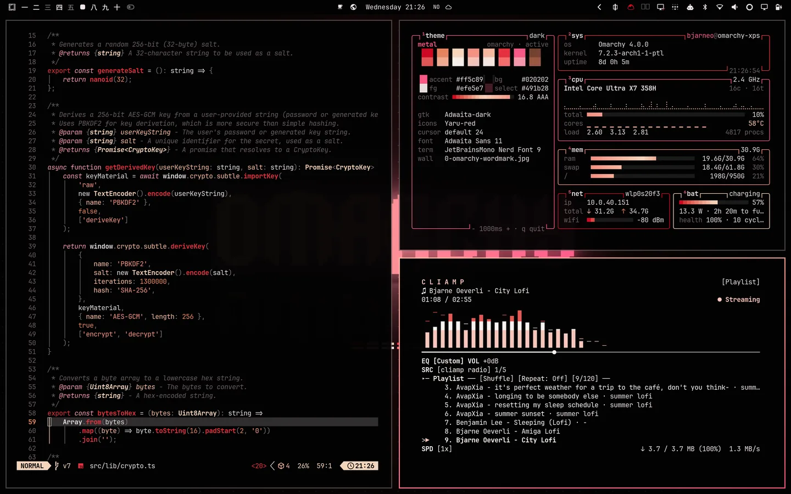](metal/preview.png)

`040` · Folder: [`metal/`](metal/) · [Open in the gallery](https://bjarneo.github.io/100-themes/#metal)

Metal has a neutral black background and a pink accent. The 6 ANSI hues stay close to red, so the palette reads as one color. The native background shows an LED spectrum analyzer.

| Key | Value |
| --- | --- |
| `background` | `#020202` |
| `foreground` | `#efe5e7` |
| `accent` | `#ff5c89` |
| `selection` | `#491b28` |
| Icon theme | `Yaru-red` |
| Backgrounds | [`0-omarchy-wordmark.jpg`](metal/backgrounds/0-omarchy-wordmark.jpg), [`1-equalizer.jpg`](metal/backgrounds/1-equalizer.jpg) |

<details>
<summary>All 16 ANSI colors</summary>

| # | Normal | # | Bright |
| --- | --- | --- | --- |
| 0 black | `#0b0b0b` | 8 bright black | `#6e5f63` |
| 1 red | `#d40924` | 9 bright red | `#e65a56` |
| 2 green | `#fd9888` | 10 bright green | `#fdc9c0` |
| 3 yellow | `#ffddc4` | 11 bright yellow | `#fef7f2` |
| 4 blue | `#ee3342` | 12 bright blue | `#fd7271` |
| 5 magenta | `#ff5c89` | 13 bright magenta | `#fd9eb1` |
| 6 cyan | `#ffc1a7` | 14 bright cyan | `#feeee7` |
| 7 white | `#d3c7ca` | 15 bright white | `#fdf9fa` |

</details>

```bash
curl -fsSL https://bjarneo.github.io/100-themes/install.sh | bash -s -- metal --set
```

### Goth

[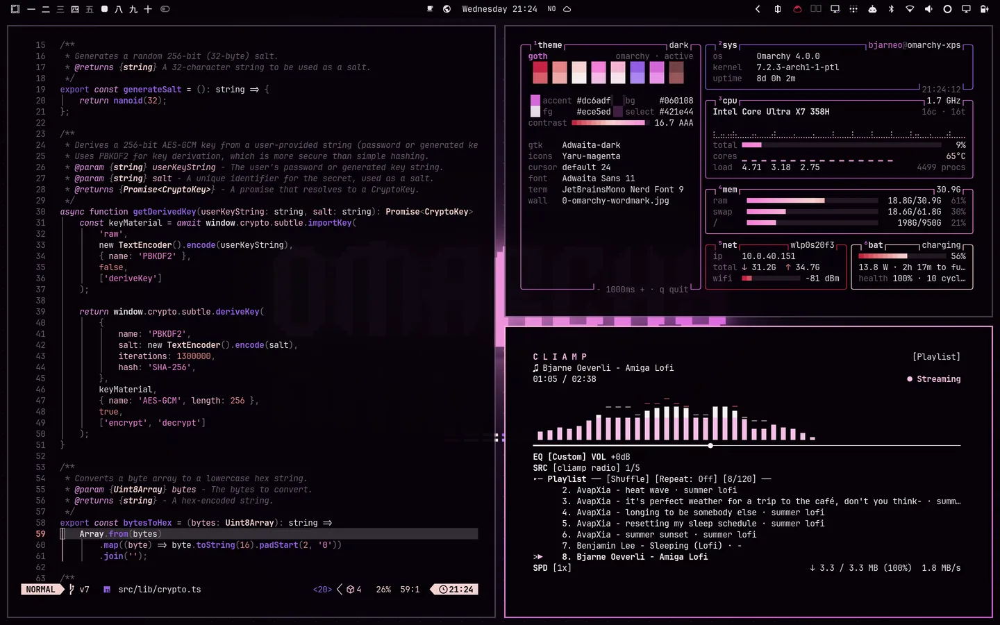](goth/preview.png)

`041` · Folder: [`goth/`](goth/) · [Open in the gallery](https://bjarneo.github.io/100-themes/#goth)

Goth has a dark magenta background and a magenta accent. The ANSI colors are saturated and bright. The native background shows layered sound wave ribbons.

| Key | Value |
| --- | --- |
| `background` | `#060108` |
| `foreground` | `#ece5ed` |
| `accent` | `#dc6adf` |
| `selection` | `#421e44` |
| Icon theme | `Yaru-magenta` |
| Backgrounds | [`0-omarchy-wordmark.jpg`](goth/backgrounds/0-omarchy-wordmark.jpg), [`1-waveform.jpg`](goth/backgrounds/1-waveform.jpg) |

<details>
<summary>All 16 ANSI colors</summary>

| # | Normal | # | Bright |
| --- | --- | --- | --- |
| 0 black | `#130915` | 8 bright black | `#705a75` |
| 1 red | `#cc2445` | 9 bright red | `#dc626d` |
| 2 green | `#fe85e0` | 10 bright green | `#fec2ec` |
| 3 yellow | `#ffdbd9` | 11 bright yellow | `#fef6f6` |
| 4 blue | `#9762ec` | 12 bright blue | `#b18df7` |
| 5 magenta | `#dc6adf` | 13 bright magenta | `#f099f1` |
| 6 cyan | `#fdbbd9` | 14 bright cyan | `#ffecf4` |
| 7 white | `#cfc8d1` | 15 bright white | `#fcf9fc` |

</details>

```bash
curl -fsSL https://bjarneo.github.io/100-themes/install.sh | bash -s -- goth --set
```

### Grunge

[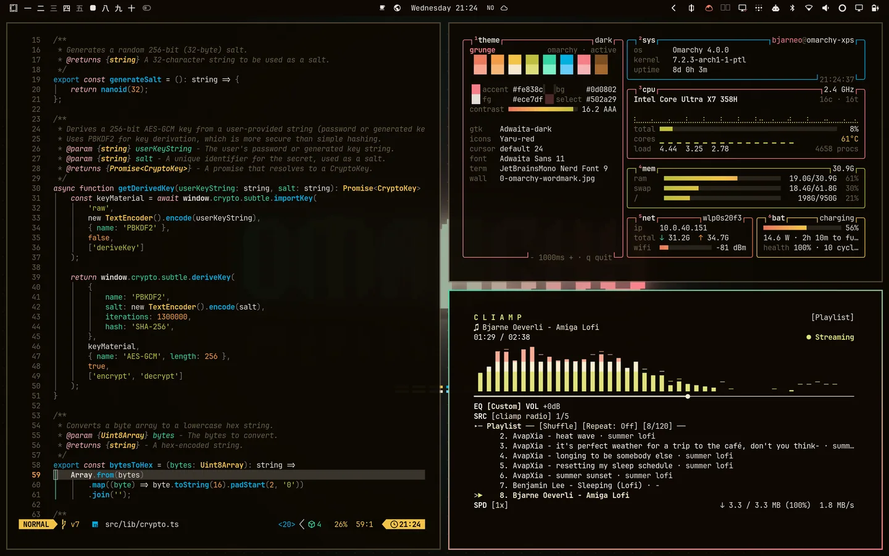](grunge/preview.png)

`042` · Folder: [`grunge/`](grunge/) · [Open in the gallery](https://bjarneo.github.io/100-themes/#grunge)

Grunge has a dark olive background and a red accent. The ANSI colors use medium chroma for a calmer look. The native background shows layered sound wave ribbons.

| Key | Value |
| --- | --- |
| `background` | `#0d0802` |
| `foreground` | `#ece7df` |
| `accent` | `#fe838c` |
| `selection` | `#502a29` |
| Icon theme | `Yaru-red` |
| Backgrounds | [`0-omarchy-wordmark.jpg`](grunge/backgrounds/0-omarchy-wordmark.jpg), [`1-waveform.jpg`](grunge/backgrounds/1-waveform.jpg) |

<details>
<summary>All 16 ANSI colors</summary>

| # | Normal | # | Bright |
| --- | --- | --- | --- |
| 0 black | `#1b150b` | 8 bright black | `#6f6149` |
| 1 red | `#f37e60` | 9 bright red | `#fead97` |
| 2 green | `#c5c541` | 10 bright green | `#e4e57f` |
| 3 yellow | `#fcca4b` | 11 bright yellow | `#fef1d4` |
| 4 blue | `#04b4e9` | 12 bright blue | `#69d3ff` |
| 5 magenta | `#fe838c` | 13 bright magenta | `#feb9bb` |
| 6 cyan | `#39dcaa` | 14 bright cyan | `#82f9cd` |
| 7 white | `#d0cac0` | 15 bright white | `#fcfaf6` |

</details>

```bash
curl -fsSL https://bjarneo.github.io/100-themes/install.sh | bash -s -- grunge --set
```

### Shoegaze

[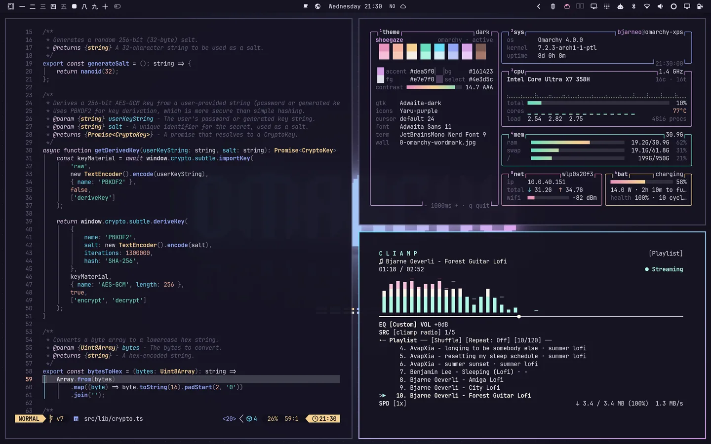](shoegaze/preview.png)

`043` · Folder: [`shoegaze/`](shoegaze/) · [Open in the gallery](https://bjarneo.github.io/100-themes/#shoegaze)

Shoegaze has a dark indigo background and a violet accent. The ANSI colors are light pastels with high lightness and low chroma. The native background shows an aurora over a mountain lake.

| Key | Value |
| --- | --- |
| `background` | `#161423` |
| `foreground` | `#e7e7f0` |
| `accent` | `#dea5f0` |
| `selection` | `#4e3d5c` |
| Icon theme | `Yaru-purple` |
| Backgrounds | [`0-omarchy-wordmark.jpg`](shoegaze/backgrounds/0-omarchy-wordmark.jpg), [`1-aurora.jpg`](shoegaze/backgrounds/1-aurora.jpg) |

<details>
<summary>All 16 ANSI colors</summary>

| # | Normal | # | Bright |
| --- | --- | --- | --- |
| 0 black | `#242232` | 8 bright black | `#625f7e` |
| 1 red | `#f297c1` | 9 bright red | `#fec5dd` |
| 2 green | `#6be4c3` | 10 bright green | `#b2fee6` |
| 3 yellow | `#ffd895` | 11 bright yellow | `#fef8ec` |
| 4 blue | `#98abfd` | 12 bright blue | `#c2cffe` |
| 5 magenta | `#dea5f0` | 13 bright magenta | `#f2d0fe` |
| 6 cyan | `#69e5fe` | 14 bright cyan | `#dbf8ff` |
| 7 white | `#cac9d4` | 15 bright white | `#fafafd` |

</details>

```bash
curl -fsSL https://bjarneo.github.io/100-themes/install.sh | bash -s -- shoegaze --set
```

### Jazz Club

[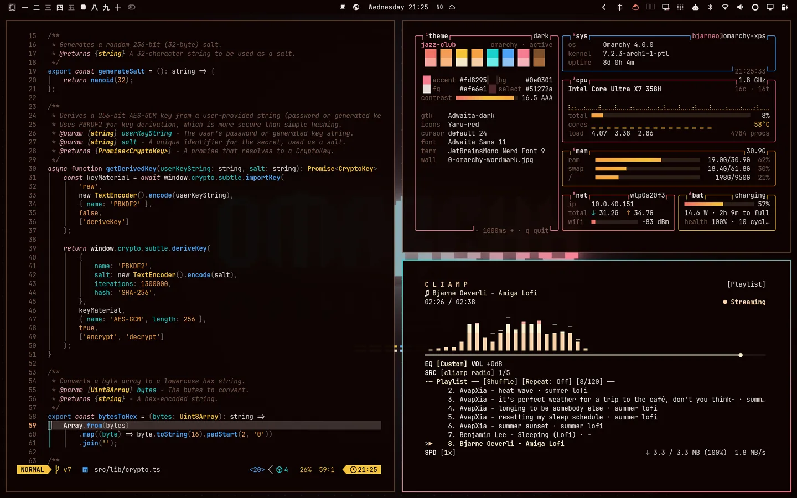](jazz-club/preview.png)

`044` · Folder: [`jazz-club/`](jazz-club/) · [Open in the gallery](https://bjarneo.github.io/100-themes/#jazz-club)

Jazz Club has a dark red background and a pink accent. The ANSI colors use medium chroma for a calmer look. The native background shows layered sound wave ribbons.

| Key | Value |
| --- | --- |
| `background` | `#0e0301` |
| `foreground` | `#efe6e1` |
| `accent` | `#fd8295` |
| `selection` | `#51272a` |
| Icon theme | `Yaru-red` |
| Backgrounds | [`0-omarchy-wordmark.jpg`](jazz-club/backgrounds/0-omarchy-wordmark.jpg), [`1-waveform.jpg`](jazz-club/backgrounds/1-waveform.jpg) |

<details>
<summary>All 16 ANSI colors</summary>

| # | Normal | # | Bright |
| --- | --- | --- | --- |
| 0 black | `#1c0d06` | 8 bright black | `#7c5a4c` |
| 1 red | `#f9786b` | 9 bright red | `#feaba1` |
| 2 green | `#fea844` | 10 bright green | `#fed6ad` |
| 3 yellow | `#fdc93a` | 11 bright yellow | `#fff1d0` |
| 4 blue | `#4eaafe` | 12 bright blue | `#96c9fc` |
| 5 magenta | `#fd8295` | 13 bright magenta | `#fdb9c0` |
| 6 cyan | `#19d9d2` | 14 bright cyan | `#6ef7f1` |
| 7 white | `#d3c8c3` | 15 bright white | `#fdf9f7` |

</details>

```bash
curl -fsSL https://bjarneo.github.io/100-themes/install.sh | bash -s -- jazz-club --set
```

### Blues

[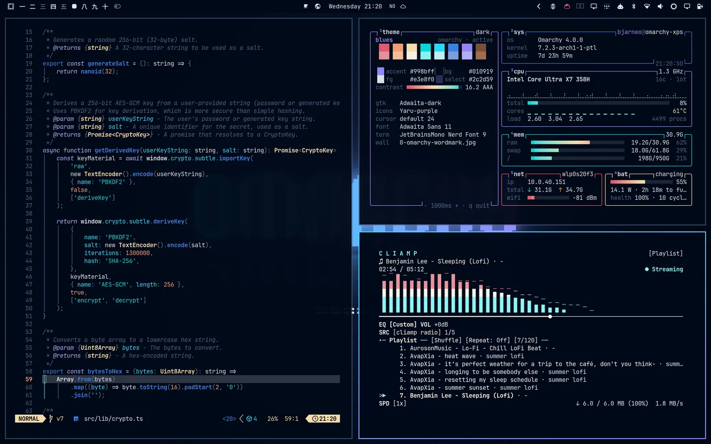](blues/preview.png)

`045` · Folder: [`blues/`](blues/) · [Open in the gallery](https://bjarneo.github.io/100-themes/#blues)

Blues has a dark blue background and a indigo accent. The ANSI colors use medium chroma for a calmer look. The native background shows layered sound wave ribbons.

| Key | Value |
| --- | --- |
| `background` | `#010919` |
| `foreground` | `#e3e8f0` |
| `accent` | `#998bff` |
| `selection` | `#2c2d59` |
| Icon theme | `Yaru-purple` |
| Backgrounds | [`0-omarchy-wordmark.jpg`](blues/backgrounds/0-omarchy-wordmark.jpg), [`1-waveform.jpg`](blues/backgrounds/1-waveform.jpg) |

<details>
<summary>All 16 ANSI colors</summary>

| # | Normal | # | Bright |
| --- | --- | --- | --- |
| 0 black | `#091628` | 8 bright black | `#4c6585` |
| 1 red | `#e65e74` | 9 bright red | `#ea969f` |
| 2 green | `#05e0dd` | 10 bright green | `#8efaf7` |
| 3 yellow | `#fee5b3` | 11 bright yellow | `#fff8e9` |
| 4 blue | `#3d84ea` | 12 bright blue | `#7da6e4` |
| 5 magenta | `#998bff` | 13 bright magenta | `#b9b4fc` |
| 6 cyan | `#2ae2ff` | 14 bright cyan | `#c5f5ff` |
| 7 white | `#c4cbd4` | 15 bright white | `#f8fafd` |

</details>

```bash
curl -fsSL https://bjarneo.github.io/100-themes/install.sh | bash -s -- blues --set
```

### Disco

[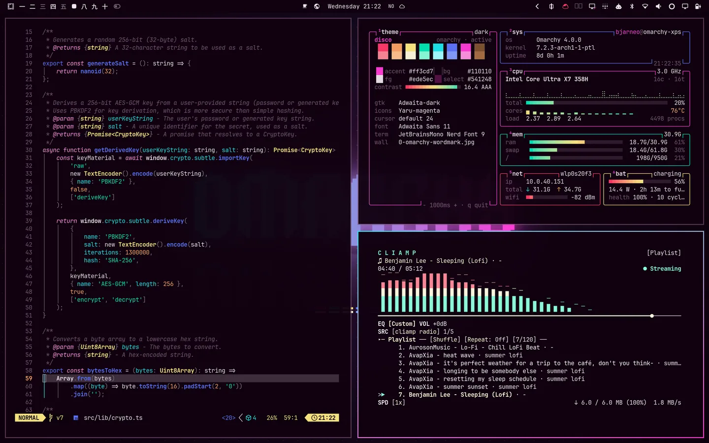](disco/preview.png)

`046` · Folder: [`disco/`](disco/) · [Open in the gallery](https://bjarneo.github.io/100-themes/#disco)

Disco has a dark magenta background and a magenta accent. The ANSI colors use very high chroma for a strong neon look. The native background shows neon tube shapes on a brick wall.

| Key | Value |
| --- | --- |
| `background` | `#110110` |
| `foreground` | `#ede5ec` |
| `accent` | `#ff3cd7` |
| `selection` | `#541248` |
| Icon theme | `Yaru-magenta` |
| Backgrounds | [`0-omarchy-wordmark.jpg`](disco/backgrounds/0-omarchy-wordmark.jpg), [`1-tubes.jpg`](disco/backgrounds/1-tubes.jpg) |

<details>
<summary>All 16 ANSI colors</summary>

| # | Normal | # | Bright |
| --- | --- | --- | --- |
| 0 black | `#200a1e` | 8 bright black | `#7a5476` |
| 1 red | `#fe3968` | 9 bright red | `#fe8896` |
| 2 green | `#03e5b7` | 10 bright green | `#8bfeda` |
| 3 yellow | `#ffe983` | 11 bright yellow | `#fff9dd` |
| 4 blue | `#5e76fc` | 12 bright blue | `#859dfe` |
| 5 magenta | `#ff3cd7` | 13 bright magenta | `#fe93e1` |
| 6 cyan | `#1ce6e9` | 14 bright cyan | `#a2feff` |
| 7 white | `#d0c7cf` | 15 bright white | `#fcf9fc` |

</details>

```bash
curl -fsSL https://bjarneo.github.io/100-themes/install.sh | bash -s -- disco --set
```

### Funk

[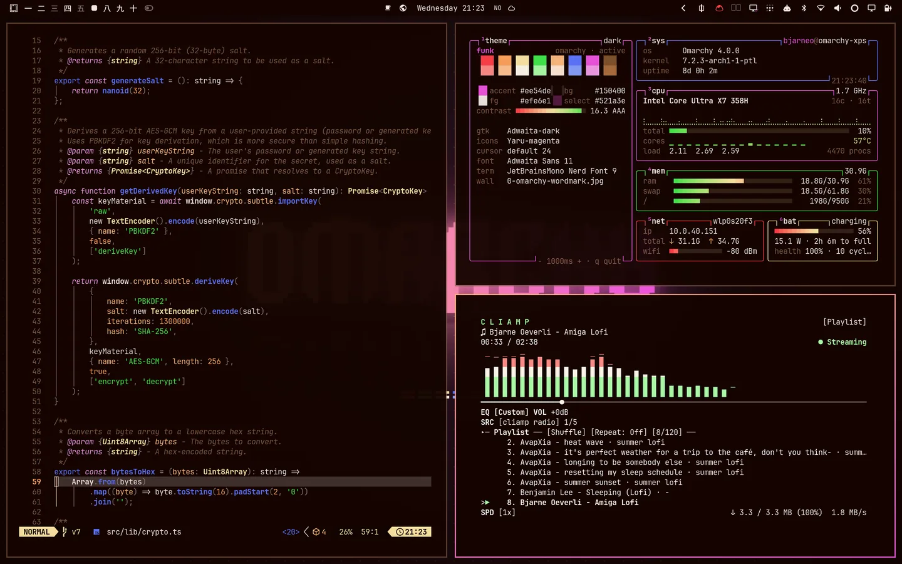](funk/preview.png)

`047` · Folder: [`funk/`](funk/) · [Open in the gallery](https://bjarneo.github.io/100-themes/#funk)

Funk has a dark brown background and a magenta accent. The ANSI colors are saturated and bright. The native background shows layered sound wave ribbons.

| Key | Value |
| --- | --- |
| `background` | `#150400` |
| `foreground` | `#efe6e1` |
| `accent` | `#ee54de` |
| `selection` | `#521a3e` |
| Icon theme | `Yaru-magenta` |
| Backgrounds | [`0-omarchy-wordmark.jpg`](funk/backgrounds/0-omarchy-wordmark.jpg), [`1-waveform.jpg`](funk/backgrounds/1-waveform.jpg) |

<details>
<summary>All 16 ANSI colors</summary>

| # | Normal | # | Bright |
| --- | --- | --- | --- |
| 0 black | `#241005` | 8 bright black | `#7f5944` |
| 1 red | `#fe4048` | 9 bright red | `#fd8c86` |
| 2 green | `#43e94b` | 10 bright green | `#abfda8` |
| 3 yellow | `#fee6a6` | 11 bright yellow | `#fef8e7` |
| 4 blue | `#5e75ff` | 12 bright blue | `#879efb` |
| 5 magenta | `#ee54de` | 13 bright magenta | `#f19be5` |
| 6 cyan | `#feba7e` | 14 bright cyan | `#ffe6d2` |
| 7 white | `#d3c8c2` | 15 bright white | `#fdf9f7` |

</details>

```bash
curl -fsSL https://bjarneo.github.io/100-themes/install.sh | bash -s -- funk --set
```

### Soul

[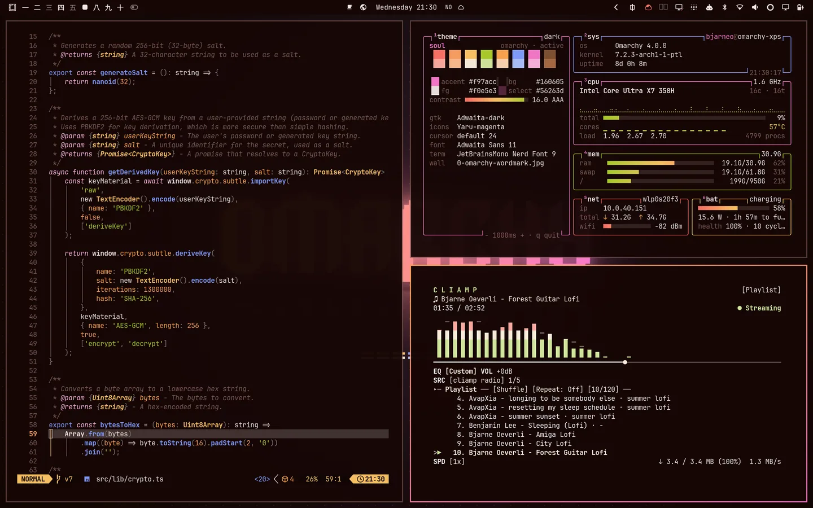](soul/preview.png)

`048` · Folder: [`soul/`](soul/) · [Open in the gallery](https://bjarneo.github.io/100-themes/#soul)

Soul has a dark red background and a magenta accent. The ANSI colors use medium chroma for a calmer look. The native background shows layered sound wave ribbons.

| Key | Value |
| --- | --- |
| `background` | `#160605` |
| `foreground` | `#f0e5e3` |
| `accent` | `#f97acc` |
| `selection` | `#56263d` |
| Icon theme | `Yaru-magenta` |
| Backgrounds | [`0-omarchy-wordmark.jpg`](soul/backgrounds/0-omarchy-wordmark.jpg), [`1-waveform.jpg`](soul/backgrounds/1-waveform.jpg) |

<details>
<summary>All 16 ANSI colors</summary>

| # | Normal | # | Bright |
| --- | --- | --- | --- |
| 0 black | `#241310` | 8 bright black | `#7d5952` |
| 1 red | `#fd7467` | 9 bright red | `#ffaba0` |
| 2 green | `#adce2c` | 10 bright green | `#d3e99d` |
| 3 yellow | `#ffc667` | 11 bright yellow | `#fdf0db` |
| 4 blue | `#829eff` | 12 bright blue | `#aec2fd` |
| 5 magenta | `#f97acc` | 13 bright magenta | `#fdb4e0` |
| 6 cyan | `#ffa750` | 14 bright cyan | `#ffd5b1` |
| 7 white | `#d4c7c5` | 15 bright white | `#fdf9f8` |

</details>

```bash
curl -fsSL https://bjarneo.github.io/100-themes/install.sh | bash -s -- soul --set
```

### Reggae

[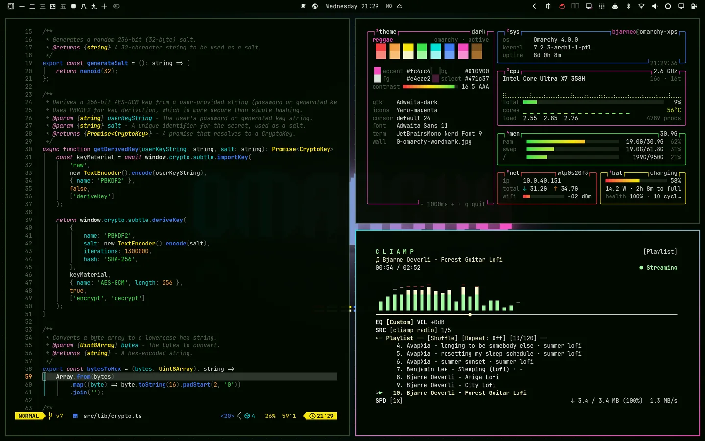](reggae/preview.png)

`049` · Folder: [`reggae/`](reggae/) · [Open in the gallery](https://bjarneo.github.io/100-themes/#reggae)

Reggae has a dark green background and a magenta accent. The ANSI colors are saturated and bright. The native background shows layered sound wave ribbons.

| Key | Value |
| --- | --- |
| `background` | `#010900` |
| `foreground` | `#e4eae2` |
| `accent` | `#fc4cc4` |
| `selection` | `#471c37` |
| Icon theme | `Yaru-magenta` |
| Backgrounds | [`0-omarchy-wordmark.jpg`](reggae/backgrounds/0-omarchy-wordmark.jpg), [`1-waveform.jpg`](reggae/backgrounds/1-waveform.jpg) |

<details>
<summary>All 16 ANSI colors</summary>

| # | Normal | # | Bright |
| --- | --- | --- | --- |
| 0 black | `#071605` | 8 bright black | `#516c4b` |
| 1 red | `#fe4141` | 9 bright red | `#fd8c82` |
| 2 green | `#3fe94d` | 10 bright green | `#a5fea4` |
| 3 yellow | `#ffed0d` | 11 bright yellow | `#fffbce` |
| 4 blue | `#427dfc` | 12 bright blue | `#74a2fe` |
| 5 magenta | `#fc4cc4` | 13 bright magenta | `#ff95d7` |
| 6 cyan | `#04e8df` | 14 bright cyan | `#a3fff8` |
| 7 white | `#c6cdc4` | 15 bright white | `#f8fbf8` |

</details>

```bash
curl -fsSL https://bjarneo.github.io/100-themes/install.sh | bash -s -- reggae --set
```

### Ambient

[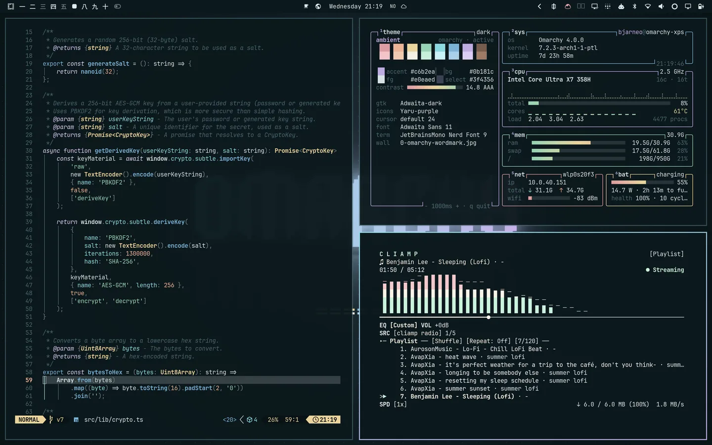](ambient/preview.png)

`050` · Folder: [`ambient/`](ambient/) · [Open in the gallery](https://bjarneo.github.io/100-themes/#ambient)

Ambient has a dark cyan background and a violet accent. The ANSI colors are light pastels with high lightness and low chroma. The native background shows an aurora over a mountain lake.

| Key | Value |
| --- | --- |
| `background` | `#0b181c` |
| `foreground` | `#e0eaed` |
| `accent` | `#c6b2ea` |
| `selection` | `#3f4356` |
| Icon theme | `Yaru-purple` |
| Backgrounds | [`0-omarchy-wordmark.jpg`](ambient/backgrounds/0-omarchy-wordmark.jpg), [`1-aurora.jpg`](ambient/backgrounds/1-aurora.jpg) |

<details>
<summary>All 16 ANSI colors</summary>

| # | Normal | # | Bright |
| --- | --- | --- | --- |
| 0 black | `#19262b` | 8 bright black | `#496973` |
| 1 red | `#e6a3a8` | 9 bright red | `#f9cacd` |
| 2 green | `#9cdbb9` | 10 bright green | `#cdf7df` |
| 3 yellow | `#f4dca1` | 11 bright yellow | `#fef8ea` |
| 4 blue | `#7fb9de` | 12 bright blue | `#b0d7f0` |
| 5 magenta | `#c6b2ea` | 13 bright magenta | `#e3d6fd` |
| 6 cyan | `#90e1e7` | 14 bright cyan | `#d0fbfe` |
| 7 white | `#c0cdd1` | 15 bright white | `#f7fbfc` |

</details>

```bash
curl -fsSL https://bjarneo.github.io/100-themes/install.sh | bash -s -- ambient --set
```

### Midnight

[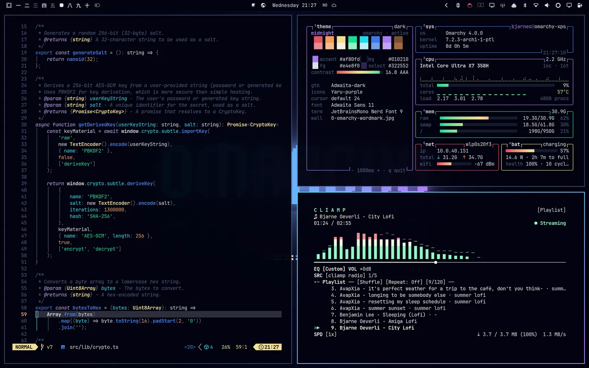](midnight/preview.png)

`051` · Folder: [`midnight/`](midnight/) · [Open in the gallery](https://bjarneo.github.io/100-themes/#midnight)

Midnight has a dark blue background and a violet accent. The ANSI colors use medium chroma for a calmer look. The native background shows a nebula in a star field.

| Key | Value |
| --- | --- |
| `background` | `#010210` |
| `foreground` | `#e4e8f0` |
| `accent` | `#af80fd` |
| `selection` | `#322552` |
| Icon theme | `Yaru-purple` |
| Backgrounds | [`0-omarchy-wordmark.jpg`](midnight/backgrounds/0-omarchy-wordmark.jpg), [`1-nebula.jpg`](midnight/backgrounds/1-nebula.jpg) |

<details>
<summary>All 16 ANSI colors</summary>

| # | Normal | # | Bright |
| --- | --- | --- | --- |
| 0 black | `#050c1e` | 8 bright black | `#526386` |
| 1 red | `#eb5968` | 9 bright red | `#f59094` |
| 2 green | `#13e79d` | 10 bright green | `#95feca` |
| 3 yellow | `#fee799` | 11 bright yellow | `#fff9e4` |
| 4 blue | `#4181f1` | 12 bright blue | `#78a5f1` |
| 5 magenta | `#af80fd` | 13 bright magenta | `#c8adff` |
| 6 cyan | `#20e4f7` | 14 bright cyan | `#bff7fe` |
| 7 white | `#c6cbd5` | 15 bright white | `#f8fafe` |

</details>

```bash
curl -fsSL https://bjarneo.github.io/100-themes/install.sh | bash -s -- midnight --set
```

### Dawn

[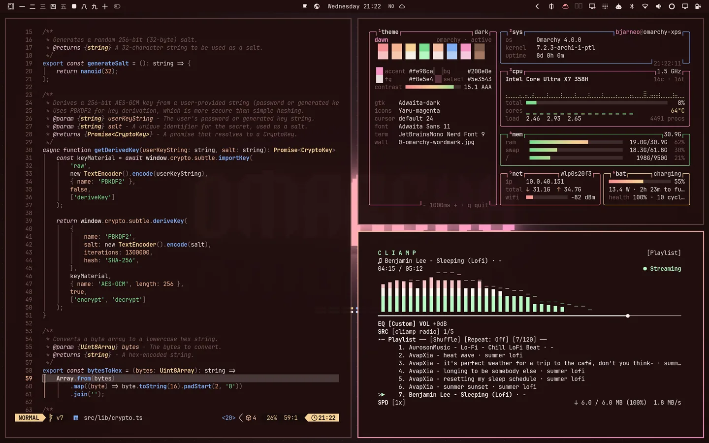](dawn/preview.png)

`052` · Folder: [`dawn/`](dawn/) · [Open in the gallery](https://bjarneo.github.io/100-themes/#dawn)

Dawn has a dark red background and a pink accent. The ANSI colors are light pastels with high lightness and low chroma. The native background shows an aurora over a mountain lake.

| Key | Value |
| --- | --- |
| `background` | `#200e0e` |
| `foreground` | `#f0e5e4` |
| `accent` | `#fe98ca` |
| `selection` | `#5e3543` |
| Icon theme | `Yaru-magenta` |
| Backgrounds | [`0-omarchy-wordmark.jpg`](dawn/backgrounds/0-omarchy-wordmark.jpg), [`1-aurora.jpg`](dawn/backgrounds/1-aurora.jpg) |

<details>
<summary>All 16 ANSI colors</summary>

| # | Normal | # | Bright |
| --- | --- | --- | --- |
| 0 black | `#2f1c1c` | 8 bright black | `#7d5857` |
| 1 red | `#fd9598` | 9 bright red | `#fdc8c8` |
| 2 green | `#7ce695` | 10 bright green | `#bbffc8` |
| 3 yellow | `#ffd899` | 11 bright yellow | `#fef8ee` |
| 4 blue | `#83b2fd` | 12 bright blue | `#b8d3fc` |
| 5 magenta | `#fe98ca` | 13 bright magenta | `#fecfe4` |
| 6 cyan | `#fdc2a3` | 14 bright cyan | `#feeee7` |
| 7 white | `#d4c7c6` | 15 bright white | `#fdf9f9` |

</details>

```bash
curl -fsSL https://bjarneo.github.io/100-themes/install.sh | bash -s -- dawn --set
```

### Dusk

[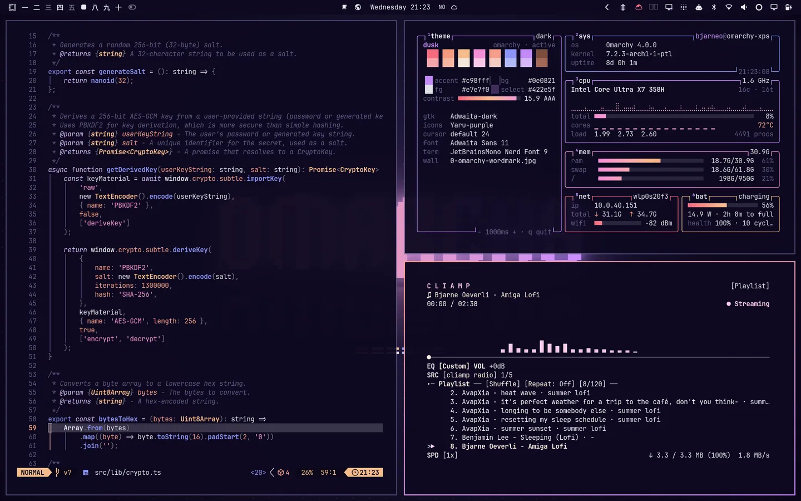](dusk/preview.png)

`053` · Folder: [`dusk/`](dusk/) · [Open in the gallery](https://bjarneo.github.io/100-themes/#dusk)

Dusk has a dark indigo background and a violet accent. The ANSI colors are saturated and bright. The native background shows a neon sun over a perspective grid.

| Key | Value |
| --- | --- |
| `background` | `#0e0821` |
| `foreground` | `#e7e7f0` |
| `accent` | `#c98fff` |
| `selection` | `#422e5f` |
| Icon theme | `Yaru-purple` |
| Backgrounds | [`0-omarchy-wordmark.jpg`](dusk/backgrounds/0-omarchy-wordmark.jpg), [`1-sunset-grid.jpg`](dusk/backgrounds/1-sunset-grid.jpg) |

<details>
<summary>All 16 ANSI colors</summary>

| # | Normal | # | Bright |
| --- | --- | --- | --- |
| 0 black | `#1b1630` | 8 bright black | `#625c89` |
| 1 red | `#fe6f83` | 9 bright red | `#fdaab1` |
| 2 green | `#ff94dd` | 10 bright green | `#ffcdec` |
| 3 yellow | `#ffc390` | 11 bright yellow | `#feefe2` |
| 4 blue | `#919afe` | 12 bright blue | `#b6bffe` |
| 5 magenta | `#c98fff` | 13 bright magenta | `#debeff` |
| 6 cyan | `#ffa28f` | 14 bright cyan | `#fdd3ca` |
| 7 white | `#cac9d4` | 15 bright white | `#fafafd` |

</details>

```bash
curl -fsSL https://bjarneo.github.io/100-themes/install.sh | bash -s -- dusk --set
```

### Aurora

[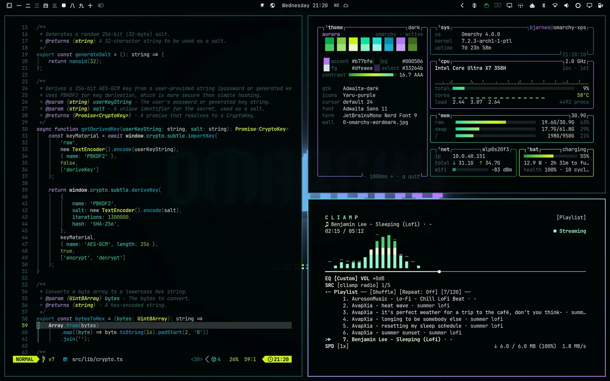](aurora/preview.png)

`054` · Folder: [`aurora/`](aurora/) · [Open in the gallery](https://bjarneo.github.io/100-themes/#aurora)

Aurora has a dark cyan background and a violet accent. The ANSI colors are saturated and bright. The native background shows an aurora over a mountain lake.

| Key | Value |
| --- | --- |
| `background` | `#000506` |
| `foreground` | `#dfeaea` |
| `accent` | `#b77bfe` |
| `selection` | `#33264b` |
| Icon theme | `Yaru-purple` |
| Backgrounds | [`0-omarchy-wordmark.jpg`](aurora/backgrounds/0-omarchy-wordmark.jpg), [`1-aurora.jpg`](aurora/backgrounds/1-aurora.jpg) |

<details>
<summary>All 16 ANSI colors</summary>

| # | Normal | # | Bright |
| --- | --- | --- | --- |
| 0 black | `#001111` | 8 bright black | `#356e6e` |
| 1 red | `#0caf4b` | 9 bright red | `#4ccf6e` |
| 2 green | `#15e6a8` | 10 bright green | `#8fffd0` |
| 3 yellow | `#d5fc10` | 11 bright yellow | `#f3ffd7` |
| 4 blue | `#0096af` | 12 bright blue | `#1bb7d5` |
| 5 magenta | `#b77bfe` | 13 bright magenta | `#ceaaff` |
| 6 cyan | `#1be9d7` | 14 bright cyan | `#a5fff3` |
| 7 white | `#c0cecd` | 15 bright white | `#f6fbfb` |

</details>

```bash
curl -fsSL https://bjarneo.github.io/100-themes/install.sh | bash -s -- aurora --set
```

### Nebula

[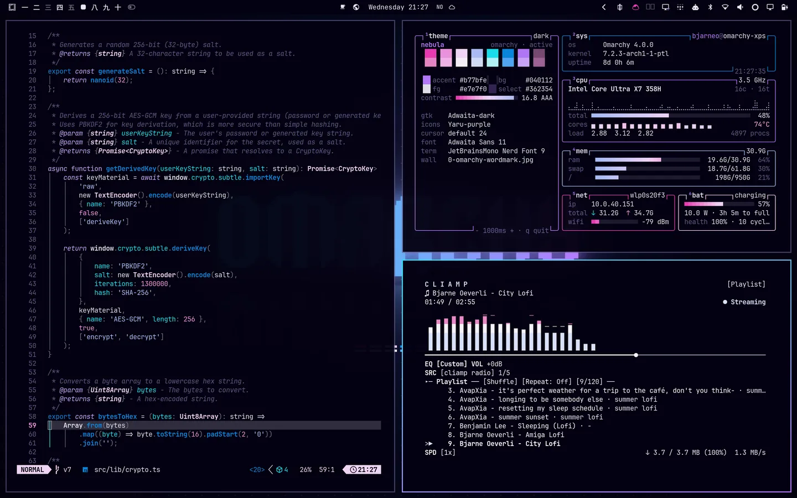](nebula/preview.png)

`055` · Folder: [`nebula/`](nebula/) · [Open in the gallery](https://bjarneo.github.io/100-themes/#nebula)

Nebula has a dark indigo background and a violet accent. The ANSI colors are saturated and bright. The native background shows a nebula in a star field.

| Key | Value |
| --- | --- |
| `background` | `#040112` |
| `foreground` | `#e7e7f0` |
| `accent` | `#b77bfe` |
| `selection` | `#362354` |
| Icon theme | `Yaru-purple` |
| Backgrounds | [`0-omarchy-wordmark.jpg`](nebula/backgrounds/0-omarchy-wordmark.jpg), [`1-nebula.jpg`](nebula/backgrounds/1-nebula.jpg) |

<details>
<summary>All 16 ANSI colors</summary>

| # | Normal | # | Bright |
| --- | --- | --- | --- |
| 0 black | `#0e0821` | 8 bright black | `#625c89` |
| 1 red | `#ed3db9` | 9 bright red | `#ee8bc9` |
| 2 green | `#afc2fc` | 10 bright green | `#dbe4fe` |
| 3 yellow | `#fadcfe` | 11 bright yellow | `#fcf6fd` |
| 4 blue | `#0a8ae3` | 12 bright blue | `#54abf8` |
| 5 magenta | `#b77bfe` | 13 bright magenta | `#ceaafe` |
| 6 cyan | `#1be5f1` | 14 bright cyan | `#b6f9fe` |
| 7 white | `#cac9d4` | 15 bright white | `#fafafd` |

</details>

```bash
curl -fsSL https://bjarneo.github.io/100-themes/install.sh | bash -s -- nebula --set
```

### Galaxy

[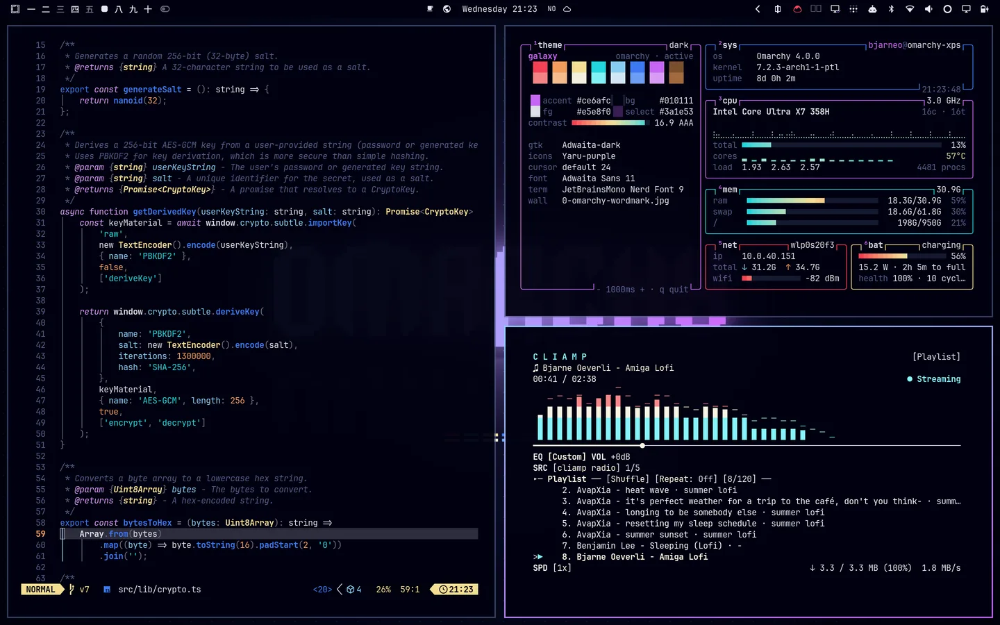](galaxy/preview.png)

`056` · Folder: [`galaxy/`](galaxy/) · [Open in the gallery](https://bjarneo.github.io/100-themes/#galaxy)

Galaxy has a dark indigo background and a violet accent. The ANSI colors are saturated and bright. The native background shows a nebula in a star field.

| Key | Value |
| --- | --- |
| `background` | `#010111` |
| `foreground` | `#e5e8f0` |
| `accent` | `#ce6afc` |
| `selection` | `#3a1e53` |
| Icon theme | `Yaru-purple` |
| Backgrounds | [`0-omarchy-wordmark.jpg`](galaxy/backgrounds/0-omarchy-wordmark.jpg), [`1-nebula.jpg`](galaxy/backgrounds/1-nebula.jpg) |

<details>
<summary>All 16 ANSI colors</summary>

| # | Normal | # | Bright |
| --- | --- | --- | --- |
| 0 black | `#050920` | 8 bright black | `#54618c` |
| 1 red | `#fc4356` | 9 bright red | `#fe8a8b` |
| 2 green | `#23dee4` | 10 bright green | `#87fafe` |
| 3 yellow | `#fee799` | 11 bright yellow | `#fef9e6` |
| 4 blue | `#3f7efc` | 12 bright blue | `#72a3ff` |
| 5 magenta | `#ce6afc` | 13 bright magenta | `#dfa0ff` |
| 6 cyan | `#8ed5fc` | 14 bright cyan | `#d8effd` |
| 7 white | `#c6cad5` | 15 bright white | `#f9fafe` |

</details>

```bash
curl -fsSL https://bjarneo.github.io/100-themes/install.sh | bash -s -- galaxy --set
```

### Supernova

[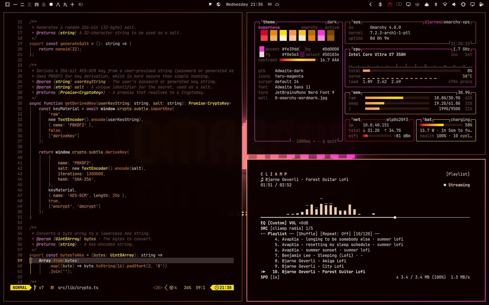](supernova/preview.png)

`057` · Folder: [`supernova/`](supernova/) · [Open in the gallery](https://bjarneo.github.io/100-themes/#supernova)

Supernova has a dark red background and a magenta accent. The ANSI colors use very high chroma for a strong neon look. The native background shows a nebula in a star field.

| Key | Value |
| --- | --- |
| `background` | `#0d0000` |
| `foreground` | `#f0e5e3` |
| `accent` | `#fe39dd` |
| `selection` | `#50103e` |
| Icon theme | `Yaru-magenta` |
| Backgrounds | [`0-omarchy-wordmark.jpg`](supernova/backgrounds/0-omarchy-wordmark.jpg), [`1-nebula.jpg`](supernova/backgrounds/1-nebula.jpg) |

<details>
<summary>All 16 ANSI colors</summary>

| # | Normal | # | Bright |
| --- | --- | --- | --- |
| 0 black | `#1b0604` | 8 bright black | `#82564f` |
| 1 red | `#d4052e` | 9 bright red | `#f5454f` |
| 2 green | `#fd9b5f` | 10 bright green | `#ffcbad` |
| 3 yellow | `#ffe815` | 11 bright yellow | `#fffad3` |
| 4 blue | `#c46c07` | 12 bright blue | `#ef8611` |
| 5 magenta | `#fe39dd` | 13 bright magenta | `#fe93e5` |
| 6 cyan | `#fec92f` | 14 bright cyan | `#fff1cf` |
| 7 white | `#d4c7c5` | 15 bright white | `#fdf9f8` |

</details>

```bash
curl -fsSL https://bjarneo.github.io/100-themes/install.sh | bash -s -- supernova --set
```

### Black Hole

[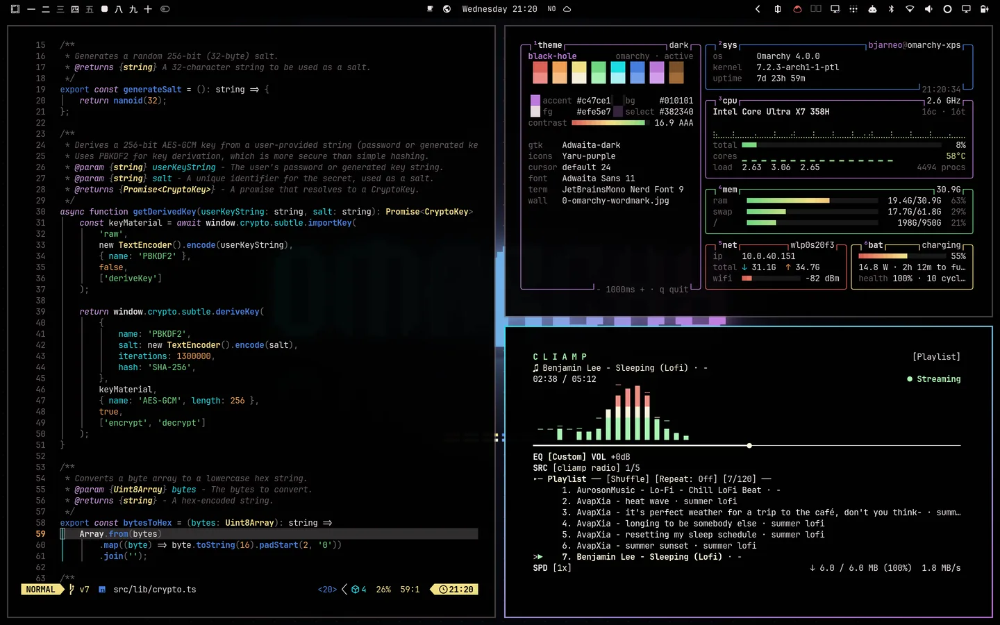](black-hole/preview.png)

`058` · Folder: [`black-hole/`](black-hole/) · [Open in the gallery](https://bjarneo.github.io/100-themes/#black-hole)

Black Hole has a neutral black background and a violet accent. The ANSI colors use medium chroma for a calmer look. The native background shows a black hole with an accretion disk.

| Key | Value |
| --- | --- |
| `background` | `#010101` |
| `foreground` | `#efe5e7` |
| `accent` | `#c47ce1` |
| `selection` | `#382340` |
| Icon theme | `Yaru-purple` |
| Backgrounds | [`0-omarchy-wordmark.jpg`](black-hole/backgrounds/0-omarchy-wordmark.jpg), [`1-planet.jpg`](black-hole/backgrounds/1-planet.jpg) |

<details>
<summary>All 16 ANSI colors</summary>

| # | Normal | # | Bright |
| --- | --- | --- | --- |
| 0 black | `#070707` | 8 bright black | `#6e5f63` |
| 1 red | `#e3655b` | 9 bright red | `#f49288` |
| 2 green | `#74e086` | 10 bright green | `#adfbb7` |
| 3 yellow | `#fee88c` | 11 bright yellow | `#fff9df` |
| 4 blue | `#4a83e5` | 12 bright blue | `#78a5f0` |
| 5 magenta | `#c47ce1` | 13 bright magenta | `#dba6f2` |
| 6 cyan | `#1be6ed` | 14 bright cyan | `#affbfe` |
| 7 white | `#d3c7ca` | 15 bright white | `#fdf9fa` |

</details>

```bash
curl -fsSL https://bjarneo.github.io/100-themes/install.sh | bash -s -- black-hole --set
```

### Mars

[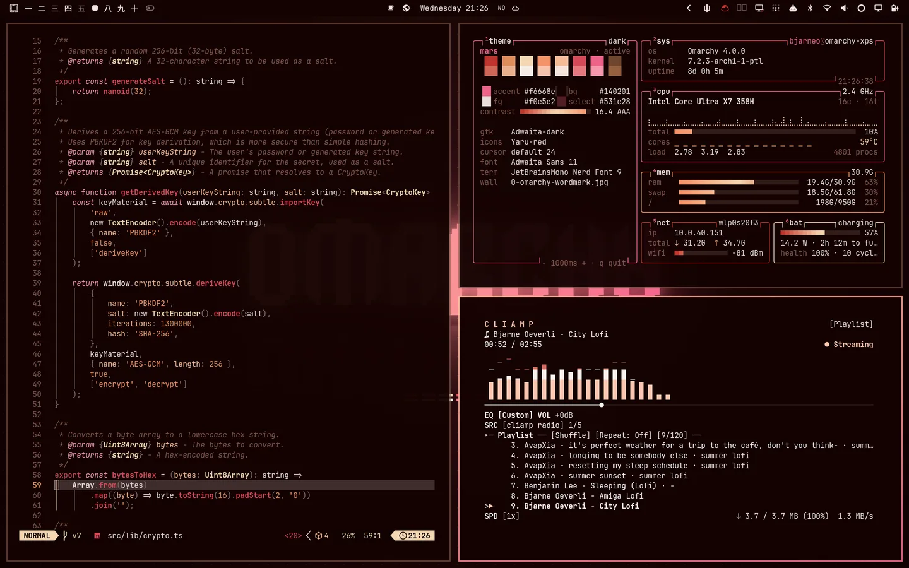](mars/preview.png)

`059` · Folder: [`mars/`](mars/) · [Open in the gallery](https://bjarneo.github.io/100-themes/#mars)

Mars has a dark red background and a pink accent. The ANSI colors use medium chroma for a calmer look. The native background shows a planet in space.

| Key | Value |
| --- | --- |
| `background` | `#140201` |
| `foreground` | `#f0e5e2` |
| `accent` | `#f6668e` |
| `selection` | `#531e28` |
| Icon theme | `Yaru-red` |
| Backgrounds | [`0-omarchy-wordmark.jpg`](mars/backgrounds/0-omarchy-wordmark.jpg), [`1-planet.jpg`](mars/backgrounds/1-planet.jpg) |

<details>
<summary>All 16 ANSI colors</summary>

| # | Normal | # | Bright |
| --- | --- | --- | --- |
| 0 black | `#230c07` | 8 bright black | `#82574c` |
| 1 red | `#c5372e` | 9 bright red | `#d66b5e` |
| 2 green | `#fe996d` | 10 bright green | `#ffcab4` |
| 3 yellow | `#fedfb9` | 11 bright yellow | `#fef7f0` |
| 4 blue | `#dd4c5d` | 12 bright blue | `#ee7e85` |
| 5 magenta | `#f6668e` | 13 bright magenta | `#fe9db3` |
| 6 cyan | `#fec29d` | 14 bright cyan | `#ffeee4` |
| 7 white | `#d4c7c4` | 15 bright white | `#fdf9f8` |

</details>

```bash
curl -fsSL https://bjarneo.github.io/100-themes/install.sh | bash -s -- mars --set
```

### Deep Space

[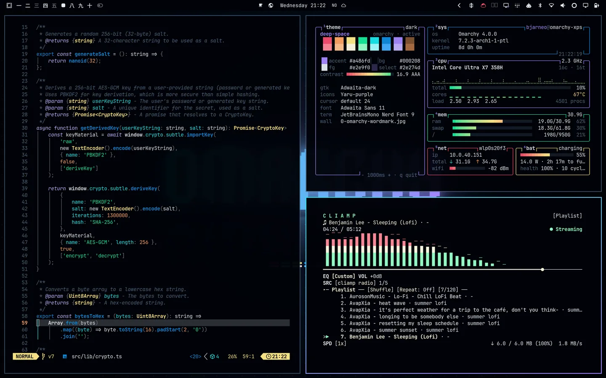](deep-space/preview.png)

`060` · Folder: [`deep-space/`](deep-space/) · [Open in the gallery](https://bjarneo.github.io/100-themes/#deep-space)

Deep Space has a dark blue background and a violet accent. The ANSI colors are saturated and bright. The native background shows a nebula in a star field.

| Key | Value |
| --- | --- |
| `background` | `#000208` |
| `foreground` | `#e2e9f0` |
| `accent` | `#a486fd` |
| `selection` | `#2e274d` |
| Icon theme | `Yaru-purple` |
| Backgrounds | [`0-omarchy-wordmark.jpg`](deep-space/backgrounds/0-omarchy-wordmark.jpg), [`1-nebula.jpg`](deep-space/backgrounds/1-nebula.jpg) |

<details>
<summary>All 16 ANSI colors</summary>

| # | Normal | # | Bright |
| --- | --- | --- | --- |
| 0 black | `#020a15` | 8 bright black | `#4d667f` |
| 1 red | `#f34e6e` | 9 bright red | `#fe8897` |
| 2 green | `#17e798` | 10 bright green | `#94ffc6` |
| 3 yellow | `#ffe887` | 11 bright yellow | `#fff9e1` |
| 4 blue | `#108cdd` | 12 bright blue | `#43acfd` |
| 5 magenta | `#a486fd` | 13 bright magenta | `#c0b1fd` |
| 6 cyan | `#1ce6e9` | 14 bright cyan | `#a2feff` |
| 7 white | `#c3cbd4` | 15 bright white | `#f8fafd` |

</details>

```bash
curl -fsSL https://bjarneo.github.io/100-themes/install.sh | bash -s -- deep-space --set
```

### Lagoon

[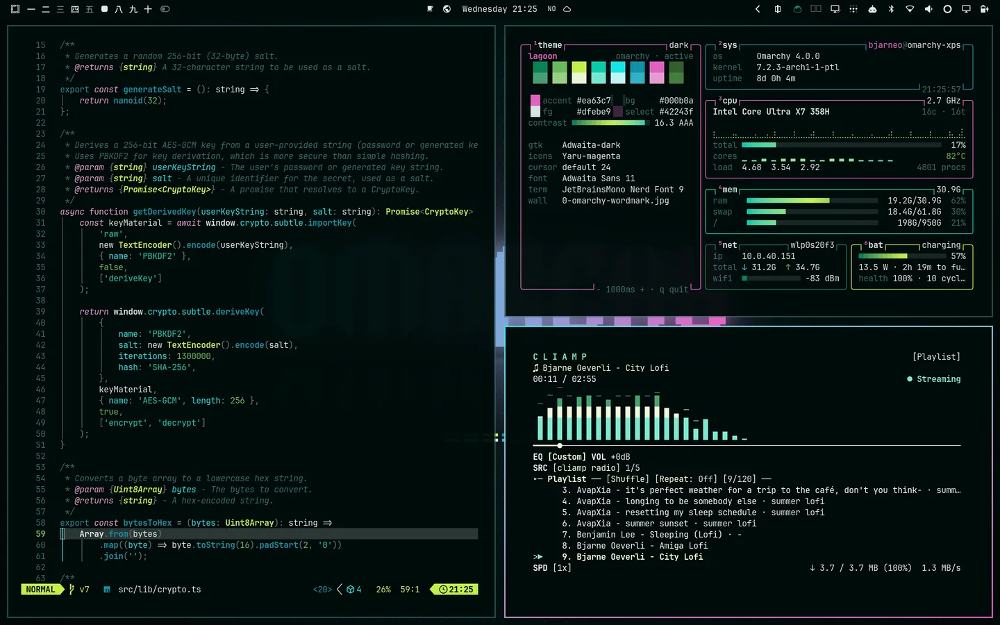](lagoon/preview.png)

`061` · Folder: [`lagoon/`](lagoon/) · [Open in the gallery](https://bjarneo.github.io/100-themes/#lagoon)

Lagoon has a dark teal background and a magenta accent. The ANSI colors are saturated and bright. The native background shows light rays in deep water.

| Key | Value |
| --- | --- |
| `background` | `#000b0a` |
| `foreground` | `#dfebe9` |
| `accent` | `#ea63c7` |
| `selection` | `#42243f` |
| Icon theme | `Yaru-magenta` |
| Backgrounds | [`0-omarchy-wordmark.jpg`](lagoon/backgrounds/0-omarchy-wordmark.jpg), [`1-depths.jpg`](lagoon/backgrounds/1-depths.jpg) |

<details>
<summary>All 16 ANSI colors</summary>

| # | Normal | # | Bright |
| --- | --- | --- | --- |
| 0 black | `#001917` | 8 bright black | `#366e6b` |
| 1 red | `#078756` | 9 bright red | `#48a475` |
| 2 green | `#0dd5b3` | 10 bright green | `#7df0d4` |
| 3 yellow | `#cbf94b` | 11 bright yellow | `#f2ffdb` |
| 4 blue | `#1296ab` | 12 bright blue | `#33b7ce` |
| 5 magenta | `#ea63c7` | 13 bright magenta | `#eea1d6` |
| 6 cyan | `#16eeed` | 14 bright cyan | `#c5fffd` |
| 7 white | `#c0cecd` | 15 bright white | `#f7fbfb` |

</details>

```bash
curl -fsSL https://bjarneo.github.io/100-themes/install.sh | bash -s -- lagoon --set
```

### Coral Reef

[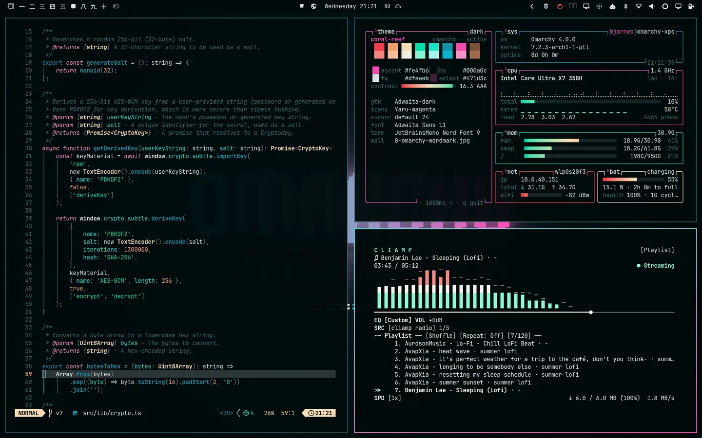](coral-reef/preview.png)

`062` · Folder: [`coral-reef/`](coral-reef/) · [Open in the gallery](https://bjarneo.github.io/100-themes/#coral-reef)

Coral Reef has a dark cyan background and a pink accent. The ANSI colors are saturated and bright. The native background shows light rays in deep water.

| Key | Value |
| --- | --- |
| `background` | `#000a0c` |
| `foreground` | `#dfeaeb` |
| `accent` | `#fe4fb6` |
| `selection` | `#471d3c` |
| Icon theme | `Yaru-magenta` |
| Backgrounds | [`0-omarchy-wordmark.jpg`](coral-reef/backgrounds/0-omarchy-wordmark.jpg), [`1-depths.jpg`](coral-reef/backgrounds/1-depths.jpg) |

<details>
<summary>All 16 ANSI colors</summary>

| # | Normal | # | Bright |
| --- | --- | --- | --- |
| 0 black | `#00181a` | 8 bright black | `#356e71` |
| 1 red | `#fe404c` | 9 bright red | `#fd8b87` |
| 2 green | `#01e5b0` | 10 bright green | `#8efed6` |
| 3 yellow | `#ffe4bc` | 11 bright yellow | `#fef7ee` |
| 4 blue | `#1296ab` | 12 bright blue | `#0cb8d1` |
| 5 magenta | `#fe4fb6` | 13 bright magenta | `#ff97cd` |
| 6 cyan | `#1ee9d6` | 14 bright cyan | `#a9fef2` |
| 7 white | `#c0cece` | 15 bright white | `#f6fbfb` |

</details>

```bash
curl -fsSL https://bjarneo.github.io/100-themes/install.sh | bash -s -- coral-reef --set
```

### Rainforest

[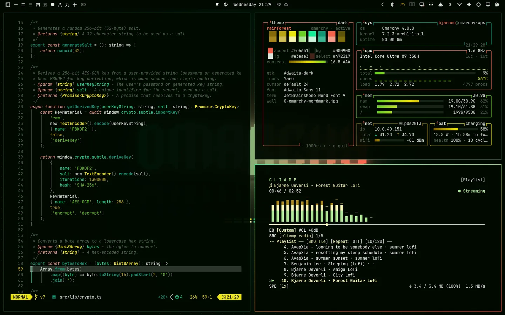](rainforest/preview.png)

`063` · Folder: [`rainforest/`](rainforest/) · [Open in the gallery](https://bjarneo.github.io/100-themes/#rainforest)

Rainforest has a dark green background and a red accent. The ANSI colors are saturated and bright. The native background shows a topographic contour map.

| Key | Value |
| --- | --- |
| `background` | `#000900` |
| `foreground` | `#e3eae3` |
| `accent` | `#fe6651` |
| `selection` | `#472317` |
| Icon theme | `Yaru` |
| Backgrounds | [`0-omarchy-wordmark.jpg`](rainforest/backgrounds/0-omarchy-wordmark.jpg), [`1-contours.jpg`](rainforest/backgrounds/1-contours.jpg) |

<details>
<summary>All 16 ANSI colors</summary>

| # | Normal | # | Bright |
| --- | --- | --- | --- |
| 0 black | `#051606` | 8 bright black | `#4d6d4e` |
| 1 red | `#8b6d08` | 9 bright red | `#ad8b20` |
| 2 green | `#6dd528` | 10 bright green | `#b2eb99` |
| 3 yellow | `#f5ec11` | 11 bright yellow | `#fffdb7` |
| 4 blue | `#119d7b` | 12 bright blue | `#3ebd98` |
| 5 magenta | `#fe6651` | 13 bright magenta | `#fea292` |
| 6 cyan | `#15f79c` | 14 bright cyan | `#d2fee3` |
| 7 white | `#c5cdc5` | 15 bright white | `#f8fbf8` |

</details>

```bash
curl -fsSL https://bjarneo.github.io/100-themes/install.sh | bash -s -- rainforest --set
```

### Desert

[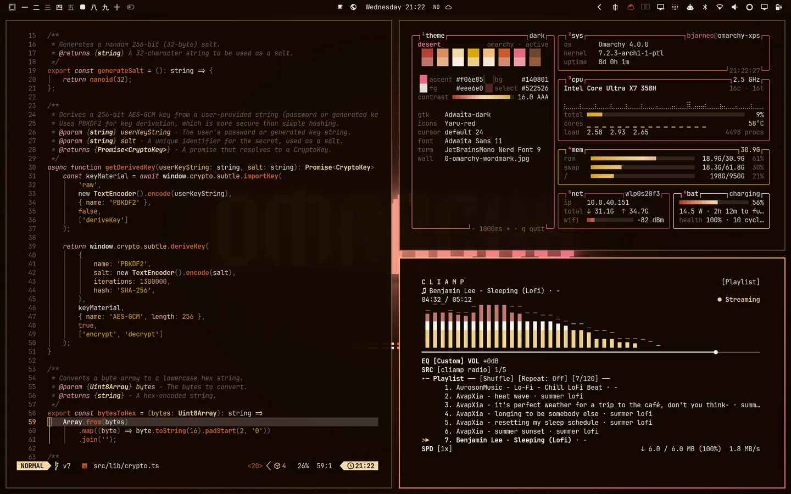](desert/preview.png)

`064` · Folder: [`desert/`](desert/) · [Open in the gallery](https://bjarneo.github.io/100-themes/#desert)

Desert has a dark brown background and a pink accent. The ANSI colors use medium chroma for a calmer look. The native background shows embers that rise over dunes.

| Key | Value |
| --- | --- |
| `background` | `#140801` |
| `foreground` | `#eee6e0` |
| `accent` | `#f06e85` |
| `selection` | `#522526` |
| Icon theme | `Yaru-red` |
| Backgrounds | [`0-omarchy-wordmark.jpg`](desert/backgrounds/0-omarchy-wordmark.jpg), [`1-embers.jpg`](desert/backgrounds/1-embers.jpg) |

<details>
<summary>All 16 ANSI colors</summary>

| # | Normal | # | Bright |
| --- | --- | --- | --- |
| 0 black | `#221509` | 8 bright black | `#775e45` |
| 1 red | `#bd4238` | 9 bright red | `#c3786d` |
| 2 green | `#e4af00` | 10 bright green | `#f4d48c` |
| 3 yellow | `#fee0ac` | 11 bright yellow | `#fef8ec` |
| 4 blue | `#d35e2c` | 12 bright blue | `#d99074` |
| 5 magenta | `#f06e85` | 13 bright magenta | `#f5a4ae` |
| 6 cyan | `#fdc583` | 14 bright cyan | `#feefdf` |
| 7 white | `#d2c9c1` | 15 bright white | `#fdf9f7` |

</details>

```bash
curl -fsSL https://bjarneo.github.io/100-themes/install.sh | bash -s -- desert --set
```

### Volcano

[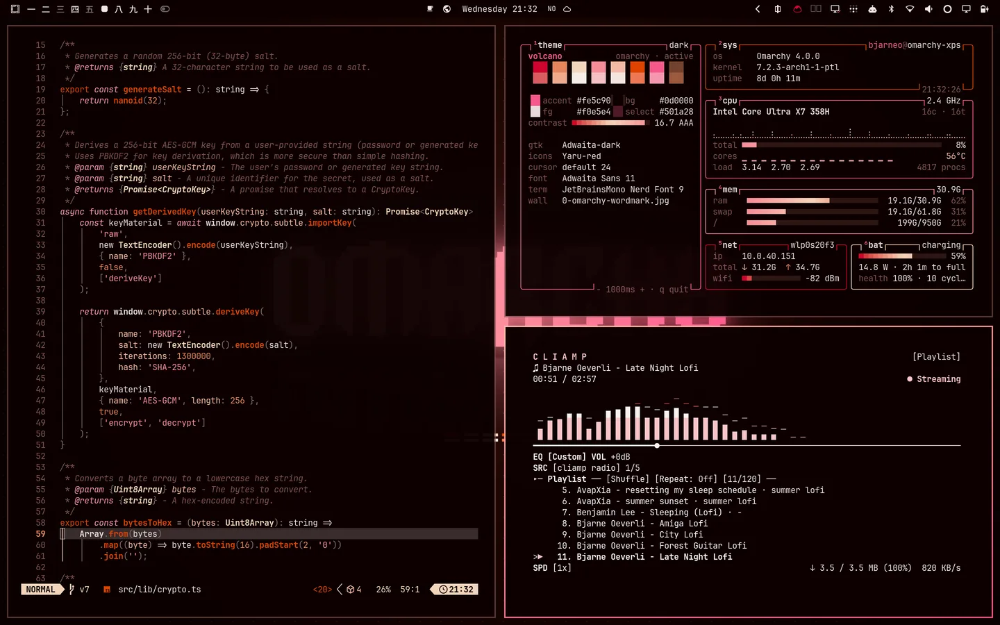](volcano/preview.png)

`065` · Folder: [`volcano/`](volcano/) · [Open in the gallery](https://bjarneo.github.io/100-themes/#volcano)

Volcano has a dark red background and a pink accent. The 6 ANSI hues stay close to pink, so the palette reads as one color. The native background shows embers that rise over dunes.

| Key | Value |
| --- | --- |
| `background` | `#0d0000` |
| `foreground` | `#f0e5e4` |
| `accent` | `#fe5c90` |
| `selection` | `#501a28` |
| Icon theme | `Yaru-red` |
| Backgrounds | [`0-omarchy-wordmark.jpg`](volcano/backgrounds/0-omarchy-wordmark.jpg), [`1-embers.jpg`](volcano/backgrounds/1-embers.jpg) |

<details>
<summary>All 16 ANSI colors</summary>

| # | Normal | # | Bright |
| --- | --- | --- | --- |
| 0 black | `#1b0605` | 8 bright black | `#825652` |
| 1 red | `#d4052f` | 9 bright red | `#e06061` |
| 2 green | `#ff939e` | 10 bright green | `#fdc8cb` |
| 3 yellow | `#fddec3` | 11 bright yellow | `#fef7f1` |
| 4 blue | `#e64700` | 12 bright blue | `#f77c56` |
| 5 magenta | `#fe5c90` | 13 bright magenta | `#ff9cb5` |
| 6 cyan | `#fdc1ab` | 14 bright cyan | `#ffeee7` |
| 7 white | `#d4c7c6` | 15 bright white | `#fdf9f8` |

</details>

```bash
curl -fsSL https://bjarneo.github.io/100-themes/install.sh | bash -s -- volcano --set
```

### Tundra

[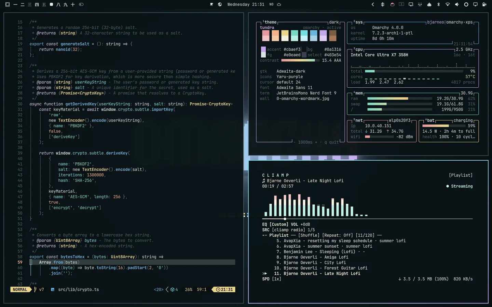](tundra/preview.png)

`066` · Folder: [`tundra/`](tundra/) · [Open in the gallery](https://bjarneo.github.io/100-themes/#tundra)

Tundra has a dark blue background and a violet accent. The ANSI colors are light pastels with high lightness and low chroma. The native background shows an aurora over a mountain lake.

| Key | Value |
| --- | --- |
| `background` | `#0a1316` |
| `foreground` | `#e0eaed` |
| `accent` | `#cbaef3` |
| `selection` | `#403e54` |
| Icon theme | `Yaru-purple` |
| Backgrounds | [`0-omarchy-wordmark.jpg`](tundra/backgrounds/0-omarchy-wordmark.jpg), [`1-aurora.jpg`](tundra/backgrounds/1-aurora.jpg) |

<details>
<summary>All 16 ANSI colors</summary>

| # | Normal | # | Bright |
| --- | --- | --- | --- |
| 0 black | `#172124` | 8 bright black | `#4d6871` |
| 1 red | `#f09da2` | 9 bright red | `#fbc9cb` |
| 2 green | `#7ce0ca` | 10 bright green | `#c3f8eb` |
| 3 yellow | `#f4dd90` | 11 bright yellow | `#fef9e4` |
| 4 blue | `#6cbce7` | 12 bright blue | `#add8f1` |
| 5 magenta | `#cbaef3` | 13 bright magenta | `#e6d5fe` |
| 6 cyan | `#79e5e9` | 14 bright cyan | `#cafdfe` |
| 7 white | `#c0cdd1` | 15 bright white | `#f7fbfc` |

</details>

```bash
curl -fsSL https://bjarneo.github.io/100-themes/install.sh | bash -s -- tundra --set
```

### Swamp

[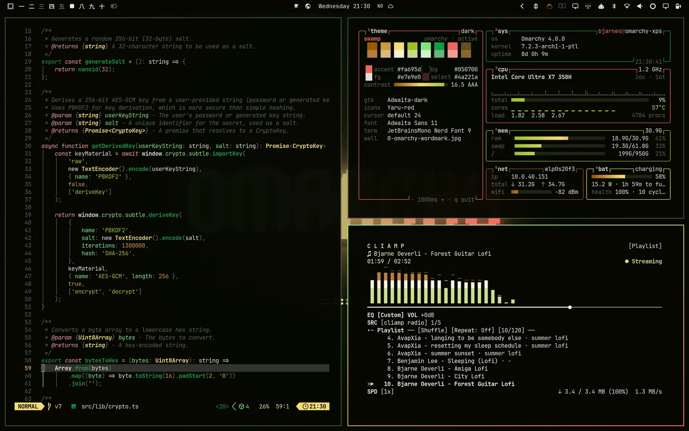](swamp/preview.png)

`067` · Folder: [`swamp/`](swamp/) · [Open in the gallery](https://bjarneo.github.io/100-themes/#swamp)

Swamp has a dark olive green background and a red accent. The ANSI colors use medium chroma for a calmer look. The native background shows a topographic contour map.

| Key | Value |
| --- | --- |
| `background` | `#050700` |
| `foreground` | `#e7e9e0` |
| `accent` | `#fa695d` |
| `selection` | `#4a221a` |
| Icon theme | `Yaru-red` |
| Backgrounds | [`0-omarchy-wordmark.jpg`](swamp/backgrounds/0-omarchy-wordmark.jpg), [`1-contours.jpg`](swamp/backgrounds/1-contours.jpg) |

<details>
<summary>All 16 ANSI colors</summary>

| # | Normal | # | Bright |
| --- | --- | --- | --- |
| 0 black | `#101305` | 8 bright black | `#5f6847` |
| 1 red | `#a35e01` | 9 bright red | `#bf7f41` |
| 2 green | `#a7c81f` | 10 bright green | `#cce38f` |
| 3 yellow | `#ffe47a` | 11 bright yellow | `#fff9e2` |
| 4 blue | `#0fa143` | 12 bright blue | `#72b87d` |
| 5 magenta | `#fa695d` | 13 bright magenta | `#fda296` |
| 6 cyan | `#86ee7c` | 14 bright cyan | `#d7ffd3` |
| 7 white | `#c9ccc1` | 15 bright white | `#f9fbf7` |

</details>

```bash
curl -fsSL https://bjarneo.github.io/100-themes/install.sh | bash -s -- swamp --set
```

### Mushroom

[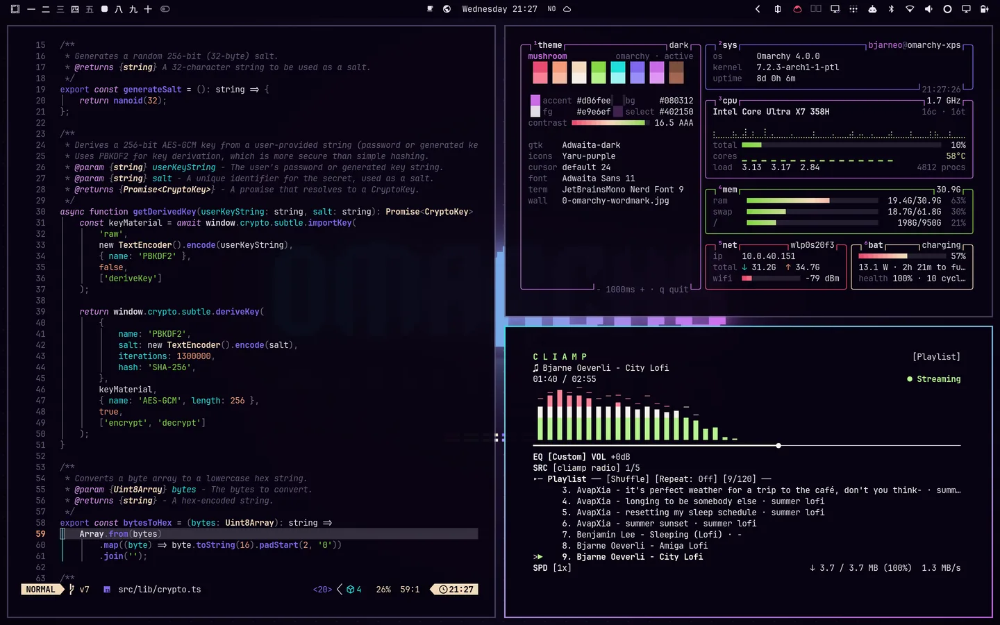](mushroom/preview.png)

`068` · Folder: [`mushroom/`](mushroom/) · [Open in the gallery](https://bjarneo.github.io/100-themes/#mushroom)

Mushroom has a dark violet background and a violet accent. The ANSI colors are saturated and bright. The native background shows a topographic contour map.

| Key | Value |
| --- | --- |
| `background` | `#080312` |
| `foreground` | `#e9e6ef` |
| `accent` | `#d06fee` |
| `selection` | `#402150` |
| Icon theme | `Yaru-purple` |
| Backgrounds | [`0-omarchy-wordmark.jpg`](mushroom/backgrounds/0-omarchy-wordmark.jpg), [`1-contours.jpg`](mushroom/backgrounds/1-contours.jpg) |

<details>
<summary>All 16 ANSI colors</summary>

| # | Normal | # | Bright |
| --- | --- | --- | --- |
| 0 black | `#140d20` | 8 bright black | `#685c81` |
| 1 red | `#f24e75` | 9 bright red | `#ff869b` |
| 2 green | `#8bdf47` | 10 bright green | `#bafb90` |
| 3 yellow | `#fee3c4` | 11 bright yellow | `#fef7f0` |
| 4 blue | `#826bf6` | 12 bright blue | `#9f94fe` |
| 5 magenta | `#d06fee` | 13 bright magenta | `#e69dfd` |
| 6 cyan | `#20e7e4` | 14 bright cyan | `#a3fefb` |
| 7 white | `#ccc8d3` | 15 bright white | `#faf9fd` |

</details>

```bash
curl -fsSL https://bjarneo.github.io/100-themes/install.sh | bash -s -- mushroom --set
```

### Firefly

[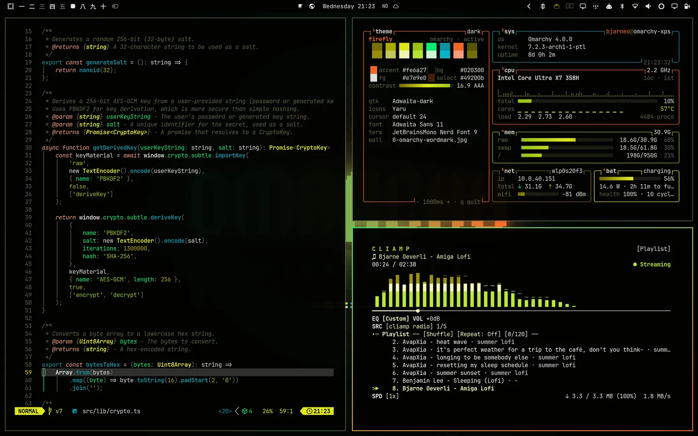](firefly/preview.png)

`069` · Folder: [`firefly/`](firefly/) · [Open in the gallery](https://bjarneo.github.io/100-themes/#firefly)

Firefly has a dark olive green background and a red accent. The ANSI colors are saturated and bright. The native background shows a topographic contour map.

| Key | Value |
| --- | --- |
| `background` | `#020300` |
| `foreground` | `#e7e9e0` |
| `accent` | `#fe6a27` |
| `selection` | `#49200b` |
| Icon theme | `Yaru` |
| Backgrounds | [`0-omarchy-wordmark.jpg`](firefly/backgrounds/0-omarchy-wordmark.jpg), [`1-contours.jpg`](firefly/backgrounds/1-contours.jpg) |

<details>
<summary>All 16 ANSI colors</summary>

| # | Normal | # | Bright |
| --- | --- | --- | --- |
| 0 black | `#0a0d01` | 8 bright black | `#5f6847` |
| 1 red | `#7e7403` | 9 bright red | `#9e9210` |
| 2 green | `#9eca14` | 10 bright green | `#bced36` |
| 3 yellow | `#e8f11c` | 11 bright yellow | `#f9ffbe` |
| 4 blue | `#0e97a8` | 12 bright blue | `#0bb9ce` |
| 5 magenta | `#fe6a27` | 13 bright magenta | `#fea381` |
| 6 cyan | `#00fa78` | 14 bright cyan | `#d4ffdc` |
| 7 white | `#c9ccc1` | 15 bright white | `#f9fbf7` |

</details>

```bash
curl -fsSL https://bjarneo.github.io/100-themes/install.sh | bash -s -- firefly --set
```

### Jellyfish

[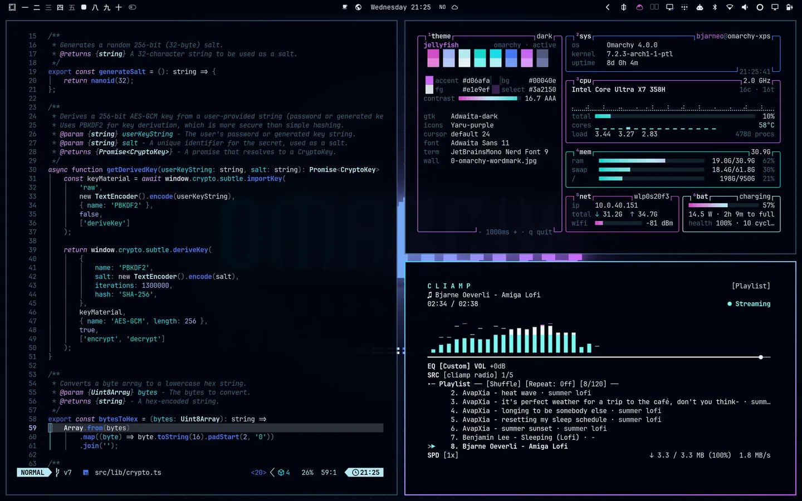](jellyfish/preview.png)

`070` · Folder: [`jellyfish/`](jellyfish/) · [Open in the gallery](https://bjarneo.github.io/100-themes/#jellyfish)

Jellyfish has a dark blue background and a violet accent. The ANSI colors are saturated and bright. The native background shows light rays in deep water.

| Key | Value |
| --- | --- |
| `background` | `#00040e` |
| `foreground` | `#e1e9ef` |
| `accent` | `#d06afa` |
| `selection` | `#3a2150` |
| Icon theme | `Yaru-purple` |
| Backgrounds | [`0-omarchy-wordmark.jpg`](jellyfish/backgrounds/0-omarchy-wordmark.jpg), [`1-depths.jpg`](jellyfish/backgrounds/1-depths.jpg) |

<details>
<summary>All 16 ANSI colors</summary>

| # | Normal | # | Bright |
| --- | --- | --- | --- |
| 0 black | `#000f1c` | 8 bright black | `#426882` |
| 1 red | `#d951cf` | 9 bright red | `#eb87e1` |
| 2 green | `#17e1d6` | 10 bright green | `#7afef4` |
| 3 yellow | `#bff2fe` | 11 bright yellow | `#effbfe` |
| 4 blue | `#497cfd` | 12 bright blue | `#78a1fe` |
| 5 magenta | `#d06afa` | 13 bright magenta | `#e19fff` |
| 6 cyan | `#1ce5f2` | 14 bright cyan | `#b9f8fe` |
| 7 white | `#c2ccd3` | 15 bright white | `#f7fbfd` |

</details>

```bash
curl -fsSL https://bjarneo.github.io/100-themes/install.sh | bash -s -- jellyfish --set
```

### Candy

[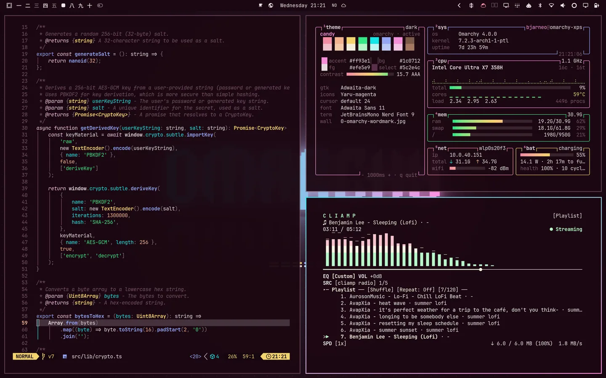](candy/preview.png)

`071` · Folder: [`candy/`](candy/) · [Open in the gallery](https://bjarneo.github.io/100-themes/#candy)

Candy has a dark plum background and a magenta accent. The ANSI colors are light pastels with high lightness and low chroma. The native background shows soft light spots with bokeh.

| Key | Value |
| --- | --- |
| `background` | `#1c0712` |
| `foreground` | `#efe5e9` |
| `accent` | `#ff93e1` |
| `selection` | `#5c2e4c` |
| Icon theme | `Yaru-magenta` |
| Backgrounds | [`0-omarchy-wordmark.jpg`](candy/backgrounds/0-omarchy-wordmark.jpg), [`1-blobs.jpg`](candy/backgrounds/1-blobs.jpg) |

<details>
<summary>All 16 ANSI colors</summary>

| # | Normal | # | Bright |
| --- | --- | --- | --- |
| 0 black | `#2b1520` | 8 bright black | `#7e5568` |
| 1 red | `#fd93a9` | 9 bright red | `#fdc7d1` |
| 2 green | `#37ef8a` | 10 bright green | `#b9ffcd` |
| 3 yellow | `#fedb72` | 11 bright yellow | `#fff8e5` |
| 4 blue | `#99abfd` | 12 bright blue | `#c2cffe` |
| 5 magenta | `#ff93e1` | 13 bright magenta | `#ffccef` |
| 6 cyan | `#16eeed` | 14 bright cyan | `#c6fffd` |
| 7 white | `#d3c7cc` | 15 bright white | `#fdf9fa` |

</details>

```bash
curl -fsSL https://bjarneo.github.io/100-themes/install.sh | bash -s -- candy --set
```

### Bubblegum

[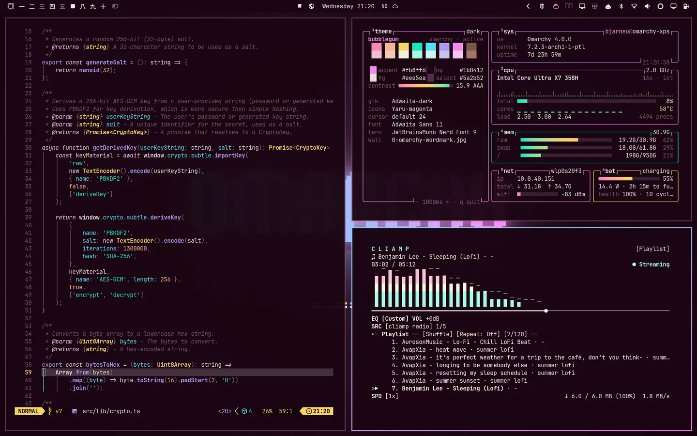](bubblegum/preview.png)

`072` · Folder: [`bubblegum/`](bubblegum/) · [Open in the gallery](https://bjarneo.github.io/100-themes/#bubblegum)

Bubblegum has a dark plum background and a magenta accent. The ANSI colors are light pastels with high lightness and low chroma. The native background shows soft light spots with bokeh.

| Key | Value |
| --- | --- |
| `background` | `#1b0412` |
| `foreground` | `#eee5ea` |
| `accent` | `#fb8ff6` |
| `selection` | `#5a2b52` |
| Icon theme | `Yaru-magenta` |
| Backgrounds | [`0-omarchy-wordmark.jpg`](bubblegum/backgrounds/0-omarchy-wordmark.jpg), [`1-blobs.jpg`](bubblegum/backgrounds/1-blobs.jpg) |

<details>
<summary>All 16 ANSI colors</summary>

| # | Normal | # | Bright |
| --- | --- | --- | --- |
| 0 black | `#2a1020` | 8 bright black | `#80536c` |
| 1 red | `#fe8ebd` | 9 bright red | `#ffc4da` |
| 2 green | `#20ebc4` | 10 bright green | `#acffe7` |
| 3 yellow | `#ffdb6c` | 11 bright yellow | `#fff8e4` |
| 4 blue | `#b4a0ff` | 12 bright blue | `#d2c9fd` |
| 5 magenta | `#fb8ff6` | 13 bright magenta | `#ffcafb` |
| 6 cyan | `#56e7fd` | 14 bright cyan | `#daf8fe` |
| 7 white | `#d2c7cd` | 15 bright white | `#fdf9fb` |

</details>

```bash
curl -fsSL https://bjarneo.github.io/100-themes/install.sh | bash -s -- bubblegum --set
```

### Lemonade

[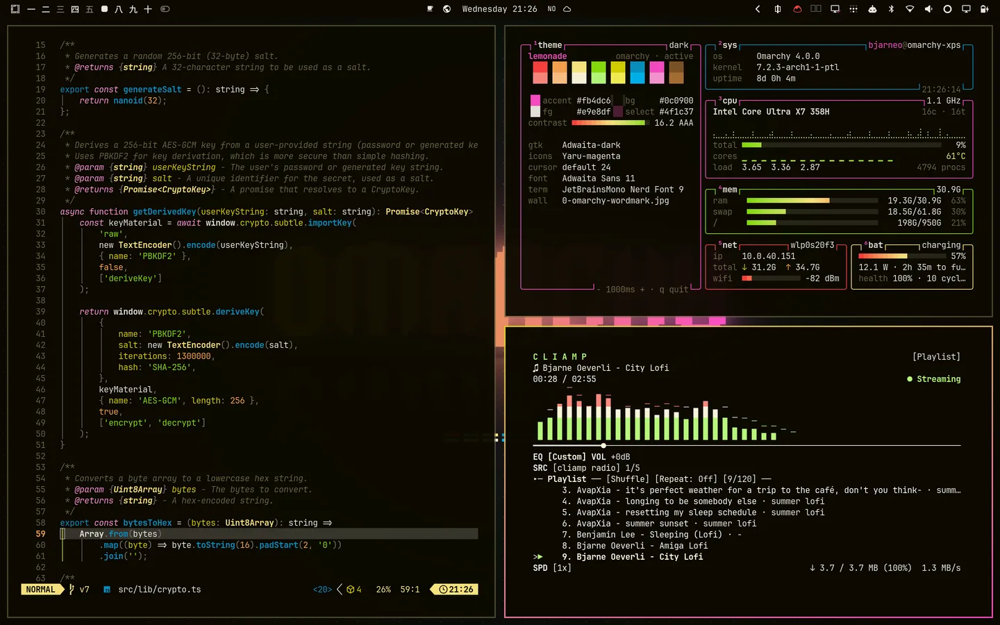](lemonade/preview.png)

`073` · Folder: [`lemonade/`](lemonade/) · [Open in the gallery](https://bjarneo.github.io/100-themes/#lemonade)

Lemonade has a dark olive background and a magenta accent. The ANSI colors are saturated and bright. The native background shows soft light spots with bokeh.

| Key | Value |
| --- | --- |
| `background` | `#0c0900` |
| `foreground` | `#e9e8df` |
| `accent` | `#fb4dc6` |
| `selection` | `#4f1c37` |
| Icon theme | `Yaru-magenta` |
| Backgrounds | [`0-omarchy-wordmark.jpg`](lemonade/backgrounds/0-omarchy-wordmark.jpg), [`1-blobs.jpg`](lemonade/backgrounds/1-blobs.jpg) |

<details>
<summary>All 16 ANSI colors</summary>

| # | Normal | # | Bright |
| --- | --- | --- | --- |
| 0 black | `#191606` | 8 bright black | `#6a6443` |
| 1 red | `#fe423e` | 9 bright red | `#ff8b7f` |
| 2 green | `#8ae00e` | 10 bright green | `#b9fc7d` |
| 3 yellow | `#ffe983` | 11 bright yellow | `#fff9dd` |
| 4 blue | `#0892c4` | 12 bright blue | `#00b3f0` |
| 5 magenta | `#fb4dc6` | 13 bright magenta | `#fe96d7` |
| 6 cyan | `#d9d102` | 14 bright cyan | `#f9f355` |
| 7 white | `#cccbc0` | 15 bright white | `#fbfaf6` |

</details>

```bash
curl -fsSL https://bjarneo.github.io/100-themes/install.sh | bash -s -- lemonade --set
```

### Mint

[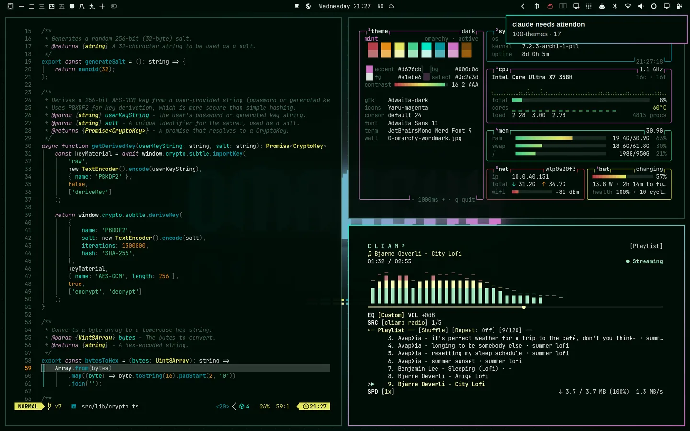](mint/preview.png)

`074` · Folder: [`mint/`](mint/) · [Open in the gallery](https://bjarneo.github.io/100-themes/#mint)

Mint has a dark teal background and a magenta accent. The ANSI colors use medium chroma for a calmer look. The native background shows soft light spots with bokeh.

| Key | Value |
| --- | --- |
| `background` | `#000d06` |
| `foreground` | `#e1ebe6` |
| `accent` | `#d676cb` |
| `selection` | `#3c2a3d` |
| Icon theme | `Yaru-magenta` |
| Backgrounds | [`0-omarchy-wordmark.jpg`](mint/backgrounds/0-omarchy-wordmark.jpg), [`1-blobs.jpg`](mint/backgrounds/1-blobs.jpg) |

<details>
<summary>All 16 ANSI colors</summary>

| # | Normal | # | Bright |
| --- | --- | --- | --- |
| 0 black | `#071a13` | 8 bright black | `#476d5c` |
| 1 red | `#bd404b` | 9 bright red | `#c07879` |
| 2 green | `#46d58e` | 10 bright green | `#a6eac0` |
| 3 yellow | `#eaee63` | 11 bright yellow | `#fbffb8` |
| 4 blue | `#0398a1` | 12 bright blue | `#57b5bc` |
| 5 magenta | `#d676cb` | 13 bright magenta | `#e0a9d8` |
| 6 cyan | `#03f2ce` | 14 bright cyan | `#ccfff1` |
| 7 white | `#c2cec8` | 15 bright white | `#f7fbf9` |

</details>

```bash
curl -fsSL https://bjarneo.github.io/100-themes/install.sh | bash -s -- mint --set
```

### Grape

[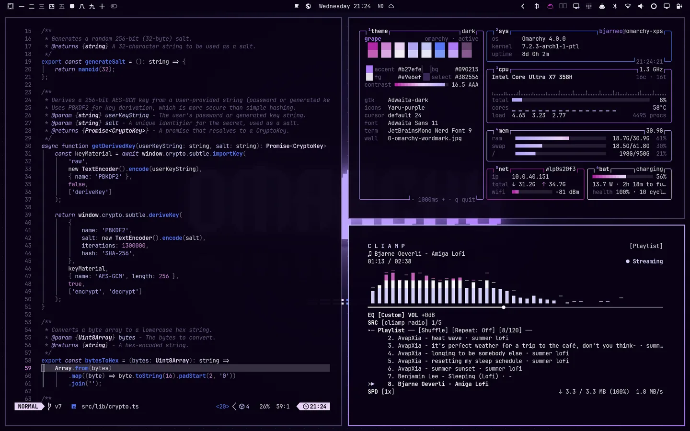](grape/preview.png)

`075` · Folder: [`grape/`](grape/) · [Open in the gallery](https://bjarneo.github.io/100-themes/#grape)

Grape has a dark violet background and a violet accent. The ANSI colors are saturated and bright. The native background shows soft light spots with bokeh.

| Key | Value |
| --- | --- |
| `background` | `#090215` |
| `foreground` | `#e9e6ef` |
| `accent` | `#b27efe` |
| `selection` | `#382556` |
| Icon theme | `Yaru-purple` |
| Backgrounds | [`0-omarchy-wordmark.jpg`](grape/backgrounds/0-omarchy-wordmark.jpg), [`1-blobs.jpg`](grape/backgrounds/1-blobs.jpg) |

<details>
<summary>All 16 ANSI colors</summary>

| # | Normal | # | Bright |
| --- | --- | --- | --- |
| 0 black | `#150b24` | 8 bright black | `#695a85` |
| 1 red | `#b528a9` | 9 bright red | `#c764bb` |
| 2 green | `#b4abfd` | 10 bright green | `#d5d2fd` |
| 3 yellow | `#f2daff` | 11 bright yellow | `#fbf7fd` |
| 4 blue | `#5978fd` | 12 bright blue | `#819efe` |
| 5 magenta | `#b27efe` | 13 bright magenta | `#caacff` |
| 6 cyan | `#c9ccff` | 14 bright cyan | `#eff1ff` |
| 7 white | `#ccc8d3` | 15 bright white | `#faf9fd` |

</details>

```bash
curl -fsSL https://bjarneo.github.io/100-themes/install.sh | bash -s -- grape --set
```

### Watermelon

[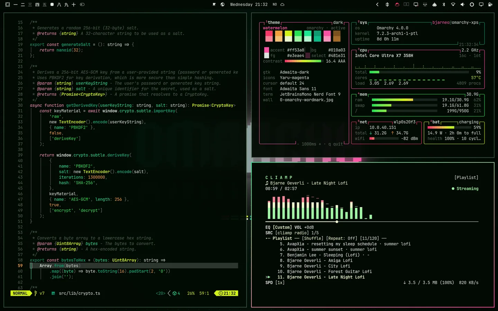](watermelon/preview.png)

`076` · Folder: [`watermelon/`](watermelon/) · [Open in the gallery](https://bjarneo.github.io/100-themes/#watermelon)

Watermelon has a dark green background and a pink accent. The ANSI colors are saturated and bright. The native background shows soft light spots with bokeh.

| Key | Value |
| --- | --- |
| `background` | `#010a03` |
| `foreground` | `#e3eae4` |
| `accent` | `#ff53a8` |
| `selection` | `#481e31` |
| Icon theme | `Yaru-magenta` |
| Backgrounds | [`0-omarchy-wordmark.jpg`](watermelon/backgrounds/0-omarchy-wordmark.jpg), [`1-blobs.jpg`](watermelon/backgrounds/1-blobs.jpg) |

<details>
<summary>All 16 ANSI colors</summary>

| # | Normal | # | Bright |
| --- | --- | --- | --- |
| 0 black | `#09180c` | 8 bright black | `#4f6c54` |
| 1 red | `#fe396b` | 9 bright red | `#fd8999` |
| 2 green | `#2aea56` | 10 bright green | `#a2ffa8` |
| 3 yellow | `#dafa18` | 11 bright yellow | `#f3ffd1` |
| 4 blue | `#109d75` | 12 bright blue | `#10c190` |
| 5 magenta | `#ff53a8` | 13 bright magenta | `#ff99c4` |
| 6 cyan | `#1eef96` | 14 bright cyan | `#b8fed3` |
| 7 white | `#c4cdc5` | 15 bright white | `#f8fbf8` |

</details>

```bash
curl -fsSL https://bjarneo.github.io/100-themes/install.sh | bash -s -- watermelon --set
```

### Espresso

[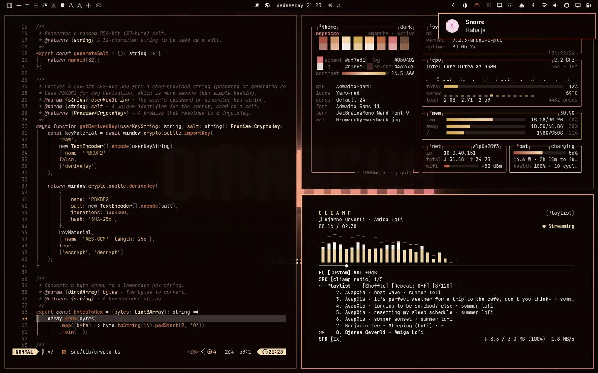](espresso/preview.png)

`077` · Folder: [`espresso/`](espresso/) · [Open in the gallery](https://bjarneo.github.io/100-themes/#espresso)

Espresso has a dark brown background and a red accent. The ANSI colors use low chroma for a soft, muted look. The native background shows soft light spots with bokeh.

| Key | Value |
| --- | --- |
| `background` | `#0b0402` |
| `foreground` | `#efe6e1` |
| `accent` | `#df7e81` |
| `selection` | `#462626` |
| Icon theme | `Yaru-red` |
| Backgrounds | [`0-omarchy-wordmark.jpg`](espresso/backgrounds/0-omarchy-wordmark.jpg), [`1-blobs.jpg`](espresso/backgrounds/1-blobs.jpg) |

<details>
<summary>All 16 ANSI colors</summary>

| # | Normal | # | Bright |
| --- | --- | --- | --- |
| 0 black | `#190f0a` | 8 bright black | `#775d4f` |
| 1 red | `#ac5442` | 9 bright red | `#b68074` |
| 2 green | `#dbb155` | 10 bright green | `#edd5a3` |
| 3 yellow | `#fde0b5` | 11 bright yellow | `#fef7ed` |
| 4 blue | `#c06d43` | 12 bright blue | `#ca977f` |
| 5 magenta | `#df7e81` | 13 bright magenta | `#e8acac` |
| 6 cyan | `#fec48a` | 14 bright cyan | `#feefe0` |
| 7 white | `#d3c8c2` | 15 bright white | `#fdf9f7` |

</details>

```bash
curl -fsSL https://bjarneo.github.io/100-themes/install.sh | bash -s -- espresso --set
```

### Matcha

[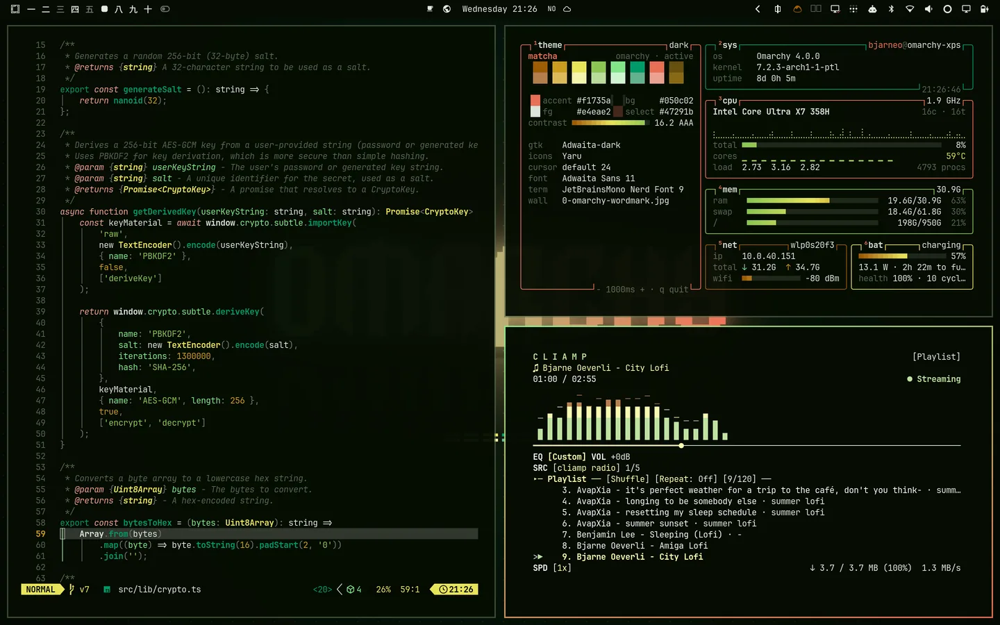](matcha/preview.png)

`078` · Folder: [`matcha/`](matcha/) · [Open in the gallery](https://bjarneo.github.io/100-themes/#matcha)

Matcha has a dark olive green background and a red accent. The ANSI colors use medium chroma for a calmer look. The native background shows soft light spots with bokeh.

| Key | Value |
| --- | --- |
| `background` | `#050c02` |
| `foreground` | `#e4eae2` |
| `accent` | `#f1735a` |
| `selection` | `#47291b` |
| Icon theme | `Yaru` |
| Backgrounds | [`0-omarchy-wordmark.jpg`](matcha/backgrounds/0-omarchy-wordmark.jpg), [`1-blobs.jpg`](matcha/backgrounds/1-blobs.jpg) |

<details>
<summary>All 16 ANSI colors</summary>

| # | Normal | # | Bright |
| --- | --- | --- | --- |
| 0 black | `#10190b` | 8 bright black | `#576a4d` |
| 1 red | `#a45e05` | 9 bright red | `#b98250` |
| 2 green | `#91cc58` | 10 bright green | `#c1e5a4` |
| 3 yellow | `#f1ec5f` | 11 bright yellow | `#fffeb3` |
| 4 blue | `#009f6e` | 12 bright blue | `#69b793` |
| 5 magenta | `#f1735a` | 13 bright magenta | `#f4a797` |
| 6 cyan | `#86ed8f` | 14 bright cyan | `#d7fed8` |
| 7 white | `#c6cdc3` | 15 bright white | `#f9fbf7` |

</details>

```bash
curl -fsSL https://bjarneo.github.io/100-themes/install.sh | bash -s -- matcha --set
```

### Cotton Candy

[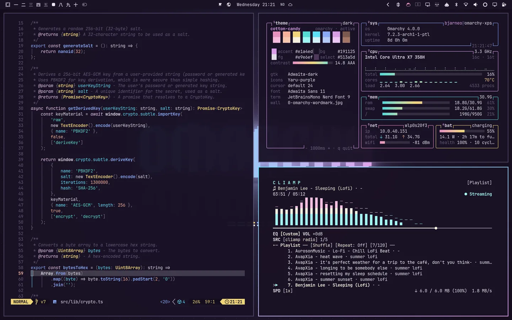](cotton-candy/preview.png)

`079` · Folder: [`cotton-candy/`](cotton-candy/) · [Open in the gallery](https://bjarneo.github.io/100-themes/#cotton-candy)

Cotton Candy has a dark violet background and a magenta accent. The ANSI colors are light pastels with high lightness and low chroma. The native background shows soft light spots with bokeh.

| Key | Value |
| --- | --- |
| `background` | `#191125` |
| `foreground` | `#e9e6ef` |
| `accent` | `#e1a4ed` |
| `selection` | `#513a5d` |
| Icon theme | `Yaru-purple` |
| Backgrounds | [`0-omarchy-wordmark.jpg`](cotton-candy/backgrounds/0-omarchy-wordmark.jpg), [`1-blobs.jpg`](cotton-candy/backgrounds/1-blobs.jpg) |

<details>
<summary>All 16 ANSI colors</summary>

| # | Normal | # | Bright |
| --- | --- | --- | --- |
| 0 black | `#271f35` | 8 bright black | `#685c81` |
| 1 red | `#f097c5` | 9 bright red | `#ffc3e1` |
| 2 green | `#58e3dc` | 10 bright green | `#a4fef8` |
| 3 yellow | `#f9dd7d` | 11 bright yellow | `#fef9e4` |
| 4 blue | `#8eaffe` | 12 bright blue | `#bdd1fe` |
| 5 magenta | `#e1a4ed` | 13 bright magenta | `#f6cefd` |
| 6 cyan | `#61e6ff` | 14 bright cyan | `#daf8ff` |
| 7 white | `#ccc8d3` | 15 bright white | `#faf9fd` |

</details>

```bash
curl -fsSL https://bjarneo.github.io/100-themes/install.sh | bash -s -- cotton-candy --set
```

### Blood Moon

[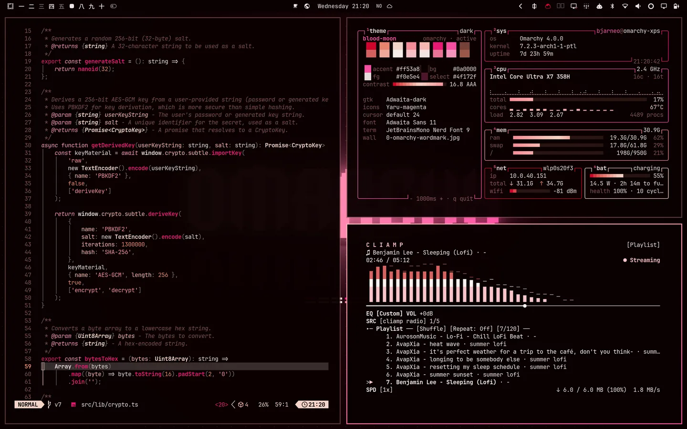](blood-moon/preview.png)

`080` · Folder: [`blood-moon/`](blood-moon/) · [Open in the gallery](https://bjarneo.github.io/100-themes/#blood-moon)

Blood Moon has a dark red background and a pink accent. The 6 ANSI hues stay close to pink, so the palette reads as one color. The native background shows a planet in space.

| Key | Value |
| --- | --- |
| `background` | `#0a0000` |
| `foreground` | `#f0e5e4` |
| `accent` | `#ff53a8` |
| `selection` | `#4f172f` |
| Icon theme | `Yaru-magenta` |
| Backgrounds | [`0-omarchy-wordmark.jpg`](blood-moon/backgrounds/0-omarchy-wordmark.jpg), [`1-planet.jpg`](blood-moon/backgrounds/1-planet.jpg) |

<details>
<summary>All 16 ANSI colors</summary>

| # | Normal | # | Bright |
| --- | --- | --- | --- |
| 0 black | `#190405` | 8 bright black | `#825555` |
| 1 red | `#d4052d` | 9 bright red | `#db6563` |
| 2 green | `#ff939f` | 10 bright green | `#ffc7cb` |
| 3 yellow | `#fdddd0` | 11 bright yellow | `#fef7f3` |
| 4 blue | `#ef1a77` | 12 bright blue | `#f0799b` |
| 5 magenta | `#ff53a8` | 13 bright magenta | `#fe9ac3` |
| 6 cyan | `#ffbfb7` | 14 bright cyan | `#ffedeb` |
| 7 white | `#d4c7c6` | 15 bright white | `#fdf9f9` |

</details>

```bash
curl -fsSL https://bjarneo.github.io/100-themes/install.sh | bash -s -- blood-moon --set
```

### Poison

[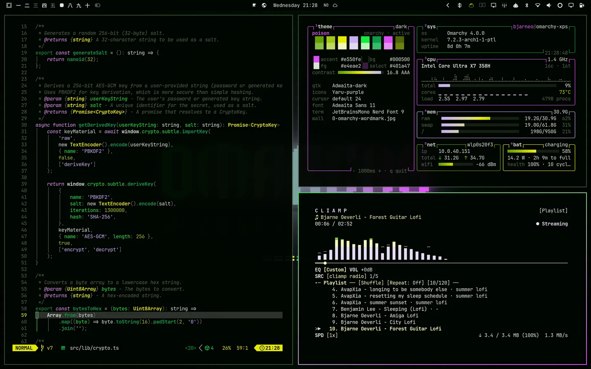](poison/preview.png)

`081` · Folder: [`poison/`](poison/) · [Open in the gallery](https://bjarneo.github.io/100-themes/#poison)

Poison has a dark green background and a magenta accent. The ANSI colors use very high chroma for a strong neon look. The native background shows a topographic contour map.

| Key | Value |
| --- | --- |
| `background` | `#000500` |
| `foreground` | `#e4eae2` |
| `accent` | `#e550fe` |
| `selection` | `#401a47` |
| Icon theme | `Yaru-purple` |
| Backgrounds | [`0-omarchy-wordmark.jpg`](poison/backgrounds/0-omarchy-wordmark.jpg), [`1-contours.jpg`](poison/backgrounds/1-contours.jpg) |

<details>
<summary>All 16 ANSI colors</summary>

| # | Normal | # | Bright |
| --- | --- | --- | --- |
| 0 black | `#041102` | 8 bright black | `#516c4b` |
| 1 red | `#69a701` | 9 bright red | `#8ac645` |
| 2 green | `#d0b4fe` | 10 bright green | `#e9dffc` |
| 3 yellow | `#eef300` | 11 bright yellow | `#faffbb` |
| 4 blue | `#0aa14e` | 12 bright blue | `#3ac26a` |
| 5 magenta | `#e550fe` | 13 bright magenta | `#ee97fe` |
| 6 cyan | `#15f441` | 14 bright cyan | `#bfffbf` |
| 7 white | `#c6cdc4` | 15 bright white | `#f8fbf8` |

</details>

```bash
curl -fsSL https://bjarneo.github.io/100-themes/install.sh | bash -s -- poison --set
```

### Hazard

[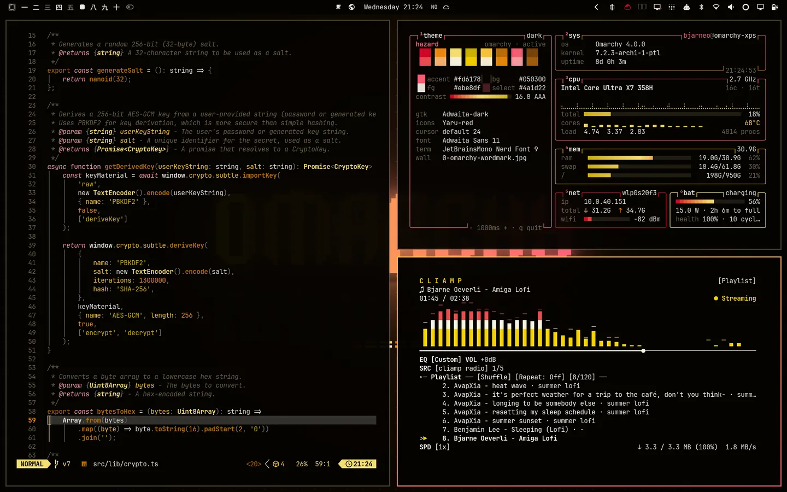](hazard/preview.png)

`082` · Folder: [`hazard/`](hazard/) · [Open in the gallery](https://bjarneo.github.io/100-themes/#hazard)

Hazard has a dark olive background and a pink accent. The ANSI colors are saturated and bright. The native background shows embers that rise over dunes.

| Key | Value |
| --- | --- |
| `background` | `#050300` |
| `foreground` | `#ebe8df` |
| `accent` | `#fd6178` |
| `selection` | `#4a1d22` |
| Icon theme | `Yaru-red` |
| Backgrounds | [`0-omarchy-wordmark.jpg`](hazard/backgrounds/0-omarchy-wordmark.jpg), [`1-embers.jpg`](hazard/backgrounds/1-embers.jpg) |

<details>
<summary>All 16 ANSI colors</summary>

| # | Normal | # | Bright |
| --- | --- | --- | --- |
| 0 black | `#110d04` | 8 bright black | `#6c6349` |
| 1 red | `#d40727` | 9 bright red | `#ef4f50` |
| 2 green | `#d5b604` | 10 bright green | `#fad601` |
| 3 yellow | `#fee575` | 11 bright yellow | `#fef9e2` |
| 4 blue | `#bf7003` | 12 bright blue | `#e98b0c` |
| 5 magenta | `#fd6178` | 13 bright magenta | `#fda0a7` |
| 6 cyan | `#fec93a` | 14 bright cyan | `#fef1d3` |
| 7 white | `#cecac0` | 15 bright white | `#fbfaf6` |

</details>

```bash
curl -fsSL https://bjarneo.github.io/100-themes/install.sh | bash -s -- hazard --set
```

### Radioactive

[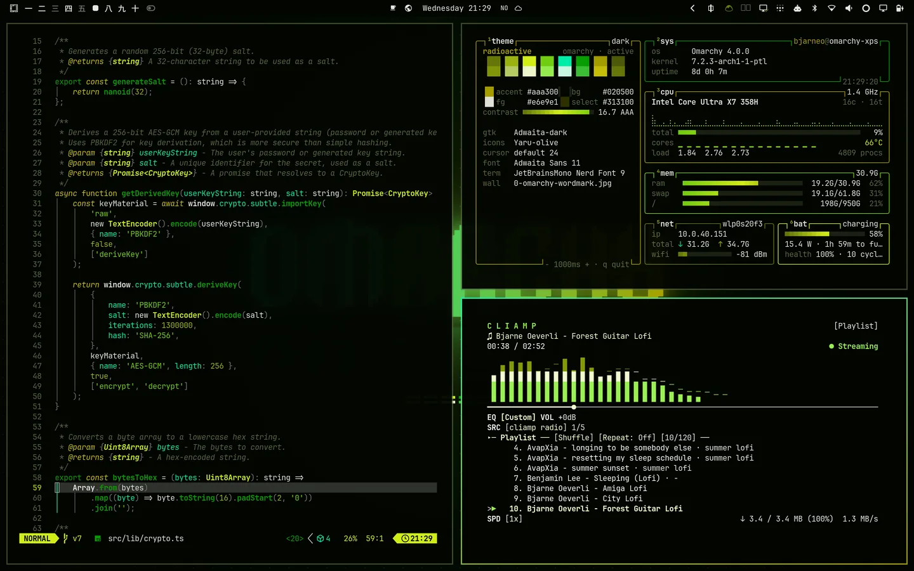](radioactive/preview.png)

`083` · Folder: [`radioactive/`](radioactive/) · [Open in the gallery](https://bjarneo.github.io/100-themes/#radioactive)

Radioactive has a dark olive green background and a yellow accent. The 6 ANSI hues stay close to lime, so the palette reads as one color. The native background shows a topographic contour map.

| Key | Value |
| --- | --- |
| `background` | `#020500` |
| `foreground` | `#e6e9e1` |
| `accent` | `#aaa300` |
| `selection` | `#313100` |
| Icon theme | `Yaru-olive` |
| Backgrounds | [`0-omarchy-wordmark.jpg`](radioactive/backgrounds/0-omarchy-wordmark.jpg), [`1-contours.jpg`](radioactive/backgrounds/1-contours.jpg) |

<details>
<summary>All 16 ANSI colors</summary>

| # | Normal | # | Bright |
| --- | --- | --- | --- |
| 0 black | `#091000` | 8 bright black | `#5b6943` |
| 1 red | `#6b7b0a` | 9 bright red | `#879a09` |
| 2 green | `#77d312` | 10 bright green | `#9bf454` |
| 3 yellow | `#daf619` | 11 bright yellow | `#f5ffd1` |
| 4 blue | `#07a301` | 12 bright blue | `#40c339` |
| 5 magenta | `#aaa300` | 13 bright magenta | `#ccc40b` |
| 6 cyan | `#00f6ae` | 14 bright cyan | `#d1fee8` |
| 7 white | `#c8ccc2` | 15 bright white | `#f9fbf7` |

</details>

```bash
curl -fsSL https://bjarneo.github.io/100-themes/install.sh | bash -s -- radioactive --set
```

### Plasma Arc

[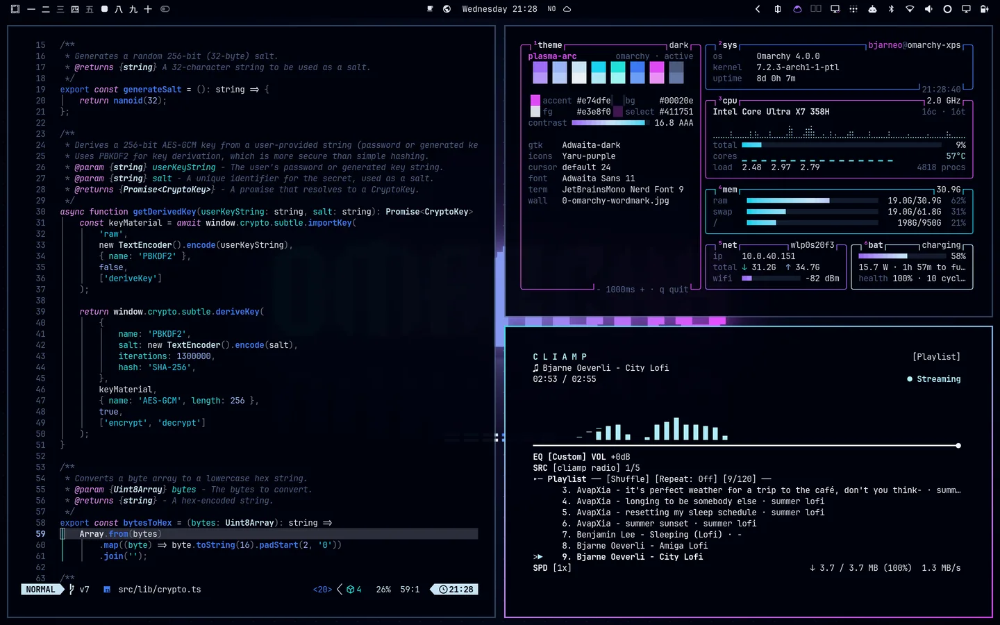](plasma-arc/preview.png)

`084` · Folder: [`plasma-arc/`](plasma-arc/) · [Open in the gallery](https://bjarneo.github.io/100-themes/#plasma-arc)

Plasma Arc has a dark blue background and a magenta accent. The ANSI colors use very high chroma for a strong neon look. The native background shows neon tube shapes on a brick wall.

| Key | Value |
| --- | --- |
| `background` | `#00020e` |
| `foreground` | `#e3e8f0` |
| `accent` | `#e74dfe` |
| `selection` | `#411751` |
| Icon theme | `Yaru-purple` |
| Backgrounds | [`0-omarchy-wordmark.jpg`](plasma-arc/backgrounds/0-omarchy-wordmark.jpg), [`1-tubes.jpg`](plasma-arc/backgrounds/1-tubes.jpg) |

<details>
<summary>All 16 ANSI colors</summary>

| # | Normal | # | Bright |
| --- | --- | --- | --- |
| 0 black | `#030b1c` | 8 bright black | `#4f6486` |
| 1 red | `#a26ffe` | 9 bright red | `#bb9dfe` |
| 2 green | `#1bdbf9` | 10 bright green | `#b3f1fe` |
| 3 yellow | `#cfedff` | 11 bright yellow | `#f3fafe` |
| 4 blue | `#407dfc` | 12 bright blue | `#73a2fe` |
| 5 magenta | `#e74dfe` | 13 bright magenta | `#f096fe` |
| 6 cyan | `#22e7e2` | 14 bright cyan | `#a2fffb` |
| 7 white | `#c5cbd5` | 15 bright white | `#f8fafe` |

</details>

```bash
curl -fsSL https://bjarneo.github.io/100-themes/install.sh | bash -s -- plasma-arc --set
```

### Laser Tag

[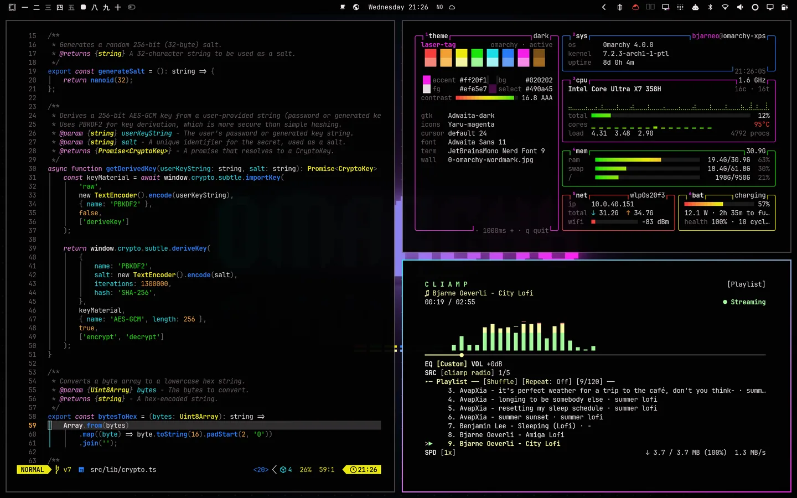](laser-tag/preview.png)

`085` · Folder: [`laser-tag/`](laser-tag/) · [Open in the gallery](https://bjarneo.github.io/100-themes/#laser-tag)

Laser Tag has a neutral black background and a magenta accent. The ANSI colors use very high chroma for a strong neon look. The native background shows neon tube shapes on a brick wall.

| Key | Value |
| --- | --- |
| `background` | `#020202` |
| `foreground` | `#efe5e7` |
| `accent` | `#ff20f1` |
| `selection` | `#490a45` |
| Icon theme | `Yaru-magenta` |
| Backgrounds | [`0-omarchy-wordmark.jpg`](laser-tag/backgrounds/0-omarchy-wordmark.jpg), [`1-tubes.jpg`](laser-tag/backgrounds/1-tubes.jpg) |

<details>
<summary>All 16 ANSI colors</summary>

| # | Normal | # | Bright |
| --- | --- | --- | --- |
| 0 black | `#0b0b0b` | 8 bright black | `#6e5f63` |
| 1 red | `#fe423d` | 9 bright red | `#fd8c80` |
| 2 green | `#1dec0b` | 10 bright green | `#a7ff9e` |
| 3 yellow | `#f4f10c` | 11 bright yellow | `#feffa8` |
| 4 blue | `#2a80fe` | 12 bright blue | `#6ba5fd` |
| 5 magenta | `#ff20f1` | 13 bright magenta | `#fe8ff1` |
| 6 cyan | `#1be6ed` | 14 bright cyan | `#abfcff` |
| 7 white | `#d3c7ca` | 15 bright white | `#fdf9fa` |

</details>

```bash
curl -fsSL https://bjarneo.github.io/100-themes/install.sh | bash -s -- laser-tag --set
```

### Stealth

[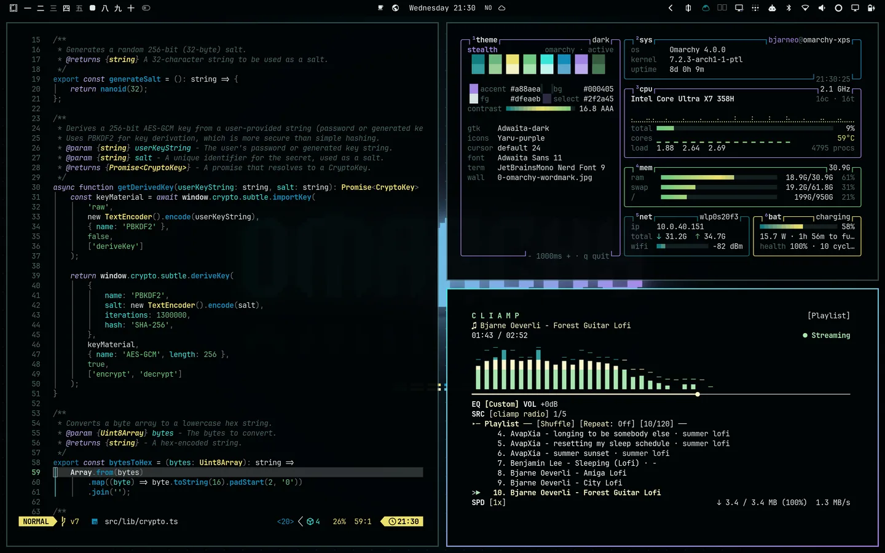](stealth/preview.png)

`086` · Folder: [`stealth/`](stealth/) · [Open in the gallery](https://bjarneo.github.io/100-themes/#stealth)

Stealth has a dark cyan background and a violet accent. The ANSI colors use medium chroma for a calmer look. The native background shows columns of falling code glyphs.

| Key | Value |
| --- | --- |
| `background` | `#000405` |
| `foreground` | `#dfeaeb` |
| `accent` | `#a88aea` |
| `selection` | `#2f2a45` |
| Icon theme | `Yaru-purple` |
| Backgrounds | [`0-omarchy-wordmark.jpg`](stealth/backgrounds/0-omarchy-wordmark.jpg), [`1-code-rain.jpg`](stealth/backgrounds/1-code-rain.jpg) |

<details>
<summary>All 16 ANSI colors</summary>

| # | Normal | # | Bright |
| --- | --- | --- | --- |
| 0 black | `#060f10` | 8 bright black | `#4c6a6b` |
| 1 red | `#128185` | 9 bright red | `#37a1a4` |
| 2 green | `#73d084` | 10 bright green | `#ade9b5` |
| 3 yellow | `#f5e973` | 11 bright yellow | `#fffbcd` |
| 4 blue | `#1492c0` | 12 bright blue | `#61b0d5` |
| 5 magenta | `#a88aea` | 13 bright magenta | `#c4b1f4` |
| 6 cyan | `#3aeee0` | 14 bright cyan | `#c9fef8` |
| 7 white | `#c0cece` | 15 bright white | `#f6fbfb` |

</details>

```bash
curl -fsSL https://bjarneo.github.io/100-themes/install.sh | bash -s -- stealth --set
```

### Mainframe

[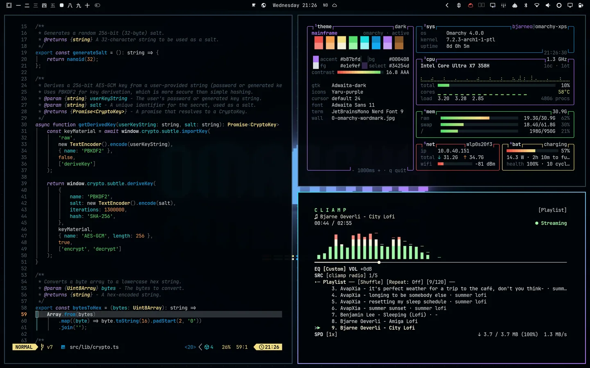](mainframe/preview.png)

`087` · Folder: [`mainframe/`](mainframe/) · [Open in the gallery](https://bjarneo.github.io/100-themes/#mainframe)

Mainframe has a dark blue background and a violet accent. The ANSI colors are saturated and bright. The native background shows columns of falling code glyphs.

| Key | Value |
| --- | --- |
| `background` | `#000408` |
| `foreground` | `#e1e9ef` |
| `accent` | `#b87bfd` |
| `selection` | `#34254d` |
| Icon theme | `Yaru-purple` |
| Backgrounds | [`0-omarchy-wordmark.jpg`](mainframe/backgrounds/0-omarchy-wordmark.jpg), [`1-code-rain.jpg`](mainframe/backgrounds/1-code-rain.jpg) |

<details>
<summary>All 16 ANSI colors</summary>

| # | Normal | # | Bright |
| --- | --- | --- | --- |
| 0 black | `#060e15` | 8 bright black | `#4f6778` |
| 1 red | `#f4524a` | 9 bright red | `#ff8b7f` |
| 2 green | `#58e570` | 10 bright green | `#a3feac` |
| 3 yellow | `#fee88c` | 11 bright yellow | `#fff9e1` |
| 4 blue | `#1090cd` | 12 bright blue | `#14b0fb` |
| 5 magenta | `#b87bfd` | 13 bright magenta | `#ceaafe` |
| 6 cyan | `#1ce6e9` | 14 bright cyan | `#a2feff` |
| 7 white | `#c2ccd3` | 15 bright white | `#f7fbfd` |

</details>

```bash
curl -fsSL https://bjarneo.github.io/100-themes/install.sh | bash -s -- mainframe --set
```

### Terminal Green

[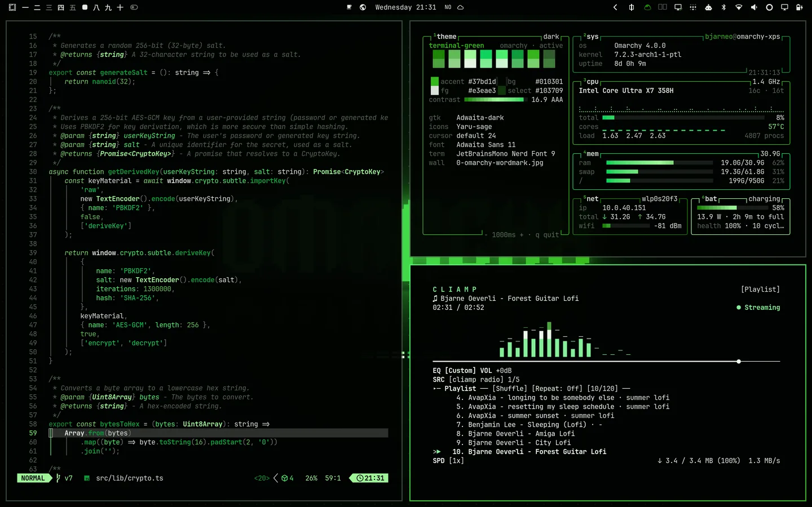](terminal-green/preview.png)

`088` · Folder: [`terminal-green/`](terminal-green/) · [Open in the gallery](https://bjarneo.github.io/100-themes/#terminal-green)

Terminal Green has a dark green background and a green accent. The 6 ANSI hues stay close to green, so the palette reads as one color. The native background shows columns of falling code glyphs.

| Key | Value |
| --- | --- |
| `background` | `#010301` |
| `foreground` | `#e3eae3` |
| `accent` | `#37bd1d` |
| `selection` | `#103709` |
| Icon theme | `Yaru-sage` |
| Backgrounds | [`0-omarchy-wordmark.jpg`](terminal-green/backgrounds/0-omarchy-wordmark.jpg), [`1-code-rain.jpg`](terminal-green/backgrounds/1-code-rain.jpg) |

<details>
<summary>All 16 ANSI colors</summary>

| # | Normal | # | Bright |
| --- | --- | --- | --- |
| 0 black | `#060d06` | 8 bright black | `#556a55` |
| 1 red | `#1d8904` | 9 bright red | `#4fa643` |
| 2 green | `#11db5f` | 10 bright green | `#85f49a` |
| 3 yellow | `#a5ff9e` | 11 bright yellow | `#edfeeb` |
| 4 blue | `#0fa13d` | 12 bright blue | `#53bf66` |
| 5 magenta | `#37bd1d` | 13 bright magenta | `#7fd772` |
| 6 cyan | `#4ff675` | 14 bright cyan | `#d5ffd9` |
| 7 white | `#c5cdc5` | 15 bright white | `#f8fbf8` |

</details>

```bash
curl -fsSL https://bjarneo.github.io/100-themes/install.sh | bash -s -- terminal-green --set
```

### Terminal Blue

[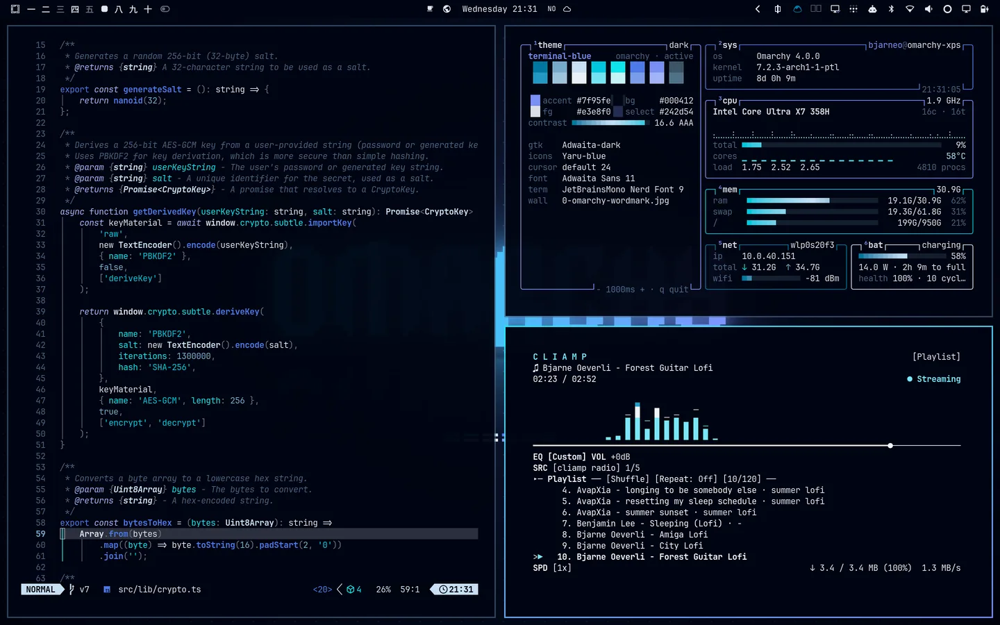](terminal-blue/preview.png)

`089` · Folder: [`terminal-blue/`](terminal-blue/) · [Open in the gallery](https://bjarneo.github.io/100-themes/#terminal-blue)

Terminal Blue has a dark blue background and a indigo accent. The ANSI colors use medium chroma for a calmer look. The native background shows columns of falling code glyphs.

| Key | Value |
| --- | --- |
| `background` | `#000412` |
| `foreground` | `#e3e8f0` |
| `accent` | `#7f95fe` |
| `selection` | `#242d54` |
| Icon theme | `Yaru-blue` |
| Backgrounds | [`0-omarchy-wordmark.jpg`](terminal-blue/backgrounds/0-omarchy-wordmark.jpg), [`1-code-rain.jpg`](terminal-blue/backgrounds/1-code-rain.jpg) |

<details>
<summary>All 16 ANSI colors</summary>

| # | Normal | # | Bright |
| --- | --- | --- | --- |
| 0 black | `#041020` | 8 bright black | `#4c6585` |
| 1 red | `#017ca5` | 9 bright red | `#269cca` |
| 2 green | `#01cee7` | 10 bright green | `#7bebfe` |
| 3 yellow | `#cfe8fe` | 11 bright yellow | `#f3f9ff` |
| 4 blue | `#507ef1` | 12 bright blue | `#80a3f0` |
| 5 magenta | `#7f95fe` | 13 bright magenta | `#a8baff` |
| 6 cyan | `#10edf4` | 14 bright cyan | `#cbfdfe` |
| 7 white | `#c4cbd4` | 15 bright white | `#f8fafd` |

</details>

```bash
curl -fsSL https://bjarneo.github.io/100-themes/install.sh | bash -s -- terminal-blue --set
```

### Neon Tokyo

[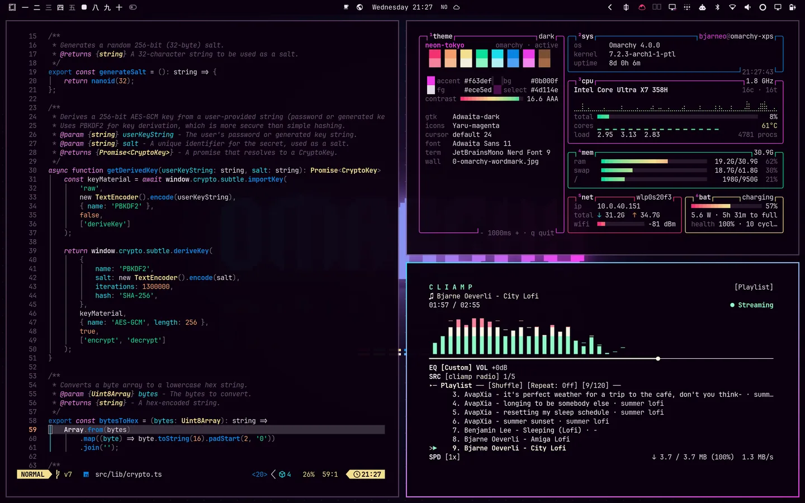](neon-tokyo/preview.png)

`090` · Folder: [`neon-tokyo/`](neon-tokyo/) · [Open in the gallery](https://bjarneo.github.io/100-themes/#neon-tokyo)

Neon Tokyo has a dark magenta background and a magenta accent. The ANSI colors use very high chroma for a strong neon look. The native background shows a city skyline at night in the rain.

| Key | Value |
| --- | --- |
| `background` | `#0b000f` |
| `foreground` | `#ece5ed` |
| `accent` | `#f63def` |
| `selection` | `#4d114e` |
| Icon theme | `Yaru-magenta` |
| Backgrounds | [`0-omarchy-wordmark.jpg`](neon-tokyo/backgrounds/0-omarchy-wordmark.jpg), [`1-skyline.jpg`](neon-tokyo/backgrounds/1-skyline.jpg) |

<details>
<summary>All 16 ANSI colors</summary>

| # | Normal | # | Bright |
| --- | --- | --- | --- |
| 0 black | `#19071d` | 8 bright black | `#75567c` |
| 1 red | `#fe3575` | 9 bright red | `#fe879f` |
| 2 green | `#0de79e` | 10 bright green | `#92ffca` |
| 3 yellow | `#ffe795` | 11 bright yellow | `#fef9e5` |
| 4 blue | `#0889ea` | 12 bright blue | `#52a9ff` |
| 5 magenta | `#f63def` | 13 bright magenta | `#fe8df6` |
| 6 cyan | `#1ce5f3` | 14 bright cyan | `#b7f9ff` |
| 7 white | `#cfc8d1` | 15 bright white | `#fcf9fc` |

</details>

```bash
curl -fsSL https://bjarneo.github.io/100-themes/install.sh | bash -s -- neon-tokyo --set
```

### Neon Vegas

[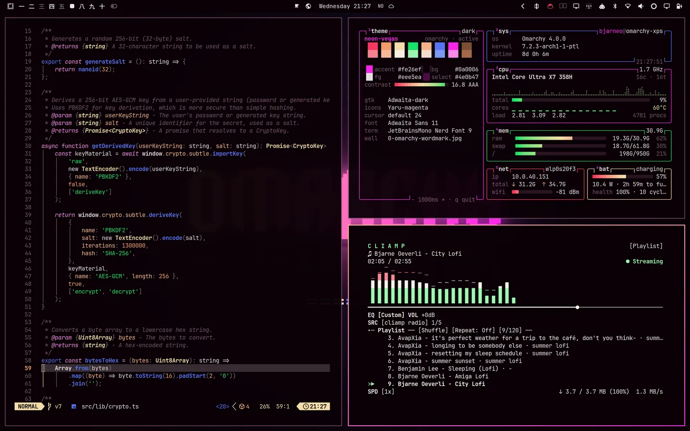](neon-vegas/preview.png)

`091` · Folder: [`neon-vegas/`](neon-vegas/) · [Open in the gallery](https://bjarneo.github.io/100-themes/#neon-vegas)

Neon Vegas has a dark magenta background and a magenta accent. The ANSI colors use very high chroma for a strong neon look. The native background shows a city skyline at night in the rain.

| Key | Value |
| --- | --- |
| `background` | `#0a0006` |
| `foreground` | `#eee5ea` |
| `accent` | `#fe26ef` |
| `selection` | `#4e0b47` |
| Icon theme | `Yaru-magenta` |
| Backgrounds | [`0-omarchy-wordmark.jpg`](neon-vegas/backgrounds/0-omarchy-wordmark.jpg), [`1-skyline.jpg`](neon-vegas/backgrounds/1-skyline.jpg) |

<details>
<summary>All 16 ANSI colors</summary>

| # | Normal | # | Bright |
| --- | --- | --- | --- |
| 0 black | `#180613` | 8 bright black | `#7b566e` |
| 1 red | `#ff3964` | 9 bright red | `#fe8894` |
| 2 green | `#17ea6d` | 10 bright green | `#9ffeb2` |
| 3 yellow | `#fee5af` | 11 bright yellow | `#fef8eb` |
| 4 blue | `#5c77fc` | 12 bright blue | `#839efe` |
| 5 magenta | `#fe26ef` | 13 bright magenta | `#fe8ff0` |
| 6 cyan | `#feb98c` | 14 bright cyan | `#fee6d7` |
| 7 white | `#d2c7ce` | 15 bright white | `#fdf9fb` |

</details>

```bash
curl -fsSL https://bjarneo.github.io/100-themes/install.sh | bash -s -- neon-vegas --set
```

### Miami Night

[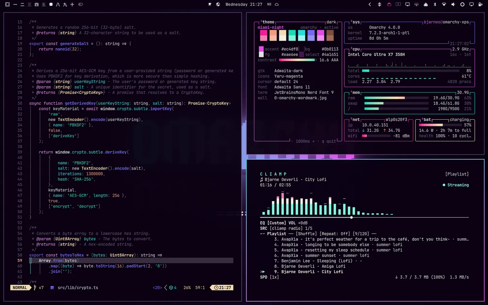](miami-night/preview.png)

`092` · Folder: [`miami-night/`](miami-night/) · [Open in the gallery](https://bjarneo.github.io/100-themes/#miami-night)

Miami Night has a dark violet background and a magenta accent. The ANSI colors are saturated and bright. The native background shows a neon sun over a perspective grid.

| Key | Value |
| --- | --- |
| `background` | `#0b0113` |
| `foreground` | `#eae6ee` |
| `accent` | `#ec4df0` |
| `selection` | `#4a1651` |
| Icon theme | `Yaru-magenta` |
| Backgrounds | [`0-omarchy-wordmark.jpg`](miami-night/backgrounds/0-omarchy-wordmark.jpg), [`1-sunset-grid.jpg`](miami-night/backgrounds/1-sunset-grid.jpg) |

<details>
<summary>All 16 ANSI colors</summary>

| # | Normal | # | Bright |
| --- | --- | --- | --- |
| 0 black | `#180a22` | 8 bright black | `#705881` |
| 1 red | `#fe1e9c` | 9 bright red | `#fe82b8` |
| 2 green | `#1ce3c0` | 10 bright green | `#87fee1` |
| 3 yellow | `#fee4b7` | 11 bright yellow | `#fef8ec` |
| 4 blue | `#7b6bfd` | 12 bright blue | `#9a96fc` |
| 5 magenta | `#ec4df0` | 13 bright magenta | `#f793f7` |
| 6 cyan | `#23e7e1` | 14 bright cyan | `#a4fefa` |
| 7 white | `#cdc8d2` | 15 bright white | `#fbf9fd` |

</details>

```bash
curl -fsSL https://bjarneo.github.io/100-themes/install.sh | bash -s -- miami-night --set
```

### Hong Kong Rain

[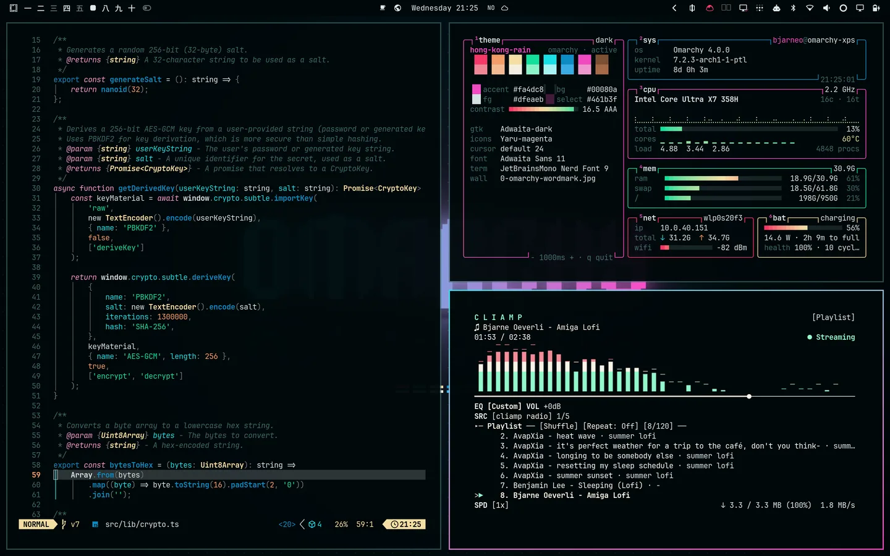](hong-kong-rain/preview.png)

`093` · Folder: [`hong-kong-rain/`](hong-kong-rain/) · [Open in the gallery](https://bjarneo.github.io/100-themes/#hong-kong-rain)

Hong Kong Rain has a dark cyan background and a magenta accent. The ANSI colors are saturated and bright. The native background shows a city skyline at night in the rain.

| Key | Value |
| --- | --- |
| `background` | `#00080a` |
| `foreground` | `#dfeaeb` |
| `accent` | `#fa4dc8` |
| `selection` | `#461b3f` |
| Icon theme | `Yaru-magenta` |
| Backgrounds | [`0-omarchy-wordmark.jpg`](hong-kong-rain/backgrounds/0-omarchy-wordmark.jpg), [`1-skyline.jpg`](hong-kong-rain/backgrounds/1-skyline.jpg) |

<details>
<summary>All 16 ANSI colors</summary>

| # | Normal | # | Bright |
| --- | --- | --- | --- |
| 0 black | `#001517` | 8 bright black | `#3f6c6e` |
| 1 red | `#fe396a` | 9 bright red | `#f98c99` |
| 2 green | `#15e6a3` | 10 bright green | `#93fecd` |
| 3 yellow | `#fee6aa` | 11 bright yellow | `#fff8e8` |
| 4 blue | `#0c91c9` | 12 bright blue | `#3db1eb` |
| 5 magenta | `#fa4dc8` | 13 bright magenta | `#f79bd6` |
| 6 cyan | `#1be6ec` | 14 bright cyan | `#acfcfe` |
| 7 white | `#c0cece` | 15 bright white | `#f6fbfb` |

</details>

```bash
curl -fsSL https://bjarneo.github.io/100-themes/install.sh | bash -s -- hong-kong-rain --set
```

### Berlin Club

[](berlin-club/preview.png)

`094` · Folder: [`berlin-club/`](berlin-club/) · [Open in the gallery](https://bjarneo.github.io/100-themes/#berlin-club)

Berlin Club has a neutral black background and a magenta accent. The ANSI colors are saturated and bright. The native background shows neon tube shapes on a brick wall.

| Key | Value |
| --- | --- |
| `background` | `#020202` |
| `foreground` | `#efe5e7` |
| `accent` | `#e25bf1` |
| `selection` | `#411b45` |
| Icon theme | `Yaru-magenta` |
| Backgrounds | [`0-omarchy-wordmark.jpg`](berlin-club/backgrounds/0-omarchy-wordmark.jpg), [`1-tubes.jpg`](berlin-club/backgrounds/1-tubes.jpg) |

<details>
<summary>All 16 ANSI colors</summary>

| # | Normal | # | Bright |
| --- | --- | --- | --- |
| 0 black | `#090909` | 8 bright black | `#6e5f63` |
| 1 red | `#fe4143` | 9 bright red | `#fd8c83` |
| 2 green | `#a1db00` | 10 bright green | `#c4fa61` |
| 3 yellow | `#feec24` | 11 bright yellow | `#fffbce` |
| 4 blue | `#2780fe` | 12 bright blue | `#6aa5fd` |
| 5 magenta | `#e25bf1` | 13 bright magenta | `#f492fe` |
| 6 cyan | `#15e8d9` | 14 bright cyan | `#a4fff4` |
| 7 white | `#d3c7ca` | 15 bright white | `#fdf9fa` |

</details>

```bash
curl -fsSL https://bjarneo.github.io/100-themes/install.sh | bash -s -- berlin-club --set
```

### Arcade Carpet

[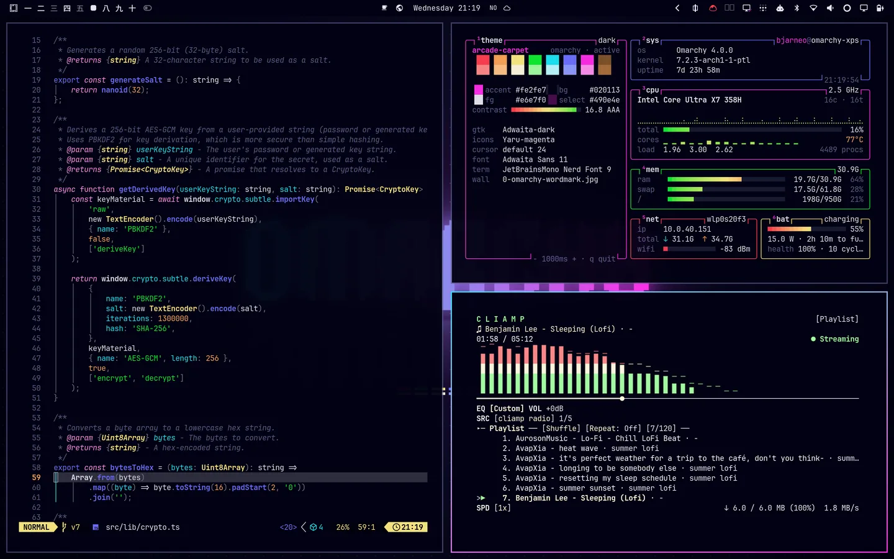](arcade-carpet/preview.png)

`095` · Folder: [`arcade-carpet/`](arcade-carpet/) · [Open in the gallery](https://bjarneo.github.io/100-themes/#arcade-carpet)

Arcade Carpet has a dark indigo background and a magenta accent. The ANSI colors use very high chroma for a strong neon look. The native background shows a pixel art landscape at night.

| Key | Value |
| --- | --- |
| `background` | `#020113` |
| `foreground` | `#e6e7f0` |
| `accent` | `#fe2fe7` |
| `selection` | `#490e4e` |
| Icon theme | `Yaru-magenta` |
| Backgrounds | [`0-omarchy-wordmark.jpg`](arcade-carpet/backgrounds/0-omarchy-wordmark.jpg), [`1-pixels.jpg`](arcade-carpet/backgrounds/1-pixels.jpg) |

<details>
<summary>All 16 ANSI colors</summary>

| # | Normal | # | Bright |
| --- | --- | --- | --- |
| 0 black | `#0a0922` | 8 bright black | `#5b5f8b` |
| 1 red | `#fe3f4f` | 9 bright red | `#fe8a88` |
| 2 green | `#10ec33` | 10 bright green | `#a4ffa2` |
| 3 yellow | `#fee983` | 11 bright yellow | `#fff9de` |
| 4 blue | `#6d71fe` | 12 bright blue | `#8f9aff` |
| 5 magenta | `#fe2fe7` | 13 bright magenta | `#fe90ec` |
| 6 cyan | `#1de4f4` | 14 bright cyan | `#bbf8fe` |
| 7 white | `#c8cad4` | 15 bright white | `#f9fafd` |

</details>

```bash
curl -fsSL https://bjarneo.github.io/100-themes/install.sh | bash -s -- arcade-carpet --set
```

### Pinball

[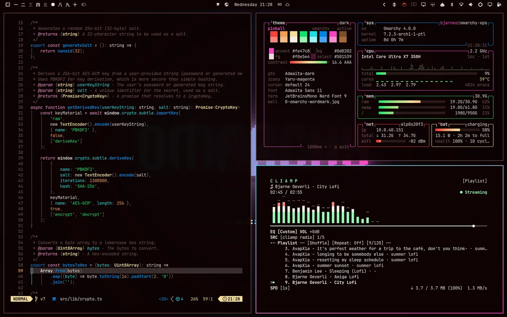](pinball/preview.png)

`096` · Folder: [`pinball/`](pinball/) · [Open in the gallery](https://bjarneo.github.io/100-themes/#pinball)

Pinball has a dark red background and a magenta accent. The ANSI colors use very high chroma for a strong neon look. The native background shows a pixel art landscape at night.

| Key | Value |
| --- | --- |
| `background` | `#0d0202` |
| `foreground` | `#f0e5e4` |
| `accent` | `#fe47c8` |
| `selection` | `#501539` |
| Icon theme | `Yaru-magenta` |
| Backgrounds | [`0-omarchy-wordmark.jpg`](pinball/backgrounds/0-omarchy-wordmark.jpg), [`1-pixels.jpg`](pinball/backgrounds/1-pixels.jpg) |

<details>
<summary>All 16 ANSI colors</summary>

| # | Normal | # | Bright |
| --- | --- | --- | --- |
| 0 black | `#1b0a0a` | 8 bright black | `#7d5857` |
| 1 red | `#fe423f` | 9 bright red | `#fe8b81` |
| 2 green | `#13ea73` | 10 bright green | `#9efeb5` |
| 3 yellow | `#fee6a2` | 11 bright yellow | `#fff8e5` |
| 4 blue | `#038ae7` | 12 bright blue | `#4eaafe` |
| 5 magenta | `#fe47c8` | 13 bright magenta | `#ff95d8` |
| 6 cyan | `#1de6e8` | 14 bright cyan | `#9fffff` |
| 7 white | `#d4c7c6` | 15 bright white | `#fdf9f9` |

</details>

```bash
curl -fsSL https://bjarneo.github.io/100-themes/install.sh | bash -s -- pinball --set
```

### Racing

[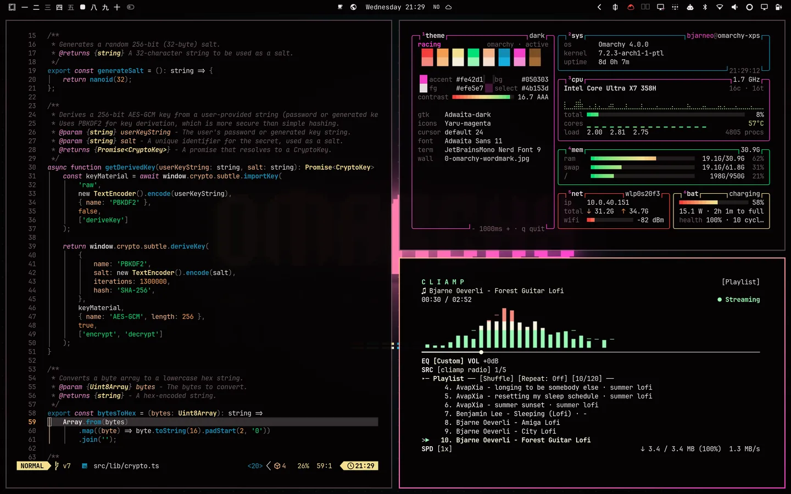](racing/preview.png)

`097` · Folder: [`racing/`](racing/) · [Open in the gallery](https://bjarneo.github.io/100-themes/#racing)

Racing has a neutral black background and a magenta accent. The ANSI colors use very high chroma for a strong neon look. The native background shows a neon sun over a perspective grid.

| Key | Value |
| --- | --- |
| `background` | `#050303` |
| `foreground` | `#efe5e7` |
| `accent` | `#fe42d1` |
| `selection` | `#4b153d` |
| Icon theme | `Yaru-magenta` |
| Backgrounds | [`0-omarchy-wordmark.jpg`](racing/backgrounds/0-omarchy-wordmark.jpg), [`1-sunset-grid.jpg`](racing/backgrounds/1-sunset-grid.jpg) |

<details>
<summary>All 16 ANSI colors</summary>

| # | Normal | # | Bright |
| --- | --- | --- | --- |
| 0 black | `#110c0d` | 8 bright black | `#725c62` |
| 1 red | `#fe423e` | 9 bright red | `#fd8c80` |
| 2 green | `#00ea7a` | 10 bright green | `#9cffb8` |
| 3 yellow | `#ffe795` | 11 bright yellow | `#fff9e2` |
| 4 blue | `#1493bb` | 12 bright blue | `#15b5e5` |
| 5 magenta | `#fe42d1` | 13 bright magenta | `#fe94de` |
| 6 cyan | `#feba8b` | 14 bright cyan | `#ffe6d5` |
| 7 white | `#d3c7ca` | 15 bright white | `#fdf9fa` |

</details>

```bash
curl -fsSL https://bjarneo.github.io/100-themes/install.sh | bash -s -- racing --set
```

### VHS

[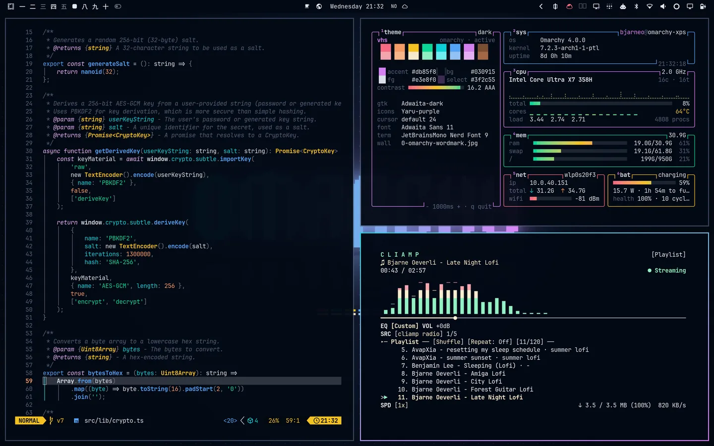](vhs/preview.png)

`098` · Folder: [`vhs/`](vhs/) · [Open in the gallery](https://bjarneo.github.io/100-themes/#vhs)

VHS has a dark blue background and a violet accent. The ANSI colors use medium chroma for a calmer look. The native background shows a VHS screen with tracking noise.

| Key | Value |
| --- | --- |
| `background` | `#030915` |
| `foreground` | `#e3e8f0` |
| `accent` | `#db85f8` |
| `selection` | `#3f2c55` |
| Icon theme | `Yaru-purple` |
| Backgrounds | [`0-omarchy-wordmark.jpg`](vhs/backgrounds/0-omarchy-wordmark.jpg), [`1-scanlines.jpg`](vhs/backgrounds/1-scanlines.jpg) |

<details>
<summary>All 16 ANSI colors</summary>

| # | Normal | # | Bright |
| --- | --- | --- | --- |
| 0 black | `#0e1624` | 8 bright black | `#536480` |
| 1 red | `#fe6f86` | 9 bright red | `#fda9b2` |
| 2 green | `#0bdf9a` | 10 bright green | `#94f6c6` |
| 3 yellow | `#fec921` | 11 bright yellow | `#fef1d1` |
| 4 blue | `#56a9ff` | 12 bright blue | `#99c8fd` |
| 5 magenta | `#db85f8` | 13 bright magenta | `#ebb7fd` |
| 6 cyan | `#0cd7de` | 14 bright cyan | `#74f5fa` |
| 7 white | `#c5cbd5` | 15 bright white | `#f8fafe` |

</details>

```bash
curl -fsSL https://bjarneo.github.io/100-themes/install.sh | bash -s -- vhs --set
```

### Polaroid

[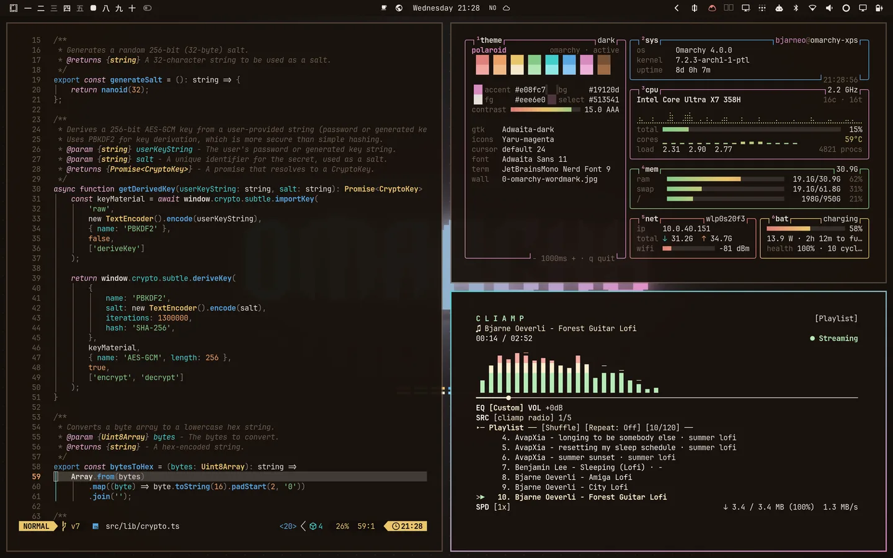](polaroid/preview.png)

`099` · Folder: [`polaroid/`](polaroid/) · [Open in the gallery](https://bjarneo.github.io/100-themes/#polaroid)

Polaroid has a dark brown background and a magenta accent. The ANSI colors use low chroma for a soft, muted look. The native background shows soft light spots with bokeh.

| Key | Value |
| --- | --- |
| `background` | `#19120d` |
| `foreground` | `#eee6e0` |
| `accent` | `#e08fc7` |
| `selection` | `#513541` |
| Icon theme | `Yaru-magenta` |
| Backgrounds | [`0-omarchy-wordmark.jpg`](polaroid/backgrounds/0-omarchy-wordmark.jpg), [`1-blobs.jpg`](polaroid/backgrounds/1-blobs.jpg) |

<details>
<summary>All 16 ANSI colors</summary>

| # | Normal | # | Bright |
| --- | --- | --- | --- |
| 0 black | `#27201a` | 8 bright black | `#735f4f` |
| 1 red | `#e6857d` | 9 bright red | `#f9aea6` |
| 2 green | `#8bd28e` | 10 bright green | `#b9eeba` |
| 3 yellow | `#f3cc6f` | 11 bright yellow | `#fff1d0` |
| 4 blue | `#5aade9` | 12 bright blue | `#90ccfa` |
| 5 magenta | `#e08fc7` | 13 bright magenta | `#f6b7e1` |
| 6 cyan | `#45d6d5` | 14 bright cyan | `#93f1f0` |
| 7 white | `#d2c8c1` | 15 bright white | `#fdf9f7` |

</details>

```bash
curl -fsSL https://bjarneo.github.io/100-themes/install.sh | bash -s -- polaroid --set
```

### Cathode

[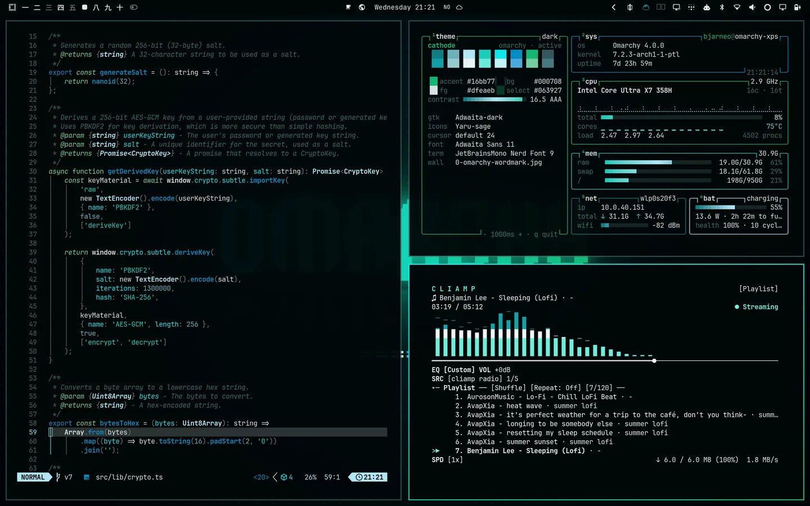](cathode/preview.png)

`100` · Folder: [`cathode/`](cathode/) · [Open in the gallery](https://bjarneo.github.io/100-themes/#cathode)

Cathode has a dark cyan background and a green accent. The ANSI colors are saturated and bright. The native background shows a VHS screen with tracking noise.

| Key | Value |
| --- | --- |
| `background` | `#000708` |
| `foreground` | `#dfeaeb` |
| `accent` | `#16bb77` |
| `selection` | `#063927` |
| Icon theme | `Yaru-sage` |
| Backgrounds | [`0-omarchy-wordmark.jpg`](cathode/backgrounds/0-omarchy-wordmark.jpg), [`1-scanlines.jpg`](cathode/backgrounds/1-scanlines.jpg) |

<details>
<summary>All 16 ANSI colors</summary>

| # | Normal | # | Bright |
| --- | --- | --- | --- |
| 0 black | `#001315` | 8 bright black | `#3f6c6e` |
| 1 red | `#128188` | 9 bright red | `#13a2ab` |
| 2 green | `#1dd3c0` | 10 bright green | `#70f1df` |
| 3 yellow | `#b8efff` | 11 bright yellow | `#f0fbfe` |
| 4 blue | `#0591c8` | 12 bright blue | `#4eb0e3` |
| 5 magenta | `#16bb77` | 13 bright magenta | `#77d5a1` |
| 6 cyan | `#10edf2` | 14 bright cyan | `#c9fdfe` |
| 7 white | `#c0cece` | 15 bright white | `#f6fbfb` |

</details>

```bash
curl -fsSL https://bjarneo.github.io/100-themes/install.sh | bash -s -- cathode --set
```
